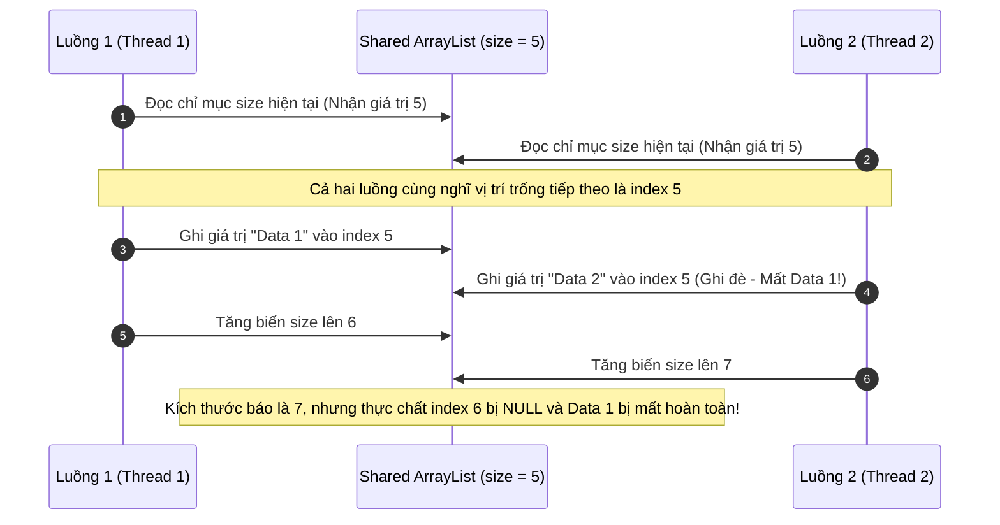

# Một shared object không thread-safe gây data corruption. Bạn debug thế nào?

## ⚡ Tóm tắt ngắn (30s)
* **Bản chất**: Sự cố sứt mẻ dữ liệu (Data Corruption) do Shared Object không thread-safe xảy ra khi nhiều luồng đồng thời ghi/sửa dữ liệu trên cùng một ô nhớ trong bộ nhớ Heap mà không có cơ chế đồng bộ hóa (Synchronization/Mutual Exclusion). Do các thao tác viết ở cấp độ mã máy không có tính nguyên tử (Non-atomic), các luồng sẽ ghi đè lên kết quả của nhau, làm hỏng cấu trúc dữ liệu nội bộ (như HashMap bị lặp vô tận, ArrayList bị lỗi chỉ mục).
* **Các thảm họa thực chiến được giải quyết**:
    1. **Thảm họa "Nhầm lẫn dữ liệu" khách hàng (Data Leakage)**: Đặt biến trạng thái (Instance Variable) lưu trữ thông tin User bên trong một Spring Service/Controller (mặc định là **Singleton** Bean). Khi nhiều request gọi đến cùng lúc, dữ liệu giỏ hàng hoặc số tài khoản của Khách hàng A bị ghi đè và hiển thị trực tiếp cho Khách hàng B.
    2. **Thảm họa "Hỏng lịch sử" do SimpleDateFormat**: Sử dụng chung một thực thể `SimpleDateFormat` tĩnh (static) để parse ngày tháng trong API traffic cao. Các luồng ghi đè lên bộ nhớ đệm lịch của nhau, dẫn đến việc parse ngày tháng bị sai lệch hoàn toàn (ví dụ: ngày 2026-05-23 parse thành năm 2050) mà không ném ra lỗi.
* **Quyết định Senior**: Triển khai quy trình debug 4 bước:
    1. **Khoanh vùng Singleton**: Rà soát các Class có phạm vi Singleton (Spring Beans) để tìm các biến instance động.
    2. **Tái hiện cưỡng bức**: Viết Unit Test đa luồng sử dụng `CountDownLatch` hoặc `CyclicBarrier` để bắt hàng trăm luồng cùng đập vào một hàm tại một mili-giây.
    3. **Thay thế cấu trúc dữ liệu**: Chuyển đổi sang các cấu trúc thread-safe (`ConcurrentHashMap`, `ThreadLocal`, `AtomicLong`).
    4. **Bảo vệ bằng Immutability**: Thiết kế các DTO bất biến (Immutable - dùng Java `record`) để loại bỏ hoàn toàn khả năng chia sẻ trạng thái thay đổi được.

---

## 🔍 Chi tiết bản chất thực chiến: Đọc vị triệu chứng & Kỹ thuật Debug Data Corruption

Senior Engineer không mò mẫm lỗi đa luồng bằng cách đọc log thông thường, vì lỗi thread-safety thường xảy ra ngẫu nhiên (flaky) và biến mất khi ta thêm log thủ công (hiện tượng Heisenbug).

### 1. Triệu chứng đặc trưng của các cấu trúc dữ liệu không Thread-safe phổ biến
Khi bị ghi đồng thời mà không có lock, các Class JDK mặc định sẽ biểu hiện các lỗi kinh điển:
* **`HashMap`**:
  * *Triệu chứng*: Treo luồng ứng dụng vĩnh viễn (CPU tăng cao hoặc thấp tùy phiên bản JDK) hoặc ném lỗi `NullPointerException` ngẫu nhiên trong hàm `.get()`. 
  * *Bản chất*: Hoạt động cơ cấu lại kích thước (resizing/rehash) của HashMap khi bị ghi đập nhau sẽ làm hỏng cấu trúc liên kết các Node trong Bucket, biến cấu trúc danh sách liên kết thành một **vòng lặp vô hạn (Infinite Loop)**.
* **`ArrayList`**:
  * *Triệu chứng*: Ném lỗi `ArrayIndexOutOfBoundsException` hoặc kích thước `list.size()` nhỏ hơn số lượng phần tử thực tế được add vào.
  * *Bản chất*: Thao tác tăng kích thước mảng nội bộ và tăng biến chỉ mục `size` không nguyên tử. Luồng A đọc index cũ, luồng B ghi đè lên cùng index, làm mất mát dữ liệu và làm lệch bộ đếm kích thước mảng.
* **`SimpleDateFormat`**:
  * *Triệu chứng*: Parse ngày tháng ra kết quả sai lệch kỳ dị hoặc ném lỗi `NumberFormatException: multiple points`.
  * *Bản chất*: Class này lưu trạng thái parse trung gian trong một thuộc tính nội bộ kiểu `Calendar`. Nhiều luồng gọi `.parse()` cùng lúc sẽ thay đổi trạng thái này chéo nhau.

---

## 🎨 Sơ đồ trực quan (Cơ chế ghi đè mất dữ liệu trong ArrayList không Thread-safe)



---

## 💻 Code thực chiến / Cấu hình thực tế: BAD vs GOOD

### ❌ BAD: Spring Singleton Bean lưu trạng thái và dùng chung SimpleDateFormat tĩnh
Controller mặc định là Singleton (chỉ có 1 instance chạy suốt vòng đời app). Việc khai báo các biến lưu thông tin User hoặc biến parse ngày dùng chung sẽ gây ra thảm họa trộn lẫn dữ liệu giữa các khách hàng khác nhau.

```java
import org.springframework.web.bind.annotation.*;
import java.text.SimpleDateFormat;
import java.util.Date;

@RestController
@RequestMapping("/orders")
public class BadOrderController {

    // ❌ TỒI 1: Controller là Singleton. Biến instance này được chia sẻ chung cho hàng triệu request.
    // Dữ liệu của khách hàng này sẽ ghi đè lên khách hàng khác gây lộ thông tin!
    private String currentRequestUserId;

    // ❌ TỒI 2: SimpleDateFormat không thread-safe. Dùng static dùng chung cho API tải cao
    // sẽ gây parse lệch ngày tháng của khách hàng hàng loạt.
    private static final SimpleDateFormat sdf = new SimpleDateFormat("yyyy-MM-dd");

    @PostMapping("/create")
    public String createOrder(@RequestParam String userId, @RequestParam String dateStr) throws Exception {
        this.currentRequestUserId = userId; // Ghi đè biến instance chung
        
        // Giả lập xử lý chậm
        Thread.sleep(50); 
        
        Date date = sdf.parse(dateStr); // Parse dùng chung static không an toàn
        
        // ❌ HẬU QUẢ: Nếu Request 1 và Request 2 đập vào cùng lúc, 
        // Request 1 có thể in ra UserId của Request 2!
        return "Tạo đơn hàng cho User: " + this.currentRequestUserId + " vào ngày: " + date;
    }
}
```

---

### ✅ GOOD: Thiết kế Stateless Controller và bảo vệ dữ liệu bằng ThreadLocal / record
Giữ thiết kế Controller hoàn toàn không lưu trạng thái (Stateless - dữ liệu truyền qua biến cục bộ trong Stack Frame), bảo vệ `SimpleDateFormat` bằng `ThreadLocal` hoặc chuyển hẳn sang Java 8 `DateTimeFormatter` thread-safe tuyệt đối.

```java
import org.springframework.web.bind.annotation.*;
import java.time.LocalDate;
import java.time.format.DateTimeFormatter;

@RestController
@RequestMapping("/orders-secure")
public class SafeOrderController {

    // ✅ TỐT 1: DateTimeFormatter của Java 8 là IMMUTABLE và THREAD-SAFE tuyệt đối.
    // Có thể dùng chung static thoải mái mà không cần lock.
    private static final DateTimeFormatter dtf = DateTimeFormatter.ofPattern("yyyy-MM-dd");

    // ✅ TỐT 2: Hoặc nếu bắt buộc dùng SimpleDateFormat cũ, bọc nó bằng ThreadLocal.
    // Mỗi luồng sẽ sở hữu duy nhất 1 bản sao SimpleDateFormat riêng biệt trong bộ nhớ.
    private static final ThreadLocal<java.text.SimpleDateFormat> threadLocalSdf = 
            ThreadLocal.withInitial(() -> new java.text.SimpleDateFormat("yyyy-MM-dd"));

    @PostMapping("/create")
    public String createOrderSecure(@RequestParam String userId, @RequestParam String dateStr) {
        // ✅ TỐT 3: Stateless - Dữ liệu Request được lưu hoàn toàn trong biến cục bộ (Local Variable).
        // Biến cục bộ nằm trong Stack Frame riêng biệt của từng Thread, không bao giờ bị tranh chấp.
        String localUserId = userId; 
        
        // Cách A: Dùng DateTimeFormatter Java 8
        LocalDate date = LocalDate.parse(dateStr, dtf);
        
        // Cách B: Nếu dùng SimpleDateFormat ThreadLocal
        // Date dateLegacy = threadLocalSdf.get().parse(dateStr);
        
        return "Tạo đơn hàng AN TOÀN cho User: " + localUserId + " vào ngày: " + date;
    }
}
```

---

## 📊 Bảng so sánh các giải pháp đồng bộ hóa Shared Object

| Giải pháp | Cơ chế hoạt động | Hiệu năng | Độ an toàn thực chiến |
| :--- | :--- | :--- | :--- |
| **Stateless Design (Khuyên dùng)** | Không lưu trạng thái động trên Class. Dữ liệu truyền qua biến cục bộ trong Stack. | Cực cao (0% overhead, không cần tranh chấp khóa). | An toàn tuyệt đối. Loại bỏ tận gốc khả năng xảy ra lỗi thread-safety. |
| **ThreadLocal** | Cấp phát cho mỗi Thread một bản sao thực thể đối tượng riêng biệt. | Cao (Chỉ tốn thêm tài nguyên bộ nhớ cho các luồng phụ). | Rất cao. Cần lưu ý gọi `.remove()` để tránh Memory Leak trong Thread Pool. |
| **Concurrent Collections** | Tự động đồng bộ hóa nội bộ ở mức tối ưu (ví dụ: chia phân đoạn/CAS trong ConcurrentHashMap). | Cao dưới tải phân tán trung bình. | Rất an toàn khi cần chia sẻ và cập nhật dữ liệu chung giữa các luồng. |
| **Synchronized / ReentrantLock** | Khóa cứng luồng, bắt các luồng phải thực thi tuần tự (Mutual Exclusion). | Thấp (Gây nghẽn luồng và context switch cao). | An toàn, nhưng dễ gây nghẽn throughput (giảm throughput) hoặc deadlock nếu dùng sai. |

---

## ⚠️ Common Gotchas & Questions follow-up

### 1. Cạm bẫy "Rò rỉ dữ liệu khi không dọn dẹp ThreadLocal trong Thread Pool"
* **Vấn đề nguy hiểm**: Khi sử dụng `ThreadLocal` trong môi trường Web Server (như Tomcat), các luồng xử lý HTTP được tái sử dụng liên tục (Thread Reuse). Nếu luồng xử lý Request 1 lưu thông tin User vào ThreadLocal, sau khi trả response, luồng này quay về pool. Khi Request 2 của người dùng khác được gán cho luồng này, nếu code không dọn dẹp, Request 2 sẽ đọc trực tiếp dữ liệu ThreadLocal cũ của Request 1!
* **Khắc phục**: Sử dụng Spring `HandlerInterceptor` hoặc bọc logic trong khối `try-finally` để bắt buộc gọi `.remove()` ở khối `finally`:
  ```java
  try {
      contextThreadLocal.set(userData);
      // xử lý...
  } finally {
      contextThreadLocal.remove(); // ✅ BẮT BUỘC để tránh rò rỉ thông tin
  }
  ```

### 2. Câu hỏi đào sâu từ interviewer

* **Q1: Viết một đoạn mã kiểm thử đa luồng (Concurrency Unit Test) làm sao để bạn ép buộc (reproduce) lỗi ghi đè dữ liệu của một Class không thread-safe xảy ra ngay lập tức trong môi trường Local?**
  * *Trả lời*: Tôi sử dụng **`CountDownLatch`** để cưỡng ép các luồng chạy đồng thời tại một thời điểm:
    ```java
    public void testConcurrencyCorruption() throws InterruptedException {
        int threadCount = 100;
        ExecutorService executor = Executors.newFixedThreadPool(threadCount);
        CountDownLatch startGate = new CountDownLatch(1); // Cổng xuất phát chung
        CountDownLatch endGate = new CountDownLatch(threadCount);
        
        NonThreadSafeObject sharedObj = new NonThreadSafeObject();

        for (int i = 0; i < threadCount; i++) {
            executor.submit(() -> {
                try {
                    startGate.await(); // ✅ Tất cả các luồng đứng chờ ở vạch xuất phát
                    sharedObj.add("Data"); // Đập đồng thời vào hàm ghi
                } catch (Exception e) {
                } finally {
                    endGate.countDown();
                }
            });
        }
        
        startGate.countDown(); // ✅ Nổ súng xuất phát! 100 luồng cùng ghi đồng thời tại 1 nano-giây.
        endGate.await(); // Chờ tất cả chạy xong
        
        // Kiểm tra dữ liệu bị sứt mẻ
        System.out.println("Kích thước thực tế: " + sharedObj.size()); 
    }
    ```

* **Q2: Tại sao `ConcurrentHashMap` từ Java 8 trở đi lại bỏ cơ chế khóa phân đoạn (Segment Locking) của Java 7 để chuyển sang dùng cơ chế CAS (Compare-And-Swap) kết hợp synchronized trên Node đầu tiên của Bucket?**
  * *Trả lời*: 
    * Trong Java 7, `ConcurrentHashMap` chia bảng băm thành 16 phân đoạn (Segments), mỗi phân đoạn được khóa độc lập bằng một `ReentrantLock`. Nhược điểm là độ thô của khóa vẫn lớn, tối đa chỉ có 16 luồng ghi đồng thời không block nhau, và tốn tài nguyên bộ nhớ để khởi tạo 16 Lock Object.
    * Từ Java 8, CHM tối ưu hóa cực hạn:
      1. **Dùng CAS (Lock-free)**: Khi ghi một phần tử vào một Bucket trống, CHM dùng lệnh nguyên tử CAS (`compareAndSwapObject`) ở cấp độ CPU để chèn Node mới mà **không cần dùng bất kỳ Lock nào**.
      2. **Khóa mịn hơn (Bucket-level Sync)**: Khi có xung đột (Bucket đã có phần tử), CHM chỉ dùng khối `synchronized` bọc trên chính **Node đầu tiên** của Bucket đó. Việc này làm giảm phạm vi tranh chấp khóa xuống cấp độ từng Bucket riêng lẻ (hàng nghìn bucket), mang lại throughput ghi đồng thời gần như tuyến tính tuyệt đối.
