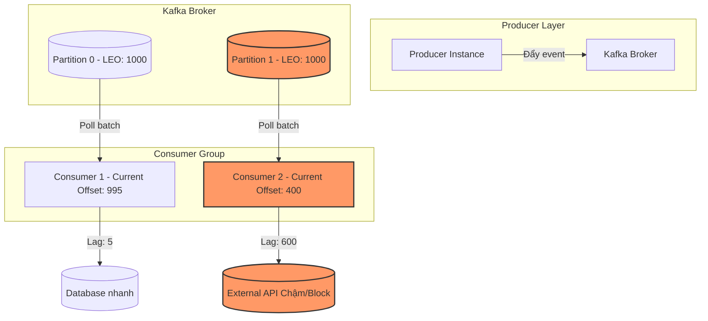

# Kafka consumer lag tăng liên tục. Bạn debug thế nào?

## ⚡ Tóm tắt ngắn (30s)
* **Bản chất**: Consumer Lag là khoảng chênh lệch giữa offset cuối cùng được ghi vào partition bởi Producer (Log End Offset - LEO) và offset cuối cùng được xử lý và commit bởi Consumer (Current Offset). Lag tăng liên tục nghĩa là **tốc độ xử lý của Consumer chậm hơn tốc độ sản xuất của Producer**.
* **Các thảm họa thực chiến được giải quyết**:
    1. **Thảm họa trễ dữ liệu thời gian thực (Data Freshness Failure)**: Trong các hệ thống e-commerce hoặc fintech, lag tăng làm cho luồng xử lý trạng thái đơn hàng hoặc số dư ví điện tử bị chậm hàng chục phút, khiến khách hàng thanh toán xong nhưng app vẫn báo "chờ thanh toán", dẫn đến việc khiếu nại dồn dập.
    2. **Thảm họa nghẽn dây chuyền & OOM (Cascading Crash)**: Khi consumer xử lý chậm, dữ liệu tồn đọng trong RAM hoặc ổ đĩa của Kafka Broker. Nếu consumer cố gắng fetch một lượng lớn message để bắt kịp nhưng không giải phóng được bộ nhớ, nó có thể gặp lỗi `OutOfMemoryError` hoặc kích hoạt lỗi `CommitFailedException` liên tục do rebalance, làm lag càng tăng nhanh hơn theo hiệu ứng quả tuyết lăn.
* **Quyết định Senior**:
    1. **Cô lập nhanh**: Kiểm tra xem lag xảy ra trên **tất cả partition** hay chỉ **một vài partition cụ thể** để xác định lỗi do phân phối key nghẽn (skew key) hay do cả cụm consumer bị chậm.
    2. **Tối ưu hóa throughput**: Tăng song song hóa (concurrency/partitions), điều chỉnh kích thước batch (`max.poll.records`, `max.partition.fetch.bytes`), sử dụng luồng xử lý bất đồng bộ kết hợp với manual commit an toàn.

---

## 🔍 Chi tiết bản chất thực chiến: Quy trình Debug Consumer Lag

Khi phát hiện cảnh báo Consumer Lag tăng cao trên hệ thống giám sát, một Senior Engineer sẽ tiến hành debug theo quy trình chuẩn hoá 5 bước:

### Bước 1: Xác định quy mô và phân bố của Lag (Scope & Distribution Analysis)
Sử dụng công cụ CLI của Kafka để kiểm tra tình trạng hiện tại của consumer group:
```bash
kafka-consumer-groups.sh --bootstrap-server localhost:9092 --describe --group order-service-group
```
* **Kịch bản A: Lag tăng đều trên tất cả partition**:
  * *Chẩn đoán*: Toàn bộ consumer group đang bị quá tải hoặc toàn bộ các instance consumer đều bị nghẽn (ví dụ: DB chung bị chậm, luồng xử lý đồng loạt bị block).
* **Kịch bản B: Chỉ có 1 hoặc vài partition bị lag đột biến, các partition khác lag bằng 0**:
  * *Chẩn đoán*: **Data Skew (Lệch dữ liệu)**. Key partition được chọn không đều (ví dụ: null key, key rỗng, hoặc một vài ID khách hàng lớn có lượng giao dịch đột biến đổ dồn vào cùng một partition), khiến một consumer instance gánh lượng tải cực lớn trong khi các instance khác rảnh rỗi.

### Bước 2: Phân tích trạng thái Consumer qua APM Metrics & Logs
* **Kiểm tra JVM Thread Dump (`jstack`)**:
  * Nhìn vào trạng thái các thread Kafka consumer (`KafkaConsumer-coordinator-heartbeat-thread` và các consumer worker thread).
  * Hầu hết worker thread ở trạng thái `BLOCKED` hoặc `WAITING` tại điểm gọi I/O (gọi database, gọi HTTP API bên thứ ba) mà không có timeout hợp lý $\implies$ Consumer đang chờ phản hồi bên ngoài quá lâu.
* **Kiểm tra Kafka Metrics quan trọng**:
  * `records-lag-max`: Giá trị lag lớn nhất trong tất cả partition.
  * `fetch-rate`: Số lượng request fetch được gửi mỗi giây. Nếu fetch rate cực thấp trong khi lag cao $\implies$ Consumer bị block hoặc đang xử lý một batch quá nặng.
  * `records-per-poll-avg`: Số lượng message trung bình lấy ra mỗi lần poll.

### Bước 3: Kiểm tra Lỗi Rebalance liên tục (Rebalance Storm)
* **Triệu chứng**: Logs xuất hiện liên tục các dòng `CommitFailedException` hoặc `Rebalancing group`.
* **Nguyên nhân**: Thời gian xử lý một batch message vượt quá cấu hình `max.poll.interval.ms` (mặc định là 5 phút). Kafka Broker nghĩ rằng consumer này đã chết và kích hoạt Rebalance để chuyển partition cho instance khác. Khi instance mới nhận partition, nó lại tiếp tục đọc batch đó và xử lý quá 5 phút $\implies$ Vòng lặp rebalance vô hạn, consumer hoàn toàn không tiến triển và lag tăng vọt.

---

## 🎨 Sơ đồ trực quan (Cơ chế sinh Consumer Lag & Điểm nghẽn)



---

## 💻 Code thực chiến: Cấu hình Optimizations

### ❌ BAD: Cấu hình mặc định dễ gây nghẽn và sập rebalance dưới tải cao
Mặc định `max.poll.records` lớn (500) và `max.poll.interval.ms` ngắn (5 phút) có thể dễ dàng làm chết consumer nếu mỗi record mất > 1 giây để xử lý (ví dụ: gọi API ngoài).

```yaml
# application.yml (Cấu hình cẩu thả)
spring:
  kafka:
    consumer:
      bootstrap-servers: localhost:9092
      group-id: order-service-group
      # Mặc định auto commit có thể làm mất dữ liệu hoặc commit khi chưa xử lý xong
      enable-auto-commit: true 
      auto-commit-interval: 5000
```

---

### ✅ GOOD: Cấu hình an toàn chống quá tải, hỗ trợ Backpressure và tránh Rebalance
Cấu hình giảm số lượng record xử lý mỗi batch, tăng giới hạn thời gian chờ xử lý tối đa, tăng song song hoá (Concurrency) ở mức code, và quản lý offset commit thủ công an toàn.

```java
import org.apache.kafka.clients.consumer.ConsumerConfig;
import org.apache.kafka.common.serialization.StringDeserializer;
import org.springframework.context.annotation.Bean;
import org.springframework.context.annotation.Configuration;
import org.springframework.kafka.config.ConcurrentKafkaListenerContainerFactory;
import org.springframework.kafka.core.ConsumerFactory;
import org.springframework.kafka.core.DefaultKafkaConsumerFactory;
import org.springframework.kafka.listener.ContainerProperties;

import java.util.HashMap;
import java.util.Map;

@Configuration
public class KafkaConsumerConfig {

    @Bean
    public ConsumerFactory<String, String> consumerFactory() {
        Map<String, Object> props = new HashMap<>();
        props.put(ConsumerConfig.BOOTSTRAP_SERVERS_CONFIG, "localhost:9092");
        props.put(ConsumerConfig.GROUP_ID_CONFIG, "order-service-group");
        props.put(ConsumerConfig.KEY_DESERIALIZER_CLASS_CONFIG, StringDeserializer.class);
        props.put(ConsumerConfig.VALUE_DESERIALIZER_CLASS_CONFIG, StringDeserializer.class);

        // ✅ TỐT: Giảm số lượng record tối đa mỗi lần poll xuống để đảm bảo xử lý kịp thời
        props.put(ConsumerConfig.MAX_POLL_RECORDS_CONFIG, "50");

        // ✅ TỐT: Tăng thời gian tối đa giữa các lần poll (ví dụ: 15 phút) 
        // Tránh lỗi CommitFailedException và Rebalance lặp vô hạn khi downstream service bị chậm
        props.put(ConsumerConfig.MAX_POLL_INTERVAL_MS_CONFIG, "900000"); 

        // ✅ TỐT: Tắt auto-commit để tự quản lý thời điểm commit offset sau khi xử lý thành công
        props.put(ConsumerConfig.ENABLE_AUTO_COMMIT_CONFIG, "false");

        return new DefaultKafkaConsumerFactory<>(props);
    }

    @Bean
    public ConcurrentKafkaListenerContainerFactory<String, String> kafkaListenerContainerFactory() {
        ConcurrentKafkaListenerContainerFactory<String, String> factory =
                new ConcurrentKafkaListenerContainerFactory<>();
        factory.setConsumerFactory(consumerFactory());

        // ✅ TỐT: Tăng số lượng luồng xử lý song song trực tiếp trên container (bằng số partitions của topic)
        factory.setConcurrency(3); 

        // ✅ TỐT: Cấu hình chế độ commit thủ công (Manual Immediate)
        factory.getContainerProperties().setAckMode(ContainerProperties.AckMode.MANUAL_IMMEDIATE);

        return factory;
    }
}
```

---

## 📊 Bảng so sánh các nguyên nhân gây Lag phổ biến và giải pháp xử lý nhanh

| Nguyên nhân gốc rễ (Root Cause) | Dấu hiệu nhận biết (Symptoms) | Giải pháp ngắn hạn (Tactical) | Giải pháp dài hạn (Strategic) |
| :--- | :--- | :--- | :--- |
| **Downstream DB/API bị nghẽn (I/O Block)** | - Threads WAITING/BLOCKED.<br>- CPU máy chủ rất thấp.<br>- Latency API ngoài tăng cao. | - Tạm thời tăng số lượng partition & scale-out thêm instances consumer. | - Cấu hình timeout & Circuit Breaker cho API ngoài.<br>- Sử dụng cache hoặc batching DB writes. |
| **Lệch dữ liệu phân vùng (Data Skew)** | - Chỉ duy nhất một Partition bị lag khủng khiếp.<br>- Các partition khác lag bằng 0. | - Scale-up CPU/RAM của instance đang chịu tải partition bị lệch. | - Thiết kế lại Partition Key (kết hợp `tenant_id` + `order_id` thay vì dùng mỗi `tenant_id`). |
| **Cơn bão Rebalance lặp vô hạn** | - Logs đầy lỗi `CommitFailedException` hoặc `Rebalancing`. | - Tăng `max.poll.interval.ms` lên gấp đôi.<br>- Giảm `max.poll.records` xuống 10-20. | - Chuyển sang mô hình xử lý bất đồng bộ bất đối xứng (Worker Thread Pool bên ngoài rồi commit thủ công). |
| **Lượng traffic tăng đột biến (Traffic Spike)** | - Lag tăng đều trên mọi phân vùng.<br>- CPU consumer chạy 100%. | - Scale-out (tăng số lượng instance consumer tối đa bằng số partitions). | - Cấu hình Auto-scaling cho Consumer Group.<br>- Nâng cấp tài nguyên phần cứng. |

---

## ⚠️ Common Gotchas & Questions follow-up

### 1. Cạm bẫy "Scale-out Consumer mù quáng vượt quá số lượng Partitions của Topic"
* **Sai lầm phổ biến**: Khi thấy lag tăng, nhiều kỹ sư lập tức cấu hình tăng số lượng container/pod chạy consumer lên gấp 3 - 4 lần để hy vọng tăng tốc độ xử lý.
* **Hậu quả**: Trong Kafka, một partition chỉ được tiêu thụ bởi duy nhất một consumer instance trong cùng một consumer group tại một thời điểm. Nếu topic có 6 partitions mà bạn scale-out lên 10 instances consumer, thì **4 instances dư thừa sẽ hoàn toàn ngồi chơi xơi nước**, gây lãng phí tài nguyên máy chủ mà không giúp giảm lag thêm một chút nào.
* **Khắc phục**: Trước khi scale-out consumer, phải kiểm tra số lượng partition hiện có của topic. Nếu muốn tăng tính song song cao hơn nữa, bắt buộc phải tăng số lượng partition của topic trước (`alter topic`), sau đó mới scale-out consumer tương ứng.

### 2. Câu hỏi đào sâu từ interviewer

* **Q1: Nếu consumer bị crash giữa chừng khi đang xử lý một batch 100 records nhưng bạn tắt auto-commit và commit thủ công ở cuối batch, điều gì xảy ra khi consumer khởi động lại?**
  * *Trả lời*: 
    * Vì auto-commit đã bị tắt và offset mới chưa được commit lên broker, khi consumer khởi động lại (hoặc partition được giao cho instance khác xử lý do rebalance), consumer mới sẽ **đọc lại toàn bộ batch 100 records đó từ đầu** (từ offset được commit thành công cuối cùng).
    * Điều này dẫn đến hiện tượng **duplicate xử lý** (xử lý trùng lặp dữ liệu) trên các record đã chạy thành công trước khi crash.
    * *Giải pháp*: Bắt buộc phải thiết kế logic xử lý của consumer đạt tính chất **Idempotency** (bằng cách dùng Idempotency Key, check khoá duy nhất trong DB trước khi ghi), hoặc tiến hành commit thủ công sau mỗi record xử lý thành công (`AckMode.MANUAL_IMMEDIATE` kết hợp ghi nhận từng dòng) thay vì commit cả batch.

* **Q2: Làm thế nào để cấu hình cơ chế Backpressure tự nhiên cho Kafka Consumer khi downstream bị quá tải mà không làm chết hệ thống?**
  * *Trả lời*: 
    * Kafka Consumer vốn có cơ chế Backpressure tự nhiên nhờ vào mô hình **Pull-based** thay vì Push-based. Nghĩa là Consumer chủ động gọi phương thức `poll()` để lấy dữ liệu về khi nó đã sẵn sàng.
    * Nếu downstream bị quá tải hoặc chậm, consumer thread sẽ tốn nhiều thời gian hơn để xử lý batch hiện tại trước khi tiếp tục gọi vòng lặp `poll()` tiếp theo. Điều này tự động làm chậm tốc độ tiêu thụ dữ liệu từ Broker lại, giúp giảm tải cho hệ thống hạ nguồn.
    * Tuy nhiên, ta cần cấu hình cẩn thận `max.poll.interval.ms` lớn hơn tổng thời gian xử lý tối đa của batch đó để tránh việc consumer bị coi là "chết" bởi Broker, gây rebalance không đáng có.
