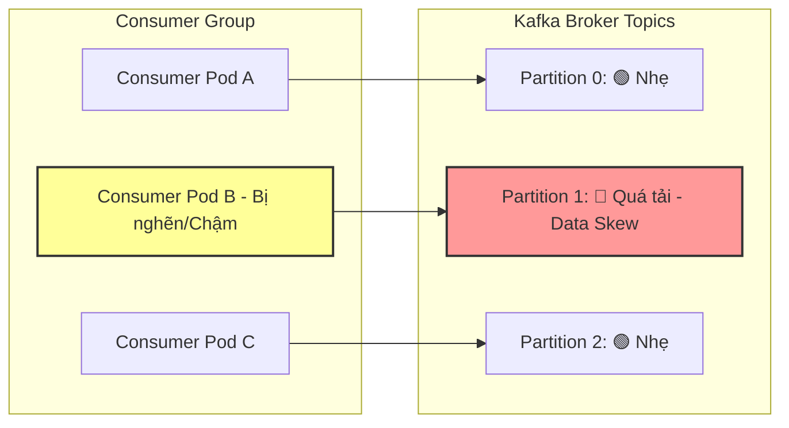

# Một partition bị lag nhiều hơn các partition khác. Vì sao?

## ⚡ Tóm tắt ngắn (30s)
* **Bản chất**: Hiện tượng này gọi là **Data Skew (Mất cân bằng dữ liệu / Hot Partition)** hoặc **Consumer Degradation (Suy giảm hiệu năng consumer đơn lẻ)**. Thay vì tin nhắn được phân bổ đều, một partition duy nhất phải gánh lượng dữ liệu khổng lồ (Hot Spot), hoặc consumer đảm nhận partition đó đang bị treo/chậm hơn các consumer khác trong group.
* **Thảm họa thực chiến được giải quyết**:
  1. **Tắc nghẽn cục bộ (Local Lag Spikes)**: Hệ thống bị nghẽn đơn hàng của một số đối tác lớn, trong khi tài nguyên CPU của các partition khác vẫn đang rảnh rỗi lãng phí.
  2. **Vi phạm SLA nghiêm trọng**: Khách hàng ở partition bị lag phải đợi hàng giờ để nhận email/OTP, trong khi khách hàng khác nhận ngay lập tức trong 1 giây.
* **Quyết định Senior**:
  1. **Nếu do Data Skew (Hot Key)**: Thiết kế lại **Partition Key** bằng cách kết hợp thêm mã ngẫu nhiên (Salting), hoặc chuyển sang chế độ **Round-robin / Sticky Partitioning** nếu nghiệp vụ không yêu cầu thứ tự tuyệt đối.
  2. **Nếu do Consumer chậm**: Điều tra sức khỏe phần cứng của container cụ thể đó (kiểm tra CPU, RAM, Disk I/O, Network link) và thay thế pod bị suy yếu hiệu năng.

---

## 🔍 Chi tiết bản chất thực chiến: Chẩn đoán 3 nguyên nhân cốt lõi

### Nguyên nhân 1: Thiết kế Partition Key bị lỗi "Hot Key" (Data Skew)
Theo mặc định, Kafka Producer sử dụng thuật toán băm **MurmurHash3** trên `Key` của message để quyết định gửi tin nhắn vào partition nào:
$$\text{Partition} = \text{abs}(\text{hash}(\text{Key})) \pmod{\text{Total Partitions}}$$

* **Kịch bản sai lầm**: Lập trình viên chọn `countryId` (mã quốc gia) hoặc `merchantId` (mã đối tác) làm Key để đảm bảo các tin nhắn của cùng quốc gia/đối tác đi theo đúng thứ tự.
* **Hậu quả thực tế**: Trên Production, đối tác lớn nhất (ví dụ: `Shopee` hoặc thị trường `VN`) chiếm tới 85% tổng lượng giao dịch của toàn bộ hệ thống. Toàn bộ 85% traffic này bị băm và đổ dồn vào **duy nhất một Partition**. Các partition khác chỉ nhận 15% traffic từ các đối tác nhỏ lẻ.

---

### Nguyên nhân 2: Lỗi phần cứng hoặc nghẽn luồng trên một Consumer đơn lẻ
Mỗi partition được xử lý bởi duy nhất một consumer thread trong Consumer Group. Nếu chỉ có một partition bị lag đột biến, rất có thể consumer đang xử lý partition đó gặp sự cố:
* **Nghẽn kết nối Database cục bộ**: Thread của consumer đó đang bị giữ lock dài hạn tại DB.
* **Lỗi Pod chạy trên node K8s yếu**: Pod đó được Kubernetes phân bổ ngẫu nhiên vào một Worker Node đang bị quá tải CPU/RAM hoặc lỗi phần cứng IO đĩa cứng chậm.

---

### Nguyên nhân 3: Tin nhắn độc (Poison Pill) bị kẹt trên Partition đó
* Một tin nhắn bị lỗi định dạng nghiêm trọng bị kẹt tại một partition cụ thể. Consumer liên tục thử lại (retry) tin nhắn lỗi này hàng nghìn lần mà không commit được, khiến toàn bộ các tin nhắn hợp lệ xếp hàng phía sau trên chính partition đó bị đình trệ, trong khi các partition khác không có poison message vẫn xử lý mượt mà.

---

## 🎨 Sơ đồ trực quan (Hiện tượng Hot Key & Mất cân bằng Partition)

```
[ PRODUCER GỬI TIN NHẮN ]
      │
      ├─ Key = "SHOPEE" (Hot Key chiếm 85% traffic)  ──► [ abs(hash("SHOPEE")) % 3 ] ──► Partition 1 🔴 (LAG KHỔNG LỒ)
      ├─ Key = "LAZADA" (Chiếm 10% traffic)          ──► [ abs(hash("LAZADA")) % 3 ] ──► Partition 0 🟢 (Hoạt động mượt)
      └─ Key = "TIKI"   (Chiếm 5% traffic)           ──► [ abs(hash("TIKI"))   % 3 ] ──► Partition 2 🟢 (Hoạt động mượt)
```



---

## 💻 Code thực chiến: Custom Partitioner chống nghẽn do Hot Key (Salting Key Strategy)

Dưới đây là mã nguồn Java cấu hình một **Custom Partitioner** cho Kafka Producer. Thuật toán này sẽ tự động phát hiện các đối tác siêu lớn (Hot Keys) và tiến hành kỹ thuật **Salting (thêm muối ngẫu nhiên)** để phân tán dữ liệu ra nhiều partition khác nhau, giải quyết triệt để Data Skew.

```java
import org.apache.kafka.clients.producer.Partitioner;
import org.apache.kafka.common.Cluster;
import org.apache.kafka.common.PartitionInfo;
import org.apache.kafka.common.utils.Utils;

import java.util.List;
import java.util.Map;
import java.util.Set;
import java.util.concurrent.ThreadLocalRandom;

public class HotKeySaltingPartitioner implements Partitioner {

    // Danh sách các đối tác cực lớn (Hot Keys) cần được băm muối phân tán dữ liệu
    private static final Set<String> HOT_KEYS = Set.of("SHOPEE", "TIKTOK_SHOP", "GLOBAL_MARKET");

    @Override
    public int partition(String topic, Object key, byte[] keyBytes, Object value, byte[] valueBytes, Cluster cluster) {
        List<PartitionInfo> partitions = cluster.partitionsForTopic(topic);
        int numPartitions = partitions.size();

        if (keyBytes == null || !(key instanceof String)) {
            // Nếu message không có Key, phân bổ dạng ngẫu nhiên / round-robin mặc định
            return ThreadLocalRandom.current().nextInt(numPartitions);
        }

        String keyStr = (String) key;

        // ✅ GIẢI PHÁP CHỐNG NGHẼN DATA SKEW:
        // Nếu phát hiện Key thuộc nhóm Hot Key siêu lớn, tiến hành băm ngẫu nhiên muối để phân tán sang partition khác
        if (HOT_KEYS.contains(keyStr)) {
            // Thêm hậu tố ngẫu nhiên (muối) từ 0 đến numPartitions - 1
            int randomSalt = ThreadLocalRandom.current().nextInt(numPartitions);
            String saltedKey = keyStr + "_" + randomSalt;
            
            // Tính toán index partition dựa trên Key đã băm muối
            return Math.abs(Utils.toPositive(Utils.murmur2(saltedKey.getBytes()))) % numPartitions;
        }

        // Với các Key bình thường, tiến hành băm thông thường để giữ tính nhất quán và thứ tự tin nhắn
        return Math.abs(Utils.toPositive(Utils.murmur2(keyBytes))) % numPartitions;
    }

    @Override
    public void close() {
        // Cleanup tài nguyên nếu có
    }

    @Override
    public void configure(Map<String, ?> configs) {
        // Nhận cấu hình khởi tạo
    }
}
```

---

## 📊 Bảng so sánh các phương án giải quyết lệch Partition

| Phương pháp | Khả năng bảo toàn thứ tự (Ordering) | Hiệu năng phân bổ tải (Load Balancing) | Độ phức tạp triển khai | Use case phù hợp |
| :--- | :--- | :--- | :--- | :--- |
| **Băm Key mặc định (MurmurHash)** | **Tuyệt đối** theo Key. | Kém nếu gặp Hot Key / Data Skew. | Thấp nhất (Cấu hình mặc định). | Hệ thống nhỏ, phân bổ key đồng đều. |
| **Không dùng Key (Round-Robin)** | **Hoàn toàn không**. | **Hoàn hảo** (Phân bổ chia đều 100% cho mọi partition). | Thấp. | Hệ thống xử lý log, metric, clickstream không yêu cầu thứ tự. |
| **Custom Salting Partitioner** | **Bảo toàn theo nhóm phụ** (Ví dụ: Tất cả đơn hàng Shopee băm muối số 2 sẽ đi đúng thứ tự). | **Rất tốt** (Tránh nghẽn Hot Key hiệu quả). | Trung bình/Cao (Cần duy trì danh sách Hot Key). | Hệ thống E-commerce, cổng thanh toán xử lý cho các Brand khổng lồ. |

---

## ⚠️ Common Gotchas & Questions follow-up

### 1. Cạm bẫy "Salting Key phá huỷ tính nhất quán thứ tự (Message Ordering Breakdown)"
* **Hậu quả nghiêm trọng**: Khi băm muối ngẫu nhiên (ví dụ `SHOPEE_0` và `SHOPEE_1`), các tin nhắn của Shopee sẽ bị bay vào các partition khác nhau. Điều này đồng nghĩa với việc Consumer xử lý **sẽ không còn đảm bảo được thứ tự thời gian** của các tin nhắn này nữa (ví dụ: Tin nhắn "Giao hàng thành công" chạy trước tin nhắn "Khởi tạo đơn hàng").
* **Khắc phục**:
  1. Chỉ áp dụng Salting cho các Hot Key thực sự cần throughput cực cao và logic xử lý nghiệp vụ tại consumer đã được thiết kế chịu được việc mất thứ tự (ví dụ: sử dụng State Machine kiểm tra trạng thái ở DB, nếu trạng thái hiện tại đã là "Đang giao" thì từ chối xử lý sự kiện "Khởi tạo" muộn màng).
  2. Tuyệt đối không dùng Salting nếu hệ thống bắt buộc chạy tuần tự theo chuỗi thời gian tuyến tính không thể đảo lộn.

### 2. Câu hỏi đào sâu từ interviewer
* **Q1: Làm sao phát hiện nhanh nhất partition nào đang bị lag vượt trội trên Production?**
  * *Trả lời*:
    * Sử dụng công cụ giám sát Prometheus kết hợp Grafana, theo dõi chỉ số `kafka_consumergroup_lag` theo chiều kích thước `partition`.
    * Cài đặt **Kafka Exporter** để lấy các metrics quan trọng:
      * `kafka_consumergroup_lag{topic="order-topic", partition="1"}`
    * Nếu đồ thị của Partition 1 tăng vọt liên tục trong khi Partition 0, 2 đi ngang sát mức 0, hệ thống chắc chắn đang bị lỗi Hot Key (Data Skew).

* **Q2: StickyAssignor giải quyết được vấn đề gì khi xảy ra Rebalance do consumer xử lý chậm?**
  * *Trả lời*:
    * Thông thường khi xảy ra Rebalance, thuật toán mặc định `RangeAssignor` sẽ thu hồi toàn bộ partition của tất cả consumer và chia lại từ đầu (Eager Rebalance).
    * `StickyAssignor` thông minh hơn. Nó cố gắng giữ nguyên phân vùng hiện tại cho các consumer khỏe mạnh đang chạy tốt, chỉ điều phối các partition bị trống (của consumer bị lỗi) sang cho người khác. Điều này giảm thiểu tối đa sự dao động lag trên các partition bình thường.
