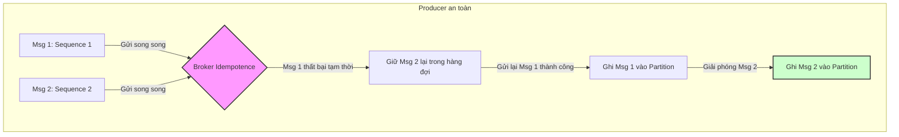

# Ordering bị sai trong hệ thống event-driven. Bạn kiểm tra gì?

## ⚡ Tóm tắt ngắn (30s)
* **Bản chất**: Kafka chỉ đảm bảo thứ tự tin nhắn **trên phạm vi một Partition duy nhất** (Partition-level Ordering). Việc sai thứ tự sự kiện (ví dụ: Tin nhắn "Hủy đơn" xử lý trước tin nhắn "Tạo đơn") thường xảy ra do cấu hình gửi song song ở Producer bị lỗi gửi lại (retry out-of-order), chọn sai Partition Key, Consumer sử dụng đa luồng (multi-threading), hoặc do cơ chế Delayed Retry đẩy tin nhắn lỗi xuống hàng đợi phụ.
* **Quy trình kiểm tra 4 bước của Senior**:
  1. **Tại Producer**: Kiểm tra cấu hình an toàn `enable.idempotence=true` và `max.in.flight.requests.per.connection <= 5`.
  2. **Tại Broker**: Kiểm tra thiết kế `Partition Key` có nhất quán (ví dụ: cùng một đơn hàng bắt buộc phải dùng chung khóa `orderId`).
  3. **Tại Consumer**: Đảm bảo xử lý đơn luồng trên mỗi partition, không đẩy tác vụ sang Thread Pool bất đồng bộ một cách vô tội vạ.
  4. **Tại Database (Chốt chặn tối hậu)**: Sử dụng mô hình **Trạng thái hữu hạn (State Machine)** và **Optimistic Locking (Version)** để từ chối các sự kiện lỗi thời đi sai thứ tự.

---

## 🔍 Chi tiết bản chất thực chiến: Quy trình truy vết lỗi mất thứ tự

### Bước 1: Điều tra và hiệu chỉnh cấu hình Producer
* **Vấn đề**: Producer gửi tin nhắn số 1 bị lỗi mạng -> Producer tiếp tục gửi tin nhắn số 2 thành công -> Producer thử lại (retry) và gửi thành công tin nhắn số 1. Thứ tự trên broker bị đảo lộn thành `[2, 1]`.
* **Giải pháp**:
  * Bật **Idempotent Producer** (`enable.idempotence=true`). Khi bật tính năng này, Broker sẽ tự động gán cho mỗi message một Sequence Number duy nhất kèm theo Producer ID. Broker sẽ từ chối ghi message nếu số Sequence nhận được không tuần tự, buộc Producer phải gửi lại đúng thứ tự.
  * Cấu hình **`max.in.flight.requests.per.connection`**:
    * Nếu `enable.idempotence=false` (cấu hình cũ): Bắt buộc phải đặt bằng `1` để đảm bảo tại một thời điểm chỉ có tối đa 1 request bay trên đường truyền mạng.
    * Nếu `enable.idempotence=true`: Có thể đặt bằng **`5`** (mặc định) mà vẫn đảm bảo an toàn tuyệt đối về thứ tự và tối ưu hóa throughput.

---

### Bước 2: Kiểm tra thiết kế Partition Key
* **Vấn đề**: Nếu các tin nhắn liên quan đến cùng một tài khoản (ví dụ: `1. Nạp tiền`, `2. Rút tiền`) không có chung Partition Key, chúng sẽ bị băm sang các partition khác nhau (`Partition 0` và `Partition 1`). Các partition này được xử lý độc lập bởi các consumer khác nhau nên chắc chắn thứ tự xử lý sẽ bị sai lệch.
* **Giải pháp**: Rà soát code định nghĩa Key của Producer. Đảm bảo mọi sự kiện của một đối tượng nghiệp vụ cụ thể bắt buộc phải có chung một Key không đổi (ví dụ: `orderId` hoặc `userId`).

---

### Bước 3: Kiểm tra luồng xử lý tại Consumer
* **Vấn đề**: Nhiều kỹ sư lập trình Consumer kéo tin nhắn về, để tăng tốc độ xử lý đã đẩy tin nhắn vào một `ThreadPoolExecutor` chạy đa luồng. Điều này trực tiếp phá huỷ cơ chế đảm bảo thứ tự của Kafka vì thread xử lý tin nhắn số 2 hoàn toàn có thể chạy xong trước thread xử lý tin nhắn số 1.
* **Giải pháp**: Tại Consumer, việc xử lý tin nhắn trên một partition phải được giữ **tuần tự (sequential)**. Nếu muốn tăng tốc độ (scale throughput), hãy **tăng số lượng Partition** trên Broker và tăng số lượng Consumer instance tương ứng thay vì dùng đa luồng nội bộ.

---

### Bước 4: Thiết kế chốt chặn phòng ngự tại Database (State Machine & Versioning)
Đây là chốt chặn quan trọng nhất của Senior vì trong hệ thống phân tán, sự cố mạng luôn có thể làm sai lệch thứ tự.
* **Thiết lập State Machine**: Định nghĩa luồng trạng thái nghiêm ngặt cho đối tượng (ví dụ: trạng thái Đơn hàng chỉ có thể đi từ `PENDING -> PAID -> DELIVERED`). Nếu sự kiện `PAID` đến sau khi trạng thái hiện tại đã là `DELIVERED`, Database sẽ lập tức từ chối cập nhật trạng thái lỗi thời này.
* **Optimistic Locking (Version)**: Mỗi bản ghi có trường `version` tăng dần. Khi update dữ liệu, bắt buộc phải đối chiếu version:
  ```sql
  UPDATE orders SET status = 'PAID', version = version + 1 
  WHERE id = :orderId AND version = :expectedVersion;
  ```

---

## 🎨 Sơ đồ trực quan (Lỗi gửi lại Out-of-Order tại Producer)

```
[ PRODUCER ] ── Gửi Msg 1 (Lỗi kết nối) ──────► (Rớt mạng)
      │
      ├──────── Gửi Msg 2 (Thành công)  ──────► [ Broker Partition ] ──► Msg 2 ghi trước (Offset 100)
      │
      └──────── Gửi lại Msg 1 (Thành công) ───► [ Broker Partition ] ──► Msg 1 ghi sau (Offset 101)
```



---

## 💻 Code thực chiến: Cấu hình Producer an toàn thứ tự & Consumer State Machine

### 1. Cấu hình Producer tuyệt đối an toàn về thứ tự (Spring Boot Java)
```java
import org.apache.kafka.clients.producer.ProducerConfig;
import org.apache.kafka.common.serialization.StringSerializer;
import org.springframework.context.annotation.Bean;
import org.springframework.context.annotation.Configuration;
import org.springframework.kafka.core.DefaultKafkaProducerFactory;
import org.springframework.kafka.core.KafkaTemplate;
import org.springframework.kafka.core.ProducerFactory;

import java.util.HashMap;
import java.util.Map;

@Configuration
public class SafeOrderingProducerConfig {

    @Bean
    public ProducerFactory<String, String> safeProducerFactory() {
        Map<String, Object> configProps = new HashMap<>();
        configProps.put(ProducerConfig.BOOTSTRAP_SERVERS_CONFIG, "localhost:9092");
        configProps.put(ProducerConfig.KEY_SERIALIZER_CLASS_CONFIG, StringSerializer.class);
        configProps.put(ProducerConfig.VALUE_SERIALIZER_CLASS_CONFIG, StringSerializer.class);

        // ==========================================
        // ✅ CẤU HÌNH VÀNG ĐẢM BẢO THỨ TỰ TUYỆT ĐỐI
        // ==========================================
        
        // 1. Kích hoạt tính năng Idempotence chống trùng lặp và giữ thứ tự gửi lại
        configProps.put(ProducerConfig.ENABLE_IDEMPOTENCE_CONFIG, "true");
        
        // 2. Cho phép tối đa 5 request bay song song trên đường truyền mà vẫn giữ thứ tự (khi idempotence = true)
        configProps.put(ProducerConfig.MAX_IN_FLIGHT_REQUESTS_PER_CONNECTION, "5");
        
        // 3. Yêu cầu toàn bộ các Broker replica xác nhận ghi thành công (acks = all)
        configProps.put(ProducerConfig.ACKS_CONFIG, "all");
        
        // 4. Cho phép thử lại vô hạn khi lỗi mạng tạm thời, Idempotence sẽ tự động lọc trùng và sắp thứ tự
        configProps.put(ProducerConfig.RETRIES_CONFIG, Integer.MAX_VALUE);

        return new DefaultKafkaProducerFactory<>(configProps);
    }

    @Bean
    public KafkaTemplate<String, String> safeKafkaTemplate() {
        return new KafkaTemplate<>(safeProducerFactory());
    }
}
```

### 2. Cốt lõi xử lý Consumer chống lỗi trôi thứ tự bằng State Machine & Optimistic Lock
```java
import lombok.RequiredArgsConstructor;
import lombok.extern.slf4j.Slf4j;
import org.springframework.kafka.annotation.KafkaListener;
import org.springframework.stereotype.Service;
import org.springframework.transaction.annotation.Transactional;

@Slf4j
@Service
@RequiredArgsConstructor
public class OrderStateConsumer {

    private final OrderRepository orderRepository;

    @KafkaListener(topics = "order-state-events", groupId = "order-group")
    @Transactional
    public void consumeOrderStateEvent(String eventJson) {
        log.info("📥 Nhận sự kiện chuyển đổi trạng thái: {}", eventJson);
        
        OrderStateEvent event = parseEvent(eventJson);
        
        // 1. Kéo trạng thái hiện tại trong Database lên
        OrderEntity order = orderRepository.findById(event.getOrderId())
                .orElseThrow(() -> new IllegalArgumentException("Không tìm thấy đơn hàng!"));

        // 2. Kiểm tra State Machine xem việc chuyển trạng thái có hợp lệ không
        // Ví dụ: Không thể đi từ DELIVERED ngược lại PAID
        if (!isValidTransition(order.getStatus(), event.getNewStatus())) {
            log.warn("⚠️ [MẤT THỨ TỰ] Bỏ qua sự kiện lỗi thời. Không thể chuyển từ {} sang {}!", 
                    order.getStatus(), event.getNewStatus());
            return; // Bỏ qua tin nhắn không ném lỗi làm nghẽn hàng đợi
        }

        // 3. Thực hiện cập nhật trạng thái kết hợp Optimistic Locking (Version check)
        try {
            order.setStatus(event.getNewStatus());
            // JPA/Hibernate sẽ tự động kiểm tra trường @Version khi lưu
            orderRepository.save(order);
            log.info("✅ Cập nhật trạng thái thành công sang: {}", event.getNewStatus());
        } catch (org.springframework.orm.ObjectOptimisticLockingFailureException e) {
            log.warn("⚠️ [CONCURRENT UPDATE] Một thread khác đã cập nhật version cao hơn. Bỏ qua!");
        }
    }

    private boolean isValidTransition(String currentStatus, String newStatus) {
        if ("DELIVERED".equals(currentStatus)) return false; // Trạng thái cuối cùng
        if ("PAID".equals(currentStatus) && "PENDING".equals(newStatus)) return false; // Đi giật lùi
        return true;
    }

    private OrderStateEvent parseEvent(String json) {
        // Parse JSON helper...
        return new OrderStateEvent(1L, "PAID");
    }
}
```

---

## 📊 Bảng so sánh các phương án bảo vệ thứ tự tin nhắn

| Giải pháp | Vị trí chốt chặn | Mức độ an toàn (Safety) | Ảnh hưởng hiệu năng (Throughput) | Cách thức triển khai |
| :--- | :--- | :--- | :--- | :--- |
| **Idempotence & acks=all** | Producer | **Rất cao** (Ngăn chặn lỗi out-of-order do gửi lại). | Ảnh hưởng rất nhỏ (Khuyên dùng mặc định). | Cấu hình tham số trên Producer client. |
| **Single Partition Topic** | Broker | **Tuyệt đối** (Duy nhất 1 partition). | **Cực kém** (Không thể scale out số lượng consumer). | Tạo topic chỉ có 1 partition. |
| **State Machine DB Check** | Consumer/DB | **Tuyệt đối an toàn** về mặt logic dữ liệu. | Rất nhỏ (Chỉ tốn thêm câu lệnh so khớp logic). | Code logic xử lý tại tầng ứng dụng nghiệp vụ. |
| **Optimistic Locking (Version)** | Database | **Tuyệt đối an toàn** về mặt lưu trữ vật lý. | Hơi tốn công sức xử lý Conflict Exception. | Thêm trường `@Version` vào bảng Database. |

---

## ⚠️ Common Gotchas & Questions follow-up

### 1. Cạm bẫy "Phình to Partition làm vỡ vụn thứ tự (Partition Expansion Disaster)"
* **Vấn đề**: Topic ban đầu có 3 partition. Các tin nhắn của đối tác `SHOPEE` có key là `"SHOPEE"`, băm ra partition 1. 
  * Hôm nay hệ thống lag, quản trị viên dùng lệnh tăng số lượng partition lên **6 partition**.
  * Thuật toán băm $\text{hash}(\text{key}) \pmod{\text{Total Partitions}}$ thay đổi kết quả từ chia dư 3 sang chia dư 6. 
  * Các tin nhắn mới của `"SHOPEE"` lập tức bị băm sang partition 4 thay vì partition 1.
  * Hậu quả: Dữ liệu của Shopee bị phân mảnh trên cả partition 1 và 4 cùng lúc. Consumer xử lý song song hai partition này sẽ làm **đảo lộn hoàn toàn thứ tự** của các sự kiện trước và sau thời điểm tăng partition.
* **Giải pháp**: 
  1. Tuyệt đối **không tăng số lượng partition của một Topic đang chạy trực tiếp** nếu hệ thống phụ thuộc hoàn toàn vào thứ tự Key.
  2. Cách scale đúng: Tạo một Topic mới có số lượng partition lớn hơn từ đầu, viết tool migrate dữ liệu cũ, sau đó chuyển hướng ứng dụng sang topic mới.

### 2. Câu hỏi đào sâu từ interviewer
* **Q1: Tại sao `max.in.flight.requests.per.connection=5` vẫn an toàn khi bật `enable.idempotence=true`?**
  * *Trả lời*: 
    * Thông thường, nếu không bật idempotence, nếu cho phép nhiều hơn 1 request bay trên đường truyền, lỗi mạng có thể làm đảo lộn thứ tự ghi trên Broker.
    * Khi `enable.idempotence=true`, Kafka Broker lưu giữ thông tin của 5 request gần nhất ứng với từng Sequence Number của Producer. Nếu request số 1 bị lỗi, Broker sẽ không ghi request số 2, 3 dù đã nhận được, mà bắt buộc phải đợi Producer gửi lại request số 1 thành công. Broker tự động sắp xếp lại các tin nhắn này theo đúng thứ tự Sequence trước khi ghi vào commit log. Do đó, cấu hình 5 vẫn an toàn tuyệt đối.
