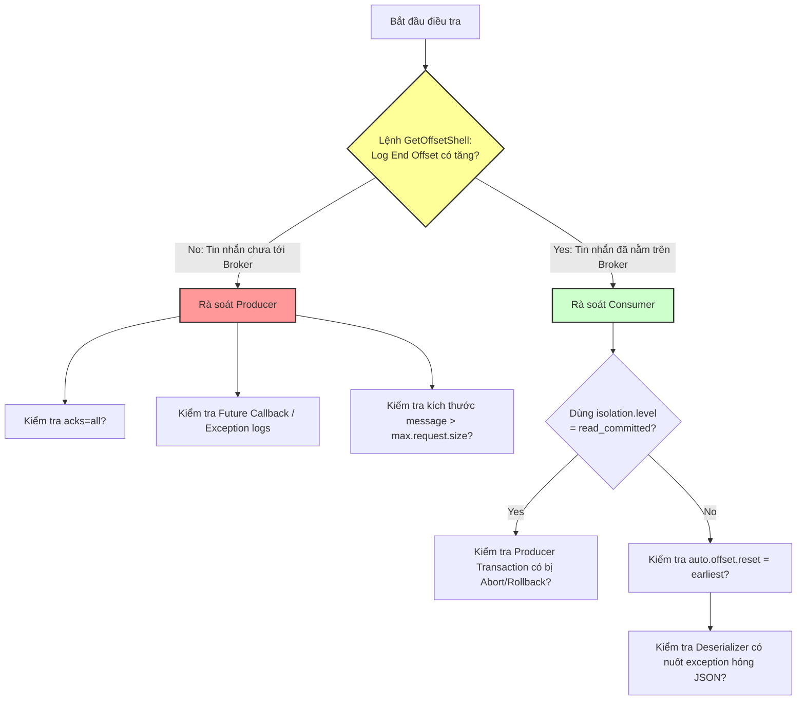

# Producer gửi message thành công nhưng consumer không thấy. Bạn điều tra thế nào?

## ⚡ Tóm tắt ngắn (30s)
* **Bản chất**: Hiện tượng này thường do **Mất dữ liệu âm thầm (Silent Data Loss)** ở phía Producer, **Lỗi cấu hình định tuyến** của Consumer, hoặc **Chốt chặn giao dịch (Transaction Isolation)** ngăn cản việc đọc. Producer báo "thành công" nhưng thực tế tin nhắn có thể chưa được ghi vào đĩa của Broker (do `acks=0` hoặc `acks=1`), hoặc Consumer đang trỏ sai topic, sai group, bị nhảy trôi offset (`auto.offset.reset`), hay âm thầm giải mã lỗi (deserialization failure) mà nuốt log.
* **Quy trình 5 bước điều tra của Senior**:
  1. **Bước 1: Kiểm tra Broker (Source of Truth)**: Dùng Kafka CLI để truy vấn trực tiếp xem tin nhắn đã có mặt vật lý trên Broker chưa thông qua kiểm tra `Log End Offset`.
  2. **Bước 2: Rà soát cấu hình Producer**: Kiểm tra thiết lập `acks` và kiểm tra xem có sử dụng cơ chế gửi bất đồng bộ mà quên đăng ký callback bắt ngoại lệ hay không.
  3. **Bước 3: Kiểm tra mức độ cô lập giao dịch (Transaction Isolation)**: Nếu dùng Kafka Transaction, đảm bảo Consumer không đặt cấu hình `isolation.level=read_committed` khi Producer đang gửi tin nhắn không theo transaction hoặc transaction bị hủy (abort).
  4. **Bước 4: Rà soát cấu hình Consumer**: Kiểm tra tên Topic, Bootstrap Servers, Consumer Group active status, và thuộc tính `auto.offset.reset`.
  5. **Bước 5: Kiểm tra Deserializer nuốt lỗi**: Xác minh xem consumer có sử dụng `ErrorHandlingDeserializer` nhưng cấu hình rỗng không có DLQ/logger dẫn đến việc bỏ qua âm thầm tin nhắn lỗi cấu trúc.

---

## 🔍 Chi tiết bản chất thực chiến: Quy trình 5 bước điều tra End-to-End

### Bước 1: Xác minh tin nhắn có thực sự nằm trên Broker hay không?
Đây là bước đầu tiên để phân đôi vùng nghi ngờ (Lỗi do Producer hay Consumer).
* **Hành động**: Sử dụng lệnh Kafka CLI để kiểm tra offset lớn nhất hiện tại của topic:
  ```bash
  kafka-run-class.sh kafka.tools.GetOffsetShell \
    --bootstrap-server localhost:9092 \
    --topic order-events --time -1
  ```
* **Phân tích kết quả**:
  * Nếu **Log End Offset không tăng**: Chứng tỏ tin nhắn **chưa từng tới được Broker**. Lỗi hoàn toàn nằm ở phía Producer (báo thành công ảo).
  * Nếu **Log End Offset tăng**: Tin nhắn đã nằm an toàn trên Broker. Lỗi chắc chắn nằm ở phía Consumer không tiêu thụ được.

---

### Bước 2: Truy vết lỗi phía Producer (Thành công ảo)
* **Lỗi `acks` lỏng lẻo**: Lập trình viên cấu hình `acks=0` (gửi xong mặc định coi là thành công mà không đợi phản hồi) hoặc `acks=1` (chỉ đợi Broker Leader xác nhận ghi vào bộ nhớ đệm RAM). Nếu Broker Leader bị sập nguồn ngay sau đó trước khi kịp đồng bộ sang các Replica, tin nhắn sẽ bị mất vĩnh viễn dù Producer nhận mã thành công.
* **Quên xử lý Callback bất đồng bộ**: Gọi `kafkaTemplate.send()` nhưng không đăng ký lắng nghe kết quả (`CompletableFuture` callback). Khi Broker từ chối ghi (ví dụ do quá kích thước payload `max.request.size`), ứng dụng vẫn chạy tiếp bình thường và nuốt lỗi âm thầm.

---

### Bước 3: Rà soát rào cản Transaction (`isolation.level`)
* **Cơ chế**: Khi sử dụng giao dịch phân tán (Kafka Transactions), Producer sẽ đánh dấu tin nhắn bằng trạng thái `committed` hoặc `aborted`.
* **Vấn đề**: Nếu Consumer cấu hình `isolation.level = read_committed` (bắt buộc cho fintech để tránh đọc rác), nó sẽ **bỏ qua hoàn toàn** các tin nhắn chưa được commit hoặc thuộc về transaction bị hủy.
* **Giải pháp**: Kiểm tra xem transaction của Producer có thực sự kết thúc bằng lệnh `commitTransaction()` hay bị rollback/abort âm thầm do một exception nghiệp vụ.

---

### Bước 4: Kiểm tra cấu hình và trạng thái của Consumer
* **Lỗi nhảy trôi offset (`auto.offset.reset`)**:
  * Nếu consumer mới tinh join group lần đầu, mặc định `auto.offset.reset=latest`.
  * Nếu Producer gửi tin nhắn lúc Consumer đang offline. Khi Consumer khởi động lên, nó sẽ **nhảy thẳng đến Offset mới nhất** và bỏ qua sạch sẽ toàn bộ lô tin nhắn được gửi trong lúc nó offline.
* **Sai tên Topic hoặc Broker**: Rà soát lỗi đánh máy (ví dụ: `order_events` thay vì `order-events`).

---

### Bước 5: Kiểm tra Deserializer nuốt lỗi âm thầm
* Nếu tin nhắn bị lỗi định dạng (JSON hỏng) và Consumer dùng `ErrorHandlingDeserializer` nhưng trong code `@KafkaListener` không có cấu hình `ErrorHandler` hoặc DLQ. Tin nhắn lỗi bị giải mã thất bại sẽ bị nuốt chửng âm thầm, offset vẫn commit trôi qua và log hệ thống hoàn toàn trống rỗng.

---

## 🎨 Sơ đồ trực quan (Quy trình 5 bước điều tra mất tin nhắn)



---

## 💻 Code thực chiến: Cấu hình an toàn tuyệt đối tránh mất mát dữ liệu

### 1. Phía Producer: Gửi tin nhắn bất đồng bộ có kèm chốt chặn Callback xác thực
```java
import lombok.extern.slf4j.Slf4j;
import org.springframework.kafka.core.KafkaTemplate;
import org.springframework.kafka.support.SendResult;
import org.springframework.stereotype.Service;

import java.util.concurrent.CompletableFuture;

@Slf4j
@Service
public class GuaranteedOrderProducer {

    private final KafkaTemplate<String, String> kafkaTemplate;

    public GuaranteedOrderProducer(KafkaTemplate<String, String> kafkaTemplate) {
        this.kafkaTemplate = kafkaTemplate;
    }

    public void publishOrder(String orderId, String orderPayload) {
        log.info("📤 Đang gửi đơn hàng {} sang Kafka...", orderId);

        // Gửi bất đồng bộ trả về CompletableFuture
        CompletableFuture<SendResult<String, String>> future = 
                kafkaTemplate.send("order-events-topic", orderId, orderPayload);

        // ✅ CHỐT CHẶN VÀNG: Bắt buộc đăng ký Callback để ghi nhận lỗi gửi vật lý
        future.whenComplete((result, ex) -> {
            if (ex == null) {
                log.info("✅ Gửi thành công đơn hàng {}! Partition: {}, Offset: {}", 
                        orderId, 
                        result.getRecordMetadata().partition(), 
                        result.getRecordMetadata().offset());
            } else {
                // Thất bại thực sự: Ghi log lỗi đỏ, bắn alert Slack hoặc đẩy vào DB dự phòng
                log.error("❌ THẢM HỌA: Gửi đơn hàng {} thất bại vật lý sang Kafka!", orderId, ex);
                handleFailedMessageBackup(orderId, orderPayload, ex.getMessage());
            }
        });
    }

    private void handleFailedMessageBackup(String orderId, String payload, String errorMessage) {
        log.warn("💾 Đang ghi đơn hàng lỗi {} vào Outbox Database dự phòng để gửi lại sau...", orderId);
    }
}
```

### 2. Phía Consumer: Thiết lập chốt chặn Transaction & Offset an toàn
```java
import org.apache.kafka.clients.consumer.ConsumerConfig;
import org.apache.kafka.common.serialization.StringDeserializer;
import org.springframework.context.annotation.Bean;
import org.springframework.context.annotation.Configuration;
import org.springframework.kafka.config.ConcurrentKafkaListenerContainerFactory;
import org.springframework.kafka.core.ConsumerFactory;
import org.springframework.kafka.core.DefaultKafkaConsumerFactory;

import java.util.HashMap;
import java.util.Map;

@Configuration
public class SafeConsumerSecurityConfig {

    @Bean
    public ConsumerFactory<String, String> safeConsumerFactory() {
        Map<String, Object> props = new HashMap<>();
        props.put(ConsumerConfig.BOOTSTRAP_SERVERS_CONFIG, "localhost:9092");
        props.put(ConsumerConfig.GROUP_ID_CONFIG, "guaranteed-order-consumer-group");

        // ✅ CHỐT CHẶN 1: Nếu rớt offset hoặc group mới tinh, bắt buộc đọc từ đầu lịch sử
        props.put(ConsumerConfig.AUTO_OFFSET_RESET_CONFIG, "earliest");

        // ✅ CHỐT CHẶN 2: Chỉ đọc các tin nhắn đã được commit hoàn tất giao dịch
        props.put(ConsumerConfig.ISOLATION_LEVEL_CONFIG, "read_committed");

        // ✅ CHỐT CHẶN 3: Tắt tự động commit tự do, chuyển sang quản lý thủ công/Spring tự động quản lý an toàn
        props.put(ConsumerConfig.ENABLE_AUTO_COMMIT_CONFIG, "false");

        return new DefaultKafkaConsumerFactory<>(
                props, 
                new StringDeserializer(), 
                new StringDeserializer()
        );
    }

    @Bean
    public ConcurrentKafkaListenerContainerFactory<String, String> kafkaListenerContainerFactory() {
        ConcurrentKafkaListenerContainerFactory<String, String> factory =
                new ConcurrentKafkaListenerContainerFactory<>();
        factory.setConsumerFactory(safeConsumerFactory());
        return factory;
    }
}
```

---

## 📊 Bảng so sánh các điểm lỗi và hành động xử lý

| Điểm lỗi (Failure Point) | Bản chất sự cố | Hậu quả dữ liệu | Cách thức phát hiện | Biện pháp xử lý vĩnh viễn |
| :--- | :--- | :--- | :--- | :--- |
| **`acks=0` hoặc `acks=1`** | Producer không đợi xác nhận ghi đĩa hoàn tất từ các Broker Replica. | Mất mát dữ liệu vĩnh viễn khi broker leader sập. | Log End Offset trên Broker không tăng dù Producer báo OK. | Cấu hình `acks=all` (hoặc `acks=-1`). |
| **`auto.offset.reset = latest`** | Consumer mới khởi chạy nhảy thẳng tới offset cuối, bỏ qua tin nhắn cũ. | Bỏ sót các tin nhắn gửi lúc consumer đang offline. | Xem offset đã commit của consumer group bằng CLI. | Cấu hình `auto.offset.reset = earliest`. |
| **Transaction Abort** | Producer chạy lỗi ném Exception làm hủy transaction giao dịch bất đồng bộ. | Consumer ở chế độ `read_committed` không đọc được tin nhắn đó. | Log End Offset của Broker tăng nhưng Offset commit của Consumer đứng yên. | Kiểm tra khối code transactional của Producer để vá lỗi logic. |
| **Silent Deserialization Failure** | Lỗi giải mã hỏng JSON bị nuốt chửng bởi Deserializer nuốt lỗi. | Tin nhắn biến mất không dấu vết, offset vẫn trôi qua. | Không có log lỗi nhưng offset vẫn tăng tuần tự. | Sử dụng `ErrorHandlingDeserializer` kết hợp ghi log/DLQ tường minh. |

---

## ⚠️ Common Gotchas & Questions follow-up

### 1. Cạm bẫy "Mất dữ liệu âm thầm do Auto-Commit offset (Silent loss via auto-commit)"
* **Vấn đề**: Nếu cấu hình `enable.auto.commit = true` (mặc định của Kafka client gốc). 
  * Consumer kéo về 100 tin nhắn. 
  * Cứ mỗi 5 giây, client tự động gửi offset lớn nhất hiện tại lên Broker để commit, bất chấp việc code nghiệp vụ xử lý 100 tin nhắn đó đã thành công hay thất bại.
  * Nếu tại tin nhắn số 5, ứng dụng bị lỗi chết đột tử (OOM hoặc sập nguồn máy chủ vật lý). 
  * Do offset của tin nhắn số 100 đã bị tự động commit trước đó, khi consumer khởi động lại, nó sẽ **tiêu thụ từ tin nhắn số 101**, làm mất vĩnh viễn từ tin nhắn số 5 đến 100 mà không hề hay biết!
* **Giải pháp**: Luôn luôn đặt `enable.auto.commit = false` trên các dự án lớn. Sử dụng tính năng commit của Spring Kafka (Spring tự động commit offset sau khi hàm listener xử lý thành công không ném ngoại lệ).

### 2. Câu hỏi đào sâu từ interviewer
* **Q1: Làm sao biết một Consumer Group có thực sự đang tiêu thụ hay bị chết lâm sàng?**
  * *Trả lời*:
    * Sử dụng lệnh Kafka CLI để kiểm tra trạng thái hoạt động của Consumer Group:
      ```bash
      kafka-consumer-groups.sh --bootstrap-server localhost:9092 \
        --describe --group guaranteed-order-consumer-group
      ```
    * Kiểm tra cột **`LAG`**: Nếu LAG lớn hơn 0 và không có dấu hiệu giảm xuống, đồng thời cột **`CONSUMER-ID`** và **`HOST`** trống rỗng (empty), chứng tỏ Consumer Group đang bị chết lâm sàng (không có bất kỳ instance hoạt động nào kết nối vào Broker).
