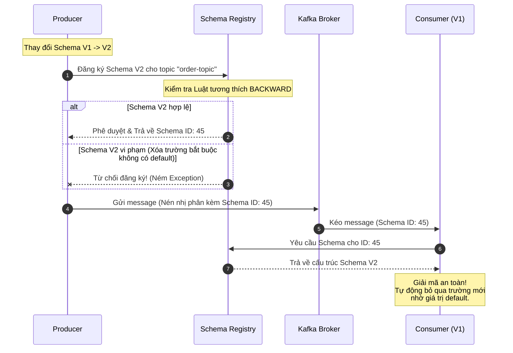

# Schema thay đổi làm consumer cũ bị lỗi. Cách phòng tránh?

## ⚡ Tóm tắt ngắn (30s)
* **Bản chất**: Hiện tượng này gọi là **Schema Evolution Mismatch (Xung đột cấu trúc dữ liệu)**. Khi Producer thay đổi định dạng tin nhắn (như xóa một trường bắt buộc, thay đổi kiểu dữ liệu, hoặc sửa tên khóa) mà Consumer cũ đang chạy trên Production chưa được cập nhật, Consumer sẽ gặp lỗi Deserialization nghiêm trọng (ném ngoại lệ, sập luồng) và biến tin nhắn đó thành một Poison Pill kẹt cứng đường ống.
* **Thảm họa thực chiến được giải quyết**:
  1. **Sập hệ thống dây chuyền khi Deploy (Deployment Dependency Lock)**: Tránh việc bắt buộc phải dừng toàn bộ hệ thống để đồng thời deploy cả Producer và Consumer cùng một lúc (Zero-downtime deployment).
  2. **Tắc nghẽn đường ống dữ liệu (Pipeline Poisoning)**: Ngăn chặn việc một cấu trúc dữ liệu mới vô tình phá hủy khả năng giải mã của hàng chục consumer độc lập khác nhau đang tiêu thụ chung một topic.
* **Quyết định Senior**:
  1. **Tuyệt đối không dùng JSON tự do (Raw JSON)** cho các luồng truyền thông cốt lõi. Bắt buộc chuyển sang định dạng tự mô tả và có schema chặt chẽ như **Apache Avro** hoặc **Protocol Buffers (Protobuf)**.
  2. **Triển khai Confluent Schema Registry** làm chốt chặn trung tâm để quản trị vòng đời Schema.
  3. **Thiết lập Luật tương thích BACKWARD** làm tiêu chuẩn mặc định: Producer chỉ được phép thêm trường mới có giá trị mặc định (`default value`) hoặc xóa trường tùy chọn (`optional field`), giúp consumer cũ vui vẻ bỏ qua trường mới và tiếp tục chạy mượt mà.

---

## 🔍 Chi tiết bản chất thực chiến: Quy tắc Tương thích Schema (Schema Compatibility Rules)

Khi triển khai **Confluent Schema Registry**, mọi schema mới gửi lên bắt buộc phải đi qua chốt chặn kiểm duyệt tương thích. Senior thiết lập 3 chế độ tương thích chính dựa trên yêu cầu nghiệp vụ:

```
                            SCHEMA COMPATIBILITY
                                     │
         ┌───────────────────────────┼───────────────────────────┐
         ▼                           ▼                           ▼
      BACKWARD                    FORWARD                      FULL
  (Khuyên dùng nhất)        (Consumer mới đọc cũ)       (Đầy đủ hai chiều)
         │                           │                           │
- Consumer cũ đọc dữ liệu mới. - Consumer mới đọc dữ liệu cũ. - Consumer cũ/mới đều đọc
- Chỉ thêm trường có default. - Chỉ xóa trường có default.     được dữ liệu cũ/mới.
- Chỉ xóa trường tùy chọn.    - Chỉ thêm trường bắt buộc.    - Chỉ thêm/xóa trường có default.
```

### 1. Luật BACKWARD (Backward Compatibility - Tiêu chuẩn Enterprise)
* **Định nghĩa**: Đảm bảo Consumer sử dụng schema phiên bản cũ (V1) có thể giải mã thành công tin nhắn được tạo bởi Producer sử dụng schema phiên bản mới (V2).
* **Quy tắc thiết kế**:
  * Khi thêm một trường mới ở V2, bắt buộc phải khai báo giá trị mặc định (`"default": null` hoặc một giá trị cụ thể). Nhờ đó, consumer cũ khi đọc dữ liệu V2 sẽ tự động bỏ qua trường này mà không ném lỗi.
  * Chỉ được xóa các trường tùy chọn ở V1 (trường đã có default).

### 2. Luật FORWARD (Forward Compatibility)
* **Định nghĩa**: Đảm bảo Consumer sử dụng schema phiên bản mới (V2) có thể đọc và hiểu được tin nhắn được tạo bởi Producer sử dụng schema phiên bản cũ (V1).
* **Quy tắc thiết kế**:
  * Khi thêm trường mới ở V2, trường đó phải là **Trường bắt buộc (Required)**.
  * Khi xóa trường ở V1, trường bị xóa bắt buộc phải là trường có giá trị mặc định.

### 3. Luật FULL (Full Compatibility)
* **Định nghĩa**: Kết hợp cả BACKWARD và FORWARD. Đảm bảo toàn bộ consumer cũ và mới đều có thể đọc chéo dữ liệu của producer cũ và mới một cách an toàn.

---

## 🎨 Sơ đồ trực quan (Luồng kiểm duyệt của Schema Registry)



---

## 💻 Code thực chiến: Cấu hình Avro Schema & Spring Boot Avro Consumer

### 1. File định nghĩa cấu trúc dữ liệu Avro Schema (`order_event.avsc`)
Dưới đây là file định nghĩa Avro Schema chuẩn hóa, thiết lập trường an toàn với giá trị mặc định để đảm bảo tương thích ngược tuyệt đối.

```json
{
  "type": "record",
  "name": "OrderEvent",
  "namespace": "com.enterprise.schema.avro",
  "doc": "Schema định nghĩa sự kiện đơn hàng an toàn tương thích ngược",
  "fields": [
    {
      "name": "orderId",
      "type": "string",
      "doc": "Mã định danh đơn hàng duy nhất"
    },
    {
      "name": "amount",
      "type": "double",
      "doc": "Số tiền của đơn hàng"
    },
    {
      "name": "status",
      "type": "string",
      "doc": "Trạng thái hiện tại của đơn hàng"
    },
    // ✅ TRƯỜNG THÊM MỚI AN TOÀN: Bắt buộc phải có default value
    {
      "name": "paymentMethod",
      "type": ["null", "string"], 
      "default": null,
      "doc": "Phương thức thanh toán mới được thêm vào phiên bản V2"
    }
  ]
}
```

### 2. Cấu hình Spring Boot Consumer sử dụng Avro và Schema Registry
```java
import com.enterprise.schema.avro.OrderEvent;
import lombok.extern.slf4j.Slf4j;
import org.apache.kafka.clients.consumer.ConsumerConfig;
import org.apache.kafka.common.serialization.StringDeserializer;
import io.confluent.kafka.serializers.KafkaAvroDeserializer;
import io.confluent.kafka.serializers.KafkaAvroDeserializerConfig;
import org.springframework.context.annotation.Bean;
import org.springframework.context.annotation.Configuration;
import org.springframework.kafka.annotation.KafkaListener;
import org.springframework.kafka.config.ConcurrentKafkaListenerContainerFactory;
import org.springframework.kafka.core.ConsumerFactory;
import org.springframework.kafka.core.DefaultKafkaConsumerFactory;
import org.springframework.messaging.handler.annotation.Payload;
import org.springframework.stereotype.Service;

import java.util.HashMap;
import java.util.Map;

@Configuration
@Slf4j
public class KafkaAvroConsumerConfig {

    @Bean
    public ConsumerFactory<String, OrderEvent> avroConsumerFactory() {
        Map<String, Object> props = new HashMap<>();
        props.put(ConsumerConfig.BOOTSTRAP_SERVERS_CONFIG, "localhost:9092");
        props.put(ConsumerConfig.GROUP_ID_CONFIG, "order-avro-group");
        
        // 1. Cấu hình Deserializer chuyên dụng cho dữ liệu Avro nhị phân
        props.put(ConsumerConfig.KEY_DESERIALIZER_CLASS_CONFIG, StringDeserializer.class);
        props.put(ConsumerConfig.VALUE_DESERIALIZER_CLASS_CONFIG, KafkaAvroDeserializer.class);

        // 2. Chỉ định địa chỉ của Confluent Schema Registry trung tâm
        props.put("schema.registry.url", "http://localhost:8081");

        // ✅ CHỐT CHẶN VÀNG: Bắt buộc giải mã ra Object cụ thể (Specific Record) 
        // thay vì giải mã ra GenericRecord thô sơ không an toàn kiểu dữ liệu.
        props.put(KafkaAvroDeserializerConfig.SPECIFIC_AVRO_READER_CONFIG, "true");

        return new DefaultKafkaConsumerFactory<>(props);
    }

    @Bean
    public ConcurrentKafkaListenerContainerFactory<String, OrderEvent> kafkaListenerContainerFactory() {
        ConcurrentKafkaListenerContainerFactory<String, OrderEvent> factory =
                new ConcurrentKafkaListenerContainerFactory<>();
        factory.setConsumerFactory(avroConsumerFactory());
        return factory;
    }
}

// ── Listener Tiêu Thụ Sự Kiện An Toàn ──────────────────────────────
@Service
@Slf4j
class OrderAvroListener {

    @KafkaListener(topics = "order-avro-events")
    public void listen(@Payload OrderEvent orderEvent) {
        log.info("✅ Giải mã Avro nhị phân thành công!");
        log.info("📥 Đơn hàng: {}, Số tiền: {}, Trạng thái: {}, Phương thức thanh toán mới: {}", 
                orderEvent.getOrderId(), 
                orderEvent.getAmount(), 
                orderEvent.getStatus(), 
                orderEvent.getPaymentMethod()); // Sẽ tự động là null nếu nhận từ Producer cũ V1
    }
}
```

---

## 📊 Bảng so sánh các Chế độ Tương thích Schema (Confluent Compatibility)

| Chế độ tương thích | Consumer cũ đọc message mới? | Consumer mới đọc message cũ? | Quy tắc bắt buộc thiết kế | Use case phù hợp |
| :--- | :--- | :--- | :--- | :--- |
| **`BACKWARD`** (Khuyên dùng) | **Được** | Không đảm bảo | Thêm trường mới phải có `default`. Xóa trường V1 phải là trường có `default`. | **Chuẩn hóa Enterprise**. Cho phép nâng cấp Producer trước mà không cần nâng cấp Consumer lập tức. |
| **`FORWARD`** | Không đảm bảo | **Được** | Thêm trường mới phải là trường bắt buộc (required). Xóa trường V1 phải có `default`. | Phù hợp khi cần nâng cấp toàn bộ hệ thống Consumer lên trước để chuẩn bị nhận dữ liệu mới. |
| **`FULL`** | **Được** | **Được** | Chỉ được thêm hoặc xóa các trường có giá trị mặc định `default`. | Các topic lõi có hàng chục consumer dùng chung, kiểm soát tương thích đa hướng cực kỳ chặt chẽ. |
| **`NONE`** | Không | Không | Không có quy tắc nào được áp dụng. | **Không bao giờ dùng trên Production**. Chỉ dùng thử nghiệm trên Local. |

---

## ⚠️ Common Gotchas & Questions follow-up

### 1. Cạm bẫy "Bẫy nâng cấp kiểu dữ liệu ngầm (Data Type Promotion Trap)"
* **Vấn đề**: Nhiều kỹ sư nghĩ rằng thay đổi kiểu dữ liệu tương đồng (ví dụ: đổi trường `amount` từ kiểu `int` sang `long` hoặc `float` sang `double`) là an toàn và tương thích ngược. 
* Tuy nhiên, đối với bộ giải mã của Apache Avro, đây là một **Breaking Change** nghiêm trọng. Avro Deserializer phiên bản cũ (V1 mong đợi `int`) sẽ lập tức ném lỗi sập luồng khi nhận được cấu trúc byte biểu diễn kiểu `long` (64-bit thay vì 32-bit).
* **Khắc phục**: 
  1. Tuyệt đối không thay đổi kiểu dữ liệu của các trường đang hoạt động. 
  2. Nếu bắt buộc thay đổi kiểu dữ liệu, hãy tạo một trường mới hoàn toàn (ví dụ: `amount_v2` kiểu `double` có default) và đánh dấu trường cũ (`amount_v1`) là không sử dụng nữa (`deprecated`).

### 2. Câu hỏi đào sâu từ interviewer
* **Q1: Làm sao kiểm tra tính tương thích của Schema tự động trước khi deploy để tránh lỗi Production?**
  * *Trả lời*:
    * Chúng ta không nên đợi đến khi deploy code lên production mới phát hiện xung đột schema.
    * Tích hợp **Schema Registry Maven / Gradle Plugin** vào pipeline CI/CD (GitHub Actions / GitLab CI).
    * Mỗi khi có thay đổi file `.avsc`, pipeline CI/CD sẽ thực thi lệnh test:
      ```bash
      mvn schema-registry:test-compatibility
      ```
    * Plugin sẽ tự động gửi schema mới lên Schema Registry của môi trường Staging và kiểm tra xem nó có tương thích với schema hiện tại theo luật (BACKWARD/FULL) hay không. Nếu kiểm tra thất bại, pipeline sẽ báo đỏ và chặn không cho merge Pull Request.
