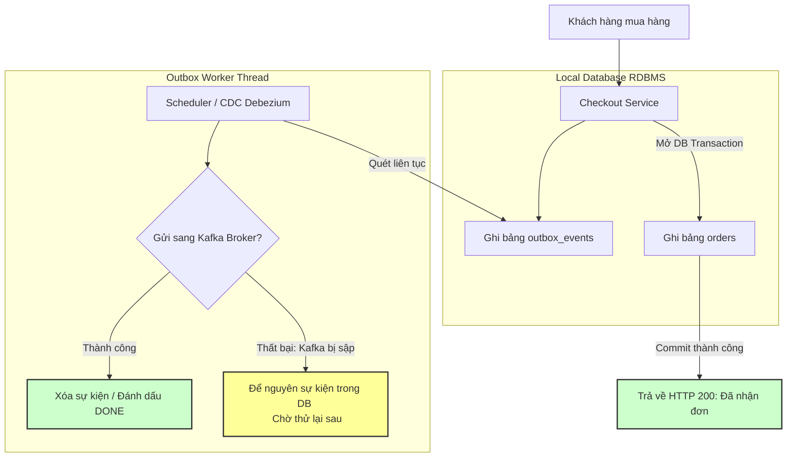

# Nếu Kafka broker unavailable, service producer nên làm gì?

## ⚡ Tóm tắt ngắn (30s)
* **Bản chất**: Khi cụm Kafka Broker bị sập (downtime vật lý, lỗi cấu hình mạng, hoặc quá tải đĩa cứng), Producer không thể gửi tin nhắn đi. Nếu không có cơ chế dự phòng, ứng dụng phía trước (ví dụ: Checkout Service) sẽ lập tức bị ném ngoại lệ, trả lỗi HTTP 500 cho khách hàng, trực tiếp gây mất mát doanh thu và dữ liệu nghiêm trọng.
* **Thảm họa thực chiến được giải quyết**:
  1. **Sập đổ dây chuyền (Cascading Outage / Thread Exhaustion)**: Mặc định, lệnh `send()` của Kafka Producer sẽ **khóa cứng (block)** luồng xử lý HTTP trong `max.block.ms` (mặc định là 60 giây) để chờ kết nối. Khi broker sập, toàn bộ HTTP Thread Pool của Web Server (như Tomcat) sẽ bị nghẽn và cạn kiệt chỉ trong vài giây, đánh sập hoàn toàn hệ thống Web phía trước.
  2. **Mất mát đơn hàng của khách hàng**: Khách hàng đã thanh toán tiền thành công nhưng hệ thống không thể tạo đơn hàng sang dịch vụ kho và vận chuyển do sập đường ống truyền tin Kafka.
* **Quyết định Senior**:
  1. **Tuyệt đối không gửi Kafka trực tiếp trong luồng chính**: Áp dụng **Transactional Outbox Pattern** kết hợp RDBMS làm bộ đệm an toàn vật lý. Ghi đồng thời dữ liệu nghiệp vụ và sự kiện cần gửi (Outbox Record) vào Database cục bộ trong **cùng một Transaction**.
  2. **Tuning cấu hình Producer**: Đặt `max.block.ms = 1000` (1 giây) và `buffer.memory` an toàn để giải phóng thread nghiệp vụ lập tức khi Broker sập.
  3. **Tự động phục hồi (Auto-healing Redrive)**: Một tiến trình chạy ngầm (Worker/Scheduler) hoặc CDC tool (như Debezium) quét bảng Outbox và gửi lại tin nhắn khi Broker sống lại.

---

## 🔍 Chi tiết bản chất thực chiến: Cạm bẫy nghẽn luồng & Giải pháp Outbox

### 1. Cạm bẫy: Đóng băng hệ thống (Thread Pool Exhaustion)
Thông thường, luồng xử lý của lập trình viên sẽ như sau:
```java
// ❌ SAI LẦM PHỔ BIẾN:
@Transactional
public void createOrder(Order order) {
    orderRepository.save(order); // 1. Ghi DB nghiệp vụ
    kafkaTemplate.send("order-topic", order.getId(), order.toJson()); // 2. Gọi Kafka trực tiếp
}
```
* **Khi Kafka Broker bị sập**: Lệnh `kafkaTemplate.send()` sẽ cố gắng kết nối với Broker để lấy Metadata của topic. Luồng xử lý chính sẽ bị **treo cứng (block) trong vòng 60 giây**.
* **Hậu quả**: Nếu hệ thống nhận 200 request/giây, chỉ sau 1 giây, toàn bộ 200 thread xử lý của Web Server sẽ bị treo cứng để đợi Kafka. Người dùng tiếp theo truy cập trang web sẽ nhận lỗi Gateway Timeout (504) hoặc Connection Refused. Toàn hệ thống sụp đổ dây chuyền.

---

### 2. Giải pháp Enterprise: Transactional Outbox Pattern
Để đảm bảo tính chịu lỗi cao nhất (High Fault-tolerance), Senior cô lập hoàn toàn Broker khỏi luồng xử lý chính:

```
[ HTTP REQUEST: Tạo đơn hàng ]
             │
             ▼
   ┌────────────────────────────────────────────────────────┐
   │            DATABASE TRANSACTION CỦA ORDER SERVICE      │
   │                                                        │
   │   1. Insert bảng [orders] (Trạng thái: PENDING)        │
   │   2. Insert bảng [outbox_events] (Sự kiện: ORDER_CREATED)│
   └────────────────────────────────────────────────────────┘
             │
    Commit thành công -> Trả về HTTP 200 cho khách hàng ngay lập tức!
             │
             ▼
┌──────────────────────────────────────────────────────────────┐
│           TIẾN TRÌNH CHẠY NGẦM (OUTBOX PUBLISHER)            │
│                                                              │
│  - Quét bảng [outbox_events] lấy các bản ghi chưa gửi.      │
│  - Thử gửi sang Kafka Broker.                                │
│  - Nếu KAFKA BROKER SẬP: Không sao, sự kiện nằm an toàn ở DB!│
│  - Nếu KAFKA BROKER SỐNG: Gửi thành công -> Đánh dấu 'DONE'. │
└──────────────────────────────────────────────────────────────┘
```

---

## 🎨 Sơ đồ trực quan (Transactional Outbox chống sập Broker)



---

## 💻 Code thực chiến: Triển khai Transactional Outbox & Auto-redrive Worker

### 1. Phía Web Service: Ghi dữ liệu nghiệp vụ và Outbox Event trong cùng 1 Transaction
```java
import lombok.RequiredArgsConstructor;
import lombok.extern.slf4j.Slf4j;
import org.springframework.stereotype.Service;
import org.springframework.transaction.annotation.Transactional;

@Slf4j
@Service
@RequiredArgsConstructor
public class OrderCheckoutService {

    private final OrderRepository orderRepository;
    private final OutboxEventRepository outboxEventRepository;

    @Transactional // ✅ ĐẢM BẢO TÍNH TOÀN VẸN: Cả 2 ghi thành công hoặc cùng rollback
    public void checkout(OrderDto dto) {
        log.info("🛒 Đang xử lý checkout cho đơn hàng {}", dto.getOrderId());

        // 1. Lưu đơn hàng vào bảng orders nghiệp vụ chính
        OrderEntity order = new OrderEntity(dto.getOrderId(), dto.getAmount(), "CREATED");
        orderRepository.save(order);

        // 2. Lưu sự kiện vào bảng outbox_events nằm cùng Database
        String eventPayload = String.format("{\"orderId\":\"%s\",\"amount\":%s}", dto.getOrderId(), dto.getAmount());
        OutboxEventEntity outboxEvent = new OutboxEventEntity(
                dto.getOrderId(),
                "ORDER_CREATED",
                eventPayload,
                "PENDING" // Trạng thái ban đầu: Chưa gửi
        );
        outboxEventRepository.save(outboxEvent);

        log.info("💾 Đã lưu đơn hàng và sự kiện Outbox thành công vào DB cục bộ!");
    }
}
```

### 2. Tiến trình chạy ngầm (Outbox Publisher) tự động quét DB gửi lên Kafka Broker
Tiến trình này chạy bất đồng bộ hoàn toàn, có cơ chế tự động thử lại khi Broker sập mà không làm phiền luồng Checkout chính.

```java
import lombok.RequiredArgsConstructor;
import lombok.extern.slf4j.Slf4j;
import org.springframework.kafka.core.KafkaTemplate;
import org.springframework.scheduling.annotation.Scheduled;
import org.springframework.stereotype.Service;
import org.springframework.transaction.annotation.Transactional;

import java.util.List;

@Slf4j
@Service
@RequiredArgsConstructor
public class OutboxPublisherWorker {

    private final OutboxEventRepository outboxEventRepository;
    private final KafkaTemplate<String, String> kafkaTemplate;

    // Quét bảng outbox định kỳ mỗi 5 giây
    @Scheduled(fixedDelay = 5000)
    @Transactional
    public void publishPendingEvents() {
        // Lấy danh sách tối đa 100 sự kiện đang bị treo 'PENDING'
        List<OutboxEventEntity> pendingEvents = outboxEventRepository.findTop100ByStatus("PENDING");
        
        if (pendingEvents.isEmpty()) {
            return;
        }

        log.info("🔄 Phát hiện {} sự kiện Outbox đang chờ xử lý...", pendingEvents.size());

        for (OutboxEventEntity event : pendingEvents) {
            try {
                // Thử gửi sang Kafka Broker vật lý
                // Cấu hình Producer: max.block.ms = 1000 (1 giây) để ném lỗi nhanh nếu sập Broker
                kafkaTemplate.send("order-events", event.getAggregateId(), event.getPayload())
                        .get(); // Chặn đồng bộ ở Worker Thread để kiểm tra kết nối vật lý thực sự

                // Gửi thành công -> Đánh dấu DONE hoặc XÓA để tránh phình to DB
                event.setStatus("DONE");
                outboxEventRepository.save(event);
                log.info("✅ Đã đẩy thành công Outbox event {} lên Kafka!", event.getAggregateId());
                
            } catch (Exception e) {
                // ⚠️ THẤT BẠI: Kafka Broker bị sập hoặc nghẽn mạng!
                log.error("❌ KAFKA BROKER SẬP: Không thể gửi sự kiện {}. Sẽ thử lại ở chu kỳ sau! Lý do: {}", 
                        event.getAggregateId(), e.getMessage());
                
                // Ngắt vòng lặp ngay lập tức, không cố gửi các sự kiện sau để tránh spam log vô ích khi Broker chết
                break; 
            }
        }
    }
}
```

---

## 📊 Bảng so sánh 3 Phương án đối phó khi Broker sập

| Tiêu chí so sánh | Fail-fast & Error out (Mặc định) | Local In-memory Buffer (RAM Cache) | Transactional Outbox (DB Buffer) |
| :--- | :--- | :--- | :--- |
| **Tính toàn vẹn dữ liệu** | **Tệ nhất** (Mất dữ liệu của khách hàng ngay lập tức). | **Kém** (Nếu container bị crash hoặc restart, toàn bộ buffer trong RAM biến mất). | **Tuyệt đối an toàn** (Dữ liệu nằm vững chắc ở RDBMS). |
| **Mức độ ảnh hưởng luồng chính** | **Cực cao** (Thread bị treo 60s gây sập dây chuyền Web Server). | Thấp (Gửi bất đồng bộ vào RAM buffer). | **Thấp nhất** (Chỉ tốn thêm 1 câu lệnh ghi DB cục bộ siêu tốc). |
| **Khả năng khôi phục (Auto-healing)** | Thủ công (Kỹ sư phải tự tìm lại dữ liệu mất). | Thủ công hoàn toàn. | **100% tự động** (Worker tự quét và đẩy lại khi Broker sống dậy). |
| **Độ phức tạp kiến trúc** | Thấp nhất. | Trung bình. | Cao (Phải thiết kế thêm bảng Outbox và Worker quét). |

---

## ⚠️ Common Gotchas & Questions follow-up

### 1. Cạm bẫy "Bảng Outbox phình to làm nổ tung đĩa cứng (Outbox Table Explosion)"
* **Vấn đề**: Khi cụm Kafka Broker bị sập nguồn kéo dài trong 2 ngày cuối tuần, checkout service vẫn ghi nhận hàng triệu đơn hàng của khách hàng thành công và bảng `outbox_events` phình to lên tới hàng triệu dòng dữ liệu ở trạng thái `PENDING`. Khi đĩa cứng của Database bị đầy tràn, toàn bộ hệ thống lõi RDBMS sẽ bị khóa ghi, đánh sập cả Checkout Service lẫn dịch vụ quản trị khác.
* **Khắc phục**:
  1. Tuyệt đối **không lưu trữ vĩnh viễn** các Outbox Event đã được gửi thành công (`status = 'DONE'`). Trong code Outbox Worker, sau khi gửi thành công sang Kafka, tiến hành thực hiện lệnh `DELETE` trực tiếp bản ghi đó thay vì chỉ `UPDATE` thành `DONE`.
  2. Bật cảnh báo (Alert) kích thước bảng outbox: Nếu số lượng bản ghi `PENDING > 50.000`, kích hoạt cảnh báo đỏ khẩn cấp báo hiệu Broker đang sập lâu dài.

### 2. Câu hỏi đào sâu từ interviewer
* **Q1: Tại sao phải gọi lệnh `.get()` đồng bộ tại Outbox Worker khi gửi tin nhắn sang Kafka Broker?**
  * *Trả lời*:
    * Khác với Producer nghiệp vụ chính cần chạy cực nhanh bất đồng bộ để tránh block client.
    * Outbox Worker chạy bất đồng bộ ngầm ở luồng phụ nên tốc độ cực nhanh không phải là ưu tiên số một, mà **tính xác thực hoàn tất** mới là quan trọng nhất.
    * Việc gọi `.get()` bắt buộc thread worker phải đợi phản hồi xác nhận ghi đĩa vật lý thành công của Broker Leader. Nếu Broker sập, nó sẽ ném ra ngoại lệ lập tức để ta dừng vòng lặp quét và giữ nguyên trạng thái tin nhắn trong DB. Nếu gửi bất đồng bộ thả nổi, ta có thể vô tình đánh dấu 'DONE' cho một sự kiện chưa từng tới được Broker.
