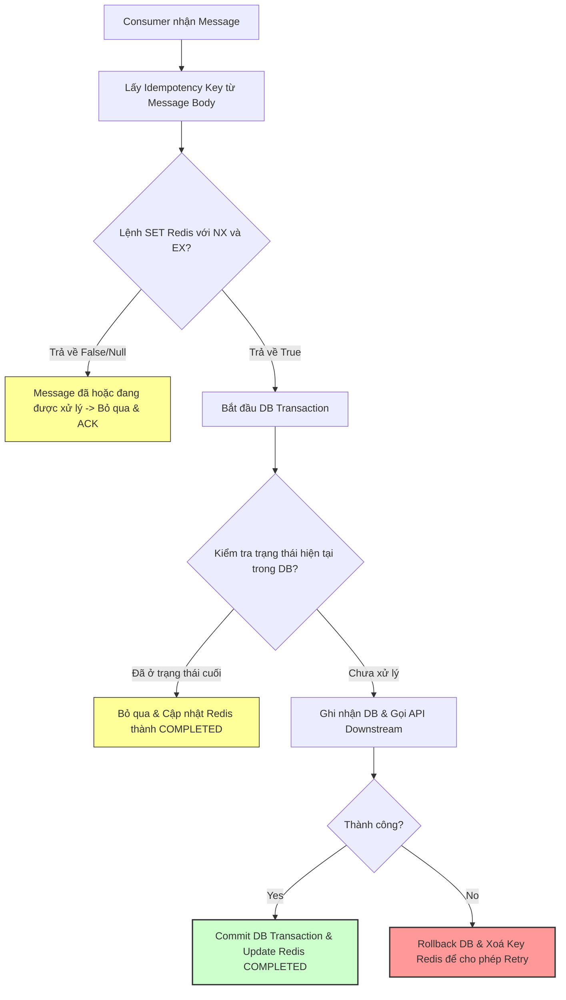

# Một message bị consume nhiều lần, hệ thống cần xử lý thế nào?

## ⚡ Tóm tắt ngắn (30s)
* **Bản chất**: Trong hệ thống phân tán, Kafka cam kết phân phối tin nhắn theo ngữ nghĩa **At-least-once (Ít nhất một lần)** trong hầu hết các cấu hình. Việc trùng lặp message (Duplication) là điều chắc chắn xảy ra khi có sự cố mạng. Giải pháp tối cao để giải quyết triệt để thảm họa này là **Idempotent Consumer (Consumer trùng lặp an toàn)**.
* **Các thảm họa thực chiến được giải quyết**:
    1. **Thảm họa thanh toán kép (Double Charging)**: Một API thanh toán hoặc chuyển tiền bị gọi lại lần thứ hai do consumer xử lý trùng lặp tin nhắn, khiến khách hàng bị trừ tiền hai lần cho cùng một hóa đơn, trực tiếp huỷ hoại uy tín doanh nghiệp.
    2. **Thảm họa sai lệch số liệu kho (Inventory Discrepancy)**: Event trừ kho hàng bị trùng lặp khiến số lượng hàng tồn kho bị trừ khống, dẫn đến tình trạng hết hàng ảo hoặc đơn hàng bị hủy hàng loạt.
* **Quyết định Senior**:
    1. Tuyệt đối không dựa dẫm vào cơ chế Exactly-once của Kafka để bảo vệ các tài nguyên bên ngoài (DB, API).
    2. Thiết lập chốt chặn **Idempotency (Tính khả trùng)** ở tầng ứng dụng bằng cách kết hợp khoá duy nhất (Unique Constraint) trong Database hoặc cơ chế Check-and-Set sử dụng Redis làm cache.

---

## 🔍 Chi tiết bản chất thực chiến: Tại sao Message bị trùng và Quy trình xử lý

### 1. Tại sao xảy ra hiện tượng trùng lặp message?
Senior Engineer hiểu rõ 3 thời điểm vàng phát sinh trùng lặp trong chuỗi cung ứng event:
* **Lỗi phía Producer (Send Retry)**: Producer gửi message thành công lên Kafka Broker, Broker đã ghi vào partition nhưng đường truyền mạng phản hồi (ACK) về cho Producer bị đứt. Producer nghĩ gửi thất bại và gửi lại tin nhắn đó một lần nữa $\implies$ Topic chứa 2 message giống hệt nhau về nội dung nhưng khác offset.
* **Lỗi phía Consumer (Commit Fail / Crash)**: Consumer lấy batch message về xử lý thành công trong Database, nhưng trước khi kịp gửi lệnh commit offset về cho Broker thì container bị crash, bị mất điện, hoặc mạng bị ngắt $\implies$ Broker bàn giao partition đó cho consumer khác đọc lại từ offset cũ, gây trùng lặp.
* **Lỗi do Rebalance (Processing Timeout)**: Consumer xử lý batch quá chậm vượt ngưỡng `max.poll.interval.ms`, Broker thu hồi partition và giao cho consumer khác xử lý lại batch đó từ offset commit cuối cùng.

---

### 2. Chiến lược thiết kế Idempotent Consumer tiêu chuẩn Senior
Để xử lý trùng lặp tin nhắn, Senior áp dụng 3 mô hình phòng vệ chiều sâu:

#### Cách 1: Thiết lập Unique Constraint trong Database (Database-level Idempotency)
* **Giải pháp**: Đây là chốt chặn cứng cáp nhất. Mỗi message từ Producer bắt buộc phải đính kèm một mã định danh duy nhất (`message_id` hoặc `idempotency_key` như `order_id`, `payment_transaction_id`). Ở Database đích, ta tạo cột tương ứng có thuộc tính **`UNIQUE`**.
* **Cơ chế**: Khi consumer xử lý lần 2, câu lệnh INSERT hoặc UPDATE sẽ ném ra lỗi trùng khóa (`DuplicateKeyException` trong Java / SQL Error 1062). Ta chủ động bắt lỗi này, ghi log cảnh báo nhẹ, và trả về thành công (ACK) để Broker bỏ qua message trùng lặp đó.

#### Cách 2: Cơ chế Check-and-Set dùng Redis (Distributed Lock / Cache)
* **Giải pháp**: Phù hợp cho các service xử lý tải cực cao mà không muốn cày nát Database để check trùng, hoặc xử lý các tác vụ không thể Rollback (như gọi API ngoài).
* **Cơ chế**: 
  1. Khi nhận được message, Consumer dùng lệnh `SET message_id "PROCESSING" NX EX 86400` trên Redis (chỉ set nếu chưa tồn tại, hết hạn sau 24h).
  2. Nếu lệnh trả về `null` (đã tồn tại) $\implies$ Bỏ qua message vì đang có luồng khác xử lý hoặc đã xử lý xong.
  3. Nếu thành công, tiến hành xử lý nghiệp vụ, xử lý xong cập nhật trạng thái thành `"COMPLETED"`.

#### Cách 3: Kiểm tra trạng thái nghiệp vụ (State Machine Verification)
* **Giải pháp**: Phù hợp với các đối tượng có vòng đời trạng thái rõ ràng (State Machine).
* **Cơ chế**: Trước khi thực hiện thao tác thay đổi dữ liệu, hãy check trạng thái hiện tại. Ví dụ: Nếu nhận event `ORDER_PAID`, consumer kiểm tra trong DB thấy trạng thái đơn hàng đã là `SHIPPED` hoặc `PAID` từ trước $\implies$ Bỏ qua ngay lập tức và kết thúc xử lý.

---

## 🎨 Sơ đồ trực quan (Luồng xử lý Idempotent Consumer chuẩn chỉ)



---

## 💻 Code thực chiến: Check-and-Set Idempotency bằng Redis & Database

Dưới đây là thiết kế thực tế cho một Consumer tiêu thụ Event thanh toán, bảo vệ an toàn cho tài khoản khách hàng khỏi bị trừ tiền trùng lặp.

```java
import lombok.RequiredArgsConstructor;
import lombok.extern.slf4j.Slf4j;
import org.apache.kafka.clients.consumer.ConsumerRecord;
import org.springframework.data.redis.core.StringRedisTemplate;
import org.springframework.kafka.annotation.KafkaListener;
import org.springframework.kafka.support.Acknowledgment;
import org.springframework.stereotype.Service;
import org.springframework.transaction.annotation.Transactional;

import java.time.Duration;

@Slf4j
@Service
@RequiredArgsConstructor
public class IdempotentPaymentConsumer {

    private final StringRedisTemplate redisTemplate;
    private final PaymentRepository paymentRepository;
    private final PaymentGatewayService paymentGatewayService;

    private static final String REDIS_KEY_PREFIX = "processed_msg:";

    @KafkaListener(topics = "payment-events", groupId = "payment-group", containerFactory = "kafkaListenerContainerFactory")
    @Transactional
    public void consumePaymentEvent(ConsumerRecord<String, String> record, Acknowledgment ack) {
        String messageId = record.key(); // Giả định messageId được truyền ở Key của Kafka Record
        String eventPayload = record.value();

        if (messageId == null || messageId.isEmpty()) {
            log.error("LỖI: Message thiếu Idempotency Key! Bỏ qua để bảo vệ hệ thống.");
            ack.acknowledge();
            return;
        }

        String redisKey = REDIS_KEY_PREFIX + messageId;

        // ✅ BƯỚC 1: Sử dụng Redis Set-NX làm Distributed Lock bảo vệ
        // Chỉ lưu khoá nếu chưa tồn tại, đặt TTL 24h để tránh rác RAM Redis
        Boolean isFirstRequest = redisTemplate.opsForValue()
                .setIfAbsent(redisKey, "PROCESSING", Duration.ofHours(24));

        if (Boolean.FALSE.equals(isFirstRequest)) {
            log.warn("CẢNH BÁO: Phát hiện message trùng lặp hoặc đang xử lý song song! Key: {}", messageId);
            ack.acknowledge(); // Commit offset ngay để giải phóng Kafka Queue
            return;
        }

        try {
            // ✅ BƯỚC 2: Kiểm tra trạng thái trong Database đích (Safety Net thứ hai)
            boolean isAlreadyProcessed = paymentRepository.existsByTransactionId(messageId);
            if (isAlreadyProcessed) {
                log.warn("CẢNH BÁO: Dữ liệu giao dịch đã tồn tại trong DB! Key: {}", messageId);
                redisTemplate.opsForValue().set(redisKey, "COMPLETED", Duration.ofHours(24));
                ack.acknowledge();
                return;
            }

            // ✅ BƯỚC 3: Xử lý nghiệp vụ chính (Gọi cổng thanh toán ngoài)
            PaymentDto payment = parsePayload(eventPayload);
            paymentGatewayService.chargeMoney(payment);

            // ✅ BƯỚC 4: Lưu thông tin giao dịch vào Database đích
            paymentRepository.save(new PaymentEntity(messageId, payment.getAmount(), "SUCCESS"));

            // ✅ BƯỚC 5: Cập nhật trạng thái xử lý thành công lên Redis & ACK
            redisTemplate.opsForValue().set(redisKey, "COMPLETED", Duration.ofHours(24));
            ack.acknowledge(); // Commit thủ công thành công

            log.info("Xử lý giao dịch thanh toán thành công và an toàn! Key: {}", messageId);

        } catch (Exception ex) {
            // ✅ BƯỚC 6: Xử lý khi có lỗi xảy ra
            log.error("Lỗi xảy ra khi xử lý giao dịch! Sẽ xoá lock Redis để cho phép Retry. Key: {}", messageId, ex);
            
            // Xoá key trên Redis để cho phép luồng retry tiếp theo được quyền vào xử lý lại
            redisTemplate.delete(redisKey);
            
            // KHÔNG gọi ack.acknowledge() -> Message sẽ được tiêu thụ lại sau khi retry container
            throw ex; 
        }
    }

    private PaymentDto parsePayload(String payload) {
        // Mock method chuyển đổi JSON sang DTO
        return new PaymentDto(150000L);
    }
}
```

---

## 📊 Bảng so sánh các phương án thiết kế tính khả trùng (Idempotency)

| Phương pháp | Độ phức tạp | Hiệu năng (Performance) | Mức độ an toàn (Reliability) | Nhược điểm lớn nhất |
| :--- | :--- | :--- | :--- | :--- |
| **Unique Database Key** | Thấp (Chỉ tạo chỉ mục UNIQUE trong DB) | Trung bình (Tăng tải ghi kiểm tra khoá của DB) | **Cực cao** (Đảm bảo bởi tính ACID của Database) | DB phình to index; Một số DB NoSQL không hỗ trợ thuộc tính UNIQUE tốt. |
| **Redis Check-and-Set** | Trung bình (Cần kết nối cụm Redis) | **Cực cao** (Thao tác trong RAM siêu tốc) | Khá cao (Nếu Redis cluster bị restart đột ngột có thể mất lock tạm thời) | Gây chi phí quản lý thêm cụm Redis; Cần xử lý xoá key khi exception nghiệp vụ xảy ra. |
| **State Machine check** | Thấp | Cao | Cao | Chỉ áp dụng được cho các nghiệp vụ có sơ đồ trạng thái hữu hạn. |

---

## ⚠️ Common Gotchas & Questions follow-up

### 1. Cạm bẫy "Xoá Lock Redis khi Transaction Database chưa được Commit thực sự"
* **Sai lầm phổ biến**: Nhiều kỹ sư lập trình đặt annotation `@Transactional` trên hàm consumer, xử lý xong ghi DB thành công, sau đó cập nhật lock Redis sang `"COMPLETED"`, cuối cùng gọi `ack.acknowledge()` rồi kết thúc hàm.
* **Hậu quả**: Spring AOP sẽ thực hiện commit transaction database **ngay sau khi luồng chạy thoát ra khỏi hàm**. Nếu bước commit DB đó bị thất bại (do deadlock DB giây cuối hoặc đứt mạng DB), database bị rollback hoàn toàn. Tuy nhiên, state trên Redis đã bị set thành `"COMPLETED"`. Lần sau message được gửi lại, consumer check Redis thấy `"COMPLETED"` sẽ bỏ qua $\implies$ **Lỗi nghiêm trọng: Mất mát giao dịch nghiệp vụ vĩnh viễn**.
* **Khắc phục**: Luôn đảm bảo rằng các thao tác cập nhật lock Redis hoặc commit offset thủ công chỉ được chạy **sau khi transaction database đã được commit thành công**. Sử dụng `TransactionSynchronizationManager` để đăng ký callback chạy sau khi commit thành công.

### 2. Câu hỏi đào sâu từ interviewer

* **Q1: Nếu hệ thống sử dụng cơ chế idempotency bằng DB UNIQUE key, khi xảy ra trùng lặp và DB ném Exception, bạn có nên ném Exception đó lên trên để Kafka retry không?**
  * *Trả lời*: 
    * **Tuyệt đối không**. Nếu ném Exception lên trên, Kafka Listener Container sẽ hiểu rằng hệ thống đang gặp lỗi hệ thống (lỗi phần cứng, lỗi DB...) và sẽ thực hiện thử lại (retry) vô hạn hoặc chuyển message đó sang DLQ.
    * Thực chất, lỗi trùng khoá lúc này là một **lỗi nghiệp vụ mong muốn (Expected Business Flow)** thể hiện chốt chặn an toàn đã hoạt động thành công.
    * Ta phải bắt Exception đó (`DuplicateKeyException`), ghi log mức độ `WARN` hoặc `INFO` để theo dõi và **gọi lệnh ACK bình thường** để giải phóng message khỏi hàng đợi.

* **Q2: Làm thế nào để giải quyết vấn đề trùng lặp khi hai message trùng nhau được xử lý song song trên hai Pod consumer khác nhau cùng một thời điểm?**
  * *Trả lời*: 
    * Nếu hai tin nhắn được xử lý hoàn toàn đồng thời, bước đọc DB kiểm tra trạng thái ở cả hai Pod đều sẽ trả về "chưa xử lý", dẫn đến cả hai Pod đều nhảy vào xử lý nghiệp vụ thực tế $\implies$ Gây trùng.
    * Để giải quyết triệt để, ta phải áp dụng **Distributed Lock (Khóa phân tán)**:
      1. Nếu dùng cách Redis: Lệnh `setIfAbsent` (SET-NX) của Redis hoạt động đơn luồng (Single Thread), chỉ duy nhất 1 Pod nhận được giá trị `true` và được xử lý, Pod còn lại nhận `false` và thoát ngay lập tức.
      2. Nếu dùng Database: Sử dụng cơ chế khóa vật lý `SELECT ... FOR UPDATE` (Pessimistic Lock) hoặc đặt UNIQUE KEY cứng trong DB để chặn đứng Pod thứ hai ghi đè.
