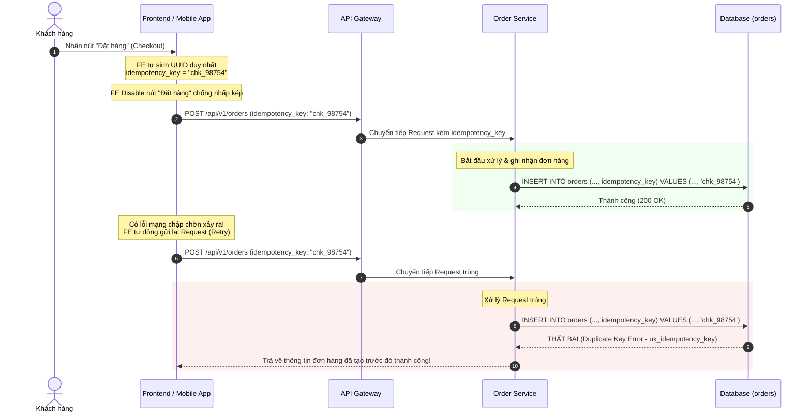

# Duplicate order được tạo do duplicate message. Bạn fix ra sao?

## ⚡ Tóm tắt ngắn (30s)
* **Bản chất**: Đây là một sự cố kinh điển ở môi trường Production. Khi một tin nhắn tạo đơn hàng (`CREATE_ORDER`) bị gửi trùng lặp từ Kafka, nếu luồng xử lý không có chốt chặn khả trùng (Idempotency), hệ thống sẽ tạo ra hai bản ghi Đơn hàng (Order) hoàn toàn giống nhau nhưng có hai ID khác nhau trong Database.
* **Các thảm họa thực chiến được giải quyết**:
    1. **Thảm họa thiệt hại tài chính doanh nghiệp**: Khách hàng bị trừ tiền hai lần và hệ thống logistics tự động đóng gói, xuất kho 2 sản phẩm vật lý giống hệt nhau gửi đi. Điều này gây tốn chi phí vận chuyển thu hồi và xử lý hoàn tiền vô cùng phức tạp.
    2. **Thảm họa sai lệch số liệu doanh thu**: Hệ thống báo cáo thống kê doanh số bán hàng bị khống lên, trực tiếp làm sai số liệu tài chính của phòng ban kế toán.
* **Quyết định Senior**:
    1. **Xử lý khẩn cấp (Hot mitigation)**: Viết script lọc và vô hiệu hóa/hủy (CANCEL) các đơn hàng trùng lặp trên Production, đồng thời chủ động liên hệ với cổng thanh toán để chặn luồng trừ tiền lần 2 hoặc hoàn tiền khẩn cấp.
    2. **Giải pháp triệt để (Ultimate Fix)**: Áp dụng cơ chế **Idempotency Key** sinh từ Client, kết hợp khoá ràng buộc duy nhất `UNIQUE` ở Database trên bảng `orders` làm chốt chặn cuối cùng.

---

## 🔍 Chi tiết bản chất thực chiến: Quy trình 3 bước xử lý Incident & Thiết kế Fix

### Bước 1: Ổn định và giảm thiểu thiệt hại khẩn cấp (Incident Mitigation)
Khi phát hiện sự cố có hàng loạt đơn hàng bị nhân đôi trên production, Senior Engineer ngay lập tức thực hiện 3 hành động:
1. **Rà quét phát hiện đơn trùng**: Chạy câu lệnh SQL truy tìm các đơn hàng được tạo bởi cùng một tài khoản (`user_id`), cùng tổng tiền (`total_amount`), cùng danh sách sản phẩm, được tạo cách nhau dưới 5 phút:
   ```sql
   SELECT user_id, count(*), GROUP_CONCAT(id) 
   FROM orders 
   WHERE created_at > NOW() - INTERVAL 1 HOUR
   GROUP BY user_id, total_amount, cart_id -- (hoặc các đặc trưng định danh giỏ hàng)
   HAVING count(*) > 1;
   ```
2. **Cắt đuôi nghiệp vụ tự động**: Đánh dấu các đơn hàng trùng lặp sinh sau ở trạng thái `SYSTEM_CANCELLED` để ngăn chặn các worker tự động (tầng Logistics/Giao hàng) xuất kho sản phẩm.
3. **Liên hệ hoàn tiền**: Lọc các ID đơn trùng đã bị trừ tiền bên cổng thanh toán để kích hoạt lệnh hoàn tiền (Refund) tự động cho khách hàng.

---

### Bước 2: Tìm nguyên nhân gốc rễ (Root Cause Analysis)
* **Lỗ hổng thiết kế**: Order Service nhận message tạo đơn hàng từ Kafka. Cấu trúc DB bảng `orders` sử dụng trường khóa chính tự tăng `id` (Auto Increment BIGINT).
* Khi message bị gửi trùng lặp (do lỗi network đứt ACK giữa Kafka và Consumer), Consumer 2 nhận message trùng và thực hiện câu lệnh `INSERT INTO orders (user_id, status, total) VALUES (...)` $\implies$ Database vui vẻ tạo thêm một dòng mới với ID tự tăng mới hoàn toàn mà không hề biết đây là giao dịch bị trùng.

---

### Bước 3: Thiết kế giải pháp Fix triệt để (The Ultimate Fix)
Để triệt tiêu vĩnh viễn lỗi này, ta cần thiết lập luồng sinh Idempotency Key xuyên suốt từ Client tới Database:

1. **Client-side Generation**: Khi khách hàng nhấn nút "Đặt hàng" (Checkout), ứng dụng Frontend/Mobile tự động sinh ra một chuỗi UUID ngẫu nhiên duy nhất đại diện cho lượt nhấn đó (gọi là `checkout_token` hoặc `idempotency_key`).
2. **Client-side Lock**: Frontend lập tức disable nút "Đặt hàng" để chống người dùng nhấn nhấp nhả liên tiếp nhiều lần.
3. **Gửi tin nhắn kèm Key**: API tạo đơn hàng hoặc tin nhắn gửi vào Kafka bắt buộc phải mang theo trường `idempotency_key` này.
4. **Database-level Constraint (Chốt chặn cuối)**: 
   * Trên bảng `orders`, ta thêm cột `idempotency_key` (VARCHAR) và cấu hình một **`UNIQUE KEY`** trên cột này.
   * Khi consumer xử lý tin nhắn trùng lặp, câu lệnh `INSERT` lần thứ hai có chứa `idempotency_key` cũ sẽ bị Database chặn đứng ngay lập tức và ném ra lỗi trùng chỉ mục.

---

## 🎨 Sơ đồ trực quan (Luồng sinh & Kiểm soát Idempotency Key cho Đơn hàng)



---

## 💻 Code thực chiến: Cấu hình DB và Consumer an toàn

### ❌ BAD: Tạo bảng thiếu ràng buộc Unique Key
```sql
-- Bảng orders cấu hình cẩu thả, tạo điều kiện cho duplicate đơn hàng
CREATE TABLE orders (
    id BIGINT AUTO_INCREMENT PRIMARY KEY,
    user_id BIGINT NOT NULL,
    total_amount DECIMAL(15, 2) NOT NULL,
    status VARCHAR(50) NOT NULL,
    created_at TIMESTAMP DEFAULT CURRENT_TIMESTAMP
);
```

---

### ✅ GOOD: Cấu hình Bảng và Code Java Consumer xử lý Idempotent
```sql
-- ✅ TỐT: Thêm cột idempotency_key có ràng buộc UNIQUE làm chốt chặn cứng
CREATE TABLE orders (
    id BIGINT AUTO_INCREMENT PRIMARY KEY,
    user_id BIGINT NOT NULL,
    total_amount DECIMAL(15, 2) NOT NULL,
    status VARCHAR(50) NOT NULL,
    idempotency_key VARCHAR(100) NOT NULL,
    created_at TIMESTAMP DEFAULT CURRENT_TIMESTAMP,
    CONSTRAINT uq_order_idempotency UNIQUE (idempotency_key)
);
```

```java
import lombok.RequiredArgsConstructor;
import lombok.extern.slf4j.Slf4j;
import org.apache.kafka.clients.consumer.ConsumerRecord;
import org.springframework.dao.DataIntegrityViolationException;
import org.springframework.kafka.annotation.KafkaListener;
import org.springframework.kafka.support.Acknowledgment;
import org.springframework.stereotype.Service;
import org.springframework.transaction.annotation.Transactional;

@Slf4j
@Service
@RequiredArgsConstructor
public class OrderCreationConsumer {

    private final OrderRepository orderRepository;
    private final InventoryClient inventoryClient;

    @KafkaListener(topics = "order-create-events", groupId = "order-group")
    @Transactional
    public void handleCreateOrder(ConsumerRecord<String, OrderEventPayload> record, Acknowledgment ack) {
        OrderEventPayload payload = record.value();
        String idempotencyKey = payload.getIdempotencyKey();

        log.info("Nhận event tạo đơn hàng. Key: {}", idempotencyKey);

        try {
            // ✅ BƯỚC 1: Kiểm tra xem đơn hàng đã được tạo trước đó chưa (Đọc nhanh)
            OrderEntity existingOrder = orderRepository.findByIdempotencyKey(idempotencyKey);
            if (existingOrder != null) {
                log.warn("CẢNH BÁO: Đơn hàng đã tồn tại (Đã xử lý trước đó)! Bỏ qua. Key: {}", idempotencyKey);
                ack.acknowledge(); // Giải phóng message
                return;
            }

            // ✅ BƯỚC 2: Thực hiện hành động nghiệp vụ phụ (ví dụ: Giữ chỗ kho hàng)
            inventoryClient.reserveStock(payload.getCartId());

            // ✅ BƯỚC 3: Ghi nhận đơn hàng vào Database
            OrderEntity newOrder = new OrderEntity();
            newOrder.setUserId(payload.getUserId());
            newOrder.setTotalAmount(payload.getTotalAmount());
            newOrder.setStatus("PENDING");
            newOrder.setIdempotencyKey(idempotencyKey); // Lưu key khả trùng

            orderRepository.saveAndFlush(newOrder); // Ép ghi ngay xuống DB để phát hiện lỗi trùng sớm

            ack.acknowledge();
            log.info("Tạo đơn hàng thành công và an toàn! Key: {}", idempotencyKey);

        } catch (DataIntegrityViolationException ex) {
            // ✅ BƯỚC 4: Bắt lỗi ném ra từ Database khi có xung đột UNIQUE CONSTRAINT (Duplicate Key)
            log.warn("CẢNH BÁO PHÒNG VỆ: Chặn đứng tạo đơn hàng trùng lặp thành công ở tầng DB! Key: {}", idempotencyKey);
            
            // Xử lý giảm thiểu: Thu hồi lại lượng giữ chỗ kho hàng nếu có gọi API ngoài ở Bước 2
            try {
                inventoryClient.releaseStock(payload.getCartId());
            } catch (Exception e) {
                log.error("Không thể hoàn trả giữ chỗ kho! Cần cơ chế đối soát hoặc retry. Key: {}", idempotencyKey, e);
            }
            
            // Đánh dấu đã tiêu thụ thành công để không bị kẹt hàng đợi
            ack.acknowledge();
            
        } catch (Exception ex) {
            log.error("Lỗi hệ thống xảy ra khi xử lý tạo đơn hàng. Sẽ retry. Key: {}", idempotencyKey, ex);
            // Không ack -> Luồng sẽ tự động retry message
            throw ex; 
        }
    }
}
```

---

## ⚠️ Common Gotchas & Questions follow-up

### 1. Cạm bẫy "Payload thay đổi nhưng Idempotency Key giữ nguyên (Payload Drift)"
* **Sai lầm phổ biến**: Khách hàng đặt mua 2 sản phẩm A và B, nhấn nút đặt hàng nhưng gặp lỗi mạng. Sau đó, họ quay lại giỏ hàng xóa sản phẩm B đi, chỉ giữ lại sản phẩm A, và nhấn nút Đặt hàng lần thứ 2. Nếu mã code Frontend cẩu thả vẫn giữ nguyên `idempotency_key` cũ và gửi lên Server.
* **Hậu quả**: Server nhận thấy `idempotency_key` đã tồn tại trong DB, vui vẻ trả về thông tin đơn hàng cũ (bao gồm cả 2 sản phẩm A và B) $\implies$ **Khách hàng nhận sai hàng và bị tính sai tiền**.
* **Khắc phục**: 
  * Cách tốt nhất: **`idempotency_key` bắt buộc phải được gắn chặt với trạng thái duy nhất của giỏ hàng**. Khi giỏ hàng thay đổi (thêm/xóa sản phẩm, đổi địa chỉ giao hàng), Frontend bắt buộc phải xoá key cũ và sinh ra một `idempotency_key` mới hoàn toàn.
  * Phía Server: Thực hiện kiểm chứng tính toàn vẹn (Payload Hash). Lưu mã Hash MD5/SHA256 của toàn bộ nội dung giỏ hàng đi kèm với idempotency key. Khi request trùng gửi lên, so sánh mã Hash của request mới với mã Hash đã lưu trong DB. Nếu khác nhau, lập tức báo lỗi `400 Bad Request` vì dữ liệu yêu cầu bị thay đổi.

### 2. Câu hỏi đào sâu từ interviewer

* **Q1: Làm sao để dọn dẹp các Idempotency Key rác trong Database sau một thời gian để tránh làm phình to bảng biểu?**
  * *Trả lời*: 
    * Idempotency key thường chỉ có giá trị bảo vệ phòng vệ trong một khoảng thời gian ngắn (ví dụ: tối đa 7 ngày đến 30 ngày) vì hiếm khi có mạng nào bị trễ hoặc khách hàng bấm nút đặt hàng trùng lặp sau cả tháng.
    * Ta có hai chiến lược dọn dẹp chính:
      1. **Bảng phân tách (Dedicated Idempotency Table)**: Không lưu key trực tiếp trên bảng `orders`, mà lưu ở một bảng phụ `idempotency_keys` (bao gồm `key`, `status`, `created_at`). Đặt UNIQUE trên cột `key` bảng này. Hằng ngày, chạy một scheduled batch job xoá các dòng có `created_at` quá 30 ngày để giữ bảng luôn gọn nhẹ.
      2. **Redis-backed Idempotency**: Dùng Redis làm chốt chặn kiểm tra khả trùng với cơ chế TTL (Time to live) tự động hết hạn sau 7 ngày. Cách này giảm tải tuyệt đối cho Database chính.
