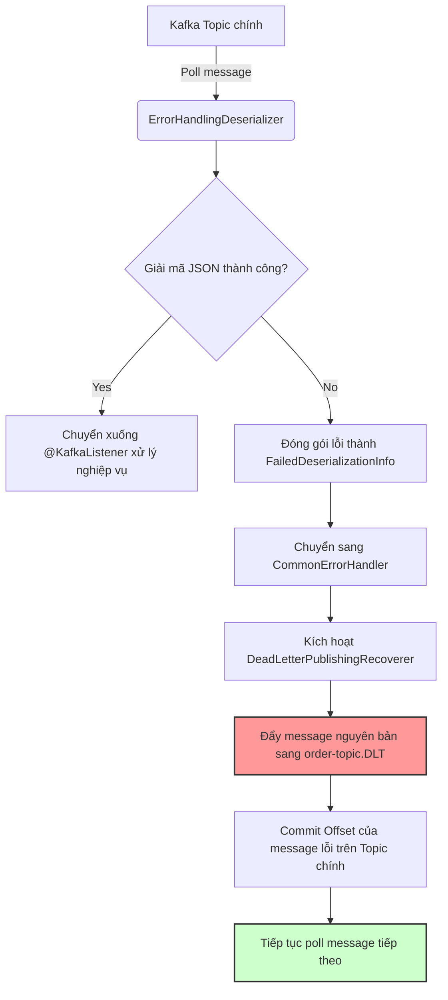

# Message sai format làm consumer crash liên tục. Bạn xử lý thế nào?

## ⚡ Tóm tắt ngắn (30s)
* **Bản chất**: Đây là hiện tượng **Poison Pill (Tin nhắn độc)**. Khi một message bị sai định dạng cấu trúc (mã hoá sai, sai JSON, thiếu thuộc tính bắt buộc) đổ bộ vào topic, consumer không thể giải mã (deserialize) được và ném ra ngoại lệ. Vì deserialization bị lỗi ở tầng trước nghiệp vụ nên offset không bao giờ được commit, khiến consumer rơi vào vòng lặp **crash & restart & retry** vô hạn tại đúng offset đó, làm tắc nghẽn toàn bộ phân vùng (partition).
* **Các thảm họa thực chiến được giải quyết**:
    1. **Thảm họa tắc nghẽn đường ống (Partition Stagnation)**: Một tin nhắn rác duy nhất làm tê liệt hoàn toàn một partition, khiến hàng triệu tin nhắn hợp lệ xếp hàng phía sau không thể được xử lý, gây trễ nải (lag) toàn bộ luồng nghiệp vụ.
    2. **Thảm họa sập nghẽn tài nguyên (CPU / Disk spike)**: Vòng lặp restart container liên tục của Kubernetes để kéo lại consumer làm tăng vọt lượng CPU của cluster và tràn ngập log file với các stack trace lỗi vô nghĩa.
* **Quyết định Senior**:
    1. **Ứng cứu khẩn cấp (Hot Fix)**: Sử dụng Kafka CLI dịch chuyển thủ công (reset offset) tiến lên 1 đơn vị để bỏ qua tin nhắn lỗi, giải phóng lập tức phân vùng bị nghẽn.
    2. **Giải pháp kiến trúc lâu dài**: Thiết lập **ErrorHandlingDeserializer** kết hợp **Dead Letter Queue (DLQ)** để tự động cô lập tin nhắn lỗi sang topic phụ và tiếp tục xử lý các tin nhắn khoẻ mạnh phía sau.

---

## 🔍 Chi tiết bản chất thực chiến: Quy trình 3 bước xử lý & Phòng vệ Poison Pill

### Bước 1: Hành động ứng phó khẩn cấp trên Production (Incident Mitigation)
Khi xảy ra sự cố consumer bị crash loop liên tục tại một offset cụ thể:
1. **Xác định vị trí tin nhắn độc**: Đọc log tìm dòng lỗi Deserialization để xác định tên `Topic`, số `Partition` và số `Offset` đang bị kẹt.
2. **Dịch chuyển thủ công qua offset lỗi (Skip Offset)**: 
   * Dừng ứng dụng consumer đang bị crash loop để tránh xung đột.
   * Sử dụng lệnh Kafka CLI để ép dịch chuyển offset đã commit tiến lên 1 đơn vị:
     ```bash
     kafka-consumer-groups.sh --bootstrap-server localhost:9092 \
       --group order-service-group \
       --reset-offsets --to-offset <offset_bị_kẹt_cộng_thêm_1> \
       --topic order-topic:partition_bị_kẹt \
       --execute
     ```
   * Khởi động lại ứng dụng. Consumer sẽ bỏ qua message độc đó và tiếp tục tiêu thụ bình thường.

---

### Bước 2: Thiết kế chốt chặn phòng vệ bằng ErrorHandlingDeserializer & DLQ
Để hệ thống tự động xử lý và cô lập hoàn toàn các Poison Pill trong tương lai mà không cần sự can thiệp thủ công của kỹ sư, Senior thiết lập kiến trúc phòng thủ 3 lớp:

1. **ErrorHandlingDeserializer**: 
   * Thông thường, nếu deserialize lỗi, Kafka client ném Exception làm sập luồng.
   * Khi dùng `ErrorHandlingDeserializer` bọc ngoài, nó sẽ **tự động catch lỗi deserialize**, đóng gói thông tin lỗi vào header của message, và trả về một Object đại diện lỗi xuống cho Consumer thay vì ném lỗi sập.
2. **FailedDeserializationInfo**:
   * Khi listener nhận được record, Spring Kafka nhận diện đây là một bản ghi deserialize hỏng và chuyển tiếp trực tiếp đến bộ xử lý lỗi toàn cục (`CommonErrorHandler`).
3. **DeadLetterPublishingRecoverer (DLQ)**:
   * Bộ xử lý lỗi sẽ đẩy trực tiếp message hỏng này sang một Topic phụ chuyên dùng để chứa rác, thường mang tên `order-topic.DLT` (Dead Letter Topic).
   * Sau khi đẩy thành công sang DLT, consumer **tự động commit offset** của message lỗi đó trên topic chính và vui vẻ đi poll các message tiếp theo.

---

## 🎨 Sơ đồ trực quan (Luồng xử lý tự động Poison Message sang DLT)



---

## 💻 Code thực chiến: Cấu hình Deserialization Error Handler & DLQ

Dưới đây là cấu hình hoàn chỉnh bằng Spring Boot Java giúp tự động bảo vệ hệ thống tuyệt đối trước các tin nhắn độc.

```java
import lombok.extern.slf4j.Slf4j;
import org.apache.kafka.clients.consumer.ConsumerConfig;
import org.apache.kafka.clients.producer.ProducerConfig;
import org.apache.kafka.common.serialization.StringDeserializer;
import org.apache.kafka.common.serialization.StringSerializer;
import org.springframework.context.annotation.Bean;
import org.springframework.context.annotation.Configuration;
import org.springframework.kafka.config.ConcurrentKafkaListenerContainerFactory;
import org.springframework.kafka.core.*;
import org.springframework.kafka.listener.DeadLetterPublishingRecoverer;
import org.springframework.kafka.listener.DefaultErrorHandler;
import org.springframework.kafka.support.serializer.ErrorHandlingDeserializer;
import org.springframework.kafka.support.serializer.JsonDeserializer;
import org.springframework.kafka.support.serializer.JsonSerializer;
import org.springframework.util.backoff.FixedBackOff;

import java.util.HashMap;
import java.util.Map;

@Slf4j
@Configuration
public class KafkaSafetyArchitectureConfig {

    // 1. Cấu hình Producer Factory để phục vụ đẩy tin nhắn lỗi sang DLT (DLQ)
    @Bean
    public ProducerFactory<Object, Object> dltProducerFactory() {
        Map<String, Object> configProps = new HashMap<>();
        configProps.put(ProducerConfig.BOOTSTRAP_SERVERS_CONFIG, "localhost:9092");
        configProps.put(ProducerConfig.KEY_SERIALIZER_CLASS_CONFIG, StringSerializer.class);
        configProps.put(ProducerConfig.VALUE_SERIALIZER_CLASS_CONFIG, JsonSerializer.class);
        return new DefaultKafkaProducerFactory<>(configProps);
    }

    @Bean
    public KafkaTemplate<Object, Object> dltKafkaTemplate() {
        return new KafkaTemplate<>(dltProducerFactory());
    }

    // 2. Cấu hình Recovery để tự động đẩy tin nhắn lỗi sang topic dạng <topic_chính>.DLT
    @Bean
    public DeadLetterPublishingRecoverer deadLetterPublishingRecoverer(KafkaTemplate<Object, Object> template) {
        return new DeadLetterPublishingRecoverer(template);
    }

    // 3. Cấu hình Consumer Factory có chốt chặn bảo vệ ErrorHandlingDeserializer
    @Bean
    public ConsumerFactory<String, Object> safeConsumerFactory() {
        Map<String, Object> props = new HashMap<>();
        props.put(ConsumerConfig.BOOTSTRAP_SERVERS_CONFIG, "localhost:9092");
        props.put(ConsumerConfig.GROUP_ID_CONFIG, "order-safety-group");
        props.put(ConsumerConfig.ENABLE_AUTO_COMMIT_CONFIG, "false");

        // ✅ TỐT: Sử dụng ErrorHandlingDeserializer để bọc các Deserializer nghiệp vụ
        ErrorHandlingDeserializer<String> keyDeserializer =
                new ErrorHandlingDeserializer<>(new StringDeserializer());
                
        ErrorHandlingDeserializer<Object> valueDeserializer =
                new ErrorHandlingDeserializer<>(new JsonDeserializer<>(Object.class));

        return new DefaultKafkaConsumerFactory<>(props, keyDeserializer, valueDeserializer);
    }

    // 4. Thiết lập Error Handler có gắn Recoverer để chuyển hướng tin nhắn lỗi tự động
    @Bean
    public DefaultErrorHandler errorHandler(DeadLetterPublishingRecoverer recoverer) {
        // Thử lại tối đa 2 lần trước khi bỏ cuộc đẩy sang DLT, mỗi lần cách nhau 1 giây
        DefaultErrorHandler errorHandler = new DefaultErrorHandler(
                recoverer,
                new FixedBackOff(1000L, 2L)
        );
        
        // Cấu hình không thử lại cho các lỗi nghiêm trọng không thể cứu vãn (như lỗi Deserialization)
        errorHandler.addNotRetryableExceptions(IllegalArgumentException.class);
        
        return errorHandler;
    }

    @Bean
    public ConcurrentKafkaListenerContainerFactory<String, Object> kafkaListenerContainerFactory(
            DefaultErrorHandler errorHandler) {
        ConcurrentKafkaListenerContainerFactory<String, Object> factory =
                new ConcurrentKafkaListenerContainerFactory<>();
        factory.setConsumerFactory(safeConsumerFactory());
        factory.setCommonErrorHandler(errorHandler); // Gắn chốt chặn xử lý lỗi toàn cục
        return factory;
    }
}
```

---

## 📊 Bảng so sánh các phương án xử lý tin nhắn hỏng định dạng

| Giải pháp | Tác động hệ thống (System Impact) | Tính bảo toàn dữ liệu (Data Loss) | Độ phức tạp triển khai | Use case phù hợp |
| :--- | :--- | :--- | :--- | :--- |
| **Bỏ qua lỗi âm thầm (Log & Ignore)** | Ứng dụng chạy mượt, không bao giờ nghẽn. | **Cao** (Mất dữ liệu vĩnh viễn, không thể khôi phục để debug). | Rất thấp (Chỉ cần try-catch toàn hàm). | Dữ liệu không quan trọng (ví dụ: log clickstream, log giám sát hiệu năng). |
| **Dịch chuyển Offset thủ công (Skip via CLI)** | Đòi hỏi kỹ sư can thiệp khẩn cấp ngoài giờ. | Khá cao (Message lỗi bị trôi qua mất nếu không kịp copy lại). | Thấp (Dùng lệnh có sẵn của Kafka). | Xử lý sự cố nóng trên Production khi chưa cấu hình DLQ từ đầu. |
| **ErrorHandlingDeserializer + DLT (DLQ)** | **Hoàn hảo** (Chạy hoàn toàn tự động, cô lập rác siêu tốc). | **Không mất mát** (Dữ liệu lỗi nằm nguyên vẹn ở topic DLT để phân tích sau). | Trung bình (Cần cấu hình code đúng chuẩn). | **Bắt buộc cho mọi ứng dụng Enterprise lớn** (Fintech, E-Commerce, SaaS). |

---

## ⚠️ Common Gotchas & Questions follow-up

### 1. Cạm bẫy "Cơn bão DLQ làm sập luôn dịch vụ lưu trữ rác (DLQ Cascade Failure)"
* **Sai lầm phổ biến**: Nhiều kỹ sư chỉ cấu hình đẩy message lỗi sang DLT (`order-topic.DLT`) nhưng hoàn toàn bỏ qua việc giám sát và cảnh báo lượng tin nhắn đổ vào DLT.
* **Hậu quả**: Nếu do lỗi logic từ phía Producer làm phát sinh hàng triệu tin nhắn sai định dạng liên tiếp, consumer sẽ liên tục chuyển hướng và đẩy hàng triệu tin nhắn rác sang DLT. Nếu không có cảnh báo, ổ đĩa lưu trữ của cụm Kafka Broker chứa DLT sẽ bị đầy tràn, trực tiếp đánh sập toàn cụm Broker chính.
* **Khắc phục**: Luôn thiết lập hệ thống cảnh báo (Alert) trên Grafana/Prometheus khi có chỉ số `messages_in_total` của topic DLT lớn hơn 0. Điều này giúp đội ngũ vận hành phát hiện sớm sự cố và phối hợp bên Producer để vá lỗi.

### 2. Câu hỏi đào sâu từ interviewer

* **Q1: Tại sao không nên cấu hình chính sách Retry vô hạn (Infinite Retry) cho mọi Exception xảy ra ở Consumer?**
  * *Trả lời*: 
    * Nếu lỗi là do hệ thống mạng chập chờn hoặc DB quá tải tạm thời, việc retry là hợp lý.
    * Tuy nhiên, nếu Exception ném ra là do lỗi logic nghiệp vụ không thể tự sửa (ví dụ: `NullPointerException` do thiếu field, hoặc lỗi `DeserializationException`), thì việc retry vô hạn là hoàn toàn vô nghĩa và gây lãng phí tài nguyên CPU khủng khiếp, làm treo cứng toàn bộ tiến trình.
    * *Giải pháp*: Sử dụng phương thức `addNotRetryableExceptions` trong `DefaultErrorHandler` để định nghĩa rõ các ngoại lệ nghiệp vụ/dữ liệu hỏng bắt buộc phải đi thẳng sang DLQ mà không được phép thử lại.

* **Q2: Làm thế nào để xử lý các tin nhắn đang nằm trong Dead Letter Topic (DLT) sau khi code lỗi đã được vá thành công trên Production?**
  * *Trả lời*: 
    * Các tin nhắn nằm trong DLT là tài sản vô giá để điều tra lỗi. Sau khi kỹ sư đã vá xong code xử lý trên production để tương thích với định dạng dữ liệu đó, ta có hai cách xử lý (Re-drive):
      1. **Viết Tool Re-drive**: Viết một ứng dụng consumer nhỏ (hoặc dùng CLI tool của Spring Cloud Stream) đọc từng message từ DLT và gửi ngược trở lại Topic chính để consumer thực tế tiêu thụ lại bình thường.
      2. **Manual Re-run**: Tùy chỉnh code consumer chính, tạm thời lắng nghe thêm topic DLT để tự tiêu thụ và xử lý nốt lượng dữ liệu tồn đọng, sau đó gỡ cấu hình này đi.
