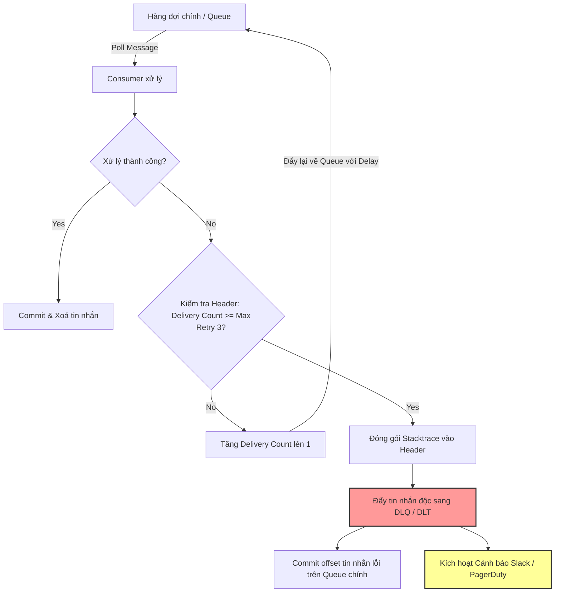

# Poison message là gì? Cách xử lý trong production?

## ⚡ Tóm tắt ngắn (30s)
* **Bản chất**: **Poison Message (Tin nhắn độc)** là những tin nhắn đặc biệt mà hệ thống không thể xử lý thành công cho dù có thử lại (retry) bao nhiêu lần đi chăng nữa. Nguyên nhân thường do dữ liệu bị lỗi định dạng (corrupted format), vi phạm ràng buộc nghiệp vụ nghiêm trọng (ví dụ: chia cho 0, null pointer ở trường bắt buộc), hoặc lỗi bảo mật độc hại.
* **Thảm họa thực chiến**: Nếu không xử lý đúng, Poison Message sẽ gây ra **Infinite Retry Loop (Vòng lặp thử lại vô hạn)**. Consumer liên tục nhận tin nhắn -> ném ra lỗi -> rollback/không commit -> nhận lại tin nhắn đó. Tiến trình này làm nghẽn hoàn toàn hàng đợi (Queue/Partition block), tiêu thụ 100% CPU, tràn ngập log hệ thống và làm tê liệt toàn bộ các tin nhắn hợp lệ xếp hàng phía sau.
* **Quyết định Senior**:
  1. **Tuyệt đối không requeue vô hạn**: Giới hạn số lần thử lại tối đa (Max Delivery Attempts).
  2. **Cô lập lập tức**: Đẩy tin nhắn lỗi sang **Dead Letter Queue (DLQ / DLT)** khi vượt ngưỡng retry để giải phóng hàng đợi chính.
  3. **Giám sát & Cảnh báo (Alerting)**: Đặt cảnh báo khi DLQ có tin nhắn để kỹ sư vận hành vào cuộc điều tra ngay lập tức.

---

## 🔍 Chi tiết bản chất thực chiến: Cơ chế Poison Pill & Chiến lược xử lý

### 1. Tại sao Poison Message xuất hiện trên Production?
* **Lỗi do phía Producer**: Deploy phiên bản mới nhưng quên cập nhật định dạng dữ liệu (Schema Evolution mismatch), hoặc serialize lỗi khiến tin nhắn bị mất một phần byte.
* **Dữ liệu rác lọt lưới (Unvalidated Data)**: Hệ thống phía trước (UI/Gateway) bỏ sót các bước validation đầu vào khiến tin nhắn chứa ký tự đặc biệt hỏng, giá trị âm trong trường số dương, hoặc định dạng date-time không hợp lệ.
* **Lỗi logic tiềm ẩn ở Consumer**: Một case logic nghiệp vụ cực kỳ hiếm gặp (edge case) không được viết unit test bao phủ, dẫn đến lỗi ném ra ngoại lệ runtime nghiêm trọng.

---

### 2. Chiến lược 3 lớp bảo vệ hệ thống trước Poison Message

#### Lớp 1: Phát hiện và Giới hạn số lần thử lại (Retry Limit & Backoff)
* Mỗi khi xử lý thất bại, không gửi trả trực tiếp tin nhắn về hàng đợi ngay lập tức (no immediate requeue).
* Lưu số lần giao hàng (Delivery Count) trong metadata/header của tin nhắn. Nếu `delivery_count > max_attempts` (thường là 3-5 lần), chuyển thẳng sang lớp 2.

#### Lớp 2: Tách biệt và Cách ly (Dead Letter Queue - DLQ)
* Di chuyển tin nhắn độc sang một hàng đợi biệt lập (DLQ) mang tên dạng `<original-queue-name>-dlq`.
* Việc chuyển tin nhắn sang DLQ đi kèm với việc ghi lại thông tin lỗi chi tiết (Exception class, Error Message, Timestamp, Hostname xử lý lỗi) vào Header để phục vụ cho việc debug.

#### Lớp 3: Xử lý hậu kỳ (Re-drive & Remediation)
* Tuyệt đối không để tin nhắn trong DLQ tự động biến mất. Kỹ sư vận hành sẽ phân tích dữ liệu lỗi từ DLQ:
  * **Nếu do lỗi Code**: Vá ứng dụng, khởi động lại, sau đó dùng công cụ chuyển ngược tin nhắn từ DLQ về Queue chính để xử lý lại (Re-drive).
  * **Nếu do dữ liệu hỏng vĩnh viễn**: Xoá bỏ hoặc lưu trữ thủ công vào kho lạnh (S3/Cold Storage) để điều tra.

---

## 🎨 Sơ đồ trực quan (Luồng xử lý tự động Poison Message trong Enterprise)



---

## 💻 Code thực chiến: Cấu hình RabbitMQ Poison Pill Defender (Spring AMQP)

Dưới đây là cấu hình hoàn chỉnh trong Java Spring Boot sử dụng Spring AMQP (RabbitMQ) để tự động bảo vệ hệ thống trước tin nhắn độc bằng cơ chế **RejectAndDontRequeueRecoverer** kết hợp với **DLX (Dead Letter Exchange)**.

```java
import org.springframework.amqp.core.*;
import org.springframework.amqp.rabbit.config.SimpleRabbitListenerContainerFactory;
import org.springframework.amqp.rabbit.connection.ConnectionFactory;
import org.springframework.amqp.rabbit.listener.RabbitListenerContainerFactory;
import org.springframework.amqp.rabbit.listener.SimpleMessageListenerContainer;
import org.springframework.amqp.rabbit.retry.RejectAndDontRequeueRecoverer;
import org.springframework.boot.autoconfigure.amqp.SimpleRabbitListenerContainerFactoryConfigurer;
import org.springframework.context.annotation.Bean;
import org.springframework.context.annotation.Configuration;
import org.springframework.retry.backoff.ExponentialBackOffPolicy;
import org.springframework.retry.support.RetryTemplate;

import java.util.HashMap;
import java.util.Map;

@Configuration
public class RabbitMQSafetyConfig {

    public static final String MAIN_EXCHANGE = "order.exchange";
    public static final String MAIN_QUEUE = "order.process.queue";
    public static final String MAIN_ROUTING_KEY = "order.process.key";

    public static final String DLX_EXCHANGE = "order.dlx.exchange";
    public static final String DLQ_QUEUE = "order.dlq.queue";
    public static final String DLQ_ROUTING_KEY = "order.dlq.key";

    // 1. Khai báo DLX và DLQ để chứa các Poison Message
    @Bean
    public DirectExchange deadLetterExchange() {
        return new DirectExchange(DLX_EXCHANGE);
    }

    @Bean
    public Queue deadLetterQueue() {
        return QueueBuilder.durable(DLQ_QUEUE).build();
    }

    @Bean
    public Binding dlqBinding() {
        return BindingBuilder.bind(deadLetterQueue()).to(deadLetterExchange()).with(DLQ_ROUTING_KEY);
    }

    // 2. Khai báo Queue chính có cấu hình liên kết với DLX
    @Bean
    public Queue mainQueue() {
        Map<String, Object> args = new HashMap<>();
        // Định nghĩa DLX: Khi message bị reject và không requeue, RabbitMQ tự đẩy sang đây
        args.put("x-dead-letter-exchange", DLX_EXCHANGE);
        args.put("x-dead-letter-routing-key", DLQ_ROUTING_KEY);
        return QueueBuilder.durable(MAIN_QUEUE).withArguments(args).build();
    }

    @Bean
    public DirectExchange mainExchange() {
        return new DirectExchange(MAIN_EXCHANGE);
    }

    @Bean
    public Binding mainBinding() {
        return BindingBuilder.bind(mainQueue()).to(mainExchange()).with(MAIN_ROUTING_KEY);
    }

    // 3. Cấu hình Container Factory với cơ chế Retry giới hạn tránh vòng lặp vô hạn
    @Bean
    public RabbitListenerContainerFactory<SimpleMessageListenerContainer> rabbitListenerContainerFactory(
            ConnectionFactory connectionFactory,
            SimpleRabbitListenerContainerFactoryConfigurer configurer) {
        
        SimpleRabbitListenerContainerFactory factory = new SimpleRabbitListenerContainerFactory();
        configurer.configure(factory, connectionFactory);

        // Kích hoạt tính năng retry ở phía Client của Spring AMQP
        factory.setAdviceChain(org.springframework.amqp.rabbit.config.RetryInterceptorBuilder.stateless()
                .maxAttempts(3) // Thử lại tối đa 3 lần
                .backOffOptions(1000, 2.0, 10000) // 1s, 2s, 4s... max 10s
                // ✅ CHỐT CHẶN VÀNG: Khi hết 3 lần thử, Reject và KHÔNG requeue.
                // Message sẽ tự động rơi vào DLX đã khai báo ở cấu hình Queue phía trên.
                .recoverer(new RejectAndDontRequeueRecoverer()) 
                .build());

        return factory;
    }
}
```

---

## 📊 Bảng so sánh các phương án xử lý tin nhắn hỏng định dạng

| Giải pháp | Cơ chế hoạt động | Rủi ro sập hệ thống (System Crash) | Tính bảo toàn dữ liệu | Khả năng tự động hóa | Use case phù hợp |
| :--- | :--- | :--- | :--- | :--- | :--- |
| **Requeue Vô Hạn (Default)** | Đẩy thẳng tin nhắn lỗi ngược lại Queue chính để xử lý lại ngay lập tức. | **Cực cao** (Gây nghẽn toàn bộ luồng xử lý do nghẽn CPU/Log). | Hoàn hảo (Không bao giờ mất tin nhắn). | Thủ công hoàn toàn khi sập. | **Không bao giờ dùng trên Production**. |
| **Try-Catch & Bỏ qua (Drop/Discard)** | Catch mọi exception và log error, âm thầm bỏ qua message hỏng. | **Không bị sập** (Hệ thống chạy cực mượt). | **Mất mát hoàn toàn** (Không thể khôi phục để debug). | 100% tự động. | Dữ liệu đo đạc (telemetry), log giám sát không quan trọng. |
| **Dead Letter Queue (DLQ)** | Thử lại tối đa $N$ lần với Backoff, nếu vẫn lỗi thì tự động đẩy sang DLQ riêng biệt. | **Không bị sập** (Đảm bảo cách ly tin nhắn độc nhanh chóng). | **Hoàn hảo** (Tin nhắn lỗi được bảo toàn nguyên vẹn ở DLQ). | Tự động cô lập, xử lý hậu kỳ thủ công. | **Bắt buộc áp dụng** cho mọi hệ thống tài chính, thanh toán, e-commerce lớn. |

---

## ⚠️ Common Gotchas & Questions follow-up

### 1. Cạm bẫy "DLQ cũng chứa Poison Message của chính nó (DLQ Poisoning Loop)"
* **Vấn đề**: Nhiều dự án thiết kế luồng tự động đọc tin nhắn từ DLQ để xử lý lại (Auto-redrive). Nếu tin nhắn đó thực sự chứa dữ liệu lỗi cấu trúc vĩnh viễn (ví dụ: thiếu trường bắt buộc của schema), nó sẽ được đẩy lại Queue chính -> Thất bại -> Về DLQ -> Tiếp tục auto-redrive -> Tạo ra vòng lặp vô tận tiêu tốn tài nguyên trên cả 2 Queue.
* **Giải pháp**:
  1. Tuyệt đối **không tự động redrive** từ DLQ mà không có chốt chặn kiểm duyệt của con người hoặc điều kiện cụ thể.
  2. Việc redrive chỉ được thực thi sau khi hệ thống đã cập nhật hotfix tương thích với dữ liệu lỗi đó hoặc sau khi dữ liệu đã được làm sạch (sanitize).

### 2. Câu hỏi đào sâu từ interviewer
* **Q1: Sự khác nhau giữa lỗi Transient (tạm thời) và Non-Transient (vĩnh viễn) khi định nghĩa Poison Message là gì?**
  * *Trả lời*:
    * Lỗi **Transient (Tạm thời)** xảy ra do môi trường ngoài: Database bị quá tải tạm thời (timeout), dịch vụ hạ nguồn bị ngắt kết nối mạng trong vài giây. Những tin nhắn này **không phải** Poison Message, việc thử lại (retry) sau một thời gian delay (Backoff) hoàn toàn có thể thành công.
    * Lỗi **Non-Transient (Vĩnh viễn)** xảy ra do bản chất dữ liệu: Vi phạm Schema, sai định dạng mã hóa, logic nghiệp vụ bị lỗi vĩnh viễn. Đây chính là **Poison Message**, việc thử lại là vô nghĩa và bắt buộc phải chuyển sang DLQ ngay lập tức.

* **Q2: Có thể dùng cơ chế Time-to-Live (TTL) để giải quyết Poison Message không?**
  * *Trả lời*:
    * Có thể dùng TTL để tránh hàng đợi bị phình to vĩnh viễn khi có tin nhắn độc bị kẹt.
    * Tuy nhiên, nếu chỉ dùng TTL đơn thuần mà không có DLQ, tin nhắn lỗi sẽ bị xoá vĩnh viễn sau khi hết hạn. Điều này vi phạm nghiêm trọng tính toàn vẹn dữ liệu trong các hệ thống doanh nghiệp (ví dụ: giao dịch thanh toán bị mất dấu vết, không thể điều tra lý do thất bại). Do đó, TTL chỉ nên đóng vai trò là cơ sở để tự động dọn dẹp DLQ sau 14-30 ngày nếu không có hành động xử lý nào khác.
