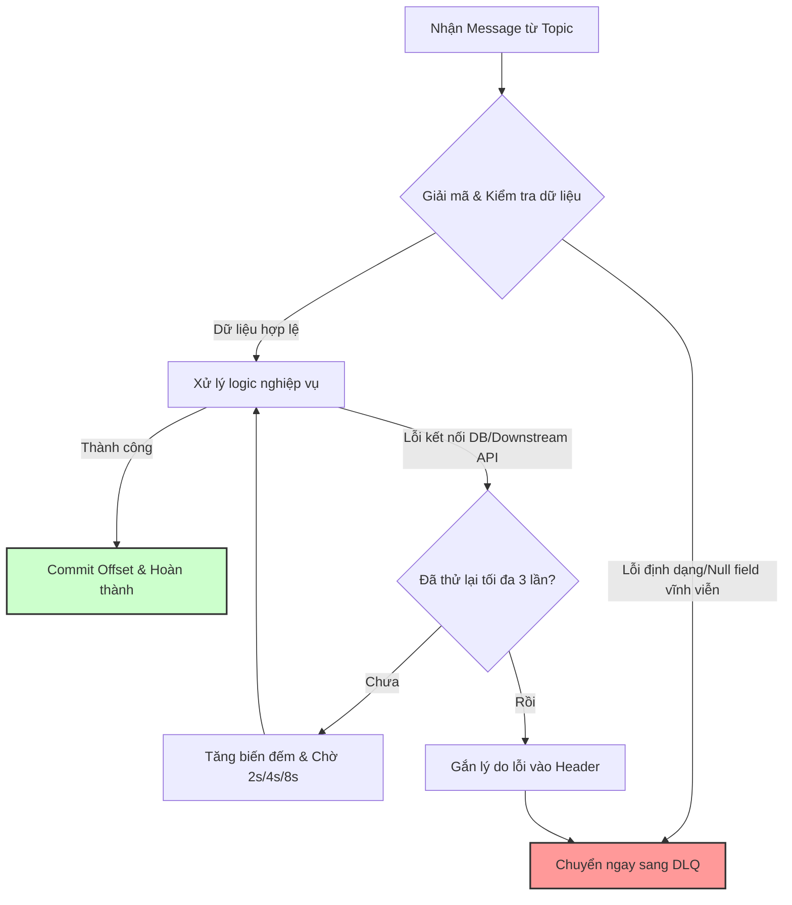

# Khi nào đưa message vào DLQ?

## ⚡ Tóm tắt ngắn (30s)
* **Bản chất**: Quyết định đưa message vào **Dead Letter Queue (DLQ)** là chốt chặn cách ly tối hậu. Chúng ta chỉ đưa message vào DLQ khi gặp **Ngoại lệ không thể phục hồi (Non-recoverable/Non-retryable Exceptions)**, hoặc khi một **Ngoại lệ tạm thời (Recoverable Exception)** đã cạn kiệt toàn bộ số lượt thử lại cho phép (`maxAttempts` exhausted) mà vẫn thất bại.
* **Thảm họa thực chiến được giải quyết**:
  1. **Nghẽn luồng xử lý do lỗi vô vọng**: Đẩy một message bị sai JSON hoặc thiếu khóa chính vào DLQ ngay lập tức, thay vì để nó chiếm dụng thread và liên tục retry làm nghẽn toàn bộ đường ống tiêu thụ.
  2. **Tránh mất mát dữ liệu quan trọng**: Thay vì âm thầm bỏ qua (silently drop) các message lỗi nghiệp vụ, DLQ bảo vệ nguyên trạng message kèm thông tin lỗi để kỹ sư phân tích sau.
* **Quyết định Senior**: Phân loại Exception cực kỳ rõ ràng ngay tại cấu hình:
  * **Đẩy trực tiếp vào DLQ**: Các lỗi định dạng (`JsonParseException`), vi phạm Schema, lỗi lập trình nghiêm trọng (`NullPointerException`).
  * **Đi qua luồng thử lại trước**: Các lỗi môi trường như kết nối DB bị nghẽn (`QueryTimeoutException`), API bên thứ ba timeout.

---

## 🔍 Chi tiết bản chất thực chiến: Bản đồ quyết định chuyển hướng DLQ

Để tối ưu tài nguyên hệ thống, Senior phân chia các lỗi phát sinh tại Consumer thành 2 nhóm chính:

```
                                  LỖI TẠI CONSUMER
                                         │
                 ┌───────────────────────┴───────────────────────┐
                 ▼                                               ▼
     Lỗi Không thể phục hồi                           Lỗi Có thể phục hồi
   (Non-recoverable Exception)                     (Recoverable Exception)
                 │                                               │
  - Sai JSON / Deserialization hỏng               - DB chập chờn / Connection Timeout
  - Vi phạm ràng buộc dữ liệu (Null field)        - Dịch vụ downstream bị sập tạm thời
  - Lỗi logic code nghiêm trọng                   - Lỗi phân tán mạng lưới chập chờn
                 │                                               │
                 ▼                                               ▼
         [ ĐẨY THẲNG SANG DLQ ]                         [ THỬ LẠI (RETRY) ]
                                                                 │
                                                       Thử lại tối đa N lần?
                                                                 │
                                                ┌────────────────┴────────────────┐
                                                ▼                                 ▼
                                              Thành công                      Thất bại
                                                │                                 │
                                                ▼                                 ▼
                                          [ Xong luồng ]                [ ĐẨY SANG DLQ ]
```

### 1. Nhóm 1: Các lỗi không thể phục hồi (Chuyển DLQ ngay lập tức)
Những lỗi này xuất phát từ cấu trúc tin nhắn hoặc lỗi logic code nghiệp vụ nghiêm trọng. Dù hệ thống có thử lại $1000$ lần thì kết quả vẫn là thất bại.
* **Lỗi Deserialization / Parsing**: Định dạng tin nhắn không đúng (ví dụ: gửi một chuỗi text thường vào consumer mong đợi JSON object).
* **Lỗi Validation Nghiệp Vụ**: Tin nhắn chứa dữ liệu phi logic vĩnh viễn (ví dụ: ID của User là số âm, số tiền thanh toán nhỏ hơn 0, thiếu trường bắt buộc).
* **Lỗi Logic Lập Trình (Runtime Exception)**: `NullPointerException`, `IndexOutOfBoundsException`, `ClassCastException` do lỗi code của Consumer.

### 2. Nhóm 2: Các lỗi có thể phục hồi (Chỉ chuyển DLQ khi hết lượt Retry)
Những lỗi xuất hiện do các yếu tố môi trường không ổn định bên ngoài.
* **Database Quá Tải / Lock**: Lỗi khóa dữ liệu tạm thời hoặc DB không phản hồi kịp thời.
* **Dịch Vụ Downstream / API Bên Thứ Ba Bị Lỗi**: API thanh toán hoặc API vận chuyển bị timeout hoặc trả về lỗi 503 tạm thời.
* **Lỗi Network Chập Chờn**: Mất kết nối internet giữa các microservices trong tích tắc.

---

## 🎨 Sơ đồ trực quan (Luồng phân phối quyết định DLQ)



---

## 💻 Code thực chiến: Cấu hình Phân loại Exception & Định hướng DLQ (Spring Kafka)

Cấu hình dưới đây minh họa cách thức thiết lập `DefaultErrorHandler` trong Spring Boot để phân loại rõ lỗi nào chuyển tiếp DLQ ngay lập tức, lỗi nào cần thử lại trước.

```java
import lombok.extern.slf4j.Slf4j;
import org.springframework.context.annotation.Bean;
import org.springframework.context.annotation.Configuration;
import org.springframework.dao.TransientDataAccessException;
import org.springframework.kafka.core.KafkaTemplate;
import org.springframework.kafka.listener.DeadLetterPublishingRecoverer;
import org.springframework.kafka.listener.DefaultErrorHandler;
import org.springframework.kafka.support.serializer.DeserializationException;
import org.springframework.messaging.converter.MessageConversionException;
import org.springframework.util.backoff.FixedBackOff;
import org.webjars.NotFoundException;

import java.net.ConnectException;

@Slf4j
@Configuration
public class KafkaDltRoutingConfig {

    // 1. Khai báo DeadLetterPublishingRecoverer để tự động gửi tin nhắn lỗi sang DLT
    @Bean
    public DeadLetterPublishingRecoverer deadLetterPublishingRecoverer(KafkaTemplate<Object, Object> template) {
        return new DeadLetterPublishingRecoverer(template);
    }

    // 2. Định nghĩa Error Handler phân loại lỗi thông minh
    @Bean
    public DefaultErrorHandler errorHandler(DeadLetterPublishingRecoverer recoverer) {
        // Cấu hình mặc định: Thử lại 3 lần, mỗi lần cách nhau 2 giây cho các lỗi thông thường
        DefaultErrorHandler errorHandler = new DefaultErrorHandler(
                recoverer,
                new FixedBackOff(2000L, 3L)
        );

        // ==========================================
        // ✅ NHÓM LỖI CHUYỂN THẲNG DLQ (Bỏ qua Thử lại)
        // ==========================================
        
        // Lỗi không thể decode JSON hoặc lỗi cấu trúc serializer
        errorHandler.addNotRetryableExceptions(DeserializationException.class);
        errorHandler.addNotRetryableExceptions(MessageConversionException.class);
        
        // Lỗi nghiệp vụ nghiêm trọng (ví dụ: Không tìm thấy tài khoản - NotFound)
        errorHandler.addNotRetryableExceptions(NotFoundException.class);
        errorHandler.addNotRetryableExceptions(NullPointerException.class);
        errorHandler.addNotRetryableExceptions(IllegalArgumentException.class);

        // ==========================================
        // ✅ NHÓM LỖI BẮT BUỘC THỬ LẠI (Retryable)
        // ==========================================
        
        // Lỗi database mất kết nối tạm thời hoặc timeout
        errorHandler.addRetryableExceptions(TransientDataAccessException.class);
        // Lỗi mạng chập chờn khi kết nối dịch vụ ngoài
        errorHandler.addRetryableExceptions(ConnectException.class);

        // Thiết lập bộ ghi log khi chuyển đổi sang DLQ thành công
        errorHandler.setCommitRecovered(true); // Tự động commit offset của tin nhắn lỗi sau khi chuyển DLQ thành công
        
        return errorHandler;
    }
}
```

---

## 📊 Bảng so sánh các phương án xử lý lỗi

| Loại ngoại lệ phát sinh | Khả năng tự phục hồi | Hành động thiết kế tối ưu | Cách thức cấu hình ở Code | Tác động hệ thống |
| :--- | :--- | :--- | :--- | :--- |
| **DeserializationException / JSON hỏng** | **Không thể** | Đẩy thẳng sang DLQ ngay lập tức. | `addNotRetryableExceptions` | Giải phóng partition lập tức, giữ hiệu năng cao. |
| **NullPointerException / Code Bug** | **Không thể** | Đẩy thẳng sang DLQ ngay lập tức. | `addNotRetryableExceptions` | Cách ly nhanh để lập trình viên sửa code. |
| **API Downstream Timeout / HTTP 503** | **Có thể** | Thử lại có giãn cách (Exponential Backoff), chỉ đẩy DLQ nếu cạn lượt. | `addRetryableExceptions` | Tự động khắc phục khi downstream service hoạt động lại. |
| **Database Connection Lost** | **Có thể** | Thử lại có giãn cách, nếu rớt kết nối lâu dài (> 1 phút) mới đưa vào DLQ. | Thử lại với thời gian giãn cách dài. | Tránh đẩy hàng loạt tin nhắn lành mạnh sang DLQ khi DB chết tạm thời. |

---

## ⚠️ Common Gotchas & Questions follow-up

### 1. Cạm bẫy "Bão hòa DLQ (DLQ Flood)"
* **Vấn đề**: Khi Database chính bị chết hẳn trong 15 phút, toàn bộ các lỗi kết nối vốn dĩ là **Recoverable Exception** sẽ liên tục thử lại 3 lần rồi cạn lượt, dẫn đến việc **hàng triệu tin nhắn lành mạnh bị chuyển nhầm sang DLQ**. Khi DB hoạt động lại, Queue chính trống rỗng nhưng DLQ lại chật cứng. Việc phục hồi (re-drive) hàng triệu tin nhắn này cực kỳ tốn công sức.
* **Giải pháp**:
  1. Sử dụng **Circuit Breaker** (như Resilience4j). Nếu tỷ lệ lỗi kết nối DB vượt quá ngưỡng, mở mạch (Open Circuit) và tạm dừng việc đọc tin nhắn (`pause()` consumer) thay vì tiếp tục poll dữ liệu rồi ném sang DLQ.
  2. Thiết kế cơ chế giám sát số lượng tin nhắn đổ vào DLQ theo thời gian (ví dụ: rate > 10 messages/phút lập tức kích hoạt cảnh báo đỏ).

### 2. Câu hỏi đào sâu từ interviewer

* **Q1: Làm thế nào để lưu thông tin chi tiết của lỗi (StackTrace) vào message trong DLQ mà không thay đổi payload gốc của message đó?**
  * *Trả lời*:
    * Trong hệ thống Kafka hoặc RabbitMQ chuyên nghiệp, chúng ta **tuyệt đối không sửa đổi body (payload) gốc** của message vì điều đó phá vỡ cấu trúc schema và làm mất tính bảo toàn dữ liệu.
    * Thay vào đó, ta đóng gói lý do lỗi vào **Header** của message. Spring Kafka tự động ghi các thông tin này vào header của Dead Letter record bao gồm các thuộc tính:
      * `x-exception-message`: Nội dung thông báo lỗi.
      * `x-exception-stacktrace`: Stacktrace đầy đủ của exception.
      * `x-original-topic`: Topic gốc sinh ra lỗi.
      * `x-original-partition` & `x-original-offset`.
    * Kỹ sư có thể dễ dàng đọc các Header này bằng GUI tool (như AKHQ, Offset Explorer) để điều tra lỗi.

* **Q2: Có nên thiết lập hệ thống tự động xử lý (Auto-consume) dữ liệu từ DLQ không?**
  * *Trả lời*:
    * **Không nên**. DLQ đại diện cho những trường hợp hệ thống máy móc đã bất lực và đầu hàng. Việc tự động consume lại tin nhắn từ DLQ khi chưa có sự can thiệp chỉnh sửa code của con người chỉ dẫn đến việc ném lỗi tuần hoàn vô hạn.
    * Cách thiết kế đúng: Kỹ sư vận hành sẽ kiểm tra lỗi, vá code hoặc sửa đổi dữ liệu sai, sau đó kích hoạt một công cụ quản trị (Admin CLI / API Endpoint) để đẩy lại (re-drive) tin nhắn từ DLQ về Queue chính xử lý lại một cách chủ động.
