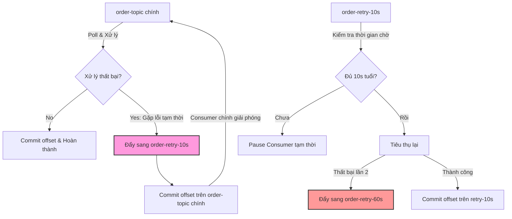

# Retry message nên immediate retry hay delayed retry?

## ⚡ Tóm tắt ngắn (30s)
* **Bản chất**: 
  * **Immediate Retry (Blocking Retry)**: Thử lại ngay lập tức tại luồng (thread) tiêu thụ chính. Thích hợp cho các sự cố mạng chập chờn siêu ngắn (dưới 1 giây). Tuy nhiên, nó sẽ **khóa cứng (block)** tiến trình tiêu thụ của partition đó, làm tăng nghẽn hàng đợi (lag) nghiêm trọng nếu lỗi kéo dài.
  * **Delayed Retry (Non-blocking Retry)**: Chuyển hướng tin nhắn lỗi sang các topic phụ chuyên biệt để trì hoãn xử lý (ví dụ: `order-retry-5s`, `order-retry-30s`), giải phóng ngay lập tức partition chính để tiêu thụ các tin nhắn lành mạnh tiếp theo.
* **Thảm họa thực chiến được giải quyết**:
  1. **Nghẽn dây chuyền (Cascading Failure/Partition Lag)**: Ngăn chặn một lỗi kết nối API bên thứ ba kéo dài 10 giây làm đóng băng toàn bộ partition của Kafka, khiến hàng triệu tin nhắn của khách hàng khác bị treo.
  2. **Tránh bão quét hạ tầng (Retry Storm)**: Immediate retry liên tục không giãn cách sẽ đóng vai trò như một đòn tấn công từ chối dịch vụ (DDoS) tự chế, trực tiếp đánh sập hệ thống Database vốn đang bị quá tải.
* **Quyết định Senior**: Sử dụng **Delayed Retry (Non-blocking)** kết hợp cơ chế **Exponential Backoff** thông qua cấu hình **Retry Topics** cho mọi luồng xử lý bất đồng bộ Enterprise cần throughput cao. Chỉ dùng **Immediate Retry** cho các tác vụ kiểm tra nhanh cực đoan (< 3 lần, giãn cách < 1s).

---

## 🔍 Chi tiết bản chất thực chiến: So sánh hai trường phái thiết kế Retry

### 1. Luồng chạy Blocking (Immediate Retry)
* **Cách hoạt động**: Thread tiêu thụ nhận message -> Gọi API lỗi -> Thread ngủ (sleep) 1s -> Thử lại -> API tiếp tục lỗi -> Thread tiếp tục ngủ 2s -> Thử lại...
* **Ưu điểm**: Đảm bảo tuyệt đối **thứ tự tin nhắn (Message Ordering)** vì partition bị khoá chặt tại đúng offset đó, không tin nhắn nào phía sau được phép vượt lên trước.
* **Nhược điểm chết người**: Làm giảm throughput của toàn bộ hệ thống xuống bằng 0 trên partition đó. Nếu lỗi kéo dài vài phút, hệ thống sẽ tích tụ hàng triệu tin nhắn lag, kích hoạt cảnh báo đỏ trên hệ thống giám sát.

---

### 2. Luồng chạy Non-blocking (Delayed Retry với Retry Topics)
Để khắc phục hoàn toàn điểm yếu nghẽn của Blocking Retry, kiến trúc Enterprise hiện đại sử dụng giải pháp **Multi-Topic Retry**:

```
                       [ TOPIC CHÍNH: order-topic ]
                                    │
                            Poll & Xử lý lỗi
                                    │
                                    ▼
                     [ TOPIC RETRY 1: order-retry-10s ] ── Chờ 10s tiêu thụ lại
                                    │
                                Vẫn lỗi
                                    │
                                    ▼
                     [ TOPIC RETRY 2: order-retry-30s ] ── Chờ 30s tiêu thụ lại
                                    │
                                Vẫn lỗi
                                    │
                                    ▼
                        [ TOPIC TỐI HẬU: order-dlt ] ── Dừng lại báo lỗi
```

* **Cơ chế**: Khi xử lý tin nhắn lỗi, Consumer gửi tin nhắn đó sang topic `order-retry-10s`, commit offset trên topic chính và tiếp tục xử lý các tin nhắn khác.
* **Cơ chế trì hoãn**: Consumer của topic `order-retry-10s` sẽ kiểm tra timestamp của tin nhắn:
  * Nếu tin nhắn chưa đủ 10 giây tuổi (tính từ lúc lỗi), consumer sẽ chủ động tạm dừng (`pause()`) việc đọc dữ liệu để chờ đủ thời gian, tránh tiêu thụ liên tục sinh lỗi thừa.
  * Nếu đã đủ 10 giây, tiến hành xử lý lại. Nếu tiếp tục lỗi, đẩy sang topic retry tiếp theo (`order-retry-30s`).

---

## 🎨 Sơ đồ trực quan (Kiến trúc Non-blocking Delayed Retry)



---

## 💻 Code thực chiến: Cấu hình Spring Kafka Non-blocking Delayed Retry

Spring Kafka hỗ trợ một cơ chế cực kỳ mạnh mẽ để cấu hình Non-blocking Delayed Retry thông qua annotation `@RetryableTopic` mà không cần tự viết code chuyển đổi thủ công phức tạp.

```java
import lombok.extern.slf4j.Slf4j;
import org.springframework.kafka.annotation.DltHandler;
import org.springframework.kafka.annotation.KafkaListener;
import org.springframework.kafka.annotation.RetryableTopic;
import org.springframework.kafka.retrytopic.DltStrategy;
import org.springframework.kafka.support.KafkaHeaders;
import org.springframework.messaging.handler.annotation.Header;
import org.springframework.messaging.handler.annotation.Payload;
import org.springframework.retry.annotation.Backoff;
import org.springframework.stereotype.Service;

import java.net.ConnectException;

@Slf4j
@Service
public class OrderDelayedRetryConsumer {

    // ✅ SỬ DỤNG RETRYABLE TOPIC ĐỂ TRIỂN KHAI NON-BLOCKING RETRY
    @RetryableTopic(
            attempts = "4", // Thử lại tối đa 3 lần (Tổng cộng 4 lần chạy)
            backoff = @Backoff(
                    delay = 5000,      // Thời gian chờ ban đầu là 5 giây
                    multiplier = 3.0,  // Exponential Backoff: nhân hệ số 3 (5s -> 15s -> 45s)
                    maxDelay = 60000   // Thời gian chờ tối đa là 60 giây
            ),
            // Chỉ định lỗi môi trường chập chờn mới được kích hoạt luồng retry này
            include = { ConnectException.class, RuntimeException.class },
            // Chiến lược DLT: Đẩy sang DLT chuyên dụng nếu thất bại toàn bộ
            dltStrategy = DltStrategy.FAIL_ON_ERROR,
            // Đặt tên hậu tố cho các topic phụ được sinh ra
            retryTopicSuffix = "-retry-topic",
            dltTopicSuffix = "-dead-letter-topic"
    )
    @KafkaListener(topics = "order-events", groupId = "order-group-service")
    public void consumeOrder(@Payload String orderJson, 
                             @Header(KafkaHeaders.RECEIVED_TOPIC) String topic,
                             @Header(KafkaHeaders.OFFSET) long offset) throws ConnectException {
        
        log.info("🔥 Nhận message từ Topic: {}, Offset: {}, Payload: {}", topic, offset, orderJson);
        
        try {
            // Logic xử lý đơn hàng nghiệp vụ ở đây
            if (orderJson.contains("timeout_test")) {
                log.warn("⚠️ Giả lập lỗi mất kết nối mạng với API giao hàng!");
                throw new ConnectException("Connection timeout to API downstream!");
            }
            log.info("✅ Xử lý đơn hàng thành công!");
        } catch (ConnectException e) {
            throw e; // Ném ra lỗi để kích hoạt luồng RetryableTopic
        }
    }

    // 🏆 ĐÂY LÀ CHỐT CHẶN CUỐI CÙNG (Dead Letter Topic Handler)
    @DltHandler
    public void handleDeadLetter(@Payload String orderJson,
                                 @Header(KafkaHeaders.RECEIVED_TOPIC) String originalTopic,
                                 @Header(KafkaHeaders.EXCEPTION_MESSAGE) String exceptionMessage) {
        
        log.error("❌ THẢM HỌA: Message đã cạn kiệt lượt retry! Bị đầy sang DLT.");
        log.error("❌ Topic gốc: {}, Lý do lỗi: {}, Nội dung: {}", originalTopic, exceptionMessage, orderJson);
        
        // Gửi alert PagerDuty / Slack cho kỹ sư vận hành xử lý nóng
        sendSlackAlert(originalTopic, exceptionMessage, orderJson);
    }

    private void sendSlackAlert(String topic, String error, String payload) {
        log.info("🔔 [ALERT] Đang gửi thông báo khẩn cấp lên Slack channel!");
    }
}
```

---

## 📊 Bảng so sánh Blocking và Non-blocking Retry

| Tiêu chí so sánh | Blocking Retry (Immediate) | Non-blocking Retry (Delayed / Multi-Topic) |
| :--- | :--- | :--- |
| **Bảo toàn thứ tự (Ordering)** | **Hoàn hảo** (Do luồng bị giữ chân tại offset lỗi). | **Không đảm bảo** (Các tin nhắn khoẻ phía sau sẽ vượt lên trước). |
| **Thông lượng hệ thống (Throughput)** | **Cực thấp** khi xảy ra sự cố (Tất cả tin nhắn lành mạnh bị kẹt). | **Cực cao** (Tin nhắn lỗi bị tách biệt, tin lành chạy vèo vèo). |
| **Quá tải tài nguyên (CPU/Network)** | **Khá cao** (Dễ tạo hiệu ứng Retry Storm phá huỷ DB). | **Thấp** (Do thời gian delay được phân bố giãn cách thông minh). |
| **Độ phức tạp triển khai** | **Rất thấp** (Hỗ trợ mặc định trong hầu hết client). | **Trung bình/Cao** (Phải quản lý thêm các topic phụ và logic trì hoãn). |
| **Use Case Phù Hợp** | Các tác vụ yêu cầu thứ tự tuyệt đối, lỗi phục hồi cực nhanh (< 1s). | **Mọi luồng nghiệp vụ lớn** (Tài chính, Đặt vé, E-commerce, Log Processing). |

---

## ⚠️ Common Gotchas & Questions follow-up

### 1. Cạm bẫy "Mất thứ tự tin nhắn nghiêm trọng (Out-of-Order Chaos)"
* **Vấn đề**: Ví dụ có 2 sự kiện của cùng 1 User: `1. Tạo tài khoản (offset 100)` -> `2. Cập nhật số điện thoại (offset 101)`.
  * Nếu sự kiện 1 bị lỗi mạng tạm thời và đẩy sang `order-retry-10s`.
  * Sự kiện 2 chạy ngay sau và thành công.
  * 10 giây sau, sự kiện 1 mới chạy lại thành công.
  * Hậu quả: Dữ liệu của User bị đưa về trạng thái cũ hỏng hoặc ném lỗi nghiệp vụ vì "Tài khoản chưa được tạo làm sao cập nhật số điện thoại".
* **Giải pháp**:
  * Nếu hệ thống **yêu cầu thứ tự tuyệt đối theo Key (ví dụ: theo userId)**: Bắt buộc dùng **Blocking (Immediate) Retry** nhưng cấu hình số lần thử lại thấp (ví dụ: max 3 lần) và timeout ngắn, sau đó đưa ngay sang DLQ và dừng consumer tạm thời để con người can thiệp.
  * Hoặc áp dụng kiến trúc **Optimistic Locking / Versioning** tại Database để từ chối các bản ghi cũ ghi đè lên dữ liệu mới.

### 2. Câu hỏi đào sâu từ interviewer
* **Q1: Làm sao Spring Kafka trì hoãn tiêu thụ (Delayed consume) ở các Retry Topic mà không làm tốn CPU loop liên tục?**
  * *Trả lời*:
    * Spring Kafka sử dụng một cơ chế rất thông minh là **Consumer Backoff**. 
    * Khi đọc được một record từ retry topic có timestamp ghi nhận chưa đủ thời gian delay cấu hình, Spring Kafka Listener sẽ tự động **tạm ngừng (pause)** luồng poll dữ liệu của container đó trong khoảng thời gian còn thiếu.
    * Nó sử dụng cơ chế hẹn giờ tác vụ bất đồng bộ (TaskScheduler) để tự động gọi phương thức `resume()` luồng tiêu thụ khi đã đủ điều kiện thời gian. Nhờ đó, thread không bị chạy loop liên tục (busy-spin), giúp tiết kiệm 100% tài nguyên CPU của hệ thống.
