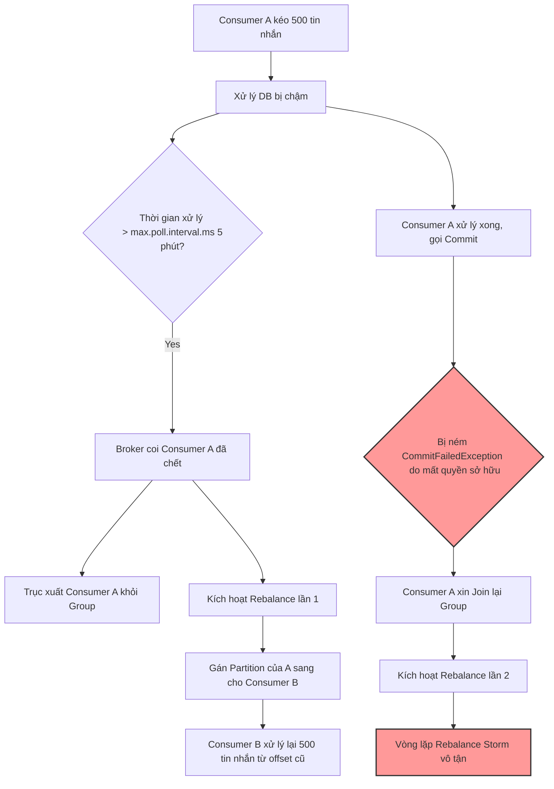

# Consumer rebalance liên tục. Nguyên nhân có thể là gì?

## ⚡ Tóm tắt ngắn (30s)
* **Bản chất**: **Rebalance** là quá trình Kafka Broker tái phân bổ quyền sở hữu các partition cho các consumer trong cùng một Consumer Group. Khi rebalance xảy ra liên tục (**Rebalance Storm**), hệ thống sẽ rơi vào trạng thái tê liệt hoàn toàn vì các consumer phải dừng tiêu thụ tin nhắn (**Stop-The-World**) để bàn giao và nhận lại partition mới.
* **Thảm họa thực chiến được giải quyết**:
  1. **Tắc nghẽn hệ thống (Processing Stagnation)**: Toàn bộ Consumer Group không thể xử lý tin nhắn mới, làm chỉ số Kafka Lag tăng vọt theo chiều thẳng đứng.
  2. **Xử lý trùng lặp trên diện rộng (Double Processing / Data Duplication)**: Consumer bị đẩy khỏi group khi đang chạy dở đơn hàng, khiến consumer khác nhảy vào tiêu thụ lại chính tin nhắn đó, tạo ra đơn hàng trùng lặp.
* **Quyết định Senior**:
  1. **Tuning cấu hình**: Tăng `max.poll.interval.ms` kết hợp giảm `max.poll.records` xuống mức an toàn.
  2. **Kiến trúc tách luồng (Decoupled Architecture)**: Luồng Poll tin nhắn từ Kafka hoạt động trên Thread riêng biệt và chuyển giao ngay cho một Worker Thread Pool (Executor) xử lý nghiệp vụ bất đồng bộ, tuyệt đối không để logic nghiệp vụ chặn luồng poll.
  3. **Nâng cấp thuật toán gán**: Sử dụng `CooperativeStickyAssignor` để chỉ tái cấu trúc phân vùng bị thay đổi thay vì "đập đi xây lại" toàn bộ group.

---

## 🔍 Chi tiết bản chất thực chiến: Tại sao xảy ra Rebalance liên tục?

Để hiểu nguyên nhân, ta cần biết Kafka Consumer Client sử dụng hai luồng chạy độc lập nội bộ:
1. **Heartbeat Thread**: Chuyên trách gửi tín hiệu định kỳ báo "Tôi còn sống" tới Group Coordinator (Broker).
2. **User Poll Thread (Main Thread)**: Thực thi lệnh `poll()` để kéo dữ liệu về và chạy logic nghiệp vụ của lập trình viên.

```
                    ┌────────────────────────────────────────┐
                    │            KAFKA CONSUMER              │
                    │                                        │
                    │   ┌────────────────────────────────┐   │
                    │   │        Heartbeat Thread        │   │ ── Gửi tín hiệu "Tôi sống" định kỳ
                    │   └────────────────────────────────┘   │    (Không bị ảnh hưởng bởi logic code)
                    │                                        │
                    │   ┌────────────────────────────────┐   │
                    │   │    User Poll Thread (Main)     │   │ ── Kéo message & chạy logic nghiệp vụ
                    │   └────────────────────────────────┘   │    (Bị chặn nếu DB chậm, gọi API nghẽn)
                    └────────────────────────────────────────┘
```

Dựa trên cơ chế này, Senior chỉ ra 3 nguyên nhân cốt lõi gây ra Rebalance Storm trên Production:

### 1. Xử lý tin nhắn quá lâu vượt quá `max.poll.interval.ms` (Phổ biến nhất)
* **Cơ chế**: Kafka yêu cầu consumer phải gọi hàm `poll()` liên tục. Khoảng cách giữa 2 lần gọi không được vượt quá `max.poll.interval.ms` (mặc định là 5 phút).
* **Kịch bản lỗi**: Consumer kéo về 500 tin nhắn (`max.poll.records`). Hôm nay Database bị chậm, khiến mỗi tin nhắn xử lý mất 1 giây. Tổng thời gian xử lý là 500 giây (~8.3 phút) > 5 phút. 
* **Hậu quả**: Broker nghĩ consumer này đã bị treo (hung thread) nên chủ động kick consumer ra khỏi Group, kích hoạt Rebalance. Khi consumer xử lý xong 500 tin nhắn đó, nó cố gửi commit nhưng bị từ chối (`CommitFailedException`), nó lại cố xin join lại Group -> Tiếp tục gây Rebalance vòng lặp.

---

### 2. Heartbeat Thread bị chết hoặc nghẽn (`session.timeout.ms`)
* **Cơ chế**: Heartbeat thread phải gửi tín hiệu về Broker mỗi `heartbeat.interval.ms` (thường là 3s). Nếu Broker không nhận được heartbeat nào trong vòng `session.timeout.ms` (mặc định là 45s), Broker coi như Consumer đã chết vật lý.
* **Kịch bản lỗi**: 
  * Ứng dụng chạy thiếu RAM gây ra hiện tượng **JVM Full GC (Stop-the-world)** kéo dài hơn 45 giây, làm đóng băng toàn bộ các thread bao gồm cả Heartbeat Thread.
  * Mạng lưới kết nối giữa Consumer Pod và Kafka Broker bị ngắt quãng hoặc lag nghiêm trọng.

---

### 3. Trạng thái Container không ổn định trên Kubernetes (Pod Churn)
* Kubernetes liên tục khởi động lại Pod do lỗi **OOMKilled** (Vượt giới hạn RAM cấu hình) hoặc cấu hình **Liveness Probe** trỏ nhầm vào endpoint nghiệp vụ đang bị nghẽn dẫn đến việc K8s đánh giá pod chết và kill liên tục. Việc consumer liên tục ra và vào group trực tiếp phá vỡ sự ổn định của Consumer Group.

---

## 🎨 Sơ đồ trực quan (Vòng lặp tử thần Rebalance - Rebalance Loop of Death)



---

## 💻 Code thực chiến: Kiến trúc Tách luồng (Worker Thread Pool) & Tuning cấu hình

Để triệt tiêu hoàn toàn lỗi Rebalance do xử lý tin nhắn chậm, phương án tốt nhất của một Senior là: **Tách biệt luồng Poll dữ liệu khỏi luồng xử lý nghiệp vụ**.

```java
import lombok.extern.slf4j.Slf4j;
import org.apache.kafka.clients.consumer.ConsumerConfig;
import org.springframework.context.annotation.Bean;
import org.springframework.context.annotation.Configuration;
import org.springframework.kafka.config.ConcurrentKafkaListenerContainerFactory;
import org.springframework.kafka.core.ConsumerFactory;
import org.springframework.kafka.core.DefaultKafkaConsumerFactory;
import org.springframework.scheduling.concurrent.ThreadPoolTaskExecutor;

import java.util.HashMap;
import java.util.Map;
import java.util.concurrent.Executor;

@Slf4j
@Configuration
public class KafkaAntiRebalanceConfig {

    // 1. Cấu hình Tuning các thông số Kafka Consumer chống Rebalance
    @Bean
    public ConsumerFactory<String, Object> antiRebalanceConsumerFactory() {
        Map<String, Object> props = new HashMap<>();
        props.put(ConsumerConfig.BOOTSTRAP_SERVERS_CONFIG, "localhost:9092");
        props.put(ConsumerConfig.GROUP_ID_CONFIG, "order-anti-rebalance-group");
        
        // 🛠️ GIẢI PHÁP TUNING CẤU HÌNH VÀNG:
        // Giảm số lượng tin nhắn kéo về mỗi lần xuống rất thấp để đảm bảo xử lý cực nhanh
        props.put(ConsumerConfig.MAX_POLL_RECORDS_CONFIG, "20"); 
        
        // Tăng tối đa thời gian chờ đợi xử lý giữa 2 lần poll lên hẳn 15 phút (900.000 ms)
        props.put(ConsumerConfig.MAX_POLL_INTERVAL_MS_CONFIG, "900000"); 

        // Điều chỉnh thời gian xác nhận mất kết nối vật lý (session timeout) lên 60 giây
        props.put(ConsumerConfig.SESSION_TIMEOUT_MS_CONFIG, "60000");
        props.put(ConsumerConfig.HEARTBEAT_INTERVAL_MS_CONFIG, "20000"); // Gửi heartbeat mỗi 20s

        // ✅ THUẬT TOÁN GÁN THÔNG MINH: Chỉ rebalance stickily, tránh dừng toàn bộ group
        props.put(ConsumerConfig.PARTITION_ASSIGNMENT_STRATEGY_CONFIG, 
                "org.apache.kafka.clients.consumer.CooperativeStickyAssignor");

        return new DefaultKafkaConsumerFactory<>(props);
    }

    // 2. Tạo luồng Executor chuyên biệt cho việc xử lý nghiệp vụ bất đồng bộ
    @Bean(name = "kafkaWorkerExecutor")
    public Executor kafkaWorkerExecutor() {
        ThreadPoolTaskExecutor executor = new ThreadPoolTaskExecutor();
        executor.setCorePoolSize(10);
        executor.setMaxPoolSize(25);
        executor.setQueueCapacity(100);
        executor.setThreadNamePrefix("KafkaWorker-");
        executor.setRejectedExecutionHandler(new java.util.concurrent.ThreadPoolExecutor.CallerRunsPolicy());
        executor.initialize();
        return executor;
    }

    @Bean
    public ConcurrentKafkaListenerContainerFactory<String, Object> kafkaListenerContainerFactory(
            Executor kafkaWorkerExecutor) {
        ConcurrentKafkaListenerContainerFactory<String, Object> factory =
                new ConcurrentKafkaListenerContainerFactory<>();
        factory.setConsumerFactory(antiRebalanceConsumerFactory());
        
        // Gán Executor nghiệp vụ: Container của Spring sẽ tự động lấy tin nhắn ra
        // và đẩy công việc vào luồng Worker này, luồng Poll chính lập tức rảnh tay quay lại kéo data tiếp!
        factory.getContainerProperties().setListenerTaskExecutor(kafkaWorkerExecutor);
        
        return factory;
    }
}
```

---

## 📊 Bảng cấu hình Tuning Consumer chống Rebalance

| Tham số cấu hình | Giá trị mặc định | Giá trị đề xuất (Tuning) | Giải thích tác dụng thực chiến |
| :--- | :--- | :--- | :--- |
| **`max.poll.interval.ms`** | 300000 (5 phút) | **900000** (15 phút) | Tăng thời gian tối đa cho phép xử lý một lô tin nhắn trước khi Broker coi Consumer đã chết. |
| **`max.poll.records`** | 500 | **20 -> 50** | Giảm số lượng tin nhắn kéo về mỗi đợt. Lô tin nhắn nhỏ hơn giúp đảm bảo hoàn thành trước thời hạn timeout. |
| **`session.timeout.ms`** | 45000 (45 giây) | **60000** (60 giây) | Giảm thiểu rebalance ảo do JVM dừng chạy quá lâu khi Full GC (Stop-the-world). |
| **`partition.assignment.strategy`** | RangeAssignor, CooperativeStickyAssignor | **CooperativeStickyAssignor** | **Tối ưu cực lớn**: Chỉ thu hồi partition của consumer bị chết thực sự và gán lại, các consumer khác vẫn tiếp tục chạy không bị Stop-the-world. |

---

## ⚠️ Common Gotchas & Questions follow-up

### 1. Cạm bẫy "Xử lý trùng lặp khổng lồ (Out-of-sync Duplication)"
* **Nguy cơ**: Khi Consumer A bị trục xuất khỏi Group do xử lý quá lâu, offset hiện tại của lô tin nhắn đang chạy chưa được commit. Consumer B nhảy vào nhận quyền quản lý partition đó và sẽ **tiêu thụ lại toàn bộ từ offset chưa committed**. 
* Điều này dẫn đến toàn bộ lô tin nhắn đó bị chạy lại lần thứ hai. Nếu luồng thanh toán nghiệp vụ của bạn không có cơ chế **Idempotent (Chống trùng lặp)**, khách hàng sẽ bị trừ tiền 2 lần!
* **Khắc phục**: 
  1. Luôn luôn thiết kế chốt chặn kiểm tra trạng thái giao dịch bằng Database Unique Constraint trước khi ghi đè dữ liệu.
  2. Bật cơ chế tự động commit offset mềm trong code theo từng tin nhắn đơn lẻ khi xử lý xong thay vì đợi hết lô.

### 2. Câu hỏi đào sâu từ interviewer
* **Q1: Tại sao không nên cấu hình `session.timeout.ms` lên quá lớn (ví dụ: 10 phút)?**
  * *Trả lời*: 
    * Nếu đặt `session.timeout.ms` quá lớn, khi một Consumer Pod thực sự bị chết vật lý (ví dụ: máy chủ ảo AWS bị sập nguồn), Kafka Broker sẽ phải đợi đúng 10 phút mới phát hiện ra sự cố này để kích hoạt rebalance cứu hộ.
    * Trong suốt 10 phút đó, các partition được phân bổ cho consumer đã chết sẽ hoàn toàn **không có ai tiêu thụ**, dẫn đến tích tụ lag khổng lồ cho các khách hàng thuộc phân vùng đó. Giá trị 60s là điểm cân bằng lý tưởng nhất.

* **Q2: StickyAssignor và CooperativeStickyAssignor khác nhau như thế nào?**
  * *Trả lời*:
    * Cả hai đều cố gắng giữ tối đa các phân vùng cũ cho các consumer lành mạnh để tránh xáo trộn partition không cần thiết.
    * Tuy nhiên, `StickyAssignor` vẫn sử dụng giao thức rebalance cũ (**Eager Rebalance**), yêu cầu toàn bộ group dừng tiêu thụ tin nhắn trong lúc phân chia lại.
    * `CooperativeStickyAssignor` sử dụng giao thức mới (**Incremental Cooperative Rebalance**). Nó cho phép các consumer không bị ảnh hưởng tiếp tục xử lý tin nhắn bình thường, chỉ thu hồi và gán lại các partition bị trống. Điều này giảm thiểu tối đa thời gian downtime của toàn cụm.
