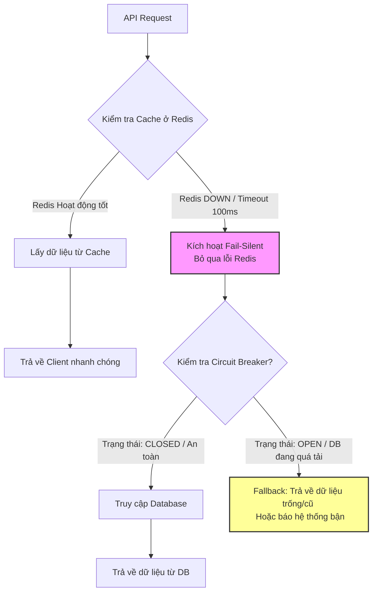

# Redis down, service của bạn có tiếp tục hoạt động không?

## ⚡ Tóm tắt ngắn (30s)
* **Bản chất**: Khi cụm Redis (Distributed Cache) bị sập (downtime vật lý, lỗi OOM do tràn RAM, hoặc mất kết nối mạng), service của bạn có sống tiếp được hay không phụ thuộc hoàn toàn vào cách thiết kế dependency: **Hard Dependency** (Redis sập kéo theo service chết) hay **Soft Dependency / Graceful Degradation** (Hạ cấp dịch vụ an toàn). Một hệ thống chuẩn Enterprise bắt buộc phải coi Cache là Soft Dependency.
* **Thảm họa thực chiến được giải quyết**:
  1. **Nghẽn luồng dây chuyền (Thread Pool Exhaustion)**: Mặc định, nếu không cấu hình timeout hoặc timeout quá lớn (ví dụ: 2 - 5 giây), luồng HTTP xử lý request sẽ bị treo cứng để đợi kết nối Redis. Hệ thống Web Server phía trước sẽ cạn kiệt luồng xử lý và sập hoàn toàn chỉ sau vài giây.
  2. **Database Overwhelm (DB bị đè bẹp)**: Khi Redis sập, 100% traffic truy vấn dữ liệu sẽ dội thẳng xuống Database chính (RDBMS/NoSQL). Database không chịu nổi lượng tải lớn đột ngột này sẽ tăng vọt CPU lên 100%, khóa bảng (table lock) và sập nốt.
* **Quyết định Senior**:
  1. **Áp dụng Fail-Silent Pattern**: Đóng gói mọi thao tác truy cập Redis trong khối `try-catch` hoặc sử dụng Custom CacheResolver của Spring để khi Redis sập, hệ thống tự động bỏ qua cache và truy cập trực tiếp DB mà không ném lỗi 500 ra API.
  2. **Tuning Timeout khắt khe**: Đặt `connection-timeout` và `read-timeout` sang Redis cực thấp (ví dụ: `100ms - 200ms`).
  3. **Bảo vệ Database bằng Circuit Breaker**: Tích hợp Resilience4j Circuit Breaker để khi phát hiện Redis sập và lượng truy vấn xuống DB tăng bất thường, hệ thống tự động kích hoạt chế độ "Rate Limiting" hoặc trả về kết quả rỗng/mặc định (Fallback) để cứu sống Database.

---

## 🔍 Chi tiết bản chất thực chiến: Cơ chế Cô lập lỗi & Hạ cấp dịch vụ

### 1. Phân tích tác động dây chuyền khi Redis sập
Khi một Service nghiệp vụ phụ thuộc vào Redis không được thiết kế chịu lỗi, chuỗi sụp đổ sẽ diễn ra như sau:

```
[Redis Sập] ──> [Redis Driver chờ Connection/Read Timeout] ──> [HTTP Thread bị Block]
                                                                      │
                                                                      ▼
[Database Sập] <── [Tải trực tiếp vào DB tăng vọt 10x] <── [Hết luồng xử lý Web Server]
```

* **Vấn đề 1: Timeout quá lớn**. Nhiều thư viện kết nối Redis mặc định để thời gian chờ lên tới hàng giây. Trong môi trường High Throughput (ví dụ: 1000 requests/giây), chỉ cần 0.2 giây treo luồng là ứng dụng đã hết sạch Thread trong Thread Pool.
* **Vấn đề 2: Sự hoảng loạn của Database**. Cache đóng vai trò là "tấm khiên" chặn 90% traffic đọc. Khi tấm khiên vỡ, 100% traffic đập thẳng vào Database. Database chỉ được thiết kế để chịu tải 10% traffic nay phải chịu 100%, dẫn tới quá tải tức thì.

---

## 🎨 Sơ đồ trực quan (Cơ chế Soft Dependency & DB Protection)



---

## 💻 Code thực chiến: Cấu hình Auto-Fallback & Chịu lỗi Redis trong Spring Boot

Để ứng dụng tự động bỏ qua lỗi Redis khi kết nối thất bại và truy cập DB an toàn, chúng ta cấu hình Custom `CacheErrorHandler` và tích hợp Resilience4j Circuit Breaker.

### 1. Cấu hình Fail-Silent CacheErrorHandler trong Spring Boot
Lớp cấu hình này giúp Spring Cache (khi dùng `@Cacheable`) tự động bỏ qua lỗi kết nối Redis và lấy dữ liệu trực tiếp từ database mà không ném lỗi ra ngoài.

```java
import lombok.extern.slf4j.Slf4j;
import org.springframework.cache.Cache;
import org.springframework.cache.annotation.CachingConfigurerSupport;
import org.springframework.cache.interceptor.CacheErrorHandler;
import org.springframework.context.annotation.Configuration;

@Slf4j
@Configuration
public class CacheConfig extends CachingConfigurerSupport {

    @Override
    public CacheErrorHandler errorHandler() {
        return new CustomCacheErrorHandler();
    }

    // ✅ Bỏ qua toàn bộ lỗi Redis để luồng chính đi tiếp xuống DB (Fail-Silent)
    private static class CustomCacheErrorHandler implements CacheErrorHandler {
        @Override
        public void handleCacheGetError(RuntimeException exception, Cache cache, Object key) {
            log.error("⚠️ Lỗi đọc Cache Redis (Key: {}). Chi tiết: {}. Chuyển hướng truy vấn xuống DB!", 
                    key, exception.getMessage());
        }

        @Override
        public void handleCachePutError(RuntimeException exception, Cache cache, Object key, Object value) {
            log.error("⚠️ Lỗi ghi Cache Redis (Key: {}). Chi tiết: {}", key, exception.getMessage());
        }

        @Override
        public void handleCacheEvictError(RuntimeException exception, Cache cache, Object key) {
            log.error("⚠️ Lỗi xóa Cache Redis (Key: {}). Chi tiết: {}", key, exception.getMessage());
        }

        @Override
        public void handleCacheClearError(RuntimeException exception, Cache cache) {
            log.error("⚠️ Lỗi xóa sạch Cache Redis. Chi tiết: {}", exception.getMessage());
        }
    }
}
```

### 2. Triển khai Service nghiệp vụ kết hợp Bảo vệ Database bằng Circuit Breaker
Khi Redis down, ta phải truy cập Database nhưng phải bọc qua Circuit Breaker để tránh DB bị sập nếu tải quá cao.

```java
import io.github.resilience4j.circuitbreaker.annotation.CircuitBreaker;
import lombok.RequiredArgsConstructor;
import lombok.extern.slf4j.Slf4j;
import org.springframework.cache.annotation.Cacheable;
import org.springframework.stereotype.Service;

@Slf4j
@Service
@RequiredArgsConstructor
public class ProductService {

    private final ProductRepository productRepository;

    /**
     * ✅ Lấy thông tin sản phẩm.
     * 1. Spring tự động tìm trong Redis Cache.
     * 2. Nếu Redis sập, CustomCacheErrorHandler bắt lỗi, ghi log và cho phép code chạy tiếp xuống DB.
     * 3. Phép gọi DB được bảo vệ bởi Circuit Breaker 'databaseCall'.
     */
    @Cacheable(value = "products", key = "#productId")
    @CircuitBreaker(name = "databaseCall", fallbackMethod = "getProductFallback")
    public ProductDto getProductDetails(String productId) {
        log.info("🔎 Cache Miss! Đang truy vấn Database cho sản phẩm {}", productId);
        
        // Mô phỏng nghiệp vụ đọc DB nặng
        ProductEntity entity = productRepository.findById(productId)
                .orElseThrow(() -> new ResourceNotFoundException("Không tìm thấy sản phẩm"));
                
        return new ProductDto(entity.getId(), entity.getName(), entity.getPrice());
    }

    /**
     * ⚠️ FALLBACK METHOD: Được gọi khi Database bị nghẽn (Circuit Breaker chuyển sang trạng thái OPEN).
     * Cứu sống hệ thống bằng cách trả về dữ liệu mặc định hoặc báo bận an toàn cho client.
     */
    public ProductDto getProductFallback(String productId, Throwable throwable) {
        log.error("🚨 HỆ THỐNG QUÁ TẢI: DB sập hoặc quá tải khi Redis down. Kích hoạt Fallback cho sản phẩm {}", productId);
        
        // Trả về DTO mặc định/tĩnh hoặc ném ra Custom exception được kiểm soát để API trả về mã lỗi 429 (Too Many Requests)
        return new ProductDto(productId, "Hệ thống đang quá tải. Vui lòng thử lại sau!", 0.0);
    }
}
```

### 3. Cấu hình Connection Timeout khắt khe trong `application.yml`
```yaml
spring:
  data:
    redis:
      host: localhost
      port: 6379
      timeout: 100ms # ✅ Read Timeout cực ngắn để giải phóng luồng chính lập tức
      connect-timeout: 100ms # ✅ Connection Timeout ngắn tránh treo luồng khi Redis chết cứng
      lettuce:
        pool:
          max-active: 16
          max-idle: 8
          min-idle: 2
          max-wait: 100ms # ✅ Thời gian tối đa đợi kết nối từ pool
```

---

## 📊 Bảng so sánh phương án Hard Dependency và Soft Dependency

| Tiêu chí | Thiết kế Hard Dependency (Ngây thơ) | Thiết kế Soft Dependency (Chuẩn Senior) |
| :--- | :--- | :--- |
| **Khi Redis đột ngột sập** | Toàn bộ các API cần gọi Redis trả về HTTP 500. | API vẫn hoạt động bình thường, chấp nhận latency tăng nhẹ. |
| **Sự ảnh hưởng luồng (Thread)** | Luồng xử lý bị block lâu dài dẫn tới sập dây chuyền Web Server. | Luồng được giải phóng ngay lập tức nhờ timeout ngắn (<100ms). |
| **Tác động lên Database** | Không kiểm soát, DB có nguy cơ cao bị đè bẹp tức thì. | Được kiểm soát chặt chẽ bằng Circuit Breaker / Rate Limiter. |
| **Trải nghiệm người dùng** | Trang web lỗi hoàn toàn (502 / 504 / 500). | Vẫn mua được hàng, xem được sản phẩm (trải nghiệm mượt mà). |

---

## ⚠️ Common Gotchas & Questions follow-up

### 1. Cạm bẫy "Double Failure" (Thảm họa kép)
* **Tình huống thực tế**: Khi Redis sập, hệ thống chuyển sang đọc Database. Vì không có Circuit Breaker, lượng truy vấn đọc DB tăng đột ngột 10 lần. Database bị đè bẹp dẫn đến sập toàn bộ dịch vụ ghi (Write transactions) như đặt hàng, thanh toán. Đây là thảm họa "Mất kết nối đọc kéo sập luôn kết nối ghi".
* **Giải pháp khắc phục**: Luôn tách biệt Connection Pool của DB cho tác vụ Đọc (Read Replica) và tác vụ Ghi (Primary DB). Khi Redis sập và bypass xuống DB đọc, nếu DB đọc bị sập thì DB ghi vẫn phải hoạt động bình thường để giữ vững tiến trình thanh toán/đơn hàng.

### 2. Câu hỏi đào sâu từ interviewer
* **Q: Nếu Redis đóng vai trò là "Session Storage" (lưu trữ phiên đăng nhập) chứ không phải data cache đơn thuần, khi Redis sập ta có thể Fail-silent đi tiếp xuống DB được không?**
  * *Trả lời*:
    * Trường hợp này là **Hard Dependency thực sự** đối với tính năng Authentication. Nếu Redis sập, người dùng không thể xác thực phiên đăng nhập và sẽ bị đá ra ngoài (Unauthorized).
    * Tuy nhiên, ta vẫn áp dụng Graceful Degradation ở mức kiến trúc:
      1. Sử dụng mô hình **Sticky Session** kết hợp Backup Session sang Database RDBMS hoặc lưu trữ Local Session có mã hóa JWT ở phía Client để tự động khôi phục phiên nếu Redis sập.
      2. Thiết kế cụm **Redis Sentinel** hoặc **Redis Cluster** có tối thiểu 3 Node (1 Master, 2 Slave) để đảm bảo High Availability (HA) tự động chuyển vùng (Failover) trong < 10 giây nếu node Master sập vật lý.
