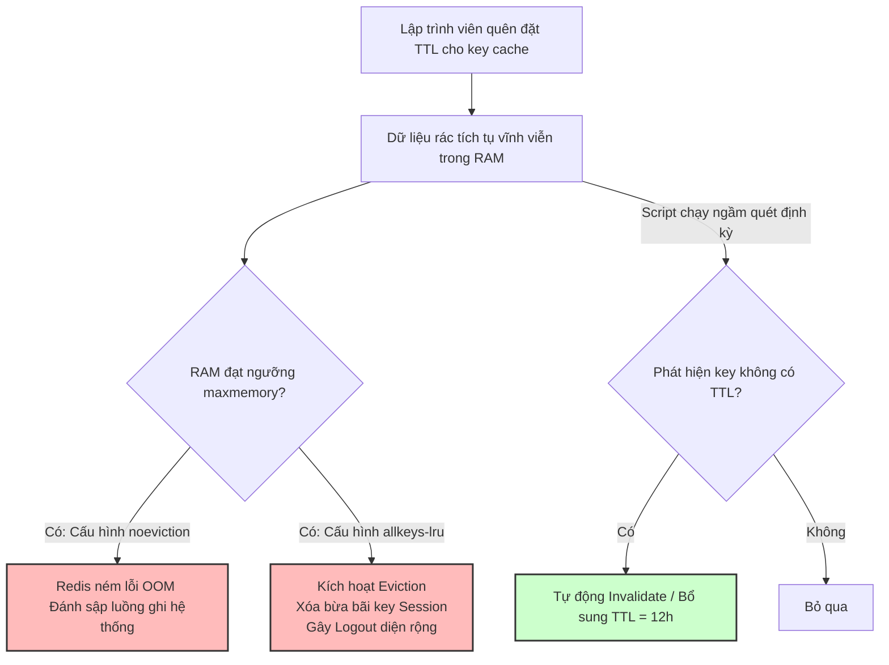

# Key không có TTL gây hậu quả gì?

## ⚡ Tóm tắt ngắn (30s)
* **Bản chất**: Khi một Key được tạo ra trong Redis mà không được gán thời gian hết hạn (**TTL - Time To Live**), nó sẽ tồn tại vĩnh viễn trong bộ nhớ RAM cho đến khi bị xóa thủ công hoặc bị ép xóa do tràn bộ nhớ (Eviction). Đây chính là nguyên nhân hàng đầu gây ra hiện tượng rò rỉ bộ nhớ (**Memory Leak**) trong Redis, làm lãng phí tài nguyên RAM cực kỳ đắt đỏ và đe dọa sự sống còn của toàn bộ hệ thống.
* **Thảm họa thực chiến được giải quyết**:
  1. **Tràn RAM & Đội chi phí vận hành (Cloud Cost Explosion)**: Dung lượng bộ nhớ phình to không giới hạn theo thời gian (từ 2GB lên 64GB), buộc doanh nghiệp phải nâng cấp gói Redis đắt tiền trên Cloud một cách vô ích.
  2. **Xóa nhầm dữ liệu cốt lõi do Eviction**: Khi RAM đầy, Redis kích hoạt chính sách xóa key (`allkeys-lru`). Key của dữ liệu quan trọng không có TTL bị xóa nhầm để nhường chỗ cho key rác mới, gây logout diện rộng hoặc mất cấu hình hệ thống.
* **Quyết định Senior**:
  1. **Cài đặt TTL mặc định bắt buộc**: Luôn luôn cấu hình một thời gian sống mặc định (ví dụ: 12 - 24 giờ) cho tất cả các key cache nghiệp vụ thông thường.
  2. **Quét tìm Key mồ côi ngầm định kỳ**: Viết script chạy ngầm (hoặc Jenkins Job) quét file RDB hoặc dùng lệnh `SCAN` để phát hiện và tự động bổ sung TTL/xóa bỏ các key không có TTL trên Production.
  3. **Tách biệt cụm vật lý**: Dữ liệu bắt buộc lưu vĩnh viễn (như Session đăng nhập, Distributed Lock, Queue) phải nằm ở cụm Redis riêng biệt có chính sách `noeviction`. Dữ liệu cache phụ phải nằm ở cụm có chính sách `volatile-lru` hoặc `allkeys-lru`.

---

## 🔍 Chi tiết bản chất thực chiến: Hậu quả & Kịch bản rò rỉ bộ nhớ

### 1. Hậu quả 1: Tràn RAM và Lỗi OOM (Out Of Memory)
Trong các ứng dụng High-throughput, số lượng thực thể mới (ví dụ: ID đơn hàng, ID session, IP truy cập) tăng lên hàng triệu mỗi ngày.
* Nếu lưu cache các thực thể này với key dạng `app:order:info:{id}` mà quên đặt TTL.
* Sau vài tháng, số lượng key mồ côi này tích tụ lên tới hàng chục triệu dòng, chiếm dụng toàn bộ RAM vật lý. Redis sẽ rơi vào trạng thái nghẽn và ném lỗi `OOM command not allowed` nếu policy là `noeviction`, đánh sập hoàn toàn luồng ghi của hệ thống.

---

### 2. Hậu quả 2: Làm chậm tốc độ Backup và Đồng bộ hóa (Replication)
* Redis sao lưu dữ liệu bằng cách fork luồng phụ ghi file RDB xuống đĩa cứng hoặc đồng bộ dữ liệu qua mạng sang các node Slave (Read Replica).
* Khi bộ nhớ chứa hàng triệu key rác không có TTL:
  * File RDB phình to làm tốc độ ghi đĩa bị chậm, tăng CPU đứt kết nối.
  * Tốc độ đồng bộ qua mạng nội bộ bị nghẽn băng thông, tăng nguy cơ mất nhất quán dữ liệu giữa node Master và Slave khi có sự cố mạng xảy ra (Split-brain).

---

### 3. Hậu quả 3: Rủi ro rò rỉ thông tin bảo mật (Stale Security Tokens)
* Các key lưu trữ mã OTP, token liên kết thanh toán tạm thời hoặc session đăng nhập nếu không cấu hình TTL sẽ tồn tại vĩnh viễn. Nếu hacker có quyền truy cập đọc Redis (qua lỗi SSRF hoặc cấu hình Redis không mật khẩu), chúng dễ dàng đánh cắp các thông tin nhạy cảm đã hết hạn sử dụng từ lâu nhưng vẫn còn nằm nguyên vẹn trong RAM.

---

## 🎨 Sơ đồ trực quan (Hệ quả đầy RAM & Cơ chế Quét rác tự động)



---

## 💻 Code thực chiến: Script Quét an toàn và bổ sung TTL cho Key mồ côi

Tuyệt đối không sử dụng lệnh `KEYS *` trên production vì lệnh này có độ phức tạp O(N) và chạy đơn luồng sẽ làm treo cứng Redis. Bắt buộc phải sử dụng lệnh `SCAN` để duyệt qua từng cụm key nhỏ.

### Script Java chạy định kỳ (Scheduled Job) quét tìm key không có TTL
```java
import lombok.RequiredArgsConstructor;
import lombok.extern.slf4j.Slf4j;
import org.springframework.data.redis.core.Cursor;
import org.springframework.data.redis.core.RedisCallback;
import org.springframework.data.redis.core.RedisTemplate;
import org.springframework.data.redis.core.ScanOptions;
import org.springframework.scheduling.annotation.Scheduled;
import org.springframework.stereotype.Service;

import java.util.concurrent.TimeUnit;

@Slf4j
@Service
@RequiredArgsConstructor
public class RedisGarbageCollector {

    private final RedisTemplate<String, Object> redisTemplate;
    
    private static final String KEY_PATTERN = "app:*"; // Quét các key có prefix của app
    private static final long DEFAULT_TTL_SECONDS = 43200; // Bổ sung TTL 12 giờ cho key mồ côi

    // Quét dọn bộ nhớ lúc 2h00 sáng mỗi ngày
    @Scheduled(cron = "0 0 2 * * ?")
    public void scanAndFixOrphanedKeys() {
        log.info("🧹 Bắt đầu tiến trình quét dọn Key không có TTL trên Redis...");

        redisTemplate.execute((RedisCallback<Void>) connection -> {
            // Sử dụng SCAN với kích thước mỗi lô (batch size) = 1000 key để không làm nghẽn Redis
            ScanOptions options = ScanOptions.scanOptions()
                    .match(KEY_PATTERN)
                    .count(1000)
                    .build();

            try (Cursor<byte[]> cursor = connection.scan(options)) {
                long totalScanned = 0;
                long totalFixed = 0;

                while (cursor.hasNext()) {
                    byte[] keyBytes = cursor.next();
                    String key = new String(keyBytes);
                    totalScanned++;

                    // Kiểm tra TTL của key (Trả về -1 nếu key không có TTL)
                    Long ttl = connection.ttl(keyBytes);
                    
                    if (ttl != null && ttl == -1) {
                        // ✅ PHÁT HIỆN KEY MỒ CÔI: Tiến hành áp đặt TTL mặc định
                        connection.expire(keyBytes, DEFAULT_TTL_SECONDS);
                        totalFixed++;
                        log.warn("⚠️ Phát hiện key mồ côi không có TTL: {}. Đã bổ sung TTL = 12h!", key);
                    }

                    // Tránh làm nghẽn luồng Redis bằng cách nghỉ nhẹ nếu quét quá nhiều
                    if (totalScanned % 5000 == 0) {
                        try {
                            TimeUnit.MILLISECONDS.sleep(50);
                        } catch (InterruptedException e) {
                            Thread.currentThread().interrupt();
                        }
                    }
                }
                
                log.info("✅ Hoàn thành quét dọn! Đã quét: {} keys. Đã bổ sung TTL cho: {} keys.", 
                        totalScanned, totalFixed);
            } catch (Exception e) {
                log.error("🚨 Lỗi trong quá trình quét dọn Redis SCAN. Chi tiết: {}", e.getMessage());
            }
            return null;
        });
    }
}
```

---

## 📊 Bảng so sánh tác động của Key có TTL và Key không có TTL

| Tiêu chí | Cấu hình Key CÓ TTL (Đúng chuẩn) | Cấu hình Key KHÔNG TTL (Lỗi logic) |
| :--- | :--- | :--- |
| **Tiêu thụ tài nguyên RAM** | Được kiểm soát, tự động giải phóng bộ nhớ khi hết hạn. | Phình to vô hạn theo thời gian (Memory Leak). |
| **Rủi ro sập hệ thống (OOM)** | Cực kỳ thấp. | Rất cao (Khi đạt giới hạn maxmemory). |
| **Hiệu năng sao lưu (RDB/AOF)** | Siêu tốc, file backup dung lượng gọn nhẹ. | Chậm chạp, file cồng kềnh, nghẽn I/O mạng. |
| **Độ chính xác dữ liệu** | Đảm bảo tính nhất quán (Dữ liệu cũ tự động biến mất). | Dữ liệu cũ rác tồn tại vĩnh viễn, gây lệch dữ liệu lâu dài. |
| **Mức độ an toàn bảo mật** | Cao (Tự hủy token/OTP sau vài phút). | Kém an toàn (OTP rác còn nguyên vẹn trong RAM). |

---

## ⚠️ Common Gotchas & Questions follow-up

### 1. Cạm bẫy "Active Expired Key Storm (Bão dọn rác đè bẹp CPU Redis Node)"
* **Vấn đề**: Để dọn dẹp các key hết hạn, Redis chạy một tiến trình ngầm quét ngẫu nhiên các key có TTL để xóa (Active Expiring). Nếu bạn đặt **trùng khít thời gian hết hạn** cho hàng triệu key cùng lúc (ví dụ: TTL = đúng 1 tiếng và nạp đồng loạt 10 triệu key). Đúng 1 tiếng sau, tiến trình Active Expiring hoạt động hết công suất để xóa key. CPU của Redis Node Master sẽ lập tức tăng vọt lên 100% để dọn rác, làm nghẽn toàn bộ kết nối đọc ghi thông thường.
* **Giải pháp khắc phục**: Bắt buộc áp dụng **Jitter** cộng thêm số giây ngẫu nhiên vào TTL để phân tán thời điểm hết hạn của các key, tránh tạo ra bão dọn rác tập trung CPU.

### 2. Câu hỏi đào sâu từ interviewer
* **Q: Làm sao biết một key không có TTL do lập trình viên quên đặt, hay do lập trình viên cố tình cấu hình lưu trữ vĩnh viễn (Persist)?**
  * *Trả lời*:
    * Ta cần rà soát qua quy chuẩn đặt tên key (**Naming Convention**):
      * Các key lưu dữ liệu cache tạm thời phải bắt buộc chứa từ khóa `cache` hoặc `temp` (ví dụ: `app:cache:product:123`).
      * Các key lưu trữ vĩnh viễn phải chứa từ khóa `persist` hoặc `store` (ví dụ: `app:store:session:token_abc`).
    * Nếu phát hiện key cache chứa `cache` mà TTL = -1, đó chắc chắn là lỗi code rò rỉ RAM của lập trình viên và cần áp dụng script bổ sung TTL ngay.
