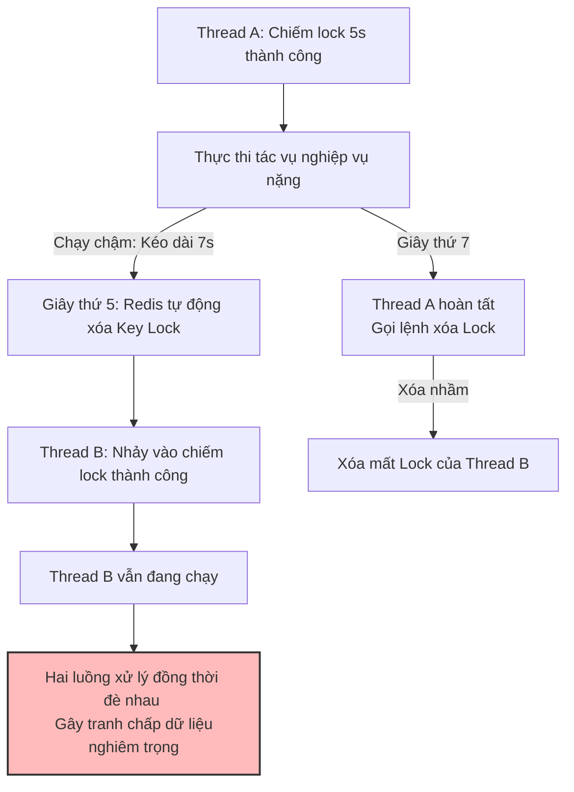
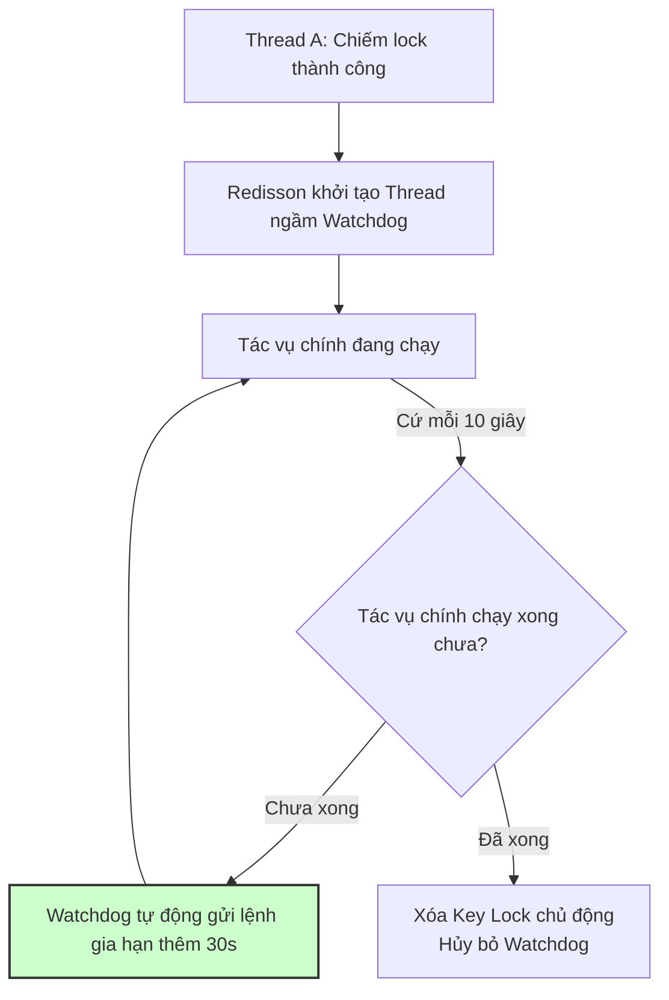

# Distributed lock bằng Redis bị lỗi có thể gây vấn đề gì?

## ⚡ Tóm tắt ngắn (30s)
* **Bản chất**: **Distributed Lock** (Khóa phân tán) bằng Redis được sử dụng để đảm bảo tính duy nhất của một tiến trình xử lý trong môi trường nhiều Instance chạy song song. Khi cơ chế khóa phân tán bị lỗi (do mất kết nối mạng, Master node bị sập trước khi đồng bộ sang Slave, hoặc cấu hình sai thời gian sống của khóa), hệ thống sẽ gặp các thảm họa nghiêm trọng: **Race Condition diện rộng (Tranh chấp dữ liệu)** hoặc **Deadlock (Đóng băng nghiệp vụ)**.
* **Thảm họa thực chiến được giải quyết**:
  1. **Thanh toán trùng lặp (Double Payment)**: Khách hàng click mua hàng nhanh 2 lần. Do khóa phân tán bị lỗi giải phóng sớm, 2 instance cùng chạy luồng thanh toán đồng thời, trừ tiền khách hàng 2 lần cho 1 đơn hàng.
  2. **Bán vượt số lượng kho (Over-selling)**: Trong Flash Sale, số lượng hàng tồn kho bị trừ âm do khóa phân tán bị mất tác dụng, dẫn tới bán vượt quá số lượng hàng thực tế có trong kho.
* **Quyết định Senior**:
  1. **Tuyệt đối không tự viết Lock bằng SETNX nghiệp dư**: Bắt buộc sử dụng các thư viện chuẩn hóa như **Redisson** (Java) có cơ chế tự động gia hạn khóa (**Watchdog**) để ngăn chặn khóa bị giải phóng sớm khi tác vụ chưa hoàn tất.
  2. **Áp dụng thuật toán Redlock**: Chiếm lock đồng thời trên cụm gồm tối thiểu 3 Node Redis độc lập để chống rủi ro mất lock khi Node Master bị sập vật lý.
  3. **Rào chắn cuối cùng tại Database (Defensive DB Design)**: Luôn coi Distributed Lock là rào chắn lớp ngoài. Tầng Database bắt buộc phải sử dụng **Unique Constraint (Index Unique)** hoặc **Optimistic Locking (@Version)** để làm chốt chặn cuối cùng chặn đứng trùng lặp dữ liệu.

---

## 🔍 Chi tiết bản chất thực chiến: 2 Thảm họa Lỗi Khóa Phân Tán

### 1. Thảm họa 1: Khóa bị giải phóng sớm trước khi xử lý xong (Trừ tiền trùng lặp)
* **Kịch bản lỗi**:
  * Lập trình viên chiếm lock với thời gian sống (Lease Time) = 5 giây.
  * Do hệ thống bị Garbage Collection dừng luồng (Stop-The-World) hoặc Database phản hồi chậm bất thường, luồng xử lý của Thread A kéo dài tới 7 giây.
  * Đúng giây thứ 5, Redis tự động xóa key lock.
  * Thread B (của Instance 2) nhảy vào thấy lock trống liền chiếm lock thành công và thực hiện thanh toán.
  * Giây thứ 7, Thread A chạy xong, gọi lệnh xóa lock (vô tình xóa nhầm lock của Thread B đang giữ).
* **Hậu quả**: Hai luồng chạy song song đồng thời đè lên nhau, phá vỡ hoàn toàn nguyên lý độc quyền truy cập.

---

### 2. Thảm họa 2: Mất Lock do Master Crash (Lệch dữ liệu khi Failover)
* **Kịch bản lỗi**: Do Redis Replication hoạt động theo cơ chế **bất đồng bộ (asynchronous replication)**:
  * Thread A gửi lệnh chiếm lock lên Redis Master thành công.
  * Redis Master chưa kịp đồng bộ key này sang Node Slave thì bị sập nguồn vật lý.
  * Cụm Sentinel/Cluster tự động bầu chọn Node Slave lên làm Master mới.
  * Do Node Master mới này hoàn toàn không có thông tin về key lock của Thread A, Thread B nhảy vào chiếm lock thành công trên Master mới.
* **Hậu quả**: Hai client cùng sở hữu một lock tại cùng một thời điểm trong hệ thống phân tán!

---

## 🎨 Sơ đồ trực quan (Thảm họa giải phóng khóa sớm & Cơ chế Watchdog giải cứu)

### 1. Thảm họa khi Lock bị giải phóng sớm


### 2. Cơ chế Watchdog gia hạn tự động của Redisson


---

## 💻 Code thực chiến: Sử dụng Redisson Lock kết hợp Bảo vệ Database

Dưới đây là cách triển khai Distributed Lock chuẩn Enterprise sử dụng Redisson kết hợp rào chắn Database bằng Unique Constraint để chống thanh toán trùng lặp.

### 1. Thiết kế Database phòng ngự chiều sâu (Unique Index)
```sql
CREATE TABLE payments (
    id VARCHAR(36) PRIMARY KEY,
    order_id VARCHAR(36) NOT NULL,
    amount DECIMAL(10,2) NOT NULL,
    status VARCHAR(20) NOT NULL,
    -- ✅ CHỐT CHẶN CUỐI CÙNG: Mỗi đơn hàng chỉ được phép có duy nhất 1 bản ghi thanh toán thành công
    CONSTRAINT unique_order_payment UNIQUE (order_id)
);
```

### 2. Triển khai Service sử dụng Redisson Lock & Cơ chế Thử lại an toàn
```java
import lombok.RequiredArgsConstructor;
import lombok.extern.slf4j.Slf4j;
import org.redisson.api.RLock;
import org.redisson.api.RedissonClient;
import org.springframework.dao.DataIntegrityViolationException;
import org.springframework.stereotype.Service;

import java.util.concurrent.TimeUnit;

@Slf4j
@Service
@RequiredArgsConstructor
public class PaymentProcessingService {

    private final RedissonClient redissonClient;
    private final PaymentRepository paymentRepository;

    private static final String LOCK_PREFIX = "lock:payment:order:";

    public void processPayment(String orderId, double amount) {
        String lockKey = LOCK_PREFIX + orderId;
        RLock lock = redissonClient.getLock(lockKey);

        try {
            // ✅ SỬ DỤNG WATCHDOG: Chỉ định thời gian chờ lấy lock (WaitTime) = 5s.
            // Tuyệt đối không truyền tham số LeaseTime vào để kích hoạt Watchdog tự gia hạn khóa!
            log.info("🔒 Đang cố gắng chiếm Lock cho đơn hàng: {}", orderId);
            boolean isLocked = lock.tryLock(5, TimeUnit.SECONDS);

            if (!isLocked) {
                log.warn("🚨 Thất bại: Không thể lấy Lock cho đơn hàng {}, request đồng thời bị chặn!", orderId);
                throw new ProcessingException("Giao dịch đang được xử lý ở luồng khác. Vui lòng không click liên tục!");
            }

            try {
                log.info("🔓 Chiếm Lock thành công! Đang thực thi thanh toán cho đơn hàng {}", orderId);
                
                // Double check dữ liệu trước khi xử lý
                if (paymentRepository.existsByOrderId(orderId)) {
                    log.warn("⚠️ Giao dịch đã tồn tại trước đó. Huỷ bỏ luồng thanh toán!");
                    return;
                }

                // Thực thi ghi DB
                PaymentEntity payment = new PaymentEntity(orderId, amount, "SUCCESS");
                paymentRepository.save(payment);
                
                log.info("✅ Giao dịch thanh toán hoàn tất thành công cho đơn hàng {}", orderId);

            } catch (DataIntegrityViolationException e) {
                // ✅ RÀO CHẮN CUỐI CÙNG: Bắt lỗi trùng lặp Index Unique dưới DB nếu Lock bị rò rỉ
                log.error("🚨 THẢM HỌA LỌT LOCK: Database chặn đứng trùng lặp thành công bằng Unique Constraint! Order: {}", orderId);
                throw new DuplicateTransactionException("Giao dịch đã được thanh toán thành công!");
            } finally {
                // Giải phóng lock an toàn, chỉ giải phóng nếu luồng hiện tại đang nắm giữ lock
                if (lock.isHeldByCurrentThread()) {
                    lock.unlock();
                    log.info("🔓 Đã giải phóng Lock cho đơn hàng {}", orderId);
                }
            }

        } catch (InterruptedException e) {
            Thread.currentThread().interrupt();
            throw new ProcessingException("Hệ thống bị treo luồng!");
        }
    }
}
```

---

## 📊 Bảng so sánh các phương án thiết kế Khóa Phân Tán

| Tiêu chí | Tự viết bằng SETNX (RedisTemplate) | Thư viện Redisson (Chuẩn Senior) | Thuật toán Redlock (Multi-Node) |
| :--- | :--- | :--- | :--- |
| **Gia hạn khóa tự động** | Không có (Dễ gây lỗi giải phóng sớm khi tác vụ chạy chậm). | **Có (Cơ chế Watchdog)** tự động gia hạn an toàn. | Có Watchdog. |
| **Tính sẵn sàng cao (HA)** | Thấp (Dễ mất khóa khi Master Node bị sập vật lý). | Thấp (Nếu dùng single-master config). | **Cực kỳ cao** (Chống chịu sập node Master vật lý). |
| **Độ trễ hệ thống (Latency)** | Thấp (< 2ms). | Thấp (< 3ms). | Cao hơn (Phải kết nối mạng chiếm lock trên nhiều node Redis). |
| **Độ phức tạp code** | Rất thấp. | Thấp (Spring Boot tích hợp dễ dàng). | Rất cao (Phải cấu hình nhiều client kết nối nhiều node). |

---

## ⚠️ Common Gotchas & Questions follow-up

### 1. Cạm bẫy "Xóa nhầm khóa của Thread khác (Unsafe Unlock)"
* **Vấn đề**: Lập trình viên gọi lệnh giải phóng khóa đơn thuần bằng cách xóa key: `redisTemplate.delete(lockKey)`. Nếu Thread A chạy quá giờ, Redis tự xóa khóa và cấp cho Thread B. Lúc này Thread A chạy xong gọi lệnh `delete(lockKey)` sẽ xóa mất khóa của Thread B, khiến Thread C nhảy vào chiếm khóa tiếp, gây ra chuỗi sụp đổ domino.
* **Giải pháp khắc phục**: Luôn sử dụng kịch bản Lua Script để kiểm tra tính sở hữu trước khi xóa. Chỉ xóa nếu giá trị lưu trong khóa trùng khớp với mã nhận diện luồng (Thread UUID) của chính mình:
  ```lua
  -- LUA script giải phóng khóa an toàn của Redisson
  if redis.call('get', KEYS[1]) == ARGV[1] then
      return redis.call('del', KEYS[1])
  else
      return 0
  end
  ```

### 2. Câu hỏi đào sâu từ interviewer
* **Q: Nếu cụm Redis bị mất điện vật lý hoàn toàn và khởi động lại, các khóa phân tán biến mất gây rò rỉ dữ liệu. Làm sao xử lý?**
  * *Trả lời*:
    * Cấu hình Redis bật đồng bộ ghi đĩa cứng khắt khe: **AOF (Append Only File) với cấu hình `appendfsync always`** (ghi đĩa sau mỗi câu lệnh ghi).
    * Tuy nhiên, cấu hình này làm giảm hiệu năng ghi của Redis nghiêm trọng.
    * Giải pháp tối ưu: Thiết kế các API có tính chất **Idempotency** (Tính an toàn khi gọi lại nhiều lần). Dù khóa bị mất, API gọi lại lần 2 vẫn trả về kết quả thành công mà không sinh ra dữ liệu thừa dưới Database nhờ cơ chế kiểm tra token giao dịch (Transaction Token).
