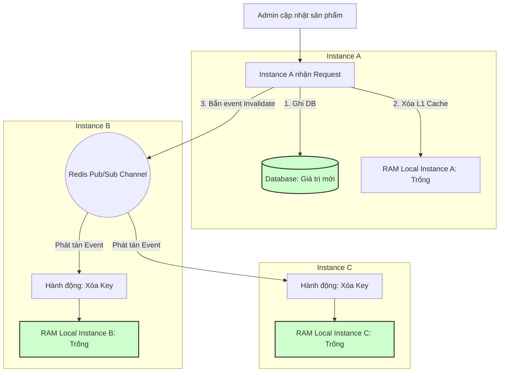

# Cache local trên nhiều instance gây inconsistency như thế nào?

## ⚡ Tóm tắt ngắn (30s)
* **Bản chất**: Khi hệ thống được triển khai mở rộng theo chiều ngang (Scale-out) với nhiều Instance chạy song song đằng sau Load Balancer, việc sử dụng **Local Cache (như Caffeine, Ehcache)** trực tiếp trên bộ nhớ RAM của JVM mỗi instance sẽ tạo ra các **ốc đảo dữ liệu biệt lập**. Khi dữ liệu được cập nhật trên Instance A, Instance A xóa local cache của mình và ghi DB. Tuy nhiên, các Instance B và C hoàn toàn "mù tịt" về sự kiện này, vẫn giữ nguyên và phục vụ dữ liệu cũ trong RAM của mình cho người dùng, gây ra sự không nhất quán dữ liệu (**Data Inconsistency**) nghiêm trọng.
* **Thảm họa thực chiến được giải quyết**:
  1. **Nhập nhèm hiển thị (Flip-flop UI)**: Người dùng F5 trang web liên tục: lượt tải 1 (chạm Instance A) thấy giá sản phẩm đã giảm 50%, lượt tải 2 (chạm Instance B) lại thấy giá gốc 100%, tạo ra trải nghiệm tồi tệ và khiếu nại khách hàng.
  2. **Vi phạm nghiệp vụ (Business Rule Breach)**: Admin cấu hình tắt một tính năng hệ thống (Feature Flag) khẩn cấp do phát hiện lỗi bảo mật, nhưng các instance cũ vẫn giữ cache "bật" trong RAM, tiếp tục gây rò rỉ dữ liệu.
* **Quyết định Senior**:
  1. **Đồng bộ hóa bằng Redis Pub/Sub (Near Cache Pattern)**: Khi có lệnh update/xóa dữ liệu, bắn một event "Invalidate Key" lên Redis Channel. Tất cả các Instance khác đang đăng ký lắng nghe channel này lập tức tự động xóa key local của mình để đồng bộ.
  2. **Thiết lập TTL ngắn hạn khắt khe**: Luôn đặt TTL cho Local Cache cực kỳ ngắn (ví dụ: `10 giây - 60 giây`) để khoanh vùng tối đa thời gian lệch dữ liệu trong phạm vi chịu đựng của nghiệp vụ.
  3. **Định tuyến Sticky Session**: Cấu hình Load Balancer định tuyến người dùng có cùng Session ID/IP vào duy nhất 1 Instance cố định trong suốt phiên giao dịch để đảm bảo "Read-your-own-writes consistency" (Đọc được chính xác những gì mình vừa ghi).

---

## 🔍 Chi tiết bản chất thực chiến: Sự cố "Ốc đảo bộ nhớ" khi Scale-out

Khi chạy độc lập, Local Cache hoạt động hoàn hảo. Nhưng trong hệ thống phân tán High-availability, thách thức nảy sinh:

```
                  [ LOAD BALANCER ]
                 /        |        \
                v         v         v
        [Instance A]  [Instance B]  [Instance C]
        (RAM: v2)     (RAM: v1)     (RAM: v1)
            |             |             |
            v             +-------------+
        [DATABASE] (DB Value: v2)
```

* **Bước 1**: Khách hàng gọi API cập nhật sản phẩm lên Instance A.
* **Bước 2**: Instance A ghi Database giá trị mới (`v2`), đồng thời xóa local cache của mình thành công.
* **Bước 3**: Khách hàng khác gửi request đọc sản phẩm, Load Balancer điều hướng vào Instance B. Instance B đọc RAM cục bộ của nó vẫn thấy giá trị cũ (`v1`), trả về ngay lập tức cho client.
* **Kết quả**: Hệ thống rơi vào trạng thái mất nhất quán dữ liệu nghiêm trọng kéo dài cho đến khi TTL của Instance B và C tự động hết hạn.

---

## 🎨 Sơ đồ trực quan (Cơ chế đồng bộ Invalidate Cache bằng Redis Pub/Sub)



---

## 💻 Code thực chiến: Đồng bộ hóa Local Cache bằng Redis Pub/Sub trong Spring Boot

Dưới đây là thiết kế Near Cache hoàn chỉnh: Kết hợp tốc độ siêu tốc của **Caffeine Local Cache** và khả năng đồng bộ thời gian thực của **Redis Pub/Sub**.

### 1. Cấu hình lắng nghe Redis Pub/Sub Channel
```java
import org.springframework.context.annotation.Bean;
import org.springframework.context.annotation.Configuration;
import org.springframework.data.redis.connection.RedisConnectionFactory;
import org.springframework.data.redis.listener.ChannelTopic;
import org.springframework.data.redis.listener.RedisMessageListenerContainer;
import org.springframework.data.redis.listener.adapter.MessageListenerAdapter;

@Configuration
public class RedisPubSubConfig {

    private static final String CHANNEL_NAME = "cache:invalidate:topic";

    @Bean
    public ChannelTopic topic() {
        return new ChannelTopic(CHANNEL_NAME);
    }

    // Đăng ký Listener Container lắng nghe sự kiện xóa cache từ Redis
    @Bean
    public RedisMessageListenerContainer redisContainer(RedisConnectionFactory connectionFactory,
                                                        MessageListenerAdapter listenerAdapter) {
        RedisMessageListenerContainer container = new RedisMessageListenerContainer();
        container.setConnectionFactory(connectionFactory);
        container.addMessageListener(listenerAdapter, topic());
        return container;
    }

    @Bean
    public MessageListenerAdapter listenerAdapter(CacheInvalidationReceiver receiver) {
        return new MessageListenerAdapter(receiver, "receiveMessage");
    }
}
```

### 2. Bộ thu nhận tin nhắn (Receiver) xóa Local Cache của Instance hiện tại
```java
import com.github.benmanes.caffeine.cache.Cache;
import lombok.RequiredArgsConstructor;
import lombok.extern.slf4j.Slf4j;
import org.springframework.stereotype.Component;

@Slf4j
@Component
@RequiredArgsConstructor
public class CacheInvalidationReceiver {

    private final Cache<String, Object> caffeineCache; // Injection Caffeine Cache chung của ứng dụng

    /**
     * ✅ NHẬN EVENT XÓA LOCAL CACHE TỪ REDIS PUB/SUB
     */
    public void receiveMessage(String message) {
        log.info("🔔 Nhận tín hiệu Invalidate Cache! Tiến hành xóa Key Local: {}", message);
        
        // Tiến hành xóa key khỏi RAM local của instance hiện tại
        caffeineCache.invalidate(message);
        log.info("✅ Đã dọn dẹp Local RAM cho Key: {} thành công!", message);
    }
}
```

### 3. Service nghiệp vụ: Cập nhật dữ liệu & Bắn tín hiệu Invalidate đồng bộ
```java
import com.github.benmanes.caffeine.cache.Cache;
import lombok.RequiredArgsConstructor;
import lombok.extern.slf4j.Slf4j;
import org.springframework.data.redis.core.RedisTemplate;
import org.springframework.stereotype.Service;
import org.springframework.transaction.annotation.Transactional;

@Slf4j
@Service
@RequiredArgsConstructor
public class ProductService {

    private final ProductRepository productRepository;
    private final Cache<String, Object> caffeineCache;
    private final RedisTemplate<String, Object> redisTemplate;

    private static final String PUB_SUB_TOPIC = "cache:invalidate:topic";

    public ProductDto getProduct(String productId) {
        // Đọc từ Local RAM cực nhanh (<0.1ms)
        ProductDto cached = (ProductDto) caffeineCache.getIfPresent(productId);
        if (cached != null) {
            return cached;
        }

        // Cache Miss
        ProductEntity entity = productRepository.findById(productId)
                .orElseThrow(() -> new ResourceNotFoundException("Sản phẩm không tồn tại"));
        ProductDto dto = new ProductDto(entity.getId(), entity.getName(), entity.getPrice());
        
        caffeineCache.put(productId, dto);
        return dto;
    }

    @Transactional
    public void updateProduct(String productId, double price) {
        // 1. Ghi DB
        ProductEntity entity = productRepository.findById(productId)
                .orElseThrow(() -> new ResourceNotFoundException("Sản phẩm không tồn tại"));
        entity.setPrice(price);
        productRepository.save(entity);

        // 2. Xóa Local RAM của chính mình
        caffeineCache.invalidate(productId);

        // 3. ✅ BẮN TIN HIỆU ĐỒNG BỘ CHO CÁC INSTANCE KHÁC QUA REDIS PUB/SUB
        try {
            redisTemplate.convertAndSend(PUB_SUB_TOPIC, productId);
            log.info("📣 Đã phát tín hiệu đồng bộ xóa key {} lên cụm!", productId);
        } catch (Exception e) {
            log.error("🚨 Lỗi bắn tin hiệu đồng bộ cache: {}", e.getMessage());
        }
    }
}
```

---

## 📊 Bảng so sánh Local Cache và Distributed Cache (Redis)

| Tiêu chí so sánh | Local Cache (Caffeine/RAM Cục bộ) | Distributed Cache (Redis tập trung) |
| :--- | :--- | :--- |
| **Tốc độ truy xuất (Latency)** | **Siêu tốc cực hạn (< 0.1ms)** (Đọc trực tiếp trên RAM ứng dụng). | Khá nhanh (< 2ms - 10ms) (Tốn thêm chi phí I/O mạng). |
| **Độ nhất quán dữ liệu** | **Kém** (Dễ bị ốc đảo dữ liệu lệch pha giữa các node). | **Cực cao** (Tất cả instance cùng nhìn vào 1 nguồn duy nhất). |
| **Rủi ro sập cụm (HA)** | Không có (Sập instance nào chỉ ảnh hưởng RAM instance đó). | Có (Redis sập làm ảnh hưởng toàn bộ Web Services). |
| **Băng thông mạng nội bộ** | **Tiết kiệm tuyệt đối** (Không tốn Network I/O). | Tốn Network I/O truyền tải JSON giữa Web và Redis. |

---

## ⚠️ Common Gotchas & Questions follow-up

### 1. Cạm bẫy "Mất tin nhắn đồng bộ do Network Partition (Pub/Sub Delivery Guarantee)"
* **Vấn đề**: Redis Pub/Sub hoạt động theo cơ chế **"Fire and Forget"** (Bắn tin và quên, không lưu trữ lại tin nhắn). Khi Instance B bị mất kết nối mạng nội bộ tạm thời với Redis trong 5 giây. Đúng lúc đó Instance A bắn event Invalidate Cache. Do Instance B đang offline, nó bỏ lỡ event này hoàn toàn. Khi mạng phục hồi, Instance B vẫn tiếp tục giữ và phục vụ dữ liệu cũ trong suốt thời gian TTL còn lại.
* **Giải pháp khắc phục**: 
  1. Sử dụng **Redis Streams** hoặc **Kafka** thay thế cho Pub/Sub nếu hệ thống yêu cầu độ chính xác dữ liệu cực cao. Redis Streams lưu trữ tin nhắn có ID và cho phép các Consumer Group đọc lại các tin nhắn bị bỏ lỡ (offset-read).
  2. Bắt buộc đặt **TTL của Local Cache siêu ngắn** (ví dụ: tối đa 30 giây) để giới hạn tối đa thiệt hại lệch dữ liệu.

### 2. Câu hỏi đào sâu từ interviewer
* **Q: Near Cache Pattern là gì? Khi nào nên áp dụng nó?**
  * *Trả lời*:
    * Near Cache là mô hình kết hợp cả Local Cache (Lớp gần/L1) và Distributed Cache (Lớp xa/L2) như code ví dụ trên.
    * Ta chỉ áp dụng Near Cache cho các nghiệp vụ có **tỉ lệ Đọc cực kỳ vượt trội so với Ghi (Read-heavy, Write-rare)**, ví dụ: danh mục hệ thống, cấu hình quốc gia, thông tin cấu hình cổng thanh toán. Tuyệt đối không áp dụng Near Cache cho các dữ liệu thay đổi liên tục từng giây (như số dư ví, điểm tích lũy, số lượng hàng tồn kho) vì chi phí bắn event đồng bộ dọn rác RAM sẽ bóp nghẹt băng thông mạng của hệ thống.
