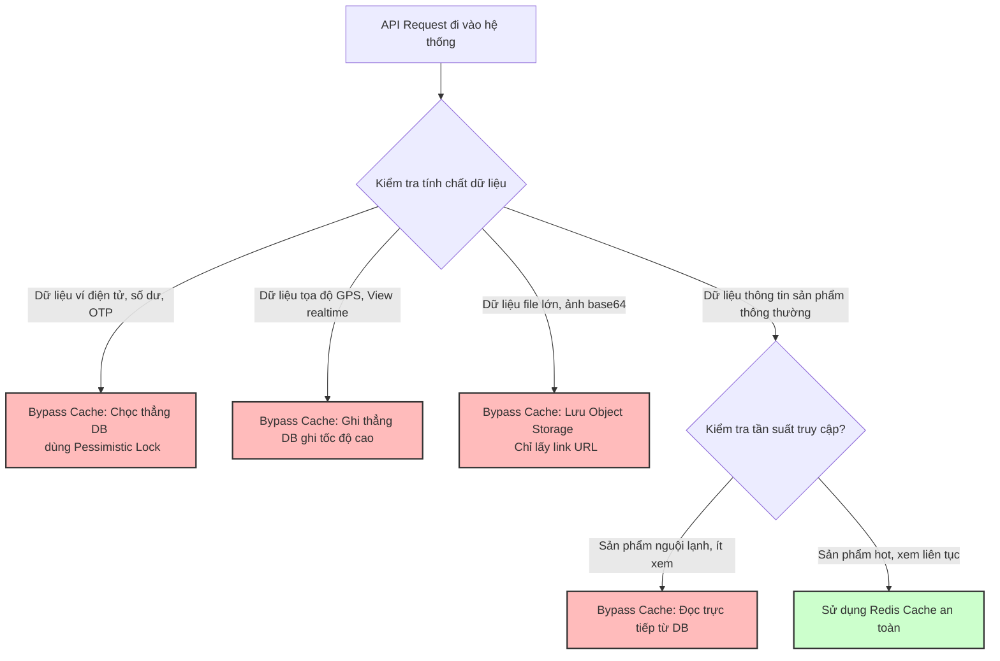

# Khi nào nên bypass cache?

## ⚡ Tóm tắt ngắn (30s)
* **Bản chất**: **Bypass Cache** (Bỏ qua Cache, truy cập trực tiếp Database) là một quyết định kiến trúc quan trọng khi hiệu năng đọc/ghi của Cache không bù đắp nổi chi phí duy trì tính nhất quán dữ liệu, hoặc khi tính chất dữ liệu không phù hợp lưu trữ tạm thời. Lạm dụng cache cho mọi loại dữ liệu là sai lầm phổ biến của Junior. Một Senior Engineer biết chính xác khi nào nói **KHÔNG** với cache để bảo vệ tính toàn vẹn hệ thống.
* **Thảm họa thực chiến được giải quyết**:
  1. **Lệch số dư ví điện tử (Financial Data Corrupt)**: Cố tình cache số dư ví tài chính của khách hàng để hiển thị nhanh. Khách hàng thực hiện nạp tiền/chuyển tiền liên tiếp nhưng số dư hiển thị không đổi do đọc cache stale, dẫn đến khiếu kiện pháp lý nghiêm trọng.
  2. **Tràn RAM do lưu trữ file cồng kềnh (Big Payload OOM)**: Cache các chuỗi mã hóa ảnh Base64 hoặc báo cáo phân tích nặng hàng chục MB vào Redis, trực tiếp bóp nghẹt RAM Redis chỉ sau vài giờ vận hành.
* **Quyết định Senior**:
  1. **Bypass 100% cho dữ liệu cần Strong Consistency (Nhất quán tuyệt đối)**: Số dư tài khoản, giao dịch ngân hàng, OTP bảo mật, trạng thái đơn đặt hàng nhạy cảm.
  2. **Bypass cho hệ thống ghi nhiều hơn đọc (Write-heavy / Real-time telemetry)**: Tọa độ GPS của tài xế xe công nghệ, số lượt view stream thời gian thực.
  3. **Bypass cho dữ liệu truy cập thấp (Long Tail / Cold Data)**: Các sản phẩm cũ, thông tin lưu trữ lịch sử từ nhiều năm trước rất hiếm khi được truy cập.

---

## 🔍 Chi tiết bản chất thực chiến: 4 Use Case bắt buộc Bypass Cache

Hãy rà soát kỹ 4 kịch bản nghiệp vụ sau để đưa ra quyết định Bypass Cache chuẩn xác:

```
[Có nên dùng Cache?]
        │
        ├─> Nhất quán tuyệt đối? (Tài chính, OTP) ──> KHÔNG! [Bypass Cache]
        │
        ├─> Ghi nhiều hơn đọc? (Tọa độ GPS, View) ───> KHÔNG! [Bypass Cache]
        │
        ├─> Payload quá lớn? (File, Ảnh Base64) ──────> KHÔNG! [Bypass Cache]
        │
        └─> Ít khi truy cập? (Dữ liệu cũ lịch sử) ────> KHÔNG! [Bypass Cache]
```

---

### 1. Dữ liệu cần tính Nhất quán mạnh (Strong Consistency)
* **Lý do**: Các nghiệp vụ liên quan đến tài chính, tiền tệ, số dư tài khoản ngân hàng, hoặc vé máy bay/vé xem phim còn lại yêu cầu dữ liệu tại mọi thời điểm phải chính xác 100%. Cache-Aside hay bất kỳ cơ chế đồng bộ nào cũng tồn tại độ trễ mạng (Network Latency) từ vài mili-giây đến vài giây. Khoảng trống trễ này đủ để gây ra lỗi nghiêm trọng (ví dụ: rút tiền vượt hạn mức, mua trùng ghế ngồi).
* **Giải pháp**: Bypass cache hoàn toàn cho luồng này, chọc thẳng Database chính sử dụng cơ chế **Pessimistic Locking (SELECT ... FOR UPDATE)** để khóa cứng dòng dữ liệu.

---

### 2. Dữ liệu thay đổi quá nhanh (High-Frequency Writes / Telemetry)
* **Lý do**: Nếu hệ thống nhận tọa độ GPS của 100.000 tài xế xe công nghệ cứ mỗi 2 giây gửi lên 1 lần. 
* Nếu cố tình ghi vào Redis Cache:
  * Số lượng lệnh ghi `SET` cực kỳ khủng khiếp làm quá tải CPU Redis.
  * Trong khi đó, khách hàng chỉ đọc tọa độ khi mở app tìm xe (tỉ lệ Đọc cực kỳ thấp so với Ghi). Việc ghi cache liên tục lúc này hoàn toàn vô nghĩa và lãng phí I/O mạng.
* **Giải pháp**: Ghi trực tiếp vào Time-Series Database hoặc bộ đệm RAM cục bộ siêu nhẹ trước khi flush xuống DB.

---

### 3. Dữ liệu có dung lượng Payload khổng lồ (Big Value / Large Strings)
* **Lý do**: Redis được thiết kế tối ưu cho hàng triệu key nhỏ gọn. Khi lưu trữ các file tài liệu lớn, báo cáo CSV nặng > 10MB hoặc chuỗi ảnh Base64:
  * Băng thông mạng nội bộ (Network Bandwidth) giữa Web Service và Redis sẽ bị chiếm dụng hết để truyền tải các gói dữ liệu khổng lồ này, làm nghẽn toàn bộ các lệnh đọc key nhỏ khác.
  * Tốc độ serialize/deserialize JSON của CPU Web Service bị kéo chậm lại đáng kể.
* **Giải pháp**: Lưu trữ file tĩnh trên **Object Storage (AWS S3 / Google Cloud Storage)** và sử dụng CDN để cache ở lớp rìa mạng. Dưới DB/Redis chỉ lưu duy nhất đường dẫn URL.

---

### 4. Dữ liệu đuôi dài (Long Tail Data / Low Cardinality)
* **Lý do**: Trong trang thương mại điện tử có 10 triệu sản phẩm, quy luật Pareto (80/20) chỉ ra rằng chỉ có 20% sản phẩm hot là được xem liên tục (Short Tail), 80% sản phẩm còn lại hầu như cả tháng mới có 1 lượt xem (Long Tail).
* Nếu nạp bừa bãi cả 80% sản phẩm nguội lạnh này vào Redis:
  * Redis sẽ cạn kiệt RAM cực nhanh, kích hoạt Eviction liên tục để xóa bớt key, vô tình xóa mất các sản phẩm hot đang đem lại doanh thu cao.
* **Giải pháp**: Chỉ bật `@Cacheable` cho các sản phẩm thuộc danh mục Hot, cấu hình Bypass cache hoàn toàn cho các sản phẩm cũ lịch sử.

---

## 🎨 Sơ đồ trực quan (Quy trình ra quyết định Bypass Cache ở Lớp API Gateway)



---

## 💻 Code thực chiến: Triển khai Dynamic Cache Bypassing linh hoạt

Trong thực tế, ta cần cơ chế linh hoạt: Cùng một API lấy thông tin sản phẩm, nhưng nếu có flag đặc biệt từ Front-end (hoặc vai trò Admin cần kiểm tra dữ liệu thật ngay lập tức dưới DB), hệ thống sẽ tự động bypass cache.

### Triển khai Custom CacheResolver để Bypass Cache động trong Spring Boot
```java
import lombok.RequiredArgsConstructor;
import lombok.extern.slf4j.Slf4j;
import org.springframework.cache.Cache;
import org.springframework.cache.interceptor.CacheOperationInvocationContext;
import org.springframework.cache.interceptor.SimpleCacheResolver;
import org.springframework.cache.support.NoOpCache;
import org.springframework.stereotype.Component;

import javax.servlet.http.HttpServletRequest;
import java.util.Collection;
import java.util.Collections;

@Slf4j
@Component
@RequiredArgsConstructor
public class DynamicCacheResolver extends SimpleCacheResolver {

    private final HttpServletRequest request;

    @Override
    public Collection<? extends Cache> resolveCaches(CacheOperationInvocationContext<?> context) {
        // ✅ KIỂM TRA ĐIỀU KIỆN BYPASS:
        // Nếu Request Header chứa "X-Bypass-Cache: true" hoặc Query Parameter "?refresh=true"
        String bypassHeader = request.getHeader("X-Bypass-Cache");
        String refreshParam = request.getParameter("refresh");

        if ("true".equalsIgnoreCase(bypassHeader) || "true".equalsIgnoreCase(refreshParam)) {
            log.warn("🔄 DYNAMIC BYPASS CACHE: Phát hiện cờ yêu cầu đọc dữ liệu thật từ DB! Bypass cache hoàn toàn.");
            
            // Trả về NoOpCache (Cache rỗng giả lập) để Spring cho phép code chạy thẳng xuống DB
            return Collections.singletonList(new NoOpCache(context.getOperation().getCacheNames().iterator().next()));
        }

        // Đi tiếp luồng cache Redis thông thường nếu không có cờ bypass
        return super.resolveCaches(context);
    }
}
```

### Sử dụng Custom CacheResolver trong Service nghiệp vụ
```java
import lombok.RequiredArgsConstructor;
import lombok.extern.slf4j.Slf4j;
import org.springframework.cache.annotation.Cacheable;
import org.springframework.stereotype.Service;

@Slf4j
@Service
@RequiredArgsConstructor
public class ProductShowcaseService {

    private final ProductRepository productRepository;

    // ✅ SỬ DỤNG CACHE RESOLVER TỰ ĐỊNH NGHĨA
    @Cacheable(value = "products", key = "#productId", cacheResolver = "dynamicCacheResolver")
    public ProductDto getProductDetails(String productId) {
        log.warn("🔎 [DB HIT] Đang truy vấn Database thật cho sản phẩm: {}", productId);
        
        ProductEntity entity = productRepository.findById(productId)
                .orElseThrow(() -> new ResourceNotFoundException("Sản phẩm không tồn tại"));
                
        return new ProductDto(entity.getId(), entity.getName(), entity.getPrice());
    }
}
```

---

## 📊 Bảng so sánh kịch bản nên Cache và kịch bản bắt buộc Bypass

| Đặc tính dữ liệu | Nên Cache sử dụng Redis | Bắt buộc phải Bypass Cache |
| :--- | :--- | :--- |
| **Tính nhất quán (Consistency)** | Chấp nhận **Eventual Consistency** (Trễ vài giây). | Đòi hỏi **Strong Consistency** (Giao dịch tài chính, OTP). |
| **Tần suất đọc/ghi (R/W Ratio)** | **Đọc nhiều vượt trội so với ghi** (Ví dụ: 99% đọc, 1% ghi). | **Ghi nhiều ngang ngửa hoặc hơn đọc** (Tọa độ GPS, cảm biến IoT). |
| **Kích thước bản ghi (Size)** | Nhỏ gọn (< 100KB per key). | Quá lớn (> 10MB per key, File ảnh, PDF). |
| **Tính chất phân phối traffic** | Phân phối tập trung (Hot data chiếm 80% traffic). | Phân phối đuôi dài rải rác (Long tail data ít khi gọi lại). |

---

## ⚠️ Common Gotchas & Questions follow-up

### 1. Cạm bẫy "Double DB Hit do lạm dụng Bypass Cache vô ý (Bypassing Storm)"
* **Vấn đề**: Bạn cung cấp tính năng Bypass Cache qua Header `X-Bypass-Cache: true` để phục vụ đội ngũ kiểm thử (QC) test dữ liệu mới dưới DB. Tuy nhiên, Front-end vô tình để mặc định cờ này là `true` trong file config của app production. Hàng vạn người dùng thật đồng loạt gửi request chứa cờ bypass này lên hệ thống. Kết quả là toàn bộ hệ thống cache bị phế võ vị hoàn toàn, Database nhận cơn bão tải trực tiếp và sụp đổ ngay lập tức.
* **Giải pháp khắc phục**: Trong code Custom CacheResolver, bắt buộc kiểm tra điều kiện quyền lực: Chỉ cho phép người dùng có Role Admin/Tester mới được phép kích hoạt tính năng bypass cache động, từ chối thẳng cờ bypass đối với người dùng phổ thông.

### 2. Câu hỏi đào sâu từ interviewer
* **Q: Nếu bypass cache cho các nghiệp vụ tài chính, làm sao xử lý khi Database Read Replica có độ trễ đồng bộ (Replication Lag)?**
  * *Trả lời*:
    * Khi bypass cache và truy cập DB đọc: Nếu DB đọc (Read Replica) bị trễ đồng bộ 1 giây so với DB ghi (Primary DB). Khách hàng vừa nạp tiền xong (ghi vào Primary DB), load lại trang (đọc từ Read Replica) vẫn thấy số dư cũ.
    * Giải pháp:
      1. Bắt buộc đọc dữ liệu số dư từ **Primary DB** (Master Node) đối với các màn hình hiển thị ví tiền, giao dịch nhạy cảm. Chỉ đọc từ Read Replica cho các tác vụ báo cáo lịch sử giao dịch cũ của tháng trước.
      2. Sử dụng cơ chế khóa phân tán Redisson Lock bảo vệ luồng đọc ghi để đảm bảo nhất quán.
