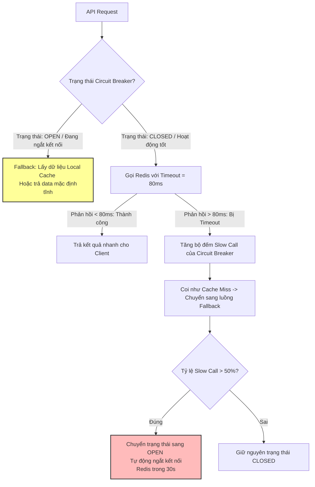

# Làm sao thiết kế fallback khi Redis chậm?

## ⚡ Tóm tắt ngắn (30s)
* **Bản chất**: Hiện tượng Redis chạy chậm (Latency tăng vọt lên hàng trăm mili-giây hoặc hàng giây do nghẽn I/O mạng, CPU Redis Master chạm ngưỡng 100%, hoặc đang bị khóa do các câu lệnh block như `KEYS *`) là sự cố **nguy hiểm hơn nhiều so với việc Redis sập vật lý hoàn toàn**. Khi sập, driver ném lỗi ngay (Fail-fast). Nhưng khi chậm, driver sẽ treo cứng luồng xử lý chính để chờ đợi. Thiết kế fallback chuẩn Senior đòi hỏi cơ chế **Fast-fail (Cắt lỗi nhanh)** kết hợp **Hạ cấp dịch vụ an toàn (Graceful Degradation)**.
* **Thảm họa thực chiến được giải quyết**:
  1. **Sập đổ toàn bộ hệ thống Web (Thread Pool Exhaustion)**: Hàng ngàn luồng HTTP Tomcat bị block để đợi Redis phản hồi quá hạn, làm cạn kiệt tài nguyên xử lý của Web server trong tích tắc.
  2. **Database Overwhelm (DB bị kéo sập theo)**: Khi phát hiện Redis chậm, hệ thống tự động bypass hàng vạn request xuống DB mà không giới hạn, gây quá tải kéo sập luôn cơ sở dữ liệu chính.
* **Quyết định Senior**:
  1. **Tuning Timeout khắt khe & Cắt lỗi nhanh (Fast-fail)**: Cấu hình `Read Timeout` với Redis cực ngắn (ví dụ: `50ms - 100ms`). Quá thời gian này, coi như cache miss lập tức và giải phóng thread nghiệp vụ.
  2. **Bọc Redis gọi qua Circuit Breaker (Resilience4j)**: Sử dụng cấu hình `SlowCallRate` của Circuit Breaker. Khi tỉ lệ cuộc gọi Redis chậm vượt quá 50%, tự động ngắt kết nối (OPEN state) và chuyển sang luồng Fallback ngay lập tức mà không thèm gọi Redis nữa.
  3. **Thiết lập Luồng Fallback thông minh**: Ưu tiên fallback lấy dữ liệu từ **Local RAM Cache (Caffeine)** hoặc trả về **dữ liệu mặc định tĩnh (Static Fallback)** thay vì cắm đầu chọc xuống Database chính.

---

## 🔍 Chi tiết bản chất thực chiến: Tại sao Redis CHẬM lại nguy hiểm hơn Redis SẬP?

### 1. Bản chất sự cố
* **Khi Redis sập vật lý hoàn toàn**: 
  * Cổng kết nối TCP bị đóng. 
  * Ứng dụng gửi request nhận được lỗi `ConnectionRefusedException` chỉ sau vài mili-giây. 
  * Cơ chế `try-catch` lập tức hoạt động, chuyển hướng xuống DB rất nhanh. Hệ thống sống tốt (nếu DB chịu nổi tải).
* **Khi Redis chạy chậm**: 
  * TCP Connection vẫn mở.
  * Ứng dụng gửi request và **treo luồng đứng chờ** cho đến khi hết `Read Timeout` (mặc định của nhiều driver là **vô hạn** hoặc vài giây).
  * Chỉ cần 200 request đồng thời bị treo trong 2 giây, toàn bộ luồng xử lý Web Server biến mất, trang web chết đứng hoàn toàn.

---

### 2. Thiết kế Lớp bảo vệ 3 tầng chống chậm Redis

Để đối phó, Senior xây dựng hệ thống phòng thủ vững chắc:

```
[API Request] ────> [1. Thư viện Lettuce (Timeout = 80ms)]
                           │
                 (Nếu phản hồi > 80ms) ──> Ném lỗi Timeout
                           ▼
                  [2. Circuit Breaker (Resilience4j)]
                           │
                 (Nếu SlowCallRate > 50%) ──> Chuyển sang trạng thái OPEN
                           ▼
                  [3. Fallback Handler]
                           │
             ┌─────────────┴─────────────┐
             ▼                           ▼
      [Đọc L1 Caffeine RAM]       [Trả dữ liệu Static mặc định]
```

---

## 🎨 Sơ đồ trực quan (Cơ chế Circuit Breaker cắt đứt Redis chậm)



---

## 💻 Code thực chiến: Cấu hình Circuit Breaker bảo vệ Redis chậm trong Spring Boot

Dưới đây là cách tích hợp thư viện Resilience4j Circuit Breaker để bảo vệ luồng gọi Redis và thực hiện Fallback an toàn.

### 1. Cấu hình YAML chi tiết cho Circuit Breaker (`application.yml`)
Cấu hình đo lường tỉ lệ cuộc gọi chậm (Slow Call) và tự động ngắt kết nối khi Redis phản hồi chậm quá 100ms.

```yaml
resilience4j:
  circuitbreaker:
    instances:
      redisService:
        slidingWindowType: COUNT_BASED
        slidingWindowSize: 20 # Xem xét 20 cuộc gọi gần nhất
        minimumNumberOfCalls: 10 # Cần tối thiểu 10 cuộc gọi để bắt đầu tính toán
        failureRateThreshold: 50 # Ngắt kết nối nếu 50% cuộc gọi bị lỗi
        slowCallRateThreshold: 50 # Ngắt kết nối nếu 50% cuộc gọi bị chậm!
        slowCallDurationThreshold: 100ms # ✅ ĐỊNH NGHĨA CUỘC GỌI CHẬM: > 100ms
        waitDurationInOpenState: 30s # Tự động thử kết nối lại sau 30 giây ngắt
        permittedNumberOfCallsInHalfOpenState: 5 # Cho phép 5 cuộc gọi thử nghiệm khi khôi phục
```

### 2. Triển khai Service nghiệp vụ kết hợp Fallback
Bọc tác vụ gọi Redis qua Circuit Breaker. Khi xảy ra lỗi hoặc chậm, tự động kích hoạt phương thức Fallback lấy dữ liệu từ Caffeine Local Cache hoặc trả dữ liệu tĩnh.

```java
import io.github.resilience4j.circuitbreaker.annotation.CircuitBreaker;
import lombok.RequiredArgsConstructor;
import lombok.extern.slf4j.Slf4j;
import org.springframework.data.redis.core.RedisTemplate;
import org.springframework.stereotype.Service;

import java.util.concurrent.TimeUnit;

@Slf4j
@Service
@RequiredArgsConstructor
public class SecureProductService {

    private final RedisTemplate<String, Object> redisTemplate;
    private final ProductRepository productRepository;
    
    // Local Cache Caffeine đóng vai trò là "kế hoạch dự phòng khẩn cấp" L1
    private final com.github.benmanes.caffeine.cache.Cache<String, Object> localBackupCache;

    private static final String CACHE_PREFIX = "app:product:";

    /**
     * ✅ ĐỌC SẢN PHẨM: Được bảo vệ bởi Circuit Breaker 'redisService'.
     * Nếu Redis phản hồi chậm (> 100ms) hoặc sập, phương thức 'fallbackGetProduct' tự động được kích hoạt.
     */
    @CircuitBreaker(name = "redisService", fallbackMethod = "fallbackGetProduct")
    public ProductDto getProductDetails(String productId) {
        String cacheKey = CACHE_PREFIX + productId;
        
        // Đọc dữ liệu từ Redis ( Lettuce driver đã cấu hình Timeout = 80ms )
        ProductDto data = (ProductDto) redisTemplate.opsForValue().get(cacheKey);
        
        if (data != null) {
            // Nạp ngược lên Local cache để dự phòng
            localBackupCache.put(productId, data);
            return data;
        }

        // Cache Miss
        return fetchFromDbAndCache(productId, cacheKey);
    }

    private ProductDto fetchFromDbAndCache(String productId, String cacheKey) {
        log.warn("🔎 Cache Miss! Đang đọc Database cho sản phẩm: {}", productId);
        ProductEntity entity = productRepository.findById(productId)
                .orElseThrow(() -> new ResourceNotFoundException("Sản phẩm không tồn tại"));
        
        ProductDto dto = new ProductDto(entity.getId(), entity.getName(), entity.getPrice());
        
        // Ghi lại vào Redis và Local cache
        try {
            redisTemplate.opsForValue().set(cacheKey, dto, 15, TimeUnit.MINUTES);
            localBackupCache.put(productId, dto);
        } catch (Exception e) {
            log.error("⚠️ Không thể ghi cache do lỗi kết nối: {}", e.getMessage());
        }
        
        return dto;
    }

    /**
     * ⚠️ FALLBACK METHOD: Được gọi tự động khi Redis chậm hoặc sập kết nối.
     * Cứu mạng hệ thống bằng cách lấy dữ liệu từ RAM Local Instance hoặc trả dữ liệu tĩnh mặc định.
     */
    public ProductDto fallbackGetProduct(String productId, Throwable throwable) {
        log.error("🚨 KÍCH HOẠT FALLBACK CACHE! Redis đang chạy cực chậm hoặc đã sập. Lý do: {}", throwable.getMessage());

        // 1. Kế hoạch dự phòng A: Đọc từ Local RAM Cache Caffeine (Zero Latency)
        ProductDto localData = (ProductDto) localBackupCache.getIfPresent(productId);
        if (localData != null) {
            log.info("🎯 Fallback thành công: Lấy dữ liệu dự phòng từ L1 Caffeine RAM cho key {}", productId);
            return localData;
        }

        // 2. Kế hoạch dự phòng B: Trả về DTO mặc định an toàn cho hệ thống tiếp tục hiển thị
        log.warn("⚠️ Local Cache trống. Trả về thông tin sản phẩm mặc định tĩnh!");
        return new ProductDto(productId, "Thông tin sản phẩm tạm thời chưa cập nhật", 0.0);
    }
}
```

---

## 📊 Bảng so sánh 3 Phương án Fallback khi Redis chậm

| Tiêu chí | Local Cache Fallback (Caffeine) | Static Fallback (Dữ liệu tĩnh) | Database Bypass Fallback (Bypass xuống DB) |
| :--- | :--- | :--- | :--- |
| **Bảo vệ hệ thống** | **Cực tốt** (Không tốn Network I/O, Zero Latency). | **Tuyệt hảo** (Dữ liệu cứng trên RAM, không tốn tài nguyên). | **Nguy hiểm** (Có nguy cơ kéo sập luôn Database chính). |
| **Độ chính xác dữ liệu** | Khá cao (Dữ liệu thật của hệ thống được lưu gần nhất). | Thấp (Chỉ là text thông báo hệ thống bận hoặc mặc định). | 100% dữ liệu mới nhất. |
| **Hiệu năng hệ thống (Latency)** | Siêu tốc (< 0.1ms). | Siêu tốc (< 0.01ms). | Chậm (Tùy thuộc tải của DB lúc đó). |
| **Phù hợp áp dụng cho** | API hiển thị thông tin sản phẩm, danh mục, tin tức. | Các tác vụ không thể lấy data cũ (báo bận an toàn). | Các API cực kỳ quan trọng và DB có Circuit Breaker riêng bảo vệ. |

---

## ⚠️ Common Gotchas & Questions follow-up

### 1. Cạm bẫy "Bão nạp Local Cache quá hạn (Caffeine Stampede)"
* **Vấn đề**: Khi Redis chậm kéo dài, hệ thống liên tục lấy dữ liệu dự phòng từ Caffeine Local RAM. Tuy nhiên, thời gian sống của Caffeine cũng bị hết hạn sau 1 phút. Hàng vạn request đồng thời bị Caffeine Cache Miss. Lúc này, do Redis đang bị Circuit Breaker ngắt kết nối (OPEN), toàn bộ luồng xử lý sẽ đồng loạt bypass đâm thẳng xuống Database chính để nạp lại Caffeine, gây sập Database lập tức.
* **Giải pháp khắc phục**: Khi kích hoạt luồng Fallback đọc DB do Redis chậm, bắt buộc phải sử dụng **Bulkhead** (giới hạn tối đa ví dụ: chỉ cho phép tối đa 10 thread đồng thời được truy vấn DB làm nhiệm vụ nạp cache, các thread khác phải đứng đợi hoặc nhận kết quả mặc định).

### 2. Câu hỏi đào sâu từ interviewer
* **Q: Làm sao phân biệt nhanh Redis đang chậm do "Nghẽn băng thông mạng nội bộ" hay do "Lệnh gọi chậm từ phía lập trình viên"?**
  * *Trả lời*:
    1. Truy cập vào Redis CLI chạy lệnh **`SLOWLOG GET 10`**:
       - Nếu slowlog hiển thị danh sách các câu lệnh chậm (ví dụ: các lệnh quét `KEYS`, `SMEMBERS` trên tập hợp lớn, hoặc `HGETALL` trên hash khổng lồ). Điều đó chứng tỏ code nghiệp vụ đang gọi lệnh sai cách.
       - Nếu slowlog trống trơn, nhưng ứng dụng vẫn báo timeout liên tục. Khả năng cao do **nghẽn băng thông mạng nội bộ** (Network Bandwidth) giữa Web server và Redis node, hoặc CPU của Redis node đang bị 100% do lượng kết nối đồng thời vượt tải.
