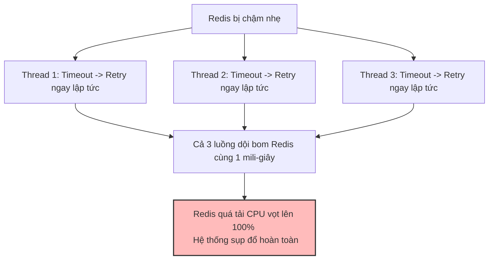
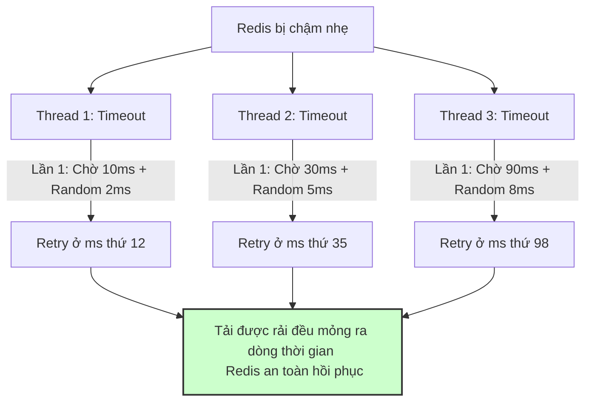

# Có nên retry Redis call không?

## ⚡ Tóm tắt ngắn (30s)
* **Bản chất**: Quyết định thử lại (**Retry**) một truy vấn Redis bị lỗi phụ thuộc hoàn toàn vào **tính chất của thao tác (Đọc/Ghi)** và **nguyên nhân lỗi**. Thử lại là con dao hai lưỡi: nó có thể cứu sống hệ thống khi gặp lỗi mạng chập chờn tạm thời (Transient Network Error), nhưng cũng chính nó sẽ biến một sự cố quá tải nhẹ thành **thảm họa sập nguồn toàn diện** (Tự DDoS chính mình) nếu không có cơ chế kiểm soát.
* **Thảm họa thực chiến được giải quyết**:
  1. **Hiệu ứng Tuyết lở khuếch đại (Amplification Avalanche)**: Redis đang bị quá tải CPU 100% làm phản hồi chậm. Web Service tự ý retry 3 lần cho mỗi request. Lượng traffic dội vào Redis tăng vọt gấp 3 lần, đè bẹp hoàn toàn cơ hội phục hồi tự động của cụm Redis và kéo dài downtime production nhiều giờ liền.
  2. **Sai lệch số đếm nghiệp vụ (Non-idempotent Write Error)**: Gửi lệnh tăng số lượng giao dịch (`INCR`) bị timeout. Ứng dụng tự động retry. Thực tế, Redis đã thực hiện lệnh đầu tiên thành công nhưng gói tin phản hồi bị mất trên đường truyền. Việc retry làm tăng số đếm lên gấp đôi, gây sai lệch số liệu tài chính nghiêm trọng.
* **Quyết định Senior**:
  1. **Chỉ Retry cho tác vụ Đọc (Idempotent Reads)**: An toàn tuyệt đối khi retry các lệnh đọc cache (`GET`, `HEXISTS`, `ZRANGE`). Cấm tự ý retry các lệnh ghi (`SET`, `INCR`, `LPUSH`) khi gặp lỗi Timeout.
  2. **Bắt buộc áp dụng Exponential Backoff với Jitter**: Tuyệt đối không retry liên tiếp lập tức. Phải giãn cách thời gian tăng dần theo hàm mũ (ví dụ: 10ms -> 30ms -> 90ms) kết hợp cộng trừ ngẫu nhiên (Jitter) để phân rã tập trung tải.
  3. **Tích hợp Circuit Breaker chặn đứng Retry điên cuồng**: Khi tỉ lệ lỗi kết nối vượt quá ngưỡng an toàn, Circuit Breaker tự động chuyển sang trạng thái OPEN, chặn đứng mọi nỗ lực retry vô nghĩa để cho Redis có khoảng thở tự hồi phục.

---

## 🔍 Chi tiết bản chất thực chiến: Quy tắc Vàng khi Thiết kế Cơ chế Retry

### 1. Phân biệt Lỗi Kết nối (Connection Error) và Lỗi Đọc chậm (Timeout Error)
* **Trường hợp 1: Lỗi mạng tạm thời (Transient Connection Error)**:
  * Ví dụ: Gói tin bị drop tạm thời do đứt cáp mạng, chuyển mạch switch.
  * **Giải pháp**: **NÊN RETRY**. Chỉ cần thử lại sau vài mili-giây, kết nối sẽ thành công.
* **Trường hợp 2: Lỗi Timeout (Read Timeout)**:
  * Ví dụ: Redis đang bận xử lý một lệnh nặng, hoặc RAM bị đầy.
  * **Giải pháp**: **CỰC KỲ HẠN CHẾ RETRY**. Việc cố chấp thử lại lúc này chỉ làm trầm trọng thêm tình trạng quá tải của Redis.

---

### 2. Cạm bẫy "Bão Retry" (The Retry Storm)
Hãy tưởng tượng hệ thống đang chạy với tải thông thường là 2000 request/giây. 
* Cụm Redis bị nghẽn nhẹ, phản hồi chậm quá 100ms.
* Cấu hình Web service tự động retry 3 lần lập tức khi timeout.
* Ngay giây tiếp theo, lượng request đập vào Redis tăng từ 2000 lên **8000 request/giây** (2000 gốc + 6000 retry).
* Băng thông mạng nội bộ bị nghẽn hoàn toàn, CPU Redis vọt lên 100%, toàn bộ cụm Redis chính thức tê liệt. Đây chính là hiện tượng **"Tự DDoS"** kinh điển do thiết kế cơ chế Retry ngây thơ.

---

## 🎨 Sơ đồ trực quan (Cơ chế Exponential Backoff & Jitter phân tán tải Retry)

```carousel
Cơ chế Retry ngây thơ (Gây nghẽn bão tải)

<!-- slide -->
Cơ chế Retry Senior (Exponential Backoff & Jitter)

````

---

## 💻 Code thực chiến: Cấu hình Thử lại thông minh cho Redis trong Spring Boot

Dưới đây là cách tích hợp cơ chế Thử lại thông minh sử dụng Spring Retry kết hợp thuật toán giãn cách thời gian tăng dần (Exponential Backoff) và độ lệch ngẫu nhiên (Jitter).

### 1. Kích hoạt tính năng Spring Retry
```java
import org.springframework.context.annotation.Configuration;
import org.springframework.retry.annotation.EnableRetry;

@Configuration
@EnableRetry // ✅ KÍCH HOẠT TÍNH NĂNG RETRY TỰ ĐỘNG
public class RetryConfig {
}
```

### 2. Triển khai Service đọc dữ liệu có cơ chế Retry an toàn
```java
import lombok.RequiredArgsConstructor;
import lombok.extern.slf4j.Slf4j;
import org.springframework.dao.QueryTimeoutException;
import org.springframework.data.redis.RedisConnectionFailureException;
import org.springframework.data.redis.core.RedisTemplate;
import org.springframework.retry.annotation.Backoff;
import org.springframework.retry.annotation.Recover;
import org.springframework.retry.annotation.Retryable;
import org.springframework.stereotype.Service;

import java.util.concurrent.TimeUnit;

@Slf4j
@Service
@RequiredArgsConstructor
public class SafeCacheService {

    private final RedisTemplate<String, Object> redisTemplate;
    private final ProductRepository productRepository;

    private static final String CACHE_PREFIX = "app:product:";

    /**
     * ✅ ĐỌC CACHE AN TOÀN VỚI CƠ CHẾ RETRY THÔNG MINH:
     * 1. Chỉ retry cho tác vụ ĐỌC (GET) - Đảm bảo tính Idempotent.
     * 2. Chỉ retry khi gặp lỗi mất kết nối (RedisConnectionFailureException) hoặc Timeout (QueryTimeoutException).
     * 3. MaxAttempts = 2: Chỉ thử lại tối đa 1 lần (Lần đầu + 1 lần thử lại).
     * 4. Backoff: Bắt đầu chờ 50ms, nhân hệ số 2 cho lần sau (delay * multiplier), 
     *    bật cờ random = true để kích hoạt JITTER ngẫu nhiên.
     */
    @Retryable(
            value = { RedisConnectionFailureException.class, QueryTimeoutException.class },
            maxAttempts = 2,
            backoff = @Backoff(delay = 50, multiplier = 2.0, random = true)
    )
    public ProductDto getProductWithRetry(String productId) {
        String cacheKey = CACHE_PREFIX + productId;
        log.info("🚀 Đang gửi lệnh đọc Cache Redis cho key: {}", cacheKey);
        
        // Thao tác đọc Redis (Lettuce Driver đã cấu hình Timeout ngắn 100ms)
        ProductDto cached = (ProductDto) redisTemplate.opsForValue().get(cacheKey);
        
        if (cached != null) {
            return cached;
        }
        
        // Cache Miss
        return fetchFromDatabase(productId, cacheKey);
    }

    private ProductDto fetchFromDatabase(String productId, String cacheKey) {
        log.warn("🔎 Cache Miss! Đọc DB sản phẩm: {}", productId);
        ProductEntity entity = productRepository.findById(productId)
                .orElseThrow(() -> new ResourceNotFoundException("Sản phẩm không tồn tại"));
        
        ProductDto dto = new ProductDto(entity.getId(), entity.getName(), entity.getPrice());
        
        // Ghi lại vào Redis (Tuyệt đối không bọc ghi vào luồng retry để tránh ghi đè lỗi)
        try {
            redisTemplate.opsForValue().set(cacheKey, dto, 15, TimeUnit.MINUTES);
        } catch (Exception e) {
            log.error("⚠️ Không thể ghi dữ liệu mới lên Redis: {}", e.getMessage());
        }
        
        return dto;
    }

    /**
     * ⚠️ PHƯƠNG THỨC CỨU HỘ (RECOVER): Được gọi khi đã retry tối đa 2 lần nhưng vẫn thất bại.
     * Giải phóng luồng và hạ cấp dịch vụ nhanh (Fail-silent).
     */
    @Recover
    public ProductDto recoverFromRedisFailure(Exception e, String productId) {
        log.error("🚨 THỬ LẠI THẤT BẠI: Đã thử lại tối đa nhưng Redis vẫn lỗi. " +
                "Kích hoạt cơ chế hạ cấp khẩn cấp! Lý do: {}", e.getMessage());
        
        // Cứu mạng hệ thống: Đọc thẳng từ Database gốc (hoặc trả về dữ liệu rỗng dự phòng)
        ProductEntity entity = productRepository.findById(productId)
                .orElseThrow(() -> new ResourceNotFoundException("Sản phẩm không tồn tại"));
        
        return new ProductDto(entity.getId(), entity.getName(), entity.getPrice());
    }
}
```

---

## 📊 Bảng so sánh kịch bản nên và không nên sử dụng Retry

| Tính chất thao tác | Loại lệnh gọi Redis | Có nên dùng Retry không? | Lý do kỹ thuật tại sao? |
| :--- | :--- | :--- | :--- |
| **Đọc dữ liệu (Read)** | `GET`, `HGET`, `ZRANGE`, `HEXISTS` | **CÓ** | Thao tác Idempotent (Đọc đi đọc lại nhiều lần không làm thay đổi trạng thái dữ liệu). |
| **Ghi dữ liệu (Write)** | `SET`, `HSET`, `LPUSH` | **CỰC KỲ HẠN CHẾ** | Thao tác ghi đè. Nếu timeout là do mất gói tin phản hồi, retry có thể ghi đè dữ liệu cũ lên dữ liệu mới hơn của luồng khác. |
| **Tăng giảm số đếm (Increment)** | `INCR`, `DECR`, `INCRBY` | **TUYỆT ĐỐI KHÔNG** | Thao tác Non-idempotent. Thử lại sẽ làm sai lệch số đếm thực tế của hệ thống. |
| **Thao tác Transaction** | `MULTI`, `EXEC`, `WATCH` | **TUYỆT ĐỐI KHÔNG** | Việc chạy lại cả một transaction phân tán đang bị timeout chỉ làm tăng gấp đôi tải trọng nghẽn mạng. |

---

## ⚠️ Common Gotchas & Questions follow-up

### 1. Cạm bẫy "Retry Forever (Thử lại vô tận)"
* **Vấn đề**: Lập trình viên sử dụng cấu hình mặc định của một số thư viện hoặc để `maxAttempts = 10` hoặc thậm chí không giới hạn số lần thử lại với hy vọng "thử đến bao giờ được thì thôi". Khi Redis sập vật lý trong 2 tiếng cuối tuần, hàng triệu request sẽ liên tục quay vòng thử lại hàng chục lần, chiếm dụng toàn bộ Thread Pool của Web Server và làm sập luôn toàn bộ các dịch vụ nghiệp vụ khác không liên quan đến Redis.
* **Giải pháp khắc phục**: Đặt giới hạn `maxAttempts` tối đa là **2 lần** (Lần đầu + 1 lần thử lại duy nhất). Nếu tiếp tục lỗi, lập tức kích hoạt luồng cứu hộ Recover để bảo vệ luồng HTTP.

### 2. Câu hỏi đào sâu từ interviewer
* **Q: Làm sao để cài đặt cơ chế Retry động (Adaptive Retry) tự động tắt khi phát hiện hệ thống đang quá tải?**
  * *Trả lời*:
    * Ta sử dụng mô hình **Circuit Breaker** kết hợp với Retry.
    * Khi tỉ lệ lỗi của Redis tăng nhẹ, ta cho phép Retry hoạt động.
    * Nhưng khi tỉ lệ lỗi vượt ngưỡng 50%, Circuit Breaker chuyển sang trạng thái **OPEN** (Ngắt kết nối hoàn toàn). Lúc này, mọi request đi vào sẽ bị chặn ngay ở lớp ngoài cùng và đi thẳng vào luồng Fallback mà không kích hoạt bất kỳ lệnh gọi Redis hay cơ chế Retry nào, giữ an toàn tuyệt đối cho cụm Redis phục hồi.
