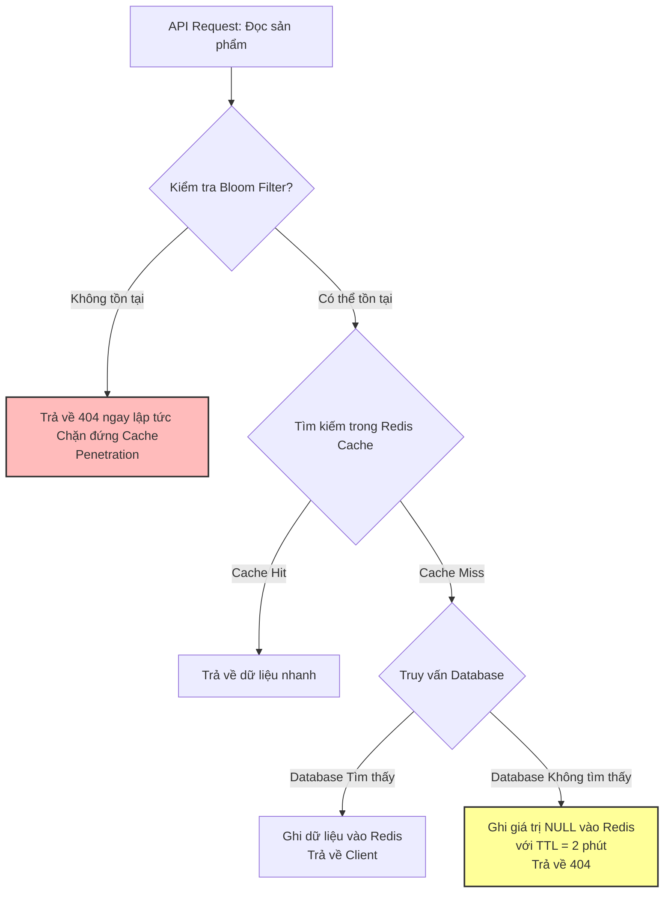

# Cache miss tăng đột biến, nguyên nhân có thể là gì?

## ⚡ Tóm tắt ngắn (30s)
* **Bản chất**: Cache Miss tăng đột biến (ví dụ từ tỷ lệ bình thường < 10% nhảy vọt lên > 80%) có nghĩa là tấm khiên bảo vệ Database (Redis Cache) đã mất tác dụng. Toàn bộ traffic đọc lúc này đập trực tiếp xuống Database chính. Sự cố này thường do 4 nhóm nguyên nhân cốt lõi: **Hành vi người dùng thay đổi (Campaign/Cold Start)**, **Redis quá tải RAM dẫn đến Eviction (Xóa key)**, **Tấn công ác ý (Cache Penetration)**, hoặc **Lỗi nghiệp vụ / Cấu hình sai TTL**.
* **Thảm họa thực chiến được giải quyết**:
  1. **Database Crash (Sập cơ sở dữ liệu)**: Khi cache miss tăng đột biến đột ngột, Database bị nghẽn CPU ở mức 100%, hàng nghìn connection bị treo cứng dẫn tới sập toàn bộ dịch vụ.
  2. **Downtime diện rộng sau Deploy**: Đẩy code mới làm thay đổi định dạng Key hoặc vô tình xóa toàn bộ cache mà không warm-up, khiến hệ thống ngưng trệ ngay khi khởi động lại.
* **Quyết định Senior**:
  1. **Áp dụng Bloom Filter**: Chống sập do truy vấn Key ảo (Cache Penetration).
  2. **Warm-up Cache chủ động**: Lập trình trước tiến trình điền sẵn các hot key vào cache trước các chiến dịch marketing lớn.
  3. **Tuning Eviction Policy**: Đặt chính sách xóa key phù hợp (ưu tiên `volatile-lru` hoặc `allkeys-lru`) và tối ưu bộ nhớ để ngăn Redis tự động xóa các key quan trọng do tràn RAM.

---

## 🔍 Chi tiết bản chất thực chiến: 4 Nhóm Nguyên nhân & Kịch bản Khắc phục

### 1. Nhóm 1: Redis đầy bộ nhớ & Bị ép Evict Key (Tràn RAM)
* **Nguyên nhân**: Khi bộ nhớ RAM vật lý của Redis đạt tới giới hạn cấu hình (`maxmemory`), Redis buộc phải giải phóng dung lượng bằng cách xóa bớt key dựa trên chính sách `maxmemory-policy` (mặc định là `noeviction` - ném lỗi, hoặc các chính sách thông dụng như `allkeys-lru`).
* **Hậu quả**: Các key phổ biến đang được truy cập thường xuyên (Hot Keys) bị xóa nhầm để nhường chỗ cho key mới ghi vào, gây ra hiện tượng cache miss tăng vọt lập tức.
* **Khắc phục**:
  * Tối ưu hóa cấu trúc dữ liệu lưu trong Redis (chuyển JSON String cồng kềnh sang cấu trúc Hash tiết kiệm bộ nhớ).
  * Scale-up RAM của Redis hoặc thiết kế cụm Redis Cluster để phân chia bộ nhớ.

---

### 2. Nhóm 2: Sự cố Cold Start (Khởi động lạnh) & Chiến dịch Marketing
* **Nguyên nhân**: Hệ thống vừa deploy phiên bản mới, xóa sạch cache cũ hoặc ra mắt một chiến dịch bán hàng mới với hàng triệu sản phẩm mới toanh chưa từng được đưa vào cache.
* **Hậu quả**: Hàng triệu người dùng đổ xô vào tìm kiếm sản phẩm mới tạo ra làn sóng truy cập "chưa từng thấy trong cache", gây sập hệ thống.
* **Khắc phục**: **Cache Warm-up** - Chạy script lấy danh sách Top 1000 sản phẩm hot nhất để điền sẵn vào cache trước khi khởi chạy chiến dịch 30 phút.

---

### 3. Nhóm 3: Tấn công Cache Penetration (Key ảo)
* **Nguyên nhân**: Kẻ tấn công cố tình spam hàng triệu request chứa các ID sản phẩm không tồn tại (ví dụ: `?productId=-9999` hoặc `?productId=uuid-khong-co-that`).
* **Hậu quả**: Do ID không có trong cache, hệ thống luôn phải xuống DB để tìm. ID cũng không có trong DB nên không thể ghi lại gì vào cache, dẫn tới tỷ lệ Cache Miss luôn là 100%.
* **Khắc phục**:
  * Ghi nhận giá trị rỗng (`Null Value`) vào cache với TTL ngắn (ví dụ: 1 - 2 phút) khi không tìm thấy trong DB.
  * Triển khai **Bloom Filter** chặn key ảo từ lớp Gatekeeper.

---

### 4. Nhóm 4: Lỗi Logic Code hoặc TTL không đồng đều
* **Nguyên nhân**: Lập trình viên vô tình thay đổi prefix của key cache khi deploy code mới (ví dụ từ `prod:v1:item:` sang `prod:v2:item:`) mà không cập nhật các key cũ. Hoặc đặt TTL quá ngắn (chỉ 5 - 10 giây) khiến key liên tục bị hết hạn.

---

## 🎨 Sơ đồ trực quan (Giải pháp chống Cache Miss diện rộng)



---

## 💻 Code thực chiến: Triển khai Chống Cache Miss diện rộng trong Spring Boot

### 1. Giải pháp ghi nhận giá trị rỗng (Cache Null Values) & Cấu hình TTL ngẫu nhiên
Để chống Cache Penetration và Cache Stampede (nhiều key hết hạn cùng một lúc), chúng ta cấu hình Redis Cache cho phép lưu giá trị Null và cấu hình TTL có độ lệch ngẫu nhiên (Jitter).

```java
import org.springframework.context.annotation.Bean;
import org.springframework.context.annotation.Configuration;
import org.springframework.data.redis.cache.RedisCacheConfiguration;
import org.springframework.data.redis.cache.RedisCacheManager;
import org.springframework.data.redis.connection.RedisConnectionFactory;
import org.springframework.data.redis.serializer.GenericJackson2JsonRedisSerializer;
import org.springframework.data.redis.serializer.RedisSerializationContext;

import java.time.Duration;

@Configuration
public class RedisCacheConfig {

    @Bean
    public RedisCacheManager cacheManager(RedisConnectionFactory connectionFactory) {
        RedisCacheConfiguration config = RedisCacheConfiguration.defaultCacheConfig()
                .entryTtl(Duration.ofMinutes(10)) // TTL mặc định 10 phút
                .disableCachingNullValues() // ❌ Cực kỳ nguy hiểm nếu bật disable!
                .serializeValuesWith(RedisSerializationContext.SerializationPair.fromSerializer(new GenericJackson2JsonRedisSerializer()));

        // ✅ CẤU HÌNH AN TOÀN ENTERPRISE:
        RedisCacheConfiguration safeConfig = RedisCacheConfiguration.defaultCacheConfig()
                .entryTtl(Duration.ofMinutes(15)) // Tăng thời gian sống
                .serializeValuesWith(RedisSerializationContext.SerializationPair.fromSerializer(new GenericJackson2JsonRedisSerializer()))
                .computePrefixWith(cacheName -> "app:" + cacheName + ":")
                .enableCachingNullValues(); // ✅ CHO PHÉP LƯU GIÁ TRỊ NULL để chống Cache Penetration!

        return RedisCacheManager.builder(connectionFactory)
                .cacheDefaults(safeConfig)
                .build();
    }
}
```

### 2. Triển khai Bloom Filter tích hợp trong nghiệp vụ
Sử dụng Guava Bloom Filter hoặc Redis Bloom Module để lọc key ảo cực kỳ hiệu quả mà không tốn bộ nhớ RAM.

```java
import com.google.common.hash.BloomFilter;
import com.google.common.hash.Funnels;
import lombok.RequiredArgsConstructor;
import lombok.extern.slf4j.Slf4j;
import org.springframework.stereotype.Service;

import javax.annotation.PostConstruct;
import java.nio.charset.StandardCharsets;
import java.util.List;

@Slf4j
@Service
@RequiredArgsConstructor
public class ProductSecureService {

    private final ProductRepository productRepository;
    private final ProductCacheService productCacheService;

    // Khởi tạo Bloom Filter lưu trữ dự kiến 1 triệu ID sản phẩm, tỷ lệ sai số chấp nhận 1% (0.01)
    private BloomFilter<String> productFilter;

    @PostConstruct
    public void initBloomFilter() {
        log.info("🌱 Đang khởi tạo Bloom Filter cho danh mục sản phẩm...");
        List<String> allProductIds = productRepository.findAllIds();
        
        productFilter = BloomFilter.create(
                Funnels.stringFunnel(StandardCharsets.UTF_8), 
                Math.max(allProductIds.size() * 2, 100000), 
                0.01
        );

        // Nạp tất cả ID sản phẩm hợp lệ trong DB vào Bloom Filter
        allProductIds.forEach(id -> productFilter.put(id));
        log.info("✅ Đã nạp {} sản phẩm vào Bloom Filter an toàn!", allProductIds.size());
    }

    public ProductDto getProductSecured(String productId) {
        // 1. Kiểm tra nhanh qua Bloom Filter trên RAM (Thời gian phản hồi < 1ms)
        if (!productFilter.mightContain(productId)) {
            log.warn("🚨 PHÁT HIỆN CACHE PENETRATION: ID sản phẩm {} ảo 100%, chặn ngay lập tức!", productId);
            throw new ResourceNotFoundException("Sản phẩm không tồn tại");
        }

        // 2. Đi tiếp luồng nghiệp vụ nếu Bloom Filter báo có thể tồn tại
        return productCacheService.getProductById(productId);
    }
    
    // Phương thức bổ sung khi admin tạo sản phẩm mới -> Nạp vào Bloom Filter
    public void addNewProduct(ProductEntity product) {
        productRepository.save(product);
        productFilter.put(product.getId());
    }
}
```

---

## 📊 Bảng so sánh 3 Kỹ thuật xử lý Cache Miss lớn

| Tiêu chí so sánh | Cache Null Value (Lưu giá trị rỗng) | Bloom Filter (Bộ lọc xác suất) | Cache Warm-up (Điền trước dữ liệu) |
| :--- | :--- | :--- | :--- |
| **Mục tiêu chính** | Chống Cache Penetration (Key ảo). | Chống Cache Penetration diện rộng cho dữ liệu lớn. | Chống Cold Start khi deploy hoặc chạy Campaign. |
| **Mức độ tiêu thụ RAM** | **Khá tốn** (Nếu số lượng key ảo cực lớn lên tới hàng triệu). | **Cực kỳ thấp** (1 triệu dòng chỉ tốn khoảng vài MB RAM). | Trung bình (Tương đương lưu trữ key thật). |
| **Độ chính xác** | 100% chính xác tuyệt đối. | Chấp nhận sai số nhỏ (Ví dụ 1% key ảo vẫn lọt qua xuống DB). | 100% chính xác tuyệt đối. |
| **Độ phức tạp** | Rất thấp (Chỉ cần bật cấu hình trong Spring). | Trung bình (Phải tự khởi tạo bộ lọc Guava hoặc cấu hình Redis Bloom). | Thấp (Viết câu lệnh SQL lấy Hot Key khi khởi động app). |

---

## ⚠️ Common Gotchas & Questions follow-up

### 1. Cạm bẫy "Lệch dữ liệu khi lưu giá trị Null (Cache Invalidation Failure)"
* **Vấn đề**: Người dùng gửi request truy vấn sản phẩm chưa tồn tại trong hệ thống. Hệ thống ghi nhận giá trị Null vào cache với TTL = 2 phút. Ngay lập tức sau đó 5 giây, Admin tạo sản phẩm đó trong hệ thống với đúng ID trên. Khi người dùng load lại trang, hệ thống vẫn báo lỗi 404 (Không tìm thấy) trong suốt 1 phút 55 giây tiếp theo do giá trị Null trong Cache chưa hết hạn.
* **Giải pháp khắc phục**: Bắt buộc phải thực hiện lệnh `cache.evict(productId)` (Xóa Key khỏi cache) ngay trong Database Transaction của luồng tạo mới sản phẩm để đồng bộ hóa dữ liệu lập tức.

### 2. Câu hỏi đào sâu từ interviewer
* **Q: Làm sao phát hiện ra hiện tượng "Cache Eviction" đang diễn ra âm thầm trên production làm giảm Cache Hit ratio?**
  * *Trả lời*:
    * Ta sử dụng lệnh `INFO stats` hoặc `INFO memory` trực tiếp trong Redis CLI để kiểm tra thông số `evicted_keys`. Nếu chỉ số `evicted_keys > 0` và tăng liên tục theo thời gian, điều đó chứng tỏ bộ nhớ Redis đã đạt giới hạn `maxmemory` và đang tích cực xóa key.
    * Giải pháp ngay lập tức: Tăng dung lượng bộ nhớ `maxmemory` của Redis hoặc chuyển đổi sang chính sách loại bỏ key thông minh hơn như `volatile-lru` để chỉ xóa các key phụ có cài đặt TTL.
