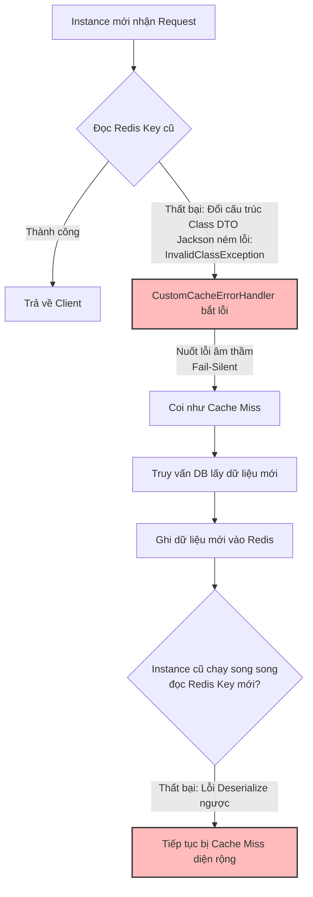

# Cache hit ratio giảm mạnh sau deploy. Bạn debug thế nào?

## ⚡ Tóm tắt ngắn (30s)
* **Bản chất**: Khi Cache Hit Ratio (Tỷ lệ tìm thấy dữ liệu trong cache) giảm mạnh đột ngột ngay sau khi deploy (ví dụ: từ 85% xuống < 20%), nguyên nhân gần như chắc chắn nằm ở **thay đổi logic code của phiên bản mới**, chứ không phải do hạ tầng mạng hay dung lượng RAM. Sự cố này thường do: **Sai lệch Serialization (Lỗi ép kiểu/Đổi thư viện)**, **Thay đổi cấu trúc Key Pattern**, **Reset TTL nhầm đơn vị thời gian**, hoặc **Lỗi silent-bypass do nghẽn kết nối**.
* **Thảm họa thực chiến được giải quyết**:
  1. **Database Bottleneck (Nghẽn cổ chai Database)**: Ngay sau deploy, CPU Database nhảy vọt lên 100% do lượng query đọc tăng gấp 5 lần thông thường. Rollback khẩn cấp là lựa chọn duy nhất nếu không tìm ra nguyên nhân debug nhanh trong 5 phút.
  2. **Trải nghiệm khách hàng chậm chạp**: API phản hồi chậm gấp 10 lần (từ 20ms lên 200ms) do phải truy xuất đĩa cứng RDBMS liên tục thay vì đọc bộ nhớ RAM Redis.
* **Quyết định Senior**:
  1. **Phân tích Log & So sánh Diff Code**: Rà soát kỹ các commit liên quan đến lớp cấu hình `RedisCacheConfiguration`, Serialization, và các annotation `@Cacheable`.
  2. **Truy vết lỗi Deserialize**: Code mới đổi cấu trúc Class (thêm/xóa field) nhưng key cũ trong Redis vẫn giữ định dạng Class cũ, dẫn đến ngoại lệ Deserialize ngầm (Fail-silent) làm hệ thống tự bỏ qua cache và truy vấn DB.
  3. **Monitor Redis Command Real-time**: Sử dụng `SLOWLOG` hoặc `MONITOR` (trong môi trường Staging/UAT) để kiểm tra chính xác định dạng key thực tế mà Service mới đang gửi lên Redis là gì.

---

## 🔍 Chi tiết bản chất thực chiến: Quy trình Debug chuẩn Senior

Quy trình chuẩn đoán lỗi Cache Hit Ratio giảm sau deploy gồm 4 bước hành động nhanh để cô lập vấn đề:

```
[Deploy Lỗi] 
     │
     ▼
[Bước 1: Kiểm tra Exception Ngầm] ──> Phát hiện lỗi Deserialize DTO (Class thay đổi)
     │
     ▼
[Bước 2: So sánh Key Pattern] ────────> Phát hiện đổi prefix key (Ví dụ: thiếu dấu ":" cuối)
     │
     ▼
[Bước 3: Rà soát TTL & Units] ────────> Phát hiện nhầm lẫn đơn vị (Cấu hình 60 mili-giây thay vì 60 giây)
     │
     ▼
[Bước 4: Kiểm tra Connection Pool] ───> Phát hiện cấu hình pool mới làm nghẽn kết nối
```

---

### 1. Sự cố phổ biến nhất: Lỗi Serialization / Deserialization (Lỗi Đọc - Ghi)
* **Kịch bản**: Lập trình viên thay đổi cấu trúc của class DTO được lưu trong cache (ví dụ: thêm một field mới `private String categoryCode;` nhưng không gán giá trị mặc định, hoặc thay đổi thư viện Jackson ObjectMapper).
* **Cơ chế lỗi**: 
  * Khi service đọc key cũ trong Redis, Jackson không thể ép kiểu (deserialize) chuỗi JSON cũ sang Class DTO mới.
  * Vì hệ thống áp dụng cơ chế **Fail-Silent CacheErrorHandler**, ngoại lệ này bị nuốt sạch âm thầm để bảo vệ ứng dụng không bị crash.
  * Ứng dụng coi như không tìm thấy cache (Cache Miss) và đi tiếp xuống DB. Khi trả về, nó ghi đè dữ liệu mới lên Redis. Tuy nhiên, nếu có nhiều phiên bản chạy song song (Rolling Update), Instance cũ đọc key của Instance mới lại tiếp tục lỗi và gây ra vòng lặp Cache Miss liên tục.

---

### 2. Sự cố thứ 2: Thay đổi Key Pattern vô ý
* **Kịch bản**: Code cũ sinh key dạng `app:product:123`. Code mới sử dụng Spring Cache nhưng cấu hình prefix tự động hoặc vô tình đổi dấu phân tách thành `app-product-123`.
* **Cơ chế lỗi**: Service mới tìm kiếm key `app-product-123` nhưng trong Redis chỉ tồn tại key `app:product:123`. Kết quả là Cache Miss 100% đối với toàn bộ dữ liệu lịch sử.

---

### 3. Sự cố thứ 3: Nhầm lẫn đơn vị thời gian TTL (Time-To-Live)
* **Kịch bản**: Trong cấu hình Spring, lập trình viên cấu hình TTL bằng số nguyên nhưng nhầm lẫn đơn vị:
  ```java
  // ❌ SAI LẦM: Cấu hình nhầm đơn vị từ Phút thành Giây/Mili-giây
  RedisCacheConfiguration.defaultCacheConfig().entryTtl(Duration.ofMillis(30)); // Chỉ sống 30 mili-giây!
  ```
* **Cơ chế lỗi**: Dữ liệu vừa được ghi vào cache lập tức bị xóa ngay sau vài mili-giây, khiến lượt truy cập tiếp theo luôn luôn bị Cache Miss.

---

## 🎨 Sơ đồ trực quan (Lỗi Deserialize ngầm gây sụt giảm Cache Hit Ratio)



---

## 💻 Code thực chiến: Bật Log Cảnh báo Deserialize & Cấu hình Jackson an toàn

Để tránh lỗi sập hệ thống do Deserialize khi Rolling Update, ta phải cấu hình Jackson tương thích ngược và ghi log chi tiết khi xảy ra lỗi cache.

### 1. Cấu hình Jackson ObjectMapper tương thích ngược (Backward Compatibility)
Cấu hình Jackson bỏ qua các thuộc tính không xác định (Unknown Properties) khi Deserialize DTO.

```java
import com.fasterxml.jackson.databind.DeserializationFeature;
import com.fasterxml.jackson.databind.ObjectMapper;
import com.fasterxml.jackson.databind.jsontype.BasicPolymorphicTypeValidator;
import com.fasterxml.jackson.databind.jsontype.PolymorphicTypeValidator;
import org.springframework.context.annotation.Bean;
import org.springframework.context.annotation.Configuration;
import org.springframework.data.redis.serializer.GenericJackson2JsonRedisSerializer;

@Configuration
public class JacksonRedisConfig {

    @Bean
    public GenericJackson2JsonRedisSerializer genericJackson2JsonRedisSerializer() {
        ObjectMapper objectMapper = new ObjectMapper();
        
        // ✅ CẤU HÌNH QUAN TRỌNG 1: Bỏ qua các field mới khi đọc dữ liệu định dạng cũ trong Cache
        objectMapper.configure(DeserializationFeature.FAIL_ON_UNKNOWN_PROPERTIES, false);
        
        // Cấu hình lưu trữ thông tin kiểu dữ liệu (Polymorphic) để Spring Cache ép kiểu chính xác
        PolymorphicTypeValidator ptv = BasicPolymorphicTypeValidator.builder()
                .allowIfBaseType(Object.class)
                .build();
        objectMapper.activateDefaultTyping(ptv, ObjectMapper.DefaultTyping.NON_FINAL);

        return new GenericJackson2JsonRedisSerializer(objectMapper);
    }
}
```

### 2. Custom CacheErrorHandler ghi log lỗi Deserialize chi tiết (Không nuốt lỗi vô ích)
Giúp kỹ sư phát hiện ngay lỗi Deserialize trên Kibana/Grafana thay vì bị nuốt lỗi âm thầm.

```java
import lombok.extern.slf4j.Slf4j;
import org.springframework.cache.Cache;
import org.springframework.cache.interceptor.CacheErrorHandler;
import org.springframework.data.redis.serializer.SerializationException;

@Slf4j
public class DiagnosticCacheErrorHandler implements CacheErrorHandler {

    @Override
    public void handleCacheGetError(RuntimeException exception, Cache cache, Object key) {
        // ✅ PHÂN TÍCH LỖI: Phát hiện chính xác lỗi Serialization
        if (exception.getCause() instanceof SerializationException || 
            exception.getMessage().contains("Could not read JSON") ||
            exception.getMessage().contains("Could not resolve type")) {
            
            log.error("🚨 THẢM HỌA DESERIALIZE CACHE: Không thể giải mã dữ liệu của Key: {}. " +
                    "Khả năng cao do đổi cấu trúc Class DTO mới không tương thích ngược! Chi tiết lỗi: {}", 
                    key, exception.getMessage());
        } else {
            log.warn("⚠️ Lỗi kết nối Redis thông thường khi đọc Key: {}. Chi tiết: {}", key, exception.getMessage());
        }
    }

    @Override
    public void handleCachePutError(RuntimeException exception, Cache cache, Object key, Object value) {
        log.error("⚠️ Lỗi ghi Cache Redis (Key: {}). Chi tiết: {}", key, exception.getMessage());
    }

    @Override
    public void handleCacheEvictError(RuntimeException exception, Cache cache, Object key) {
        log.error("⚠️ Lỗi xóa Cache Redis (Key: {}). Chi tiết: {}", key, exception.getMessage());
    }

    @Override
    public void handleCacheClearError(RuntimeException exception, Cache cache) {
        log.error("⚠️ Lỗi clear cache. Chi tiết: {}", exception.getMessage());
    }
}
```

---

## 📊 Bảng so sánh 3 kịch bản lỗi làm tụt Cache Hit Ratio sau deploy

| Đặc điểm nhận dạng | Lỗi Deserialize DTO | Lỗi Sai Key Pattern | Lỗi Cấu hình Sai TTL |
| :--- | :--- | :--- | :--- |
| **Triệu chứng trên Redis** | Số lượng key tăng nhưng Cache Miss vẫn cao. | Redis xuất hiện hàng loạt key mới song song với key cũ. | Số lượng key trong Redis duy trì ở mức cực thấp (< 5%). |
| **Dấu vết trong Log** | Xuất hiện log lỗi "SerializationException" liên tục (nếu bật log). | Không có log lỗi kết nối hay parse, mọi lệnh đều chạy êm. | Không có log lỗi, hệ thống ghi cache xong tự biến mất lập tức. |
| **Giải pháp sửa đổi** | Cấu hình `FAIL_ON_UNKNOWN_PROPERTIES = false` ở Jackson. | Sửa lại prefix key đồng nhất với phiên bản cũ. | Sửa cấu hình đơn vị thời gian TTL (Duration.ofMinutes / ofSeconds). |

---

## ⚠️ Common Gotchas & Questions follow-up

### 1. Cạm bẫy "Rolling Update Poisoning" (Nhiễm độc cache chéo)
* **Vấn đề**: Trong quá trình deploy Kubernetes theo chiến lược Rolling Update, 2 phiên bản cũ (v1) và mới (v2) chạy song song cùng lúc. Phiên bản v2 ghi dữ liệu định dạng mới lên Redis. Phiên bản v1 đọc key đó bị lỗi deserialize, ghi đè lại dữ liệu định dạng v1. Phiên bản v2 đọc lại bị lỗi tiếp. Hai phiên bản liên tục "đánh nhau" ghi đè dữ liệu, kéo sập Cache Hit Ratio của toàn cụm xuống 0% trong suốt quá trình deploy.
* **Giải pháp khắc phục**: Luôn bổ sung version prefix vào cache name khi thay đổi cấu trúc dữ liệu lớn (ví dụ: chuyển từ `@Cacheable(value = "products")` sang `@Cacheable(value = "products_v2")`).

### 2. Câu hỏi đào sâu từ interviewer
* **Q: Nếu không thể xem log ứng dụng, làm sao dùng Redis CLI để xác định nhanh key nào đang bị Cache Miss nhiều nhất?**
  * *Trả lời*:
    * Ta sử dụng tính năng **Redis Keyspace Notifications**. Bật cấu hình `config set notify-keyspace-events gxE` để theo dõi các sự kiện tác động lên key.
    * Hoặc sử dụng công cụ phân tích log truy vấn real-time `redis-cli --monitor` kết hợp bộ lọc `grep` trên terminal để xem lệnh `GET` nào đang được gọi liên tục nhưng không có lệnh `SET` tương ứng đi kèm (dấu hiệu của Cache Miss liên tiếp trên cùng một key).
