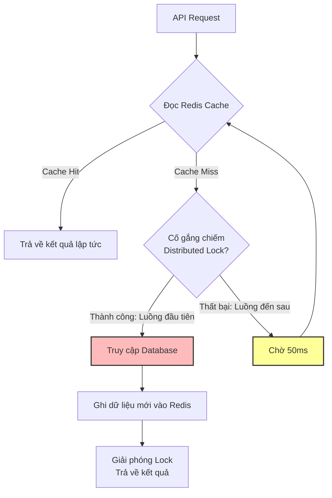

# Cache stampede xảy ra khi nào? Cách xử lý?

## ⚡ Tóm tắt ngắn (30s)
* **Bản chất**: **Cache Stampede** (hay còn gọi là **Dog-piling** hoặc **Cache Thundering Herd**) xảy ra khi một **Hot Key** (key có tần suất truy cập cực kỳ cao, ví dụ: cấu hình hệ thống, danh mục trang chủ, sản phẩm Flash Sale) hết hạn (Expired) đúng vào thời điểm hệ thống đang chịu tải cao (High Traffic). Hàng ngàn luồng xử lý đồng thời phát hiện Cache Miss và cùng lúc dội bom truy vấn xuống Database nghiệp vụ để đọc dữ liệu và ghi lại vào Redis.
* **Thảm họa thực chiến được giải quyết**:
  1. **Sập đổ Database dây chuyền (DB Overwhelm)**: Hàng nghìn kết nối đắt đỏ cùng lúc quét bảng dữ liệu nặng, chiếm dụng toàn bộ Connection Pool của Database làm CPU tăng vọt 100% khiến hệ thống bị liệt hoàn toàn.
  2. **Tắc nghẽn mạng nội bộ (Internal Network Congestion)**: Lưu lượng dữ liệu khổng lồ dịch chuyển đồng thời giữa Database, Backend Service và Redis làm nghẽn băng thông switch.
* **Quyết định Senior**:
  1. **Áp dụng Mutex / Single Flight (Distributed Lock)**: Khi phát hiện Cache Miss, sử dụng cơ chế khóa phân tán để chỉ cho phép **duy nhất 1 luồng** truy cập Database để cập nhật cache, các luồng khác phải chờ và đọc lại cache sau vài chục mili-giây.
  2. **Thiết kế Soft TTL & Background Refresh**: Lưu dữ liệu bọc trong một Object chứa thời gian hết hạn ảo (Soft TTL). Khi Soft TTL hết, luồng đầu tiên sẽ trả về dữ liệu cũ ngay lập tức (Zero Latency) và chạy một Thread chạy ngầm (Background) để update dữ liệu DB vào Redis.
  3. **Thuật toán Probabilistic Early Expiration (XFetch)**: Tự động tính toán xác suất hết hạn sớm để kích hoạt làm mới cache chủ động trước khi key thực sự biến mất khỏi Redis.

---

## 🔍 Chi tiết bản chất thực chiến: Cơ chế kích hoạt & Giải pháp Mutex

### 1. Kịch bản sụp đổ điển hình của Cache Stampede

```
[Thời điểm T] ── Hot Key 'homepage_banner' hết hạn trên Redis.
     │
[Thời điểm T+1ms] ── 5000 HTTP Requests đồng thời truy cập vào 'homepage_banner'.
     │
     ├─> 5000 luồng đều nhận kết quả: CACHE MISS!
     │
     └─> 5000 luồng đồng thời thực thi lệnh: SELECT * FROM banners WHERE status = 'ACTIVE' xuống Database!
                                                           │
                                                           ▼
[Hậu quả] ── Connection Pool DB cạn kiệt, CPU DB vọt lên 100%, Treo toàn bộ ứng dụng!
```

---

### 2. Giải pháp 1: Sử dụng Mutex Lock / Single Flight (Khóa phân tán kiểm soát luồng)
Thay vì thả nổi cho mọi luồng tự do truy cập DB, ta dựng một rào chắn:

* Chỉ luồng chiếm được **Mutex Lock** mới được phép đi xuống DB.
* Các luồng còn lại không lấy được Lock sẽ bị bắt **chờ (sleep/wait)** từ 20ms - 50ms và quay lại đọc Redis lần 2. Lúc này luồng thứ nhất đã cập nhật xong cache, luồng còn lại sẽ Cache Hit an toàn.

---

### 3. Giải pháp 2: Soft TTL kết hợp Background Refresh (Khuyên dùng)
Đây là phương án tối ưu nhất cho trải nghiệm người dùng vì **không bao giờ block client**:

* Dữ liệu trong cache không bao giờ cài đặt TTL cứng của Redis (`Hard TTL = -1` hoặc đặt rất dài như 1 ngày).
* Bên trong JSON value, lưu thêm field `expireAt` (Soft TTL, ví dụ: 5 phút).
* Khi đọc cache:
  * Nếu `currentTime < expireAt`: Trả về dữ liệu ngay (Cache Hit).
  * Nếu `currentTime >= expireAt`: Trình xử lý phát hiện key đã quá hạn ảo. Luồng đầu tiên chiếm Lock thành công sẽ bắn một **Asynchronous Task** xuống DB để update cache. Đồng thời, luồng này và toàn bộ các request đồng thời khác **vẫn nhận được dữ liệu cũ** trong cache để trả về cho client lập tức.

---

## 🎨 Sơ đồ trực quan (Soft TTL vs Mutex Lock)

```carousel
Mutex Lock Flow

<!-- slide -->
Soft TTL & Background Refresh Flow
```mermaid
flowchart TD
    A[API Request] --> B[Đọc dữ liệu từ Redis]
    B --> C{Thời gian hiện tại \n > Soft TTL (expireAt)?}
    
    C -->|Không: Key còn mới| D[Trả về dữ liệu ngay]
    
    C -->|Có: Key đã cũ| E{Thử lấy Lock ngầm?}
    E -->|Thành công| F[Chạy Thread ngầm đọc DB \n & Cập nhật Redis]
    E -->|Thất bại: Đã có luồng chạy ngầm| G[Bỏ qua]
    
    F --> H[Trả về dữ liệu cũ lập tức \n Zero Latency]
    G --> H
    
    style F fill:#cfc,stroke:#333,stroke-width:2px
    style H fill:#ff9,stroke:#333,stroke-width:2px
`

---

## 💻 Code thực chiến: Triển khai Soft TTL & Background Refresh

Dưới đây là cách triển khai tối ưu nhất cho môi trường Production thực tế bằng Java Spring Boot, sử dụng Redisson làm thư viện quản lý khóa.

### 1. DTO bao bọc dữ liệu (Cache Wrapper)
```java
import lombok.AllArgsConstructor;
import lombok.Data;
import lombok.NoArgsConstructor;

import java.io.Serializable;

@Data
@NoArgsConstructor
@AllArgsConstructor
public class CacheWrapper<T> implements Serializable {
    private T data;
    private long expireAt; // Thời gian hết hạn ảo (Epoch Milliseconds)
}
```

### 2. Service nghiệp vụ tích hợp khóa phân tán Redisson và Background Executor
```java
import lombok.RequiredArgsConstructor;
import lombok.extern.slf4j.Slf4j;
import org.redisson.api.RLock;
import org.redisson.api.RedissonClient;
import org.springframework.data.redis.core.RedisTemplate;
import org.springframework.stereotype.Service;

import java.util.concurrent.ExecutorService;
import java.util.concurrent.Executors;
import java.util.concurrent.TimeUnit;

@Slf4j
@Service
@RequiredArgsConstructor
public class HomeBannerService {

    private final BannerRepository bannerRepository;
    private final RedisTemplate<String, Object> redisTemplate;
    private final RedissonClient redissonClient;
    
    // Tạo Thread Pool riêng biệt xử lý các tác vụ nạp cache chạy ngầm
    private final ExecutorService cacheUpdateExecutor = Executors.newFixedThreadPool(4);

    private static final String CACHE_KEY = "app:homepage:banners";
    private static final long SOFT_TTL_MS = TimeUnit.MINUTES.toMillis(5); // Soft TTL: 5 phút

    public BannerDto getHomeBanners() {
        // 1. Đọc dữ liệu từ Redis
        CacheWrapper<BannerDto> wrapper = (CacheWrapper<BannerDto>) redisTemplate.opsForValue().get(CACHE_KEY);

        if (wrapper == null) {
            // ⚠️ TRƯỜNG HỢP LẠNH (Cold Start): Chưa có gì trong cache, bắt buộc dùng Mutex Lock đồng bộ
            return loadSynchronouslyWithLock();
        }

        long currentTime = System.currentTimeMillis();
        // 2. Kiểm tra xem Soft TTL đã hết hạn hay chưa
        if (currentTime >= wrapper.getExpireAt()) {
            log.info("⏰ Soft TTL hết hạn cho key: {}. Kích hoạt làm mới chạy ngầm...", CACHE_KEY);
            
            // 3. Thử lấy Lock bất đồng bộ (Non-blocking) để cập nhật cache ngầm
            RLock lock = redissonClient.getLock(CACHE_KEY + ":lock");
            
            cacheUpdateExecutor.submit(() -> {
                try {
                    // Cố gắng lấy lock ngay lập tức, nếu đã có thread khác giữ lock -> bỏ qua
                    if (lock.tryLock(0, 10, TimeUnit.SECONDS)) {
                        try {
                            log.info("🚀 Đang chạy ngầm truy vấn DB để làm mới cache...");
                            BannerDto freshData = fetchBannersFromDb();
                            
                            // Ghi lại cache mới với Soft TTL mới
                            CacheWrapper<BannerDto> newWrapper = new CacheWrapper<>(
                                    freshData, 
                                    System.currentTimeMillis() + SOFT_TTL_MS
                            );
                            redisTemplate.opsForValue().set(CACHE_KEY, newWrapper);
                            log.info("✅ Đã làm mới cache ngầm thành công!");
                        } finally {
                            lock.unlock();
                        }
                    }
                } catch (InterruptedException e) {
                    Thread.currentThread().interrupt();
                }
            });
        }

        // 4. Luôn trả về dữ liệu ngay lập tức (Dù là cũ hay mới) -> Zero Latency cho Client
        return wrapper.getData();
    }

    private BannerDto loadSynchronouslyWithLock() {
        log.warn("⚠️ Cache trống hoàn toàn. Đang dùng khóa đồng bộ để nạp cache lần đầu...");
        RLock lock = redissonClient.getLock(CACHE_KEY + ":lock");
        try {
            // Chờ lấy lock tối đa 5 giây, tự động giải phóng sau 10 giây nếu crash
            if (lock.tryLock(5, 10, TimeUnit.SECONDS)) {
                try {
                    // Double-check lock: Đọc lại cache xem luồng trước đã ghi chưa
                    CacheWrapper<BannerDto> wrapper = (CacheWrapper<BannerDto>) redisTemplate.opsForValue().get(CACHE_KEY);
                    if (wrapper != null) {
                        return wrapper.getData();
                    }

                    BannerDto data = fetchBannersFromDb();
                    CacheWrapper<BannerDto> newWrapper = new CacheWrapper<>(data, System.currentTimeMillis() + SOFT_TTL_MS);
                    redisTemplate.opsForValue().set(CACHE_KEY, newWrapper);
                    return data;
                } finally {
                    lock.unlock();
                }
            } else {
                // Trả về dữ liệu trống hoặc ném exception nếu quá tải nghiêm trọng
                throw new RuntimeException("Hệ thống bận. Vui lòng thử lại sau!");
            }
        } catch (InterruptedException e) {
            Thread.currentThread().interrupt();
            throw new RuntimeException("Treo luồng");
        }
    }

    private BannerDto fetchBannersFromDb() {
        // Nghiệp vụ quét DB nặng
        return new BannerDto(bannerRepository.findActiveBanners());
    }
}
```

---

## 📊 Bảng so sánh 3 Giải pháp chống Cache Stampede

| Tiêu chí | Dùng Mutex Lock (Khóa phân tán) | Soft TTL & Background Refresh | Thiết lập TTL ngẫu nhiên (Jitter) |
| :--- | :--- | :--- | :--- |
| **Độ trễ tối đa (Latency)** | **Cao hơn** (Các luồng sau phải chờ luồng đầu ghi xong). | **Bằng 0 (Zero Latency)** (Luôn lấy dữ liệu cũ có sẵn). | Thấp (Vẫn bị đơ nhẹ khi hết hạn nhưng rải đều thời gian). |
| **Bảo vệ Database** | Cực kỳ an toàn (Chỉ 1 truy vấn duy nhất xuống DB). | Cực kỳ an toàn (Chỉ 1 truy vấn chạy ngầm xuống DB). | Trung bình (Giảm thiểu tập trung tải cùng lúc). |
| **Độ phức tạp code** | Trung bình (Sử dụng Redisson Lock). | Cao (Phải thiết kế lớp bọc và Thread Pool chạy ngầm). | Rất thấp (Chỉ cần cộng thêm số giây ngẫu nhiên vào TTL). |
| **Độ chính xác dữ liệu** | 100% dữ liệu mới nhất. | Chấp nhận dữ liệu cũ hơn vài giây trong lúc cập nhật ngầm. | 100% dữ liệu mới nhất. |

---

## ⚠️ Common Gotchas & Questions follow-up

### 1. Cạm bẫy "Memory Leak do ExecutorService không giới hạn (Unbounded Queue)"
* **Vấn đề**: Khi triển khai Background Refresh, lập trình viên sử dụng `Executors.newCachedThreadPool()` hoặc cấu hình queue không giới hạn. Trong thời điểm Flash Sale, hàng vạn request nhảy vào thấy key quá hạn ảo, chúng liên tục đẩy task mới vào Thread Pool. Hậu quả là sinh ra hàng ngàn thread chạy ngầm tranh chấp CPU lẫn nhau làm sập toàn bộ bộ nhớ RAM của chính Web Service.
* **Giải pháp khắc phục**: Bắt buộc sử dụng Thread Pool có kích thước cố định (`FixedThreadPool` cực nhỏ, ví dụ: 4 - 8 thread) kết hợp cơ chế `DiscardPolicy` (nếu pool đầy thì bỏ qua, không nạp thêm task cập nhật cache nữa do đã có task trước đang chạy).

### 2. Câu hỏi đào sâu từ interviewer
* **Q: Thuật toán Xochastic Early Expiration (XFetch) hoạt động dựa trên triết lý toán học nào?**
  * *Trả lời*:
    * XFetch giúp quyết định thời điểm nạp lại cache một cách xác suất: Khi Client đọc cache, nó tính toán một giá trị dựa trên thời gian thực thi của câu lệnh đọc DB (`delta`), thời gian sống còn lại của key (`ttl`) và một hệ số ngẫu nhiên (`beta` > 0).
    * Công thức: `currentTime - (delta * beta * ln(random())) > expireAt`.
    * Nếu điều kiện trên đúng, hệ thống sẽ chủ động nạp lại cache sớm. Nhờ hàm log tự nhiên `ln(random())`, key càng gần thời điểm hết hạn, xác suất được làm mới sớm càng tiến sát về 100%. Đây là thuật toán kinh điển giúp chống Cache Stampede mà không cần cài đặt Soft TTL hay Thread Pool ngầm phức tạp.
