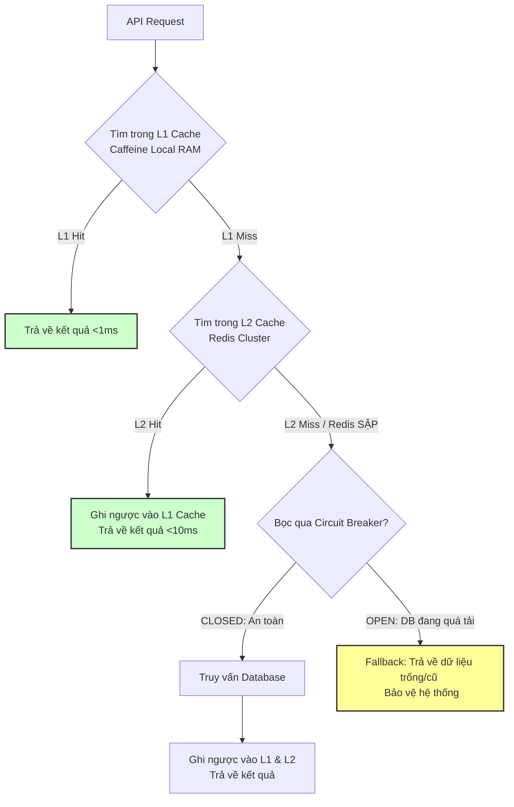

# Cache avalanche là gì?

## ⚡ Tóm tắt ngắn (30s)
* **Bản chất**: **Cache Avalanche** (Tuyết lở Cache) xảy ra khi một lượng lớn key trong cache **hết hạn (expired) đồng loạt** vào cùng một thời điểm, hoặc khi **toàn bộ cụm Redis bị sập vật lý**. Hệ thống lập tức mất đi tấm khiên bảo vệ trên diện rộng, khiến hàng vạn truy vấn từ phía người dùng dội thẳng xuống Database chính cùng một lúc.
* **Thảm họa thực chiến được giải quyết**:
  1. **Sập hệ thống hàng loạt (Cascading Failure)**: Database bị quá tải tức thì, cạn kiệt Connection Pool làm toàn bộ các service nghiệp vụ (kể cả luồng Ghi/Write) bị tê liệt hoàn toàn.
  2. **Nghẽn mạng nội bộ**: Băng thông kết nối giữa Web Service và Database bị nghẽn do truyền tải lượng dữ liệu khổng lồ đột ngột.
* **Quyết định Senior**:
  1. **Áp dụng Kỹ thuật Jitter (TTL ngẫu nhiên)**: Tuyệt đối không đặt TTL cố định cho nhóm key lớn. Bắt buộc cộng thêm một khoảng thời gian ngẫu nhiên (ví dụ: `TTL = 10 phút + Random(1 đến 5 phút)`) để rải đều thời điểm hết hạn của các key.
  2. **Kiến trúc Cache nhiều lớp (Multi-level Caching)**: Kết hợp **Local Cache (Caffeine)** trên RAM của Web instance làm lớp đệm thứ nhất và **Redis** làm lớp đệm thứ hai.
  3. **Chống sập bằng Hàng đợi & Circuit Breaker**: Sử dụng Resilience4j Rate Limiter để giới hạn số lượng request được phép quét DB cùng lúc khi xảy ra tuyết lở.

---

## 🔍 Chi tiết bản chất thực chiến: Cơ chế kích hoạt & Kịch bản Phòng chống

### 1. Phân biệt Cache Stampede và Cache Avalanche
Rất nhiều kỹ sư nhầm lẫn giữa hai khái niệm này, hãy làm rõ để gây ấn tượng với interviewer:
* **Cache Stampede (Thần tốc)**: Xảy ra với **MỘT (01) Hot Key** duy nhất nhưng có lượng traffic truy cập siêu khủng.
* **Cache Avalanche (Tuyết lở)**: Xảy ra với **HÀNG LOẠT (Hàng nghìn/Hàng triệu) Key** khác nhau bị hết hạn đồng loạt (ví dụ: do chạy script nạp dữ liệu định kỳ vào lúc 0h00 và đặt TTL đều là 1 tiếng).

---

### 2. Giải pháp 1: Áp dụng TTL Jitter (Độ lệch ngẫu nhiên)
Nếu hệ thống của bạn có tiến trình chạy định kỳ điền dữ liệu cho 100.000 sản phẩm vào cache, và bạn đặt TTL cứng là 2 giờ:
* Đúng 2 giờ sau, 100.000 key này biến mất khỏi Redis cùng một giây.
* **Giải pháp**:
  ```
  Key 1: TTL = 120 phút + 3 phút = 123 phút
  Key 2: TTL = 120 phút - 1 phút = 119 phút
  Key 3: TTL = 120 phút + 5 phút = 125 phút
  ```
  Nhờ có Jitter, thời điểm hết hạn của 100.000 key sẽ được rải đều trong suốt 10-15 phút, giúp Database xử lý truy vấn đọc rải rác cực kỳ nhẹ nhàng.

---

### 3. Giải pháp 2: Kiến trúc Multi-level Cache (Caffeine + Redis)
Đây là thiết kế tối cao của Senior để chống chịu sự cố cụm Redis sập vật lý hoàn toàn:

```
[API Request] ────> [1. Local Cache (Caffeine - RAM Instance)] ──> TRẢ VỀ (Tốc độ cực siêu tốc < 1ms)
                           │
                      (Cache Miss)
                           ▼
                  [2. Distributed Cache (Redis)] ────────────────> TRẢ VỀ (Tốc độ < 10ms)
                           │
                      (Cache Miss / Redis Sập)
                           ▼
                  [3. Database (RDBMS)] ────────────────────────> TRẢ VỀ & Nạp ngược lên
```
* **Ưu điểm**: Nếu cụm Redis bị sập nguồn, Local Cache (Caffeine) vẫn cứu sống hệ thống, chặn đứng 70-80% traffic không đập xuống DB.

---

## 🎨 Sơ đồ trực quan (Kiến trúc Cache nhiều lớp chống Tuyết lở)



---

## 💻 Code thực chiến: Triển khai L1 Caffeine + L2 Redis trong Spring Boot

Dưới đây là cách cấu hình kiến trúc Cache 2 lớp (Multi-level Caching) hoàn chỉnh sử dụng thư viện Spring Cache kết hợp Caffeine và Redis.

### 1. Triển khai Class Custom Cache Manager quản lý 2 lớp L1 & L2
```java
import com.github.benmanes.caffeine.cache.Caffeine;
import lombok.RequiredArgsConstructor;
import lombok.extern.slf4j.Slf4j;
import org.springframework.cache.Cache;
import org.springframework.cache.support.SimpleValueWrapper;
import org.springframework.data.redis.core.RedisTemplate;
import org.springframework.stereotype.Service;

import java.util.concurrent.Callable;
import java.util.concurrent.TimeUnit;

@Slf4j
@Service
@RequiredArgsConstructor
public class MultiLevelCacheService {

    private final RedisTemplate<String, Object> redisTemplate;

    // ✅ KHỞI TẠO L1 CACHE (Caffeine RAM cục bộ)
    private final com.github.benmanes.caffeine.cache.Cache<String, Object> l1Cache = Caffeine.newBuilder()
            .expireAfterWrite(1, TimeUnit.MINUTES) // Chỉ lưu trên RAM instance 1 phút để tránh lệch dữ liệu quá lâu
            .maximumSize(10000) // Tối đa 10k bản ghi trên RAM
            .build();

    private static final String REDIS_PREFIX = "cache:product:";

    public Object get(String key) {
        // 1. Kiểm tra L1 Cache (Caffeine RAM)
        Object value = l1Cache.getIfPresent(key);
        if (value != null) {
            log.info("🎯 L1 Cache Hit (Caffeine) cho key: {}", key);
            return value;
        }

        // 2. L1 Miss -> Kiểm tra L2 Cache (Redis) bọc trong try-catch để phòng Redis sập
        try {
            value = redisTemplate.opsForValue().get(REDIS_PREFIX + key);
            if (value != null) {
                log.info("🚀 L2 Cache Hit (Redis) cho key: {}. Ghi ngược lên L1.", key);
                l1Cache.put(key, value); // Ghi ngược lên L1 để request sau nhanh hơn
                return value;
            }
        } catch (Exception e) {
            log.error("🚨 REDIS SẬP: Không thể đọc L2 Cache. Đang bypass xuống DB! Lỗi: {}", e.getMessage());
        }

        return null; // Báo hiệu cả 2 lớp đều Miss
    }

    public void put(String key, Object value) {
        // Ghi đồng thời vào cả 2 lớp Cache
        l1Cache.put(key, value);
        try {
            // ✅ KỸ THUẬT JITTER: Cộng thêm thời gian ngẫu nhiên từ 1 - 5 phút vào TTL 10 phút
            long randomJitterSeconds = 600 + (long) (Math.random() * 300);
            redisTemplate.opsForValue().set(REDIS_PREFIX + key, value, randomJitterSeconds, TimeUnit.SECONDS);
            log.info("💾 Đã lưu dữ liệu vào L1 & L2 thành công! TTL: {} giây", randomJitterSeconds);
        } catch (Exception e) {
            log.error("🚨 REDIS SẬP: Không thể ghi L2 Cache. Lỗi: {}", e.getMessage());
        }
    }

    public void evict(String key) {
        // Xóa đồng thời ở cả 2 lớp khi cập nhật dữ liệu dưới DB
        l1Cache.invalidate(key);
        try {
            redisTemplate.delete(REDIS_PREFIX + key);
        } catch (Exception e) {
            log.error("🚨 REDIS SẬP: Không thể xóa L2 Cache. Lỗi: {}", e.getMessage());
        }
    }
}
```

### 2. Sử dụng Multi-level Cache trong nghiệp vụ thực tế
```java
import lombok.RequiredArgsConstructor;
import lombok.extern.slf4j.Slf4j;
import org.springframework.stereotype.Service;

@Slf4j
@Service
@RequiredArgsConstructor
public class ProductCatalogService {

    private final ProductRepository productRepository;
    private final MultiLevelCacheService cacheService;

    public ProductDto getProductDetails(String productId) {
        // Đọc từ hệ thống Cache 2 lớp
        Object cachedValue = cacheService.get(productId);
        if (cachedValue != null) {
            return (ProductDto) cachedValue;
        }

        // Cả 2 lớp đều Miss -> Quét DB
        log.warn("🔎 Double Cache Miss! Đang truy cập Database cho sản phẩm {}", productId);
        ProductEntity entity = productRepository.findById(productId)
                .orElseThrow(() -> new ResourceNotFoundException("Không tìm thấy sản phẩm"));

        ProductDto dto = new ProductDto(entity.getId(), entity.getName(), entity.getPrice());

        // Nạp lại vào hệ thống Cache 2 lớp
        cacheService.put(productId, dto);

        return dto;
    }
}
```

---

## 📊 Bảng so sánh các biện pháp khắc phục Tuyết lở Cache

| Tiêu chí | Jitter (TTL ngẫu nhiên) | L1 + L2 Cache (Caffeine + Redis) | Circuit Breaker (Resilience4j) |
| :--- | :--- | :--- | :--- |
| **Mức độ phòng thủ** | Ngăn chặn hiện tượng hết hạn key đồng loạt. | Ngăn sập hệ thống khi cụm Redis bị sập vật lý hoàn toàn. | Cứu mạng Database khi tuyết lở đã xảy ra trên production. |
| **Độ trễ hệ thống** | Thấp (Đọc Redis nhanh chóng). | **Siêu thấp (<1ms)** nhờ lớp L1 Caffeine trực tiếp trên RAM. | Tăng nhẹ (Nếu kích hoạt chế độ Fallback). |
| **Tính đồng nhất dữ liệu** | Rất tốt. | **Kém hơn** (RAM instance có dữ liệu khác nhau, chỉ nên đặt TTL L1 ngắn < 1 phút). | Rất tốt. |
| **Chi phí hạ tầng** | **Bằng 0** (Chỉ sửa logic sinh số ngẫu nhiên trong code). | Tốn thêm RAM của Web Service để chứa Local Cache. | Thấp (Chi phí CPU cực nhỏ để đếm lỗi). |

---

## ⚠️ Common Gotchas & Questions follow-up

### 1. Cạm bẫy "Data Inconsistency giữa các Instance do L1 Cache (Nhiễm độc dữ liệu local)"
* **Vấn đề**: Khi sử dụng Local Cache (L1 Caffeine), nếu bạn deploy 5 instance Web Service. Admin cập nhật giá trị sản phẩm từ 100$ xuống 80$. Hệ thống gửi lệnh xóa key trên Redis (L2) thành công. Tuy nhiên, Instance 1 đã đọc key này trước đó 5 giây và lưu trong Caffeine. Trong suốt 55 giây tiếp theo, người dùng truy cập vào Instance 1 vẫn thấy giá trị 100$ (dữ liệu cũ), trong khi truy cập vào Instance 2 lại thấy 80$ (dữ liệu mới).
* **Giải pháp khắc phục**:
  1. Chỉ sử dụng Local Cache cho các dữ liệu rất ít khi thay đổi (như danh mục hệ thống, tỉnh thành, cấu hình chung).
  2. Triển khai cơ chế **Redis Pub/Sub**. Khi một Instance gọi lệnh xóa cache, nó bắn một event "Evict" lên Redis channel. Tất cả các Web Instance khác đang lắng nghe channel này sẽ lập tức xóa key tương ứng trong Caffeine của mình.

### 2. Câu hỏi đào sâu từ interviewer
* **Q: Nếu cụm Redis Cluster sập hoàn toàn và ta không có L1 Cache, làm sao để khởi động lại (Cold Start) hệ thống an toàn mà không làm sập Database chính?**
  * *Trả lời*:
    1. **Không mở cổng traffic 100% lập tức**: Phải cấu hình API Gateway hoặc Load Balancer (Nginx/Kong) giới hạn lượng traffic đi vào (ví dụ: chỉ cho phép 5% traffic vào hệ thống trong 10 phút đầu).
    2. Chạy tiến trình **Warm-up script** nạp sẵn 10% các sản phẩm Hot nhất vào cụm Redis mới dựng lại từ DB dự phòng.
    3. Tăng dần giới hạn traffic (10%, 30%, 70%...) lên khi thấy tỷ lệ Cache Hit của Redis đã ổn định trở lại mức an toàn (> 70%).
