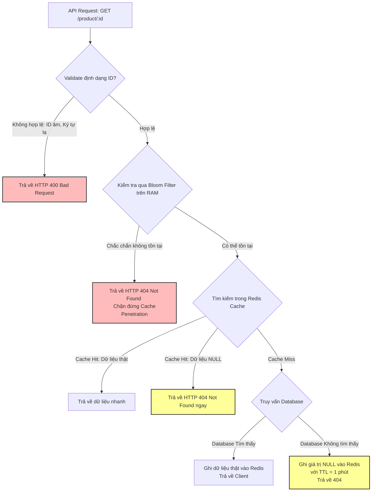

# Cache penetration là gì?

## ⚡ Tóm tắt ngắn (30s)
* **Bản chất**: **Cache Penetration** (Xuyên thủng Cache) xảy ra khi hệ thống nhận liên tục các yêu cầu truy vấn những **Key chắc chắn không tồn tại** trong cả Cache (Redis) lẫn Database chính (RDBMS/NoSQL). Vì key không tồn tại, Redis luôn báo Cache Miss và chuyển request xuống Database. Vì Database cũng không tìm thấy dữ liệu, nên không có gì để lưu lại vào cache. Hậu quả là mọi request tiếp theo với key đó vẫn đâm thẳng qua cache chọc xuống Database.
* **Thảm họa thực chiến được giải quyết**:
  1. **Tấn công DDoS làm sập Database (DB Exhaustion)**: Hacker sử dụng botnet spam hàng triệu request chứa ID sản phẩm ảo (ví dụ: `id = -1`, `id = null`, `id = select * from ...`). Database bị nghẽn CPU ở mức 100% để tìm kiếm các bản ghi ảo này và sập hoàn toàn.
  2. **Tăng vọt chi phí vận hành**: Truy vấn DB liên tục tốn tài nguyên tính toán và chi phí IOPS đắt đỏ trên Cloud.
* **Quyết định Senior**:
  1. **Cache Null Value (Lưu giá trị rỗng)**: Khi Database báo không tồn tại, lập tức ghi nhận giá trị rỗng (như `Null` hoặc chuỗi rỗng `"{}"`) vào Redis với TTL ngắn (ví dụ: 1 đến 2 phút) để chặn đứng các request tiếp theo truy vấn cùng key đó.
  2. **Triển khai Bloom Filter (Bộ lọc xác suất)**: Dựng một bộ lọc hiệu quả bộ nhớ cực cao trước Redis. Nếu Bloom Filter báo key chắc chắn không tồn tại, từ chối request lập tức mà không cần động đến Redis hay DB.
  3. **Khống chế dữ liệu đầu vào khắt khe**: Validate định dạng ID (ví dụ: regex kiểm tra số nguyên dương, UUID hợp lệ) ngay tại API Gateway/Controller để lọc sạch 95% request rác.

---

## 🔍 Chi tiết bản chất thực chiến: Tấn công Key ảo & Cách phòng thủ

### 1. Phân biệt Cache Penetration, Cache Breakdown và Cache Avalanche
Hãy phân biệt rõ ràng 3 khái niệm cực kỳ hay bị nhầm lẫn trong phỏng vấn System Design:
* **Cache Penetration**: Truy vấn key **không tồn tại** trong DB (Luôn xuyên thủng cache xuống DB).
* **Cache Breakdown / Stampede**: Key **CÓ tồn tại** trong DB, nhưng bị hết hạn trong cache đúng lúc traffic cực lớn đập vào.
* **Cache Avalanche**: Hàng loạt key **CÓ tồn tại** bị hết hạn đồng loạt hoặc cụm Redis sập vật lý.

---

### 2. Giải pháp 1: Cache Null Value (Lưu trữ giá trị rỗng)
* **Cơ chế**: Khi người dùng tìm kiếm sản phẩm ID `item_999` (không tồn tại trong hệ thống):
  * Lần 1: Cache Miss -> DB quét trả về `null` -> Ta lưu key `item_999` vào Redis với value là `"{}"` và TTL = 1 phút.
  * Lần 2 đến lần N (trong vòng 1 phút): Cache Hit với giá trị `"{}"` -> Trả về lỗi 404 lập tức mà không chọc xuống Database.
* **Cạm bẫy**: Kẻ tấn công có thể spam các ID ngẫu nhiên khác nhau liên tục (ví dụ: `item_001`, `item_002`... `item_999999`). Việc này làm Redis bị phình to RAM do phải lưu hàng triệu key ảo vô nghĩa.

---

### 3. Giải pháp 2: Sử dụng Bloom Filter (Bộ lọc tối thượng)
* **Cơ chế**: Bloom Filter là một cấu trúc dữ liệu xác suất siêu nhẹ trên bộ nhớ RAM:
  * Khi khởi động ứng dụng, nạp toàn bộ ID sản phẩm hợp lệ từ DB vào Bloom Filter.
  * Khi có request, Bloom Filter kiểm tra nhanh xem ID đó có thuộc tập hợp hợp lệ hay không.
  * Đặc tính toán học của Bloom Filter:
    * Nếu Bloom Filter nói **"Không tồn tại"**: Chắc chắn 100% key đó không tồn tại trong hệ thống -> Chặn ngay lập tức!
    * Nếu Bloom Filter nói **"Có thể tồn tại"**: Đi tiếp vào Redis/DB. Chấp nhận tỉ lệ sai số dương tính giả (False Positive) cực nhỏ (< 1%) lọt qua.
* **Ưu điểm**: Cực kỳ tiết kiệm bộ nhớ RAM. Lưu 10 triệu ID sản phẩm chỉ tốn khoảng 10MB RAM.

---

## 🎨 Sơ đồ trực quan (Giải pháp kết hợp Bloom Filter & Cache Null Value)



---

## 💻 Code thực chiến: Triển khai Bloom Filter và Cache Null Value bảo mật cao

### 1. Triển khai Bloom Filter bằng Redisson (Distributed Bloom Filter)
Sử dụng Redis Bloom Filter qua thư viện Redisson để tất cả các Web instance chia sẻ chung một bộ lọc xác suất đồng nhất.

```java
import lombok.RequiredArgsConstructor;
import lombok.extern.slf4j.Slf4j;
import org.redisson.api.RBloomFilter;
import org.redisson.api.RedissonClient;
import org.springframework.stereotype.Service;

import javax.annotation.PostConstruct;
import java.util.List;

@Slf4j
@Service
@RequiredArgsConstructor
public class DistributedBloomFilterService {

    private final RedissonClient redissonClient;
    private final ProductRepository productRepository;
    
    private RBloomFilter<String> productBloomFilter;

    @PostConstruct
    public void init() {
        // Khởi tạo Distributed Bloom Filter trên Redis
        productBloomFilter = redissonClient.getBloomFilter("bloom:products");
        
        // Cấu hình: Sức chứa dự kiến 1,000,000 phần tử, tỉ lệ lỗi dương tính giả 1%
        productBloomFilter.tryInit(1000000L, 0.01);

        // Nạp dữ liệu từ DB lên Bloom Filter nếu bộ lọc trống (Lần đầu chạy hệ thống)
        if (productBloomFilter.count() == 0) {
            log.info("🌱 Đang nạp ID sản phẩm từ DB lên Distributed Bloom Filter...");
            List<String> ids = productRepository.findAllIds();
            ids.forEach(id -> productBloomFilter.add(id));
            log.info("✅ Nạp thành công {} IDs lên Bloom Filter!", ids.size());
        }
    }

    public boolean mightContain(String productId) {
        return productBloomFilter.contains(productId);
    }

    public void add(String productId) {
        productBloomFilter.add(productId);
    }
}
```

### 2. Triển khai Luồng Nghiệp vụ Kết hợp Khống chế Key ảo
```java
import lombok.RequiredArgsConstructor;
import lombok.extern.slf4j.Slf4j;
import org.springframework.data.redis.core.RedisTemplate;
import org.springframework.stereotype.Service;

import java.util.concurrent.TimeUnit;

@Slf4j
@Service
@RequiredArgsConstructor
public class ProductSecureCatalogService {

    private final ProductRepository productRepository;
    private final RedisTemplate<String, Object> redisTemplate;
    private final DistributedBloomFilterService bloomFilterService;

    private static final String CACHE_PREFIX = "app:product:";
    private static final String NULL_VALUE = "{}"; // Đại diện cho giá trị trống

    public ProductDto getProductSecured(String productId) {
        // 1. Khống chế đầu vào cơ bản (Regex validation)
        if (productId == null || !productId.matches("^[a-zA-Z0-9_-]{8,36}$")) {
            log.warn("🚨 chặn ID rác hoặc SQL Injection payload: {}", productId);
            throw new InvalidInputException("Định dạng ID không hợp lệ!");
        }

        // 2. Kiểm tra nhanh qua Bloom Filter
        if (!bloomFilterService.mightContain(productId)) {
            log.warn("🛑 CHẶN ĐỨNG CACHE PENETRATION: ID {} không tồn tại trong hệ thống!", productId);
            throw new ResourceNotFoundException("Sản phẩm không tồn tại");
        }

        // 3. Đọc dữ liệu từ Redis Cache
        String cacheKey = CACHE_PREFIX + productId;
        Object cachedData = redisTemplate.opsForValue().get(cacheKey);

        if (cachedData != null) {
            if (NULL_VALUE.equals(cachedData)) {
                log.info("🎯 Cache Hit: Giá trị NULL ảo được ghi nhận trước đó cho key {}", cacheKey);
                throw new ResourceNotFoundException("Sản phẩm không tồn tại");
            }
            return (ProductDto) cachedData;
        }

        // 4. Cache Miss -> Truy vấn DB
        log.warn("🔎 Cache Miss! Đang truy vấn Database cho sản phẩm {}", productId);
        ProductEntity entity = productRepository.findById(productId).orElse(null);

        if (entity == null) {
            // ✅ GHI NHẬN GIÁ TRỊ NULL VỚI TTL NGẮN 1 PHÚT để chặn spam tiếp theo
            redisTemplate.opsForValue().set(cacheKey, NULL_VALUE, 1, TimeUnit.MINUTES);
            log.info("💾 Đã lưu giá trị NULL tạm thời vào Redis cho key {}", cacheKey);
            throw new ResourceNotFoundException("Sản phẩm không tồn tại");
        }

        ProductDto dto = new ProductDto(entity.getId(), entity.getName(), entity.getPrice());
        
        // Ghi lại dữ liệu thật với TTL 15 phút
        redisTemplate.opsForValue().set(cacheKey, dto, 15, TimeUnit.MINUTES);
        
        return dto;
    }
}
```

---

## 📊 Bảng so sánh 3 Phương án đối phó Cache Penetration

| Tiêu chí | Lưu giá trị Null (Cache Null Value) | Bloom Filter (Bộ lọc xác suất) | Lọc định dạng (API Gateway Validation) |
| :--- | :--- | :--- | :--- |
| **Bảo vệ hạ tầng** | Trung bình (Lần đầu vẫn chọc xuống DB). | **Tuyệt đối** (Chặn đứng trước khi chạm vào Redis/DB). | Trung bình (Chỉ chặn được ID sai định dạng cấu trúc). |
| **Tiêu tốn bộ nhớ RAM** | **Khá tốn** (Nếu kẻ xấu spam hàng triệu key ngẫu nhiên khác nhau). | **Cực kỳ thấp** (Vài MB lưu hàng triệu dòng). | **Bằng 0** (Chỉ chạy logic Regex trong code). |
| **Độ chính xác** | 100% chính xác tuyệt đối. | Chấp nhận sai số nhỏ (Ví dụ: 1% key ảo vẫn lọt qua). | 100% chính xác tuyệt đối. |
| **Độ phức tạp code** | Rất thấp. | Trung bình (Cần quản trị Bloom Filter khi tạo mới/xóa dữ liệu). | Thấp. |

---

## ⚠️ Common Gotchas & Questions follow-up

### 1. Cạm bẫy "Bloom Filter Bị Lệch Dữ Liệu Khi Xóa Bản Ghi (Hard Delete)"
* **Vấn đề**: Cấu trúc dữ liệu Standard Bloom Filter chỉ hỗ trợ thêm (`add`) và kiểm tra (`contains`), hoàn toàn **không hỗ trợ xóa (`remove`)**. Khi admin xóa vĩnh viễn sản phẩm `item_100` ra khỏi Database, ta không thể xóa nó khỏi Bloom Filter. Kết quả là Bloom Filter vẫn báo "Có thể tồn tại", request của khách hàng vẫn lọt qua cache đâm thẳng xuống DB, gây ra hiện tượng Cache Miss vô ích.
* **Giải pháp khắc phục**:
  1. Sử dụng **Counting Bloom Filter** (hỗ trợ đếm tần suất và cho phép xóa nhưng tốn bộ nhớ gấp 4 lần).
  2. Áp dụng chính sách **Soft Delete** (không xóa vật lý trong DB, chỉ đánh dấu trạng thái `status = 'DELETED'`). Khi đó, Bloom Filter vẫn đúng, và khi xuống DB ta trả về trạng thái Deleted ngay lập tức.
  3. Định kỳ rebuild lại Bloom Filter vào ban đêm (Offline Rebuild) bằng cách quét sạch bảng ID từ DB nạp vào Bloom Filter mới và ghi đè lên bộ lọc cũ.

### 2. Câu hỏi đào sâu từ interviewer
* **Q: Có nên sử dụng Local Bloom Filter ở RAM của từng Web Instance thay vì Distributed Bloom Filter trên Redis không?**
  * *Trả lời*:
    * **Local Bloom Filter (Guava)**: Thích hợp khi dung lượng dữ liệu nhỏ, các instance chạy độc lập và không muốn tạo thêm kết nối mạng (Network I/O) sang Redis làm chậm latency.
    * **Distributed Bloom Filter (Redisson)**: Thích hợp khi hệ thống có hàng chục instance Web, lượng dữ liệu lớn và liên tục được cập nhật. Nếu dùng Local, khi admin thêm 1 sản phẩm mới ở Instance 1, Instance 2 không biết nên sẽ chặn nhầm request của người dùng (False Negative) do ID mới chưa được nạp vào Local RAM của Instance 2.
