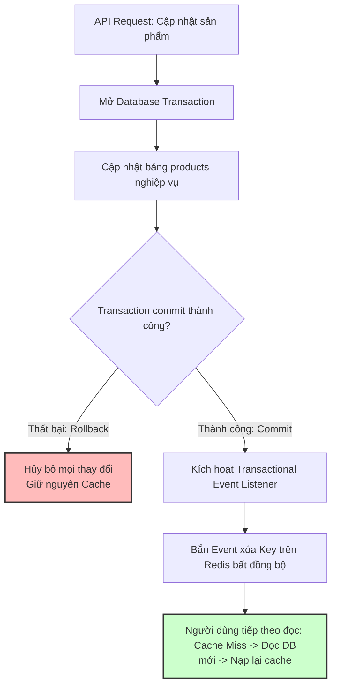

# Dữ liệu trong cache cũ hơn database, bạn xử lý thế nào?

## ⚡ Tóm tắt ngắn (30s)
* **Bản chất**: Sự không nhất quán dữ liệu giữa Cache và Database (**Cache-DB Inconsistency**) xảy ra khi một thao tác cập nhật dữ liệu dưới Database thành công nhưng Cache vẫn lưu giữ giá trị cũ (Stale Data). Trong các hệ thống phân tán High-concurrency, việc duy trì tính nhất quán tuyệt đối (Strong Consistency) là cực kỳ khó khăn và tốn chi phí. Quyết định của một Senior là chấp nhận **Eventual Consistency** (Nhất quán cuối cùng) và áp dụng các chiến lược cập nhật cache an toàn.
* **Thảm họa thực chiến được giải quyết**:
  1. **Lệch giá trị thanh toán**: Khách hàng thấy giá sản phẩm đã giảm trên UI (do đọc DB hoặc cache mới) nhưng khi thanh toán hệ thống lại tính giá cũ (do đọc từ cache stale), trực tiếp gây khiếu nại pháp lý nghiêm trọng.
  2. **Race Condition khi cập nhật đồng thời**: Hai request ghi đồng thời xen kẽ nhau làm cache bị ghi đè bởi dữ liệu cũ hơn cả Database (Hiện tượng "Out of Order Update").
* **Quyết định Senior**:
  1. **Tuân thủ Cache-Aside Pattern (Đọc ghi tách biệt)**: Khi cập nhật Database, **tuyệt đối không cập nhật đè cache (Update Cache) mà luôn thực hiện XÓA cache (Delete/Evict Cache)**. Việc xóa cache ép buộc request đọc tiếp theo phải truy vấn dữ liệu mới nhất từ DB nạp lại lên cache.
  2. **Sử dụng Spring @TransactionalEventListener**: Chỉ kích hoạt hành động xóa cache **sau khi** Database Transaction đã Commit thành công để tránh lỗi DB rollback nhưng cache đã bị xóa hoặc ngược lại.
  3. **Hạ tầng tự động hóa bằng CDC (Debezium + Kafka)**: Đối với các hệ thống Microservices phức tạp, sử dụng công cụ Change Data Capture (CDC) quét Transaction Log của DB để tự động xóa cache bất đồng bộ, giải phóng code nghiệp vụ khỏi logic cache.

---

## 🔍 Chi tiết bản chất thực chiến: Tại sao nên Xóa Cache thay vì Cập nhật Cache?

Một câu hỏi phỏng vấn kinh điển: **"Khi update DB, ta nên Update Cache hay Delete Cache?"**

### 1. Tại sao KHÔNG nên Update Cache? (Cạm bẫy Race Condition)
Giả sử có 2 request cập nhật (Request A và Request B) cùng tác động vào 1 bản ghi:

```
[Request A] ── Ghi DB thành công (Giá trị = 10)
     │
     │                      [Request B] ── Ghi DB thành công (Giá trị = 20)
     │                                           │
     │                      [Request B] ── Ghi đè Cache (Cache = 20)
     ▼
[Request A] ── Chạy chậm hơn do nghẽn mạng -> Ghi đè Cache (Cache = 10)
```
* **Hậu quả**: Dưới Database giá trị cuối cùng là **20** (của B), nhưng trên Cache giá trị cuối cùng lại là **10** (của A). Cache bị lệch vĩnh viễn cho đến khi hết hạn TTL!
* **Nếu chọn Delete Cache**: Cả A và B đều xóa cache. Luồng đọc tiếp theo chắc chắn sẽ xuống DB lấy giá trị mới nhất (20) nạp lên cache. Hệ thống tự động nhất quán!

---

### 2. Cạm bẫy thứ tự: Xóa Cache trước hay Ghi DB trước?
* **Kịch bản 1: Xóa Cache trước, Ghi DB sau** (Cực kỳ nguy hiểm!):
  * Request A (Ghi): Xóa Cache thành công.
  * Request B (Đọc): Nhận Cache Miss -> Xuống DB đọc giá trị cũ (10) -> Nạp giá trị cũ (10) lên Cache.
  * Request A (Ghi): Hoàn tất ghi DB giá trị mới (20).
  * **Hậu quả**: Cache lưu giá trị cũ (10), DB lưu giá trị mới (20). Lệch vĩnh viễn!
* **Kịch bản 2: Ghi DB trước, Xóa Cache sau** (An toàn nhất):
  * Request A (Đọc): Cache Miss.
  * Request A (Đọc): Xuống DB đọc giá trị cũ (10).
  * Request B (Ghi): Ghi DB giá trị mới (20) -> Thực hiện xóa cache.
  * Request A (Đọc): Nạp giá trị cũ (10) lên cache (Lúc này cache đã bị B xóa nên hành động nạp này đè lên khoảng trống).
  * **Hậu quả**: Tỉ lệ xảy ra tranh chấp ở kịch bản 2 là cực kỳ nhỏ vì thời gian đọc DB và nạp cache chỉ mất vài mili-giây, nhanh hơn rất nhiều so với thời gian ghi DB.

---

## 🎨 Sơ đồ trực quan (Quy trình Ghi DB trước - Xóa Cache sau bằng Transaction Listener)



---

## 💻 Code thực chiến: Đồng bộ hóa Cache bằng Transactional Event Listener

Để đảm bảo tính toàn vẹn: **Chỉ xóa cache sau khi DB đã commit thực sự thành công**, chúng ta sử dụng cơ chế Event Publisher của Spring Boot.

### 1. Định nghĩa Event và Service nghiệp vụ ghi dữ liệu
```java
import lombok.AllArgsConstructor;
import lombok.Getter;

@Getter
@AllArgsConstructor
public class ProductUpdateEvent {
    private final String productId;
}
```

```java
import lombok.RequiredArgsConstructor;
import lombok.extern.slf4j.Slf4j;
import org.springframework.context.ApplicationEventPublisher;
import org.springframework.stereotype.Service;
import org.springframework.transaction.annotation.Transactional;

@Slf4j
@Service
@RequiredArgsConstructor
public class ProductAdminService {

    private final ProductRepository productRepository;
    private final ApplicationEventPublisher eventPublisher;

    @Transactional // ✅ MỞ DB TRANSACTION
    public void updateProductPrice(String productId, double newPrice) {
        log.info("💾 Đang cập nhật giá sản phẩm {} dưới DB...", productId);
        
        ProductEntity entity = productRepository.findById(productId)
                .orElseThrow(() -> new ResourceNotFoundException("Sản phẩm không tồn tại"));
        entity.setPrice(newPrice);
        productRepository.save(entity); // 1. Ghi DB nghiệp vụ

        // 2. Phát tán Event xóa cache (Chưa chạy ngay, nằm chờ DB commit)
        eventPublisher.publishEvent(new ProductUpdateEvent(productId));
        log.info("📣 Đã phát event cập nhật sản phẩm {}, chờ DB commit...", productId);
    }
}
```

### 2. Transactional Listener xử lý xóa Cache sau khi Commit thành công
```java
import lombok.RequiredArgsConstructor;
import lombok.extern.slf4j.Slf4j;
import org.springframework.data.redis.core.RedisTemplate;
import org.springframework.stereotype.Component;
import org.springframework.transaction.event.TransactionPhase;
import org.springframework.transaction.event.TransactionalEventListener;

@Slf4j
@Component
@RequiredArgsConstructor
public class ProductCacheSyncListener {

    private final RedisTemplate<String, Object> redisTemplate;
    private static final String CACHE_PREFIX = "app:product:";

    // ✅ CHỈ CHẠY SAU KHI TRANSACTION COMMIT THÀNH CÔNG
    @TransactionalEventListener(phase = TransactionPhase.AFTER_COMMIT)
    public void handleProductUpdate(ProductUpdateEvent event) {
        String cacheKey = CACHE_PREFIX + event.getProductId();
        log.info("⚡ DB COMMIT THÀNH CÔNG! Đang thực hiện xóa key cache: {}", cacheKey);
        
        try {
            redisTemplate.delete(cacheKey); // Xóa cache
            log.info("✅ Đã xóa sạch cache cho key: {}!", cacheKey);
        } catch (Exception e) {
            // Nếu Redis sập không thể xóa, ta cần ghi nhận vào Dead Letter Queue hoặc retry cơ chế phụ
            log.error("🚨 Lỗi kết nối Redis khi xóa cache cho key: {}. Lỗi: {}", cacheKey, e.getMessage());
        }
    }
}
```

---

## 📊 Bảng so sánh 3 Chiến thuật quản lý nhất quán dữ liệu Cache

| Tiêu chí so sánh | Cache-Aside (Xóa Cache sau Commit) | Read/Write-Through (Đọc ghi trực tiếp qua cache) | CDC (Change Data Capture - Debezium) |
| :--- | :--- | :--- | :--- |
| **Mức độ nhất quán** | **Cao** (Eventual consistency cực nhanh). | Tuyệt đối (Cache đóng vai trò là DB). | **Tuyệt đối nhất quán** (CDC tự động quét DB log để đồng bộ). |
| **Mức độ phụ thuộc hạ tầng** | Thấp (Chỉ viết logic trong code ứng dụng). | Rất cao (Thư viện cache phải tích hợp sâu với DB). | Cao (Cần chạy Kafka, Debezium Connectors). |
| **Tác động lên Latency ghi** | Thấp (Chỉ tốn thêm lệnh xóa cache bất đồng bộ). | Cao (Phải ghi đồng thời cả Cache và DB). | **Bằng 0** (CDC chạy ngầm bất đồng bộ hoàn toàn). |
| **Phù hợp với** | 95% các hệ thống Enterprise thông thường. | Hệ thống ghi ít, đọc siêu nhiều và cần dữ liệu thời gian thực. | Hệ thống lớn, kiến trúc Microservices phân tách DB. |

---

## ⚠️ Common Gotchas & Questions follow-up

### 1. Cạm bẫy "Xóa Cache Thất Bại do mạng nghẽn (Redis Eviction Failure)"
* **Vấn đề**: DB commit thành công, Event Listener kích hoạt lệnh `redisTemplate.delete(key)` nhưng đúng lúc đó mạng nội bộ bị nghẽn làm lệnh xóa Redis bị timeout/thất bại. DB đã có giá trị mới, Redis vẫn giữ giá trị cũ vĩnh viễn.
* **Giải pháp khắc phục**: 
  1. Luôn cài đặt **TTL ngắn** (ví dụ: 15 - 30 phút) cho mọi key trong cache để nếu có sự cố nghẽn mạng xóa hụt, dữ liệu lệch cũng tự động được dọn dẹp sau một khoảng thời gian ngắn.
  2. Áp dụng kỹ thuật **Delayed Double Delete** (Xóa kép có trì hoãn): Luồng cập nhật sẽ xóa cache -> ghi DB -> chờ 500ms -> xóa cache lần nữa để quét sạch mọi luồng đọc cũ đang bay lơ lửng giữa mạng nạp đè dữ liệu cũ lên cache.

### 2. Câu hỏi đào sâu từ interviewer
* **Q: Làm sao thiết kế hệ thống Cache đảm bảo Strong Consistency (Nhất quán tuyệt đối) như Database?**
  * *Trả lời*:
    * Để đạt Strong Consistency, bắt buộc phải đánh đổi hiệu năng (Latency tăng cao) bằng cách áp dụng cơ chế khóa hai pha (**Distributed Lock / Redisson Write Lock**):
      * Khi luồng Ghi cập nhật DB: Chiếm hữu **Write Lock**. Toàn bộ các request đọc vào key đó sẽ bị block.
      * Khi luồng Ghi cập nhật xong cả DB và Cache: Giải phóng Write Lock. Lúc này các request đọc mới được phép truy cập và đọc dữ liệu mới nhất.
    * Kỹ thuật này chỉ nên áp dụng cho các dữ liệu nhạy cảm liên quan đến tài chính, ví điện tử, số dư tài khoản.
