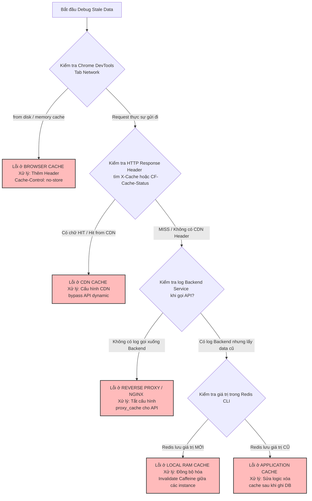

# User thấy data cũ sau khi update. Có thể do cache ở đâu?

## ⚡ Tóm tắt ngắn (30s)
* **Bản chất**: Hiện tượng người dùng vẫn thấy dữ liệu cũ (Stale Data) sau khi hệ thống báo cập nhật thành công là kết quả của việc cache tồn tại ở **nhiều lớp khác nhau (Multi-layered Caching)** trong kiến trúc từ Client đến Database. Một Senior Engineer không bao giờ chỉ rà soát Redis, mà phải có tư duy hệ thống để "bắt bệnh" cache tại 5 tầng phân cấp: **Browser Cache (Client)**, **CDN (Edge)**, **Reverse Proxy / Gateway**, **Application Cache (Redis)**, và **Local RAM Instance**.
* **Thảm họa thực chiến được giải quyết**:
  1. **Tổn hao tài nguyên vô ích**: Kỹ sư liên tục chạy lệnh xóa sạch (Flush) cụm Redis trên production nhưng người dùng vẫn thấy data cũ, gây hoang mang cho đội ngũ vận hành và làm gián đoạn kinh doanh.
  2. **Bất đồng nhất trạng thái thanh toán/đơn hàng**: User cập nhật địa chỉ giao hàng mới thành công nhưng đơn hàng vẫn gửi về địa chỉ cũ do hệ thống đọc cache stale từ một lớp trung gian.
* **Quyết định Senior**:
  1. **Rà soát HTTP Response Headers**: Kiểm tra các header `Cache-Control`, `Expires`, `ETag` trả về từ API để xác định Browser hay CDN có đang tự ý cache lại API động hay không.
  2. **Áp dụng Cache Busting**: Cài đặt versioning hoặc timestamp vào query param của API gọi từ Front-End khi có thao tác update dữ liệu chủ động.
  3. **Purge Cache diện rộng bằng Webhook**: Khi Admin cập nhật dữ liệu cốt lõi, kích hoạt webhook tự động gọi API của CDN (như Cloudflare) để dọn sạch (Purge) key tương ứng trên toàn cầu.

---

## 🔍 Chi tiết bản chất thực chiến: Bản đồ 5 lớp cache từ Client đến Server

Để debug chính xác, hãy rà soát theo đúng lộ trình di chuyển của một Request:

```
[Client Trình duyệt] ──> [CDN / Edge Cloudflare] ──> [Nginx / API Gateway]
                                                           │
                                                           ▼
[Local RAM (Caffeine)] <── [Redis Distributed] <── [Backend Service]
```

---

### 1. Lớp 1: Browser Cache (Trình duyệt của Client)
* **Cơ chế**: Trình duyệt lưu trữ response của API trên ổ đĩa/RAM của thiết bị người dùng dựa trên HTTP Header trả về từ server.
* **Dấu hiệu nhận biết**: Mở tab Network trên Chrome DevTools, nếu thấy dòng `Status Code: 200 OK (from disk cache)` hoặc `(from memory cache)`, dữ liệu cũ đang được đọc trực tiếp từ máy Client mà không hề gửi bất kỳ request nào lên server.
* **Khắc phục**: Cấu hình API động luôn trả về Header:
  ```http
  Cache-Control: no-store, no-cache, must-revalidate, max-age=0
  Pragma: no-cache
  ```

---

### 2. Lớp 2: CDN Cache (Cloudflare, AWS CloudFront, Akamai)
* **Cơ chế**: CDN lưu giữ bản sao của API tại các node mạng gần người dùng nhất để giảm tải cho máy chủ gốc (Origin Server).
* **Dấu hiệu nhận biết**: Kiểm tra HTTP Header của response, nếu thấy `CF-Cache-Status: HIT` (của Cloudflare) hoặc `X-Cache: Hit from cloudfront`, nghĩa là CDN đang chặn request và trả ngay data cũ.
* **Khắc phục**: 
  * Cấu hình CDN chỉ cache tài nguyên tĩnh (Images, CSS, JS). Cấm cache các đường dẫn API động (`/api/v1/*`).
  * Gọi API Purge Cache của CDN khi có sự kiện thay đổi dữ liệu nghiệp vụ quan trọng.

---

### 3. Lớp 3: Reverse Proxy / API Gateway Cache (Nginx, Kong, Apisix)
* **Cơ chế**: Nginx được cấu hình `proxy_cache` để tự động lưu lại kết quả của các API nặng nhằm cứu cánh cho Backend.
* **Dấu hiệu nhận biết**: Latency của API siêu nhanh (< 2ms) nhưng không thấy bất kỳ log nào xuất hiện ở Backend Service.
* **Khắc phục**: Cấu hình Nginx bỏ qua cache khi request chứa Header `Cache-Control: no-cache` hoặc cấu hình chi tiết `proxy_cache_bypass`.

---

### 4. Lớp 4: Distributed Cache (Redis / Memcached)
* **Cơ chế**: Nơi lưu trữ dữ liệu nghiệp vụ tập trung ở tầng Backend.
* **Khắc phục**: Áp dụng đúng mẫu thiết kế **Cache-Aside** (Xóa key Redis sau khi update DB thành công) như đã phân tích ở câu hỏi trước.

---

### 5. Lớp 5: Local JVM Cache (Caffeine, Ehcache, Hibernate 2nd Level Cache)
* **Cơ chế**: Lưu trực tiếp trên bộ nhớ RAM của từng instance Java Service để tối ưu hóa hiệu năng tối đa.
* **Khắc phục**: Khi có thay đổi dữ liệu, sử dụng cơ chế **Redis Pub/Sub** hoặc **Kafka Event** để thông báo cho toàn bộ các instance Web khác tự động invalidate cache local của mình.

---

## 🎨 Sơ đồ trực quan (Lộ trình Debug Cache rò rỉ dữ liệu cũ)



---

## 💻 Code thực chiến: Cấu hình API chặn Browser Cache & Quét sạch Cache CDN

### 1. Spring Boot Controller: Cấu hình an toàn chặn Browser Cache
Đảm bảo trình duyệt của client luôn luôn gửi request lên server để lấy dữ liệu mới nhất.

```java
import org.springframework.http.CacheControl;
import org.springframework.http.ResponseEntity;
import org.springframework.web.bind.annotation.GetMapping;
import org.springframework.web.bind.annotation.PathVariable;
import org.springframework.web.bind.annotation.RequestMapping;
import org.springframework.web.bind.annotation.RestController;

import java.util.concurrent.TimeUnit;

@RestController
@RequestMapping("/api/v1/orders")
public class OrderController {

    @GetMapping("/{orderId}")
    public ResponseEntity<OrderDto> getOrderDetails(@PathVariable String orderId) {
        OrderDto order = fetchOrderFromDatabase(orderId);

        // ✅ CẤU HÌNH AN TOÀN TUYỆT ĐỐI CHỐNG BROWSER CACHE
        return ResponseEntity.ok()
                .cacheControl(CacheControl.noStore() // Không cho trình duyệt lưu trữ dưới mọi hình thức
                        .mustRevalidate())          // Bắt buộc revalidate với server
                .header("Pragma", "no-cache")        // Hỗ trợ HTTP 1.0 cũ
                .header("Expires", "0")              // Hết hạn ngay lập tức
                .body(order);
    }

    private OrderDto fetchOrderFromDatabase(String orderId) {
        return new OrderDto(orderId, "DELIVERED");
    }
}
```

### 2. Service tự động dọn dẹp Cache CDN Cloudflare khi dữ liệu cập nhật
Khi admin cập nhật thông tin sản phẩm, gọi API của Cloudflare để xóa key cache tương ứng trên các node CDN toàn cầu.

```java
import lombok.RequiredArgsConstructor;
import lombok.extern.slf4j.Slf4j;
import org.springframework.http.HttpEntity;
import org.springframework.http.HttpHeaders;
import org.springframework.http.MediaType;
import org.springframework.stereotype.Service;
import org.springframework.web.client.RestTemplate;

import java.util.Collections;
import java.util.HashMap;
import java.util.Map;

@Slf4j
@Service
@RequiredArgsConstructor
public class CdnCachePurgeService {

    private final RestTemplate restTemplate = new RestTemplate();

    private static final String CLOUDFLARE_API_URL = "https://api.cloudflare.com/client/v4/zones/{zone_id}/purge_cache";
    private static final String ZONE_ID = "cf_zone_id_here";
    private static final String API_TOKEN = "cf_api_token_here";

    public void purgeCdnCacheByUrl(String targetUrl) {
        log.info("🌐 Đang gửi yêu cầu Purge CDN Cache cho URL: {}", targetUrl);

        HttpHeaders headers = new HttpHeaders();
        headers.setContentType(MediaType.APPLICATION_JSON);
        headers.set("Authorization", "Bearer " + API_TOKEN);

        // Thiết lập payload cấu trúc Cloudflare: Purge theo URL cụ thể
        Map<String, Object> body = new HashMap<>();
        body.put("files", Collections.singletonList(targetUrl));

        HttpEntity<Map<String, Object>> requestEntity = new HttpEntity<>(body, headers);

        try {
            restTemplate.postForEntity(CLOUDFLARE_API_URL, requestEntity, String.class, ZONE_ID);
            log.info("✅ Đã xóa CDN Cache thành công cho URL: {}!", targetUrl);
        } catch (Exception e) {
            log.error("🚨 Không thể gửi lệnh Purge CDN Cache. Lỗi: {}", e.getMessage());
        }
    }
}
```

---

## 📊 Bảng so sánh 5 lớp cache và thời gian sống khuyến nghị (TTL)

| Lớp Cache | Tốc độ truy cập (Latency) | Vị trí vật lý | TTL Khuyến nghị | Cách xóa bỏ (Purge/Invalidate) |
| :--- | :--- | :--- | :--- | :--- |
| **Browser Cache** | < 1ms (Đọc từ RAM/Disk Client) | Máy người dùng | **0 giây** (Không nên cache API động) | Sửa HTTP Header, người dùng xóa lịch sử. |
| **CDN Cache** | 5ms - 20ms | Các Edge node toàn cầu | 5 - 10 phút (Cho dữ liệu tĩnh) | Gọi API Purge Cache của CDN. |
| **Reverse Proxy** | 1ms - 5ms | Nginx Server | 1 - 2 phút | Reload proxy hoặc reload service. |
| **Redis Cache** | 2ms - 10ms | Cụm Redis riêng biệt | **15 - 30 phút** (Có Jitter) | Gọi lệnh `DEL key` từ Backend. |
| **Local RAM** | **< 0.1ms** (JVM Memory) | Bộ nhớ RAM của Web instance | **30 - 60 giây** (Siêu ngắn) | Dùng Redis Pub/Sub hoặc Event. |

---

## ⚠️ Common Gotchas & Questions follow-up

### 1. Cạm bẫy "Query Param Poisoning do CDN (Trùng lặp cache CDN)"
* **Vấn đề**: CDN được cấu hình cache bỏ qua query parameter (để tiết kiệm tài nguyên). Khi Front-end áp dụng kỹ thuật Cache Busting bằng cách thêm query param `?t=1234567` nhằm buộc server trả về dữ liệu mới. Tuy nhiên, do CDN bỏ qua query parameter, nó vẫn trả về dữ liệu của request gốc `?t=old_timestamp`, vô hiệu hóa hoàn toàn nỗ lực sửa lỗi của Front-end.
* **Giải pháp khắc phục**: Kiểm tra cấu hình Caching Rule của CDN (Cloudflare), luôn bật tùy chọn **"Cache Level: Cache Everything"** kết hợp **"Respect Query String"** để đảm bảo CDN coi mỗi query parameter khác nhau là một key hoàn toàn độc lập.

### 2. Câu hỏi đào sâu từ interviewer
* **Q: Làm sao thiết kế cơ chế "ETag" để kiểm tra tính hợp lệ của cache mà không cần tốn băng thông truyền dữ liệu lớn?**
  * *Trả lời*:
    * ETag (Entity Tag) là một chuỗi băm (hash) đại diện cho nội dung của bản ghi.
    * Khi client gọi API, server trả về dữ liệu kèm header `ETag: "hash_value_123"`.
    * Lần gọi tiếp theo, client gửi kèm header `If-None-Match: "hash_value_123"`.
    * Server kiểm tra dữ liệu dưới DB, nếu hash không đổi, server lập tức trả về mã HTTP **304 Not Modified** với phần thân (Body) trống hoàn toàn. Client sẽ tự dùng lại cache cũ. Điều này giúp tiết kiệm cực kỳ nhiều băng thông mạng và I/O mạng.
