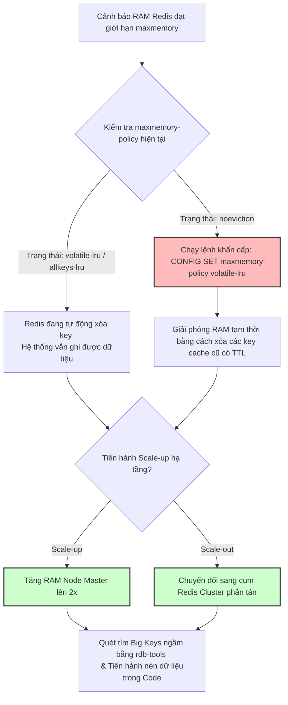

# Redis memory đầy, eviction bắt đầu xảy ra. Bạn làm gì?

## ⚡ Tóm tắt ngắn (30s)
* **Bản chất**: Khi bộ nhớ RAM của Redis đạt tới giới hạn cấu hình (`maxmemory`), Redis sẽ kích hoạt chính sách xóa key (**Eviction Policy**) để giải phóng bộ nhớ cho dữ liệu mới, hoặc từ chối mọi lệnh ghi mới nếu cấu hình là `noeviction`. Sự cố này là hồi chuông báo động đỏ về quản lý vòng đời dữ liệu và cấu hình hạ tầng. Một Senior phải bình tĩnh xử lý theo 2 giai đoạn: **Cứu hỏa khẩn cấp** để hệ thống không crash, và **Tối ưu hóa kiến trúc** để dọn sạch rác RAM tận gốc.
* **Thảm họa thực chiến được giải quyết**:
  1. **Lỗi hệ thống diện rộng (OOM Crash)**: Nếu đặt `maxmemory-policy = noeviction` (mặc định của nhiều hệ thống), Redis đầy RAM sẽ trả về lỗi `OOM command not allowed when used memory > 'maxmemory'`. Toàn bộ các API ghi (như lưu giỏ hàng, cập nhật session, tạo token) sẽ lập tức bị lỗi 500.
  2. **Bắt đăng nhập lại toàn hệ thống (Massive Logout)**: Cấu hình `allkeys-lru` khi hết RAM tự động xóa sạch các Session/JWT Token đang hoạt động của người dùng để nhường chỗ cho cache thông thường, trực tiếp hủy hoại trải nghiệm khách hàng.
* **Quyết định Senior**:
  1. **Hành động khẩn cấp**: Đổi nhanh `maxmemory-policy` từ `noeviction` sang `volatile-lru` bằng lệnh `CONFIG SET` không cần restart Redis để dọn dẹp các key có cài TTL trước. Tăng nhanh RAM của node (Scale-up) hoặc chuyển đổi sang cụm Redis Cluster (Scale-out).
  2. **Săn lùng Big Keys**: Chạy lệnh `redis-cli --bigkeys` hoặc phân tích file RDB để phát hiện các key khổng lồ chiếm dụng RAM vô ích.
  3. **Đặt TTL bắt buộc & Nén dữ liệu**: Triển khai cơ chế bắt buộc khai báo TTL cho mọi cache nghiệp vụ. Áp dụng thuật toán nén (như GZIP/Snappy) cho các JSON payload nặng trước khi đẩy vào Redis.

---

## 🔍 Chi tiết bản chất thực chiến: Quy trình xử lý Sự cố đầy RAM

Khi nhận cảnh báo từ Prometheus/Grafana báo bộ nhớ Redis đạt mức nguy hiểm (> 90%), hãy thực thi các bước sau:

```
[Nhận Cảnh báo RAM Redis > 90%] 
               │
               ▼
[Bước 1: Kiểm tra Policy hiện tại] ──> Nếu 'noeviction' -> Đổi ngay sang 'volatile-lru'
               │
               ▼
[Bước 2: Scale-up RAM khẩn cấp] ────> Tăng RAM ảo hóa hoặc kích hoạt Node phụ
               │
               ▼
[Bước 3: Săn lùng & Xóa Big Keys] ──> Dùng '--bigkeys' hoặc quét RDB Tools để xóa rác
               │
               ▼
[Bước 4: Code Tối ưu hóa lâu dài] ──> Nén dữ liệu, đổi Hash data structure, ép đặt TTL
```

---

### 1. Phân tích 3 Chính sách Eviction (Xóa Key) quan trọng nhất
Senior cần hiểu rõ bản chất từng chính sách để cấu hình phù hợp với tính chất của từng cụm Redis:

* **`noeviction`**: Không xóa bất kỳ key nào. Khi RAM đầy, ném lỗi OOM lập tức cho các lệnh ghi. 
  * *Use case*: Bắt buộc dùng cho cụm Redis đóng vai trò làm **Database / Queue / Session Storage** (nơi không được phép mất dữ liệu dưới mọi hình thức).
* **`allkeys-lru`**: Xóa bất kỳ key nào ít được truy cập nhất (Least Recently Used) không phân biệt key đó có TTL hay không.
  * *Use case*: Dùng cho cụm Redis **chỉ làm thuần nhiệm vụ Data Cache**. Chấp nhận mất dữ liệu cache để hệ thống tiếp tục ghi dữ liệu mới.
* **`volatile-lru`**: Chỉ xóa những key ít được truy cập nhất **trong số các key có thiết lập TTL**.
  * *Use case*: Cực kỳ tối ưu cho các cụm Redis dùng chung (vừa lưu Session không có TTL, vừa lưu Cache có TTL). Đảm bảo Session an toàn, chỉ cache thông thường bị xóa dọn RAM.

---

### 2. Các kỹ thuật tối ưu hóa RAM nâng cao dành cho Senior

#### A. Săn lùng Big Keys bằng công cụ chuyên dụng
* Việc chạy lệnh `KEYS *` để tìm key lớn là một **thảm họa** trên production vì nó chặn toàn bộ kết nối đơn luồng (single-thread) của Redis.
* **Giải pháp an toàn**: Sử dụng lệnh `redis-cli --bigkeys -i 0.1` (tham số `-i 0.1` nghĩa là nghỉ 100ms sau mỗi lần quét để không làm nghẽn Redis).
* Hoặc tải file backup `.rdb` về máy local và phân tích ngoại tuyến bằng công cụ **RDB Tools**:
  ```bash
  rdb -c memory dump.rdb --bytes 1048576 -f memory.csv # Xuất danh sách các key chiếm > 1MB ra file CSV
  ```

#### B. Tối ưu cấu trúc dữ liệu Hash thay vì String
* Thay vì lưu 1000 key String: `user:1000:name`, `user:1000:email`...
* Hãy gộp chung thành 1 key Hash: `user:1000` với các field `name`, `email`. Redis tối ưu hóa cấu trúc Hash cực kỳ tiết kiệm bộ nhớ nhờ cơ chế mã hóa nội bộ `ziplist`/`listpack`.

---

## 🎨 Sơ đồ trực quan (Cơ chế xử lý Khẩn cấp & Dọn dẹp RAM Redis)



---

## 💻 Code thực chiến: Nén dữ liệu JSON bằng Gzip trước khi đẩy vào Redis

Để giảm thiểu 60-80% dung lượng RAM sử dụng của Redis khi lưu trữ các cấu trúc JSON lớn, chúng ta cài đặt Custom RedisSerializer tự động nén/giải nén dữ liệu bằng thuật toán GZIP.

```java
import lombok.extern.slf4j.Slf4j;
import org.springframework.data.redis.serializer.RedisSerializer;
import org.springframework.data.redis.serializer.SerializationException;

import java.io.ByteArrayInputStream;
import java.io.ByteArrayOutputStream;
import java.io.IOException;
import java.nio.charset.StandardCharsets;
import java.util.zip.GZIPInputStream;
import java.util.zip.GZIPOutputStream;

@Slf4j
public class GzipRedisSerializer implements RedisSerializer<Object> {

    private final RedisSerializer<Object> innerSerializer;

    public GzipRedisSerializer(RedisSerializer<Object> innerSerializer) {
        this.innerSerializer = innerSerializer;
    }

    @Override
    public byte[] serialize(Object graph) throws SerializationException {
        if (graph == null) {
            return new byte[0];
        }
        
        // 1. Chuyển Object sang mảng bytes thông thường qua Jackson
        byte[] rawBytes = innerSerializer.serialize(graph);

        // ✅ 2. NÉN DỮ LIỆU BẰNG GZIP ĐỂ TIẾT KIỆM RAM REDIS
        try (ByteArrayOutputStream bos = new ByteArrayOutputStream();
             GZIPOutputStream gzip = new GZIPOutputStream(bos)) {
            gzip.write(rawBytes);
            gzip.finish();
            byte[] compressed = bos.toByteArray();
            
            log.debug("📉 Đã nén dữ liệu cache: {} bytes xuống còn {} bytes", rawBytes.length, compressed.length);
            return compressed;
        } catch (IOException e) {
            throw new SerializationException("Lỗi nén dữ liệu GZIP", e);
        }
    }

    @Override
    public Object deserialize(byte[] bytes) throws SerializationException {
        if (bytes == null || bytes.length == 0) {
            return null;
        }

        // ✅ 3. GIẢI NÉN DỮ LIỆU KHI ĐỌC TỪ REDIS
        try (ByteArrayInputStream bis = new ByteArrayInputStream(bytes);
             GZIPInputStream gzip = new GZIPInputStream(bis);
             ByteArrayOutputStream bos = new ByteArrayOutputStream()) {
            
            byte[] buffer = new byte[1024];
            int len;
            while ((len = gzip.read(buffer)) > 0) {
                bos.write(buffer, 0, len);
            }
            
            byte[] decompressedBytes = bos.toByteArray();
            return innerSerializer.deserialize(decompressedBytes);
        } catch (IOException e) {
            throw new SerializationException("Lỗi giải nén dữ liệu GZIP", e);
        }
    }
}
```

---

## 📊 Bảng so sánh 4 chính sách loại bỏ key (Eviction Policy) phổ biến

| Chính sách | Cơ chế hoạt động | Rủi ro mất dữ liệu quan trọng | Phù hợp với cụm Redis nào? |
| :--- | :--- | :--- | :--- |
| **`noeviction`** | Trả về lỗi OOM khi đầy RAM, không xóa key nào. | **Bằng 0** (Đảm bảo an toàn dữ liệu tuyệt đối). | Cụm Queue, Session, Wallet, Database. |
| **`volatile-lru`** | Chỉ xóa các key ít dùng nhất **có cài TTL**. | **Rất thấp** (Vì key có TTL là key cache phụ). | Cụm Redis dùng chung (Lưu cả Session và Cache). |
| **`allkeys-lru`** | Xóa key ít dùng nhất bất kể có TTL hay không. | **Cao** (Có thể xóa mất key Session, Token không cài TTL). | Cụm Redis chỉ làm nhiệm vụ Data Cache. |
| **`allkeys-random`** | Xóa ngẫu nhiên key bất kỳ để dọn RAM nhanh. | **Cực cao** (Xóa bừa bãi key quan trọng đang dùng nhiều). | Không khuyến nghị dùng trên Production. |

---

## ⚠️ Common Gotchas & Questions follow-up

### 1. Cạm bẫy "Xóa nhầm cấu hình hệ thống (Config Eviction Loss)"
* **Vấn đề**: Trong một cụm Redis dùng chung, lập trình viên lưu trữ cấu hình hệ thống (ví dụ: danh sách cổng thanh toán đang hoạt động) và đặt key này không có TTL vì nghĩ nó quan trọng. Khi RAM đầy, Redis được cấu hình `allkeys-lru`. Do cấu hình hệ thống thi thoảng mới đọc một lần (được lưu cục bộ ở RAM ứng dụng trước đó), Redis coi nó là "Lợi ích LRU thấp" và tiến hành xóa bỏ. Khi Web service restart và tìm kiếm cấu hình này bị Cache Miss xuống DB nhưng DB không lưu, hệ thống lỗi nghiêm trọng.
* **Giải pháp khắc phục**: Tuyệt đối không bao giờ để các dữ liệu mang tính cấu hình, Session hoặc token chạy chung cụm Redis với cụm lưu dữ liệu Cache. Bắt buộc phải **tách biệt vật lý cụm Redis Cache** và **cụm Redis Session/Config**.

### 2. Câu hỏi đào sâu từ interviewer
* **Q: Có nên sử dụng lệnh `FLUSHALL` hoặc `FLUSHDB` để giải phóng nhanh RAM Redis khi xảy ra sự cố đầy bộ nhớ không?**
  * *Trả lời*:
    * **Tuyệt đối KHÔNG chạy lệnh `FLUSHALL/FLUSHDB` trên Production lớn!**
    * Lý do:
      1. Lệnh `FLUSHALL` là một lệnh chặn luồng (blocking) có độ phức tạp thời gian là O(N) với N là tổng số lượng key. Nếu cụm Redis đang có hàng triệu key, việc flush sẽ làm Redis bị treo cứng trong vài giây đến vài chục giây, ngắt toàn bộ kết nối.
      2. Khi xóa sạch cache, hệ thống sẽ rơi vào sự cố **Cold Start / Cache Avalanche** trên diện rộng. Hàng triệu request đồng loạt đâm thẳng xuống Database chính, chắc chắn sẽ đè bẹp và gây sập Database ngay lập tức.
