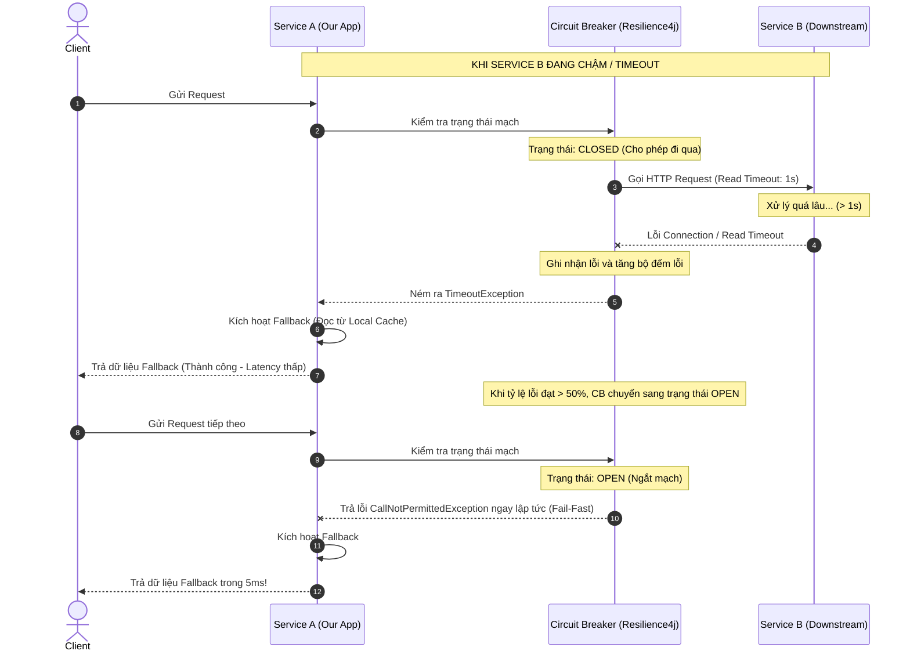

# Một downstream service timeout liên tục. Service của bạn nên xử lý thế nào?

## ⚡ Tóm tắt ngắn (30s)
* **Bản chất**: Khi một dịch vụ downstream (phía dưới) phản hồi chậm hoặc timeout liên tục, dịch vụ gọi nó sẽ đứng trước nguy cơ **nghẽn luồng dây chuyền (Cascading Failure)**. Việc giải phóng tài nguyên hệ thống (Thread, RAM) khỏi các kết nối chờ đợi vô vọng quan trọng hơn việc lấy được dữ liệu bằng mọi giá.
* **Thảm họa thực chiến được giải quyết**:
  1. **Thread Pool Exhaustion (Cạn kiệt luồng)**: Khi hàng ngàn request phải đợi downstream service phản hồi (ví dụ: 10 - 30 giây mặc định), toàn bộ thread của Web Server (Tomcat/Undertow) sẽ bị block. Hệ thống không thể tiếp nhận thêm bất kỳ request mới nào, kể cả các API không liên quan tới downstream service đó, gây sập toàn bộ dịch vụ.
  2. **Database Connection Leak**: Các luồng bị treo vẫn giữ kết nối Database (đã mượn từ pool), khiến database connection pool cạn kiệt, làm sập toàn bộ các tác vụ đọc ghi khác.
* **Quyết định Senior**:
  1. **Tuning Timeout khắt khe**: Tuyệt đối không dùng cấu hình mặc định (vô hạn). Đặt Connect Timeout cực ngắn (~200ms - 500ms) và Read Timeout phù hợp SLA (~1s - 2s).
  2. **Triển khai Circuit Breaker (Ngắt mạch)**: Sử dụng Resilience4j để tự động ngắt kết nối (OPEN circuit) khi tỷ lệ gọi lỗi/timeout vượt quá ngưỡng (ví dụ: >50%), chuyển sang cơ chế Fail-Fast lập tức để bảo vệ tài nguyên.
  3. **Cô lập luồng bằng Bulkhead**: Giới hạn số lượng thread tối đa được phép gọi sang downstream service đó để nếu nó bị sập, các phần khác của hệ thống vẫn hoạt động bình thường.
  4. **Graceful Fallback**: Thiết kế phương án dự phòng (trả về dữ liệu từ cache cũ, dữ liệu mặc định tĩnh, hoặc thông báo bận an toàn) để đảm bảo trải nghiệm người dùng không bị đứt gãy.

---

## 🔍 Chi tiết bản chất thực chiến: Quy trình xử lý Downtime của Downstream Service

Khi phát hiện downstream service có dấu hiệu nghẽn và timeout liên tục, kiến trúc hệ thống cần phản ứng theo quy trình tự động hóa sau:

```
[API Request] ──> [Bulkhead check: Còn slot thread?] ──> [Circuit Breaker: CLOSED?] ──> [Gọi Downstream]
                         │                                     │                               │
                         ▼ (Hết slot)                          ▼ (OPEN - Mạch hở)              ▼ (Chậm > Timeout)
                 [Ném lỗi Bulkhead]                     [Kích hoạt Fallback]             [Cắt kết nối lập tức]
                         │                                     │                               │
                         └─────────────────────────────────────┴───────────────────────────────┘
                                                               ▼
                                                     [Trả về dữ liệu dự phòng]
```

### 1. Kỹ thuật thiết lập Timeout động & tĩnh (Static vs Dynamic Timeout)
* **Static Timeout**: Đặt cứng Connect Timeout và Read Timeout trên HTTP Client.
  * *Công thức tính Read Timeout*: `Read Timeout = p99.9 Latency + 200ms` (Với điều kiện tổng thời gian không vượt quá timeout của API Gateway hoặc phía Client).
* **Dynamic Timeout (Client-Specified Timeout)**: API Gateway hoặc client truyền vào header `X-Request-Timeout` (ví dụ: `800ms`). Mỗi service trung gian khi nhận request sẽ trừ đi thời gian xử lý nội bộ của mình trước khi gọi downstream tiếp theo. Điều này tránh việc gọi downstream khi thời gian chờ của client đã thực sự hết.

### 2. Sự khác biệt giữa Semaphore Bulkhead và Threadpool Bulkhead
* **Semaphore Bulkhead**: Sử dụng biến đếm để giới hạn số lượng luồng đồng thời chạy vào downstream. Cực kỳ hiệu quả và ít tốn overhead đối với các ứng dụng non-blocking (Reactive WebFlux).
* **Threadpool Bulkhead**: Sử dụng một Thread Pool riêng biệt (cách ly hoàn toàn với thread pool của ứng dụng) để thực hiện cuộc gọi. 
  * *Ưu điểm*: Có thể chủ động ngắt (interrupt) luồng đang chạy nếu bị quá thời gian. Khuyên dùng cho các ứng dụng blocking truyền thống (Spring MVC).

---

## 🎨 Sơ đồ trực quan (Cơ chế cô lập và ngắt mạch tự động)



---

## 💻 Code thực chiến: Cấu hình WebClient và Resilience4j bảo vệ Service

Dưới đây là cách triển khai hoàn chỉnh bằng **Spring Boot Webflux / WebClient** và **Resilience4j** tích hợp cả **Circuit Breaker, TimeLimiter và Bulkhead**.

### 1. Cấu hình HTTP Client (WebClient) với Timeout khắt khe
```java
import io.netty.channel.ChannelOption;
import io.netty.handler.timeout.ReadTimeoutHandler;
import io.netty.handler.timeout.WriteTimeoutHandler;
import org.springframework.context.annotation.Bean;
import org.springframework.context.annotation.Configuration;
import org.springframework.http.client.reactive.ReactorClientHttpConnector;
import org.springframework.web.reactive.function.client.WebClient;
import reactor.netty.http.client.HttpClient;

import java.time.Duration;
import java.util.concurrent.TimeUnit;

@Configuration
public class WebClientConfig {

    @Bean
    public WebClient downstreamWebClient() {
        HttpClient httpClient = HttpClient.create()
                .option(ChannelOption.CONNECT_TIMEOUT_MILLIS, 200) // ✅ 200ms Connect Timeout
                .responseTimeout(Duration.ofMillis(1000))        // ✅ 1s Response Timeout
                .doOnConnected(conn -> conn
                        .addHandlerLast(new ReadTimeoutHandler(1000, TimeUnit.MILLISECONDS))  // ✅ Read Timeout
                        .addHandlerLast(new WriteTimeoutHandler(1000, TimeUnit.MILLISECONDS))); // ✅ Write Timeout

        return WebClient.builder()
                .clientConnector(new ReactorClientHttpConnector(httpClient))
                .baseUrl("https://downstream-service.api")
                .build();
    }
}
```

### 2. Triển khai Service bảo vệ luồng bằng Resilience4j Annotations
```java
import io.github.resilience4j.bulkhead.annotation.Bulkhead;
import io.github.resilience4j.circuitbreaker.annotation.CircuitBreaker;
import io.github.resilience4j.timelimiter.annotation.TimeLimiter;
import lombok.RequiredArgsConstructor;
import lombok.extern.slf4j.Slf4j;
import org.springframework.stereotype.Service;
import org.springframework.web.reactive.function.client.WebClient;
import reactor.core.publisher.Mono;

import java.time.Duration;

@Slf4j
@Service
@RequiredArgsConstructor
public class InventoryService {

    private final WebClient downstreamWebClient;

    /**
     * ✅ Gọi downstream service lấy thông tin kho hàng.
     * Tích hợp: Bulkhead (cô lập thread) -> Circuit Breaker (ngắt mạch) -> TimeLimiter.
     */
    @Bulkhead(name = "inventoryApi", fallbackMethod = "getInventoryFallback")
    @CircuitBreaker(name = "inventoryApi", fallbackMethod = "getInventoryFallback")
    @TimeLimiter(name = "inventoryApi")
    public Mono<InventoryDto> getInventoryInfo(String productId) {
        log.info("🚀 Gọi downstream API lấy kho hàng cho sản phẩm: {}", productId);
        
        return downstreamWebClient.get()
                .uri("/products/{id}/inventory", productId)
                .retrieve()
                .bodyToMono(InventoryDto.class)
                // Ép buộc timeout thêm ở tầng Reactor phòng hờ
                .timeout(Duration.ofMillis(1000)); 
    }

    /**
     * ⚠️ FALLBACK METHOD: Được gọi tự động khi:
     * 1. Downstream sập/timeout liên tục (Circuit Breaker OPEN).
     * 2. Quá tải luồng gọi song song (Bulkhead đầy).
     * 3. Xử lý vượt quá 1000ms (TimeLimiter kích hoạt).
     */
    public Mono<InventoryDto> getInventoryFallback(String productId, Throwable throwable) {
        log.warn("🚨 Bảo vệ luồng được kích hoạt! Lý do lỗi: {}. Trả về fallback.", throwable.getMessage());
        
        // Trả về kết quả dự phòng: Coi như sản phẩm tạm hết hàng hoặc lấy từ cache cũ
        return Mono.just(new InventoryDto(productId, 0, "TEMPORARILY_UNAVAILABLE (Fallback)"));
    }
}
```

### 3. Cấu hình chi tiết `application.yml`
```yaml
resilience4j:
  circuitbreaker:
    instances:
      inventoryApi:
        slidingWindowType: COUNT_BASED
        slidingWindowSize: 10          # ✅ Đánh giá dựa trên 10 request gần nhất
        failureRateThreshold: 50       # ✅ Ngắt mạch nếu >= 50% request bị lỗi/timeout
        slowCallRateThreshold: 50      # ✅ Ngắt mạch nếu >= 50% request xử lý chậm
        slowCallDurationThreshold: 800ms # ✅ Coi là chậm nếu xử lý > 800ms
        waitDurationInOpenState: 10000ms # ✅ Đợi 10s ở trạng thái OPEN trước khi sang HALF-OPEN
        permittedNumberOfCallsInHalfOpenState: 3 # Thử nghiệm 3 request khi ở trạng thái HALF-OPEN
  bulkhead:
    instances:
      inventoryApi:
        maxConcurrentCalls: 20         # ✅ Chỉ cho phép tối đa 20 request gọi song song
        maxWaitDuration: 10ms          # ✅ Request thứ 21 chỉ được đợi 10ms trong hàng chờ trước khi bị reject
```

---

## 📊 Bảng so sánh 4 mẫu hình tự bảo vệ trong Hệ thống Phân Tán

| Mẫu hình | Mục tiêu chính | Cơ chế hoạt động | Use case điển hình |
| :--- | :--- | :--- | :--- |
| **Timeout** | Tránh treo luồng vô thời hạn. | Đơn phương cắt kết nối khi quá thời gian quy định. | Mọi cuộc gọi mạng (HTTP, gRPC, DB, Cache). |
| **Circuit Breaker** | Bảo vệ downstream khỏi quá tải & ngăn ngừa lan truyền lỗi. | Tự động ngắt luồng gọi, chuyển sang trạng thái lỗi ngay lập tức mà không gửi request mạng. | Gọi các service REST bên ngoài. |
| **Bulkhead** | Cô lập tài nguyên giữa các tính năng. | Giới hạn dung lượng thread pool hoặc semaphore cho từng mục tiêu gọi. | Gọi downstream service có độ ổn định kém. |
| **Rate Limiter** | Bảo vệ chính mình khỏi bị ngập request. | Giới hạn số lượng request được tiếp nhận trong một khoảng thời gian. | Bảo vệ API public chống spam hoặc Ddos. |

---

## ⚠️ Common Gotchas & Questions follow-up

### 1. Cạm bẫy "Bẫy lồng nhau của Timeout ở các tầng (Timeout Cascade)"
* **Vấn đề**: API Gateway của bạn đặt timeout là `3s`, Service A đặt timeout gọi Service B là `4s`. Khi Service B bị nghẽn và treo mất `3.5s`, API Gateway đã chủ động ngắt kết nối với Service A (và trả lỗi cho Client), nhưng Service A vẫn tiếp tục chạy luồng gọi Service B thêm `0.5s` nữa rồi mới timeout. Đây là sự lãng phí tài nguyên nghiêm trọng.
* **Giải pháp khắc phục**: Đảm bảo nguyên tắc **Timeout giảm dần từ ngoài vào trong**. Phía Client > API Gateway > Service A > Service B. Phía ngoài cùng luôn có thời gian chờ lớn nhất để có thể nhận được kết quả xử lý của các vòng bên trong.

### 2. Câu hỏi đào sâu từ interviewer
* **Q: Nếu downstream service bị timeout liên tục và ta dùng Fallback trả về dữ liệu cache cũ. Làm sao để đảm bảo dữ liệu cache cũ không bị quá hạn (stale) quá lâu?**
  * *Trả lời*:
    * Ta áp dụng cơ chế **Cache với 2 mức TTL (Soft TTL và Hard TTL)**.
    * Dưới điều kiện bình thường, ta đọc/ghi cache dựa trên Soft TTL (ví dụ: `5 phút`). Khi Soft TTL hết hạn, hệ thống vẫn ưu tiên gọi downstream để lấy dữ liệu mới và cập nhật cache.
    * Khi downstream bị sập (Circuit Breaker OPEN), ta chuyển sang đọc dữ liệu dự phòng từ cache dựa trên Hard TTL (ví dụ: `24 giờ`). 
    * Kèm theo đó, ta thiết lập cờ đánh dấu dữ liệu này là "Dữ liệu cũ (Stale data)" trong HTTP response header hoặc JSON body để phía Client hiển thị cảnh báo nhỏ: *"Đang hiển thị dữ liệu ngoại tuyến"* cho người dùng biết.
