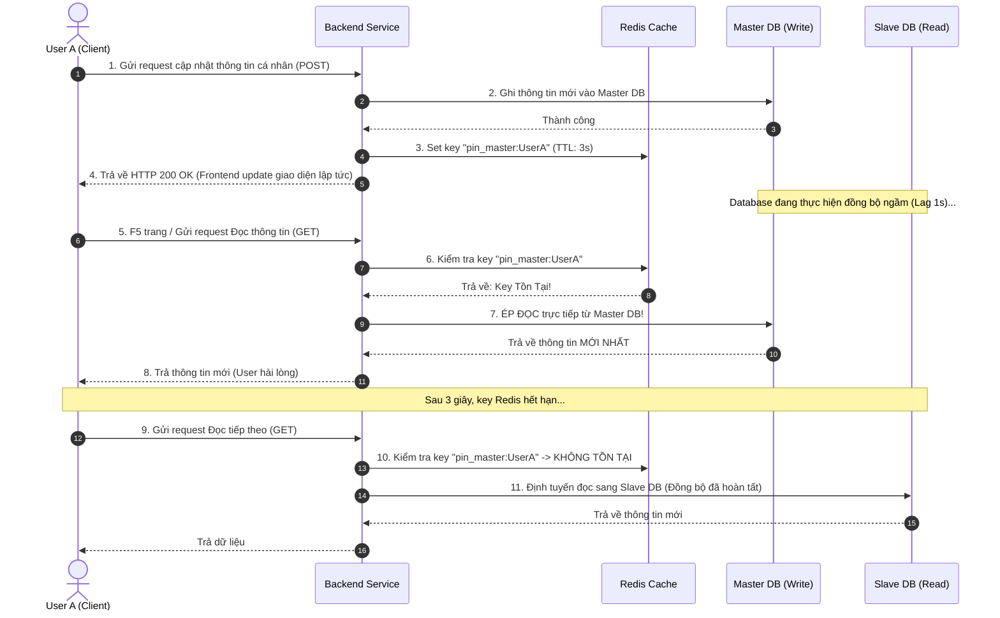

# Eventual consistency làm user thấy dữ liệu chưa cập nhật. Bạn giải thích và xử lý ra sao?

## ⚡ Tóm tắt ngắn (30s)
* **Bản chất**: **Nhất quán cuối cùng (Eventual Consistency)** là sự đánh đổi bắt buộc trong hệ thống phân tán chịu tải lớn để đổi lấy tính Sẵn sàng cao (High Availability) và Tốc độ (Low Latency) theo định lý **CAP**. Tuy nhiên, độ trễ đồng bộ (Replication Lag / Sync Lag) giữa database ghi (Master) và database đọc (Slave/Replica) hoặc giữa các microservices sẽ khiến người dùng gặp trải nghiệm tồi tệ: Vừa thực hiện cập nhật xong, load lại trang vẫn thấy dữ liệu cũ.
* **Thảm họa thực chiến được giải quyết**:
  1. **Thao tác lặp (Double Action)**: Khách hàng nhấn chuyển khoản/đặt hàng thành công, app quay về trang chủ. Do sync lag mất 2 giây, màn hình vẫn hiển thị số dư cũ. Khách hàng hoảng loạn tưởng hệ thống lỗi, nhấn nút gửi tiền thêm 3 lần nữa, tạo ra các giao dịch trùng lặp ngoài ý muốn.
  2. **Hoang mang & Khiếu nại**: Người dùng sửa ảnh đại diện hoặc tên hiển thị thành công, nhưng F5 lại thấy tên cũ. Họ liên tục gửi ticket báo lỗi hệ thống, gây quá tải cho đội CSKH.
* **Quyết định Senior**:
  1. **Áp dụng Read-Your-Own-Writes Consistency**: Đảm bảo chính người dùng vừa thực hiện thay đổi sẽ luôn đọc được dữ liệu mới nhất (bằng cách tạm thời ghim phiên đọc của user đó vào DB Master trong 3 - 5 giây tiếp theo, trong khi các user khác vẫn đọc từ Slave DB).
  2. **Tối ưu hóa Trải nghiệm UI (Optimistic UI)**: Phía Client (Frontend) tự động cập nhật giao diện ngay lập tức bằng dữ liệu ảo của request vừa gửi thành công mà không cần đợi Database đồng bộ xong.
  3. **Cơ chế Trạng thái Đang xử lý (Pending State UI)**: Hiển thị cờ `[Đang đồng bộ...]` hoặc vô hiệu hóa (disable) nút bấm cho đến khi nhận được thông báo đồng bộ hoàn tất thông qua WebSocket / SSE.

---

## 🔍 Chi tiết bản chất thực chiến: Tại sao có Trễ Nhất Quán và Cách vá lỗi

Sự cố bất nhất dữ liệu tạm thời xảy ra phổ biến nhất trong kiến trúc tách biệt Đọc/Ghi (CQRS / Master-Slave Replication) như sau:

```
[User ghi dữ liệu] ──> [Database Master (Ghi mới)]
                             │
                             ▼ (Replication Lag: Mất 1 - 2 giây ngầm)
                       [Database Slave (Dữ liệu cũ)] <── [User F5 trang: Đọc từ đây] ──> [❌ Thấy dữ liệu cũ]
```

### 1. Kỹ thuật "Read-Your-Own-Writes" bằng cách Ghim phiên vào Master (Session Pinning)
Để đảm bảo chính user vừa cập nhật sẽ thấy dữ liệu mới nhất, Senior thiết lập cơ chế định tuyến thông minh:
* Khi User A gửi request ghi (POST/PUT/PATCH):
  * Thực hiện ghi vào DB Master.
  * Phía backend set một cờ tạm thời vào Redis Cache với key: `pin_master:{userId}` có TTL là `3 giây`.
* Trong 3 giây tiếp theo, bất kỳ request đọc (GET) nào từ User A gửi lên:
  * Backend kiểm tra Redis xem có key `pin_master:{userId}` không.
  * Nếu có: **Ép buộc chuyển hướng câu lệnh đọc vào DB Master** thay vì đọc từ DB Slave.
  * Nếu không: Tiếp tục đọc từ DB Slave để giảm tải cho Master.
* Cơ chế này giúp User A có trải nghiệm nhất quán tuyệt đối, trong khi 99% người dùng khác vẫn đọc từ Slave DB để đảm bảo hệ thống chịu tải cao.

### 2. Kỹ thuật Optimistic UI Updates (Cập nhật giao diện lạc quan)
* Frontend không cần đợi API trả về data hoàn chỉnh rồi mới render.
* Ngay khi nhận được HTTP status `200 OK` (xác nhận backend đã nhận lệnh ghi), Frontend tự động ghi đè thông tin mới vào Local State (Redux/Vuex) để hiển thị ngay cho user.
* Trải nghiệm người dùng sẽ có cảm giác nhanh tức thì (Zero-Latency), loại bỏ hoàn toàn cảm giác khó chịu của replication lag.

---

## 🎨 Sơ đồ trực quan (Luồng hoạt động của Read-Your-Own-Writes)



---

## 💻 Code thực chiến: Định tuyến Đọc/Ghi động bảo vệ trải nghiệm User

Dưới đây là cách triển khai định tuyến Database động bằng cách ghim session của user vào Master DB sau khi thực hiện tác vụ ghi dữ liệu bằng **Spring Boot AbstractRoutingDataSource** và **Interceptor**.

### 1. Triển khai ThreadLocal Context để giữ trạng thái Định Tuyến
```java
public class DbRoutingContext {
    private static final ThreadLocal<DataSourceType> CONTEXT = new ThreadLocal<>();

    public enum DataSourceType {
        MASTER, SLAVE
    }

    public static void set(DataSourceType type) {
        CONTEXT.set(type);
    }

    public static DataSourceType get() {
        return CONTEXT.get() != null ? CONTEXT.get() : DataSourceType.SLAVE; // Mặc định đọc từ SLAVE
    }

    public static void clear() {
        CONTEXT.remove();
    }
}
```

### 2. Triển khai AbstractRoutingDataSource quyết định DB thực tế
```java
import org.springframework.jdbc.datasource.lookup.AbstractRoutingDataSource;

public class DynamicRoutingDataSource extends AbstractRoutingDataSource {
    @Override
    protected Object determineCurrentLookupKey() {
        // ✅ Trả về MASTER hoặc SLAVE dựa trên Context hiện tại của Thread
        return DbRoutingContext.get();
    }
}
```

### 3. Viết Web Interceptor ghim Session vào Master sử dụng Redis
```java
import jakarta.servlet.http.HttpServletRequest;
import jakarta.servlet.http.HttpServletResponse;
import lombok.RequiredArgsConstructor;
import lombok.extern.slf4j.Slf4j;
import org.springframework.data.redis.core.StringRedisTemplate;
import org.springframework.stereotype.Component;
import org.springframework.web.servlet.HandlerInterceptor;
import org.springframework.web.servlet.ModelAndView;

import java.time.Duration;

@Slf4j
@Component
@RequiredArgsConstructor
public class DbRoutingInterceptor implements HandlerInterceptor {

    private final StringRedisTemplate redisTemplate;
    
    private static final String REDIS_PIN_KEY_PREFIX = "pin_master:";
    private static final String HEADER_USER_ID = "X-User-Id";

    @Override
    public boolean preHandle(HttpServletRequest request, HttpServletResponse response, Object handler) {
        String userId = request.getHeader(HEADER_USER_ID);
        String method = request.getMethod();

        if (userId == null || userId.isBlank()) {
            return true;
        }

        // 1. Nếu là request ghi (POST/PUT/PATCH/DELETE), bắt buộc định tuyến vào MASTER
        if (!"GET".equalsIgnoreCase(method)) {
            log.info("📝 Request GHI: Ghim luồng vào MASTER DB cho user: {}", userId);
            DbRoutingContext.set(DbRoutingContext.DataSourceType.MASTER);
            
            // Đánh dấu cờ tạm thời trong Redis 3 giây để ép các request đọc sau đó vào Master
            redisTemplate.opsForValue().set(REDIS_PIN_KEY_PREFIX + userId, "true", Duration.ofSeconds(3));
        } else {
            // 2. Nếu là request đọc (GET), kiểm tra xem user này có đang trong thời gian ghim Master không
            Boolean isPinned = redisTemplate.hasKey(REDIS_PIN_KEY_PREFIX + userId);
            if (Boolean.TRUE.equals(isPinned)) {
                log.warn("⏳ PHÁT HIỆN REPLICATION PIN: Ép đọc từ MASTER DB cho user: {}", userId);
                DbRoutingContext.set(DbRoutingContext.DataSourceType.MASTER);
            } else {
                // Đọc an toàn từ SLAVE DB để giảm tải
                DbRoutingContext.set(DbRoutingContext.DataSourceType.SLAVE);
            }
        }
        return true;
    }

    @Override
    public void postHandle(HttpServletRequest request, HttpServletResponse response, Object handler, ModelAndView modelAndView) {
        // Dọn dẹp sạch sẽ ThreadLocal để tránh rò rỉ dữ liệu luồng
        DbRoutingContext.clear();
    }
}
```

---

## 📊 Bảng so sánh các Cấp Độ Nhất Quán Dữ Liệu thực chiến

| Mô hình nhất quán | Bản chất hoạt động | Trải nghiệm người dùng | Ảnh hưởng đến hiệu năng | Phù hợp với |
| :--- | :--- | :--- | :--- | :--- |
| **`Strong Consistency`** | Toàn bộ các node database phải đồng bộ xong mới trả về thành công cho client. | Hoàn hảo (Không bao giờ thấy dữ liệu cũ). | **Rất kém** (Latency cao, thắt cổ chai hệ thống). | Giao dịch tài chính, số dư ví, ngân hàng. |
| **`Eventual Consistency`** | Ghi vào 1 node và trả về ngay. Việc đồng bộ sang các node khác diễn ra ngầm. | Tệ (Gặp trễ đồng bộ, thấy dữ liệu cũ tạm thời). | **Tuyệt vời** (Latency cực thấp, throughput cực cao). | Bảng tin News Feed, lượt Like, Comment, đếm View. |
| **`Read-Your-Own-Writes`** | Chính người ghi sẽ thấy dữ liệu mới. Người khác thấy chậm vài giây. | **Tốt** (Người dùng trực tiếp không hoang mang). | Nhẹ (Chỉ tốn thêm 1 truy vấn Redis kiểm tra cờ ghim). | Thông tin cá nhân, sửa Avatar, đổi mật khẩu. |

---

## ⚠️ Common Gotchas & Questions follow-up

### 1. Cạm bẫy "Bão đồng bộ đè bẹp Master DB (Master Overwhelm)"
* **Vấn đề**: Khi hệ thống bị quá tải, Replication Lag tăng cao (ví dụ: DB Slave bị lag tới 10 giây). Lập trình viên thiết lập thời gian ghim Master quá lớn hoặc toàn bộ client liên tục F5 trang. Điều này khiến toàn bộ request đọc của hàng triệu user đồng loạt chuyển hướng đập thẳng vào DB Master. Database Master vốn chỉ gánh 10% tải ghi nay phải gánh thêm 90% tải đọc, dẫn đến sập toàn bộ hệ thống.
* **Giải pháp khắc phục**: Đặt thời gian ghim Master cực kỳ ngắn (tối đa 3 giây). Kèm theo đó, áp dụng **Rate Limiting** khắt khe cho các API đọc bắt buộc phải hướng vào Master.

### 2. Câu hỏi đào sâu từ interviewer
* **Q: Nếu ta dùng cơ chế Read-Your-Own-Writes bằng cách đọc từ Redis cache vừa ghi. Làm sao đảm bảo dữ liệu trong Redis cache không bị bất nhất với DB Master nếu DB Master bị rollback giao dịch ở bước cuối?**
  * *Trả lời*:
    * Đây là rủi ro cực cao nếu ta cập nhật cache trước khi Transaction DB thực sự commit.
    * Giải pháp triệt để: **Không bao giờ cập nhật Cache trực tiếp trong phương thức nghiệp vụ trước khi transaction hoàn tất**.
    * Ta sử dụng **Spring `@TransactionalEventListener`** cấu hình giai đoạn **`AFTER_COMMIT`** để chỉ ghi dữ liệu mới vào Redis Cache *sau khi* Database chính đã commit thành công 100%. Nếu transaction DB bị rollback, event không được kích hoạt, cache không bị ô nhiễm dữ liệu ảo.
