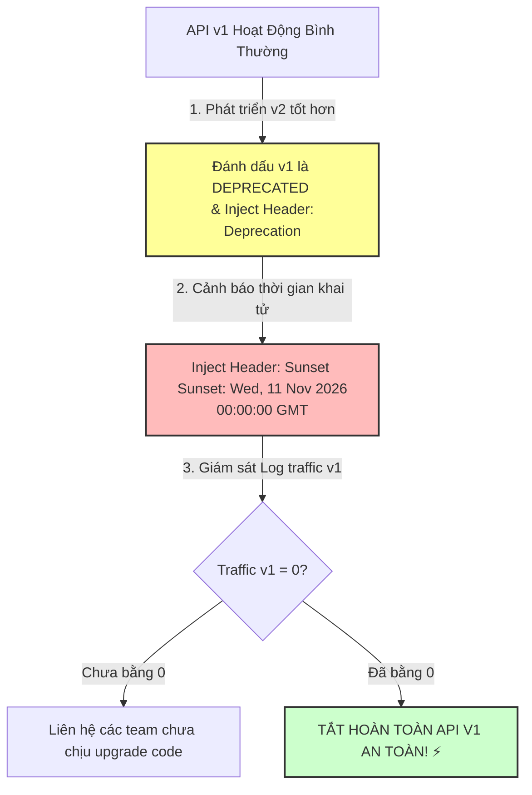

# API backward compatibility trong microservices quan trọng thế nào?

## ⚡ Tóm tắt ngắn (30s)
* **Bản chất**: **API Backward Compatibility (Tính tương thích ngược)** là khả năng của một phiên bản API mới có thể phục vụ trơn tru toàn bộ các Client/Consumer đang sử dụng cấu trúc mã nguồn cũ mà không bắt buộc họ phải nâng cấp ngay lập tức. Trong microservices, tương thích ngược là **chìa khóa sống còn** để duy trì đặc tính **Deploy Độc Lập (Independent Deployability)** của từng dịch vụ.
* **Thảm họa thực chiến được giải quyết**:
  1. **Thảm họa "Big Bang Deployment" (Deploy đồng loạt)**: Nếu không có tương thích ngược, mỗi khi bạn deploy một phiên bản mới của User Service (ví dụ: đổi tên 1 trường dữ liệu), bạn bắt buộc phải tắt toàn bộ hệ thống và **deploy đồng loạt 30 services khác** có phụ thuộc vào User Service trong cùng một thời điểm. Việc này biến microservices của bạn thành một khối "Monolith phân tán" cồng kềnh, làm tê liệt quy trình CI/CD.
  2. **Downtime hệ thống khi nâng cấp luân phiên (Rolling Update)**: Trong lúc Kubernetes đang deploy từng Pod mới của Service A, các Pod chạy phiên bản cũ (v1) và phiên bản mới (v2) sẽ tồn tại song song. Nếu v2 không tương thích ngược, các request được định tuyến ngẫu nhiên vào v2 sẽ bị crash ngay lập tức.
* **Quyết định Senior**:
  1. **Duy trì Luật Thiết Kế API Bất Di Dịch**:
     - *Không bao giờ xóa hoặc đổi tên trường cũ*.
     - *Chỉ thêm trường mới dạng Optional* (không bắt buộc truyền ở request input).
     - *Không thay đổi kiểu dữ liệu* hoặc thay đổi luật validate của các trường hiện tại sang khắt khe hơn.
  2. **Triển khai Chiến lược API Versioning rõ ràng**: Sử dụng URL versioning (ví dụ: `/api/v1/orders`) hoặc Header versioning khi bắt buộc phải thay đổi cấu trúc dữ liệu cốt lõi (Breaking Changes).
  3. **Quản lý vòng đời Deprecated chuyên nghiệp**: Đánh dấu các trường/API cũ là `@Deprecated`, trả về HTTP header `Sunset` và `Deprecation` để thông báo lộ trình đóng API cũ cho các team khác biết trước vài tháng.

---

## 🔍 Chi tiết bản chất thực chiến: Tại sao Deploy độc lập phụ thuộc vào Tương thích ngược?

Hãy cùng phân tích kịch bản **Rolling Upgrade (Cập nhật cuốn chiếu)** trên production để hiểu tại sao tương thích ngược lại bảo vệ hệ thống không bị downtime:

```
[KUBERNETES DEPLOYMENT: ROLLING UPDATE]

Pod A (v1) ──┐
             ├──> Nhận Request từ Consumer cũ (v1) ──> Xử lý OK
Pod A (v1) ──┤
             ▼ (Deploy Pod mới)
Pod A (v2) ──┐
             ├──> Nhận Request từ Consumer cũ (v1) ──> ❌ CRASH (Nếu v2 không tương thích ngược!)
Pod A (v2) ──┘
```

* **Trạng thái chuyển tiếp**: Trong quá trình deploy rolling update, Kubernetes sẽ tắt dần các Pod v1 và khởi động các Pod v2. Trạng thái "tranh tối tranh sáng" này kéo dài từ vài chục giây đến vài phút. Trong thời gian này, load balancer sẽ phân phối request từ các Consumer (vẫn đang chạy code cũ) vào cả Pod v1 và Pod v2. 
* **Hậu quả nếu phá vỡ tương thích**: Nếu v2 ném lỗi vì không hiểu cấu trúc request cũ, hệ thống sẽ bị lỗi chập chờn (5xx) liên tục trong suốt thời gian deploy, hủy hoại hoàn toàn cam kết Zero-Downtime Deployment.

---

## 🎨 Sơ đồ trực quan (Quản lý Vòng Đời API Deprecated)

Để loại bỏ một API cũ bị lỗi thời một cách an toàn mà không kéo sập hệ thống, Senior áp dụng quy trình **Deprecation & Sunset Lifecycle** chuẩn quốc tế (RFC 8594):



---

## 💻 Code thực chiến: Định tuyến dynamic theo Header Versioning trong Spring Boot

Trong 4 kỹ thuật Versioning, **Header Versioning** được nhiều Senior khuyên dùng vì nó giữ nguyên cấu trúc URL đẹp của RESTful API và thân thiện với việc quản trị. Dưới đây là cách triển khai custom RequestMapping để định tuyến request động dựa trên HTTP Header `X-API-Version`.

### 1. Tạo Annotation đánh dấu Version của API
```java
import java.lang.annotation.ElementType;
import java.lang.annotation.Retention;
import java.lang.annotation.RetentionPolicy;
import java.lang.annotation.Target;

@Target({ElementType.METHOD, ElementType.TYPE})
@Retention(RetentionPolicy.RUNTIME)
public @interface ApiVersion {
    String value(); // Ví dụ: "1", "2"
}
```

### 2. Triển khai Custom RequestCondition so khớp API Version từ Header
```java
import jakarta.servlet.http.HttpServletRequest;
import org.springframework.web.servlet.mvc.condition.RequestCondition;

public class ApiVersionRequestCondition implements RequestCondition<ApiVersionRequestCondition> {

    private final String version;
    private static final String VERSION_HEADER = "X-API-Version";

    public ApiVersionRequestCondition(String version) {
        this.version = version;
    }

    @Override
    public ApiVersionRequestCondition combine(ApiVersionRequestCondition other) {
        // Ưu tiên version cấu hình ở method hơn class
        return new ApiVersionRequestCondition(other.version);
    }

    @Override
    public ApiVersionRequestCondition getMatchingCondition(HttpServletRequest request) {
        // Đọc version từ HTTP Header gửi lên
        String requestVersion = request.getHeader(VERSION_HEADER);
        
        // Nếu client không truyền, mặc định coi là Version 1 để tương thích ngược
        if (requestVersion == null || requestVersion.isBlank()) {
            requestVersion = "1";
        }

        if (this.version.equals(requestVersion)) {
            return this;
        }
        return null;
    }

    @Override
    public int compareTo(ApiVersionRequestCondition other, HttpServletRequest request) {
        // Ưu tiên so sánh phiên bản khớp chính xác
        return 0;
    }
}
```

### 3. Khai báo Controller phục vụ 2 phiên bản song song
```java
import lombok.extern.slf4j.Slf4j;
import org.springframework.web.bind.annotation.*;

@Slf4j
@RestController
@RequestMapping("/api/customers")
public class CustomerController {

    /**
     * ✅ API Version 1 (Tương thích ngược cho các client cũ).
     * Trả về cấu trúc chứa trường cũ 'fullName'.
     */
    @GetMapping("/{id}")
    @ApiVersion("1")
    public CustomerV1 getCustomerV1(@PathVariable String id) {
        log.info("📞 Gọi API Customer Version 1 cho ID: {}", id);
        return new CustomerV1(id, "Senior Developer");
    }

    /**
     * ✅ API Version 2 (Dành cho các client mới đã nâng cấp code).
     * Trả về cấu trúc mới tách biệt 'firstName' và 'lastName'.
     */
    @GetMapping("/{id}")
    @ApiVersion("2")
    public CustomerV2 getCustomerV2(@PathVariable String id) {
        log.info("📞 Gọi API Customer Version 2 cho ID: {}", id);
        return new CustomerV2(id, "Senior", "Developer");
    }
}
```

---

## 📊 Bảng so sánh 3 Phương án API Versioning phổ biến

| Phương pháp | Ví dụ triển khai | Ưu điểm | Nhược điểm | Thích hợp với |
| :--- | :--- | :--- | :--- | :--- |
| **`URI Path`** | `/api/v1/users` | Cực kỳ rõ ràng, dễ đọc, **thân thiện với cơ chế Cache** của CDN/Gateway. | Phình to số lượng Endpoint, URL bị thay đổi khi nâng cấp. | REST API public cung cấp cho bên thứ 3. |
| **`Custom Header`** | Header: `X-API-Version: 2` | URL sạch sẽ tuyệt đối, có thể thiết lập default version nếu thiếu header. | Khó test trực tiếp bằng trình duyệt thông thường, khó cấu hình cache CDN. | Hệ thống Microservices nội bộ của doanh nghiệp. |
| **`Content Negotiation`** | Header: `Accept: application/vnd.app.v2+json` | Chuẩn RESTful học thuật nhất, cho phép versioning chi tiết thực thể. | Cực kỳ phức tạp trong code cấu hình, khó giải thích cho non-technical. | Các hệ thống lớn có chuẩn mực thiết kế cực kỳ khắt khe. |

---

## ⚠️ Common Gotchas & Questions follow-up

### 1. Cạm bẫy "Code tương thích ngược nhưng Database Schema bị vỡ (Database Contract Breach)"
* **Vấn đề**: Bạn viết code Service A version 2 rất thông minh, hỗ trợ cả API v1 (đọc trường `phone`) và API v2 (đọc trường `phoneNumber`). Tuy nhiên, trong lúc deploy database migration, bạn chạy lệnh SQL `ALTER TABLE users DROP COLUMN phone` để dọn rác.
* **Hậu quả**: Ngay lập tức, toàn bộ các Pod Service A version 1 đang chạy dở (vẫn đang đọc trường `phone` từ database) sẽ bị crash hàng loạt. Bạn đã phá vỡ contract ở tầng Database!
* **Giải pháp khắc phục**: Tuyệt đối không xóa cột database trong cùng đợt deploy code mới. Áp dụng quy trình **2-Phase Database Migration**:
  - *Đợt 1*: Thêm cột mới `phoneNumber`, cập nhật code để ghi dữ liệu song song vào cả 2 cột.
  - *Đợt 2* (Cách vài tuần): Viết script migration copy dữ liệu cũ từ `phone` sang `phoneNumber`.
  - *Đợt 3* (Khi code cũ đã tắt hoàn toàn): Tiến hành chạy lệnh DROP cột `phone` an toàn.

### 2. Câu hỏi đào sâu từ interviewer
* **Q: Làm sao trả về Header `Sunset` và `Deprecation` trong Spring Boot để tự động cảnh báo các Consumer mà không cần hardcode trong từng Controller?**
  * *Trả lời*:
    * Ta sử dụng một **Spring Web Interceptor** hoặc **Servlet Filter** gom bộ lọc tập trung:
      1. Khi Interceptor bắt được request gọi vào các API có đánh dấu annotation `@Deprecated` hoặc có version cũ (ví dụ: API v1).
      2. Interceptor tự động ghi đè và inject thêm 2 HTTP Header tiêu chuẩn vào HttpServletResponse trước khi trả về client:
         - `Deprecation: true` (Báo hiệu API đã lỗi thời).
         - `Sunset: Wed, 11 Nov 2026 00:00:00 GMT` (Báo hiệu ngày chính thức khai tử API).
      3. Điều này giúp các đội ngũ vận hành Consumer phát hiện sớm các API cũ sắp bị xóa dựa trên log monitor của họ.
