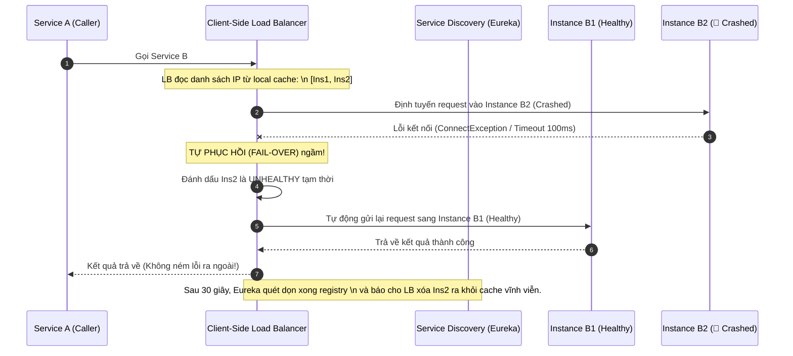

# Service discovery trả về instance lỗi. Bạn xử lý thế nào?

## ⚡ Tóm tắt ngắn (30s)
* **Bản chất**: Trong hệ thống Microservices, **Service Discovery (như Netflix Eureka, HashiCorp Consul, hay K8s DNS)** đóng vai trò là "bản đồ địa chỉ" của toàn hệ thống. Tuy nhiên, do độ trễ đồng bộ bất đồng bộ và trễ nhịp tim (Heartbeat Latency), bản đồ này có thể bị cũ (**Stale Registry**), dẫn tới việc trả về địa chỉ IP của một instance đã bị sập vật lý hoặc đang bị treo cứng (Gray Failure). Lập trình viên không được tin tưởng tuyệt đối vào Service Discovery mà phải xây dựng lớp phòng thủ **Tự vệ phía Client (Client-Side Resiliency)**.
* **Thảm họa thực chiến được giải quyết**:
  1. **Request rơi vào hố đen (Blackhole Requests)**: Khi một instance bị sập nguồn đột ngột, Service Discovery có thể mất tới 30 - 90 giây mới gạch tên IP đó khỏi danh sách (eviction). Trong khoảng thời gian "tranh tối tranh sáng" này, hàng ngàn request tiếp tục được gửi vào IP chết, gây ra lỗi nghẽn và lỗi 504 Gateway Timeout liên tục cho người dùng.
  2. **Hiệu ứng sập mạng nội bộ (Self-Preservation Lockout)**: Eureka Server kích hoạt chế độ tự vệ khẩn cấp khi mất kết nối mạng diện rộng, khóa toàn bộ việc xóa instance (eviction), giữ lại 100% IP chết trong danh sách cung cấp cho Client.
* **Quyết định Senior**:
  1. **Tuning Heartbeat khắt khe**: Rút ngắn thời gian gửi nhịp tim (Eureka `leaseRenewalIntervalInSeconds = 5s`) và thời gian quét loại trừ instance chết (`evictionIntervalTimerInMs = 5000ms`) để dọn rác registry nhanh nhất.
  2. **Triển khai Client-Side Load Balancing tự chữa lành**: Sử dụng **Spring Cloud LoadBalancer** cấu hình tự động thử lại (Retry) trên instance khác nếu cuộc gọi đầu tiên vào IP của Service Discovery trả về thất bại (Fail-over ngay lập tức).
  3. **Áp dụng Active Health Checking**: Cấu hình Client-side load balancer chạy ping ngầm định kỳ để tự kiểm tra sức khỏe của các instance, tự động loại trừ IP lỗi tại bộ nhớ local mà không cần đợi cập nhật từ Service Discovery.

---

## 🔍 Chi tiết bản chất thực chiến: Tại sao xảy ra lỗi Bản đồ cũ (Stale Registry)?

Quy trình sập của một instance và độ trễ phát hiện lỗi của Service Discovery diễn ra như sau:

```
[Instance A Bị Sập Đột Ngột] ──> [Eureka Server chờ Heartbeat Timeout: 90s] ──> [Eureka Server chạy Eviction: Quét mỗi 60s]
                                                                                               │
                                                                                               ▼
[Client tiếp tục nhận IP chết] <── [Mất tối đa 150 giây để dọn rác Registry] <── [Eureka vẫn lưu IP của Instance A]
```

* **Vấn đề 1: Trễ Heartbeat mặc định**. Mặc định, Eureka Server đợi 90 giây không nhận được heartbeat mới coi là instance chết (`leaseExpirationDurationInSeconds = 90`).
* **Vấn đề 2: Trễ Client Cache**. Phía Client (như Service gọi) thường cache danh sách IP trong local memory và chỉ update định kỳ mỗi 30 giây (`registryFetchIntervalSeconds = 30`). 
* **Tổng cộng**: Hệ thống có thể mất tới **vài phút** để nhận thức được một instance đã chết.

---

## 🎨 Sơ đồ trực quan (Cơ chế tự chữa lành của Client-Side Load Balancer)



---

## 💻 Code thực chiến: Cấu hình Client-Side Load Balancer Tự Động Fail-over trong Spring Boot

Dưới đây là cách cấu hình **Spring Cloud LoadBalancer** kết hợp **Spring Retry** để tự động loại bỏ instance lỗi và định tuyến lại request sang instance lành mạnh ngay lập tức.

### 1. Cấu hình HTTP Client với Spring Cloud LoadBalancer & Retry
```java
import org.springframework.cloud.client.loadbalancer.LoadBalanced;
import org.springframework.context.annotation.Bean;
import org.springframework.context.annotation.Configuration;
import org.springframework.web.client.RestTemplate;

@Configuration
public class LoadBalancerRetryConfig {

    @Bean
    @LoadBalanced // ✅ Kích hoạt Client-Side Load Balancing
    public RestTemplate restTemplate() {
        return new RestTemplate();
    }
}
```

### 2. Triển khai Service gọi API có cấu hình tự động Retry trên Instance khác
```java
import lombok.RequiredArgsConstructor;
import lombok.extern.slf4j.Slf4j;
import org.springframework.retry.annotation.Backoff;
import org.springframework.retry.annotation.Retryable;
import org.springframework.stereotype.Service;
import org.springframework.web.client.ResourceAccessException;
import org.springframework.web.client.RestTemplate;

@Slf4j
@Service
@RequiredArgsConstructor
public class UserClientService {

    private final RestTemplate restTemplate;

    /**
     * ✅ Gọi User Service qua Service Discovery.
     * Tự động Retry nếu gặp lỗi kết nối (ResourceAccessException).
     * Spring Cloud LoadBalancer sẽ tự động chọn Instance KHÁC ở lần thử tiếp theo!
     */
    @Retryable(
            retryFor = { ResourceAccessException.class }, // Chỉ retry lỗi kết nối vật lý/timeout kết nối
            maxAttempts = 3,
            backoff = @Backoff(delay = 50) // Chờ 50ms trước khi thử lại
    )
    public String getUserProfile(String userId) {
        log.info("📞 Đang gọi API lấy thông tin User qua Load Balancer cho ID: {}", userId);
        
        // "user-service" là tên service đăng ký trên Service Discovery, không dùng IP cứng
        String url = "http://user-service/users/" + userId;
        
        return restTemplate.getForObject(url, String.class);
    }
}
```

### 3. Tuning cấu hình Eureka Client giảm thiểu tối đa độ trễ trong `application.yml`
```yaml
eureka:
  client:
    registryFetchIntervalSeconds: 5 # ✅ Rút ngắn thời gian Client kéo danh sách IP mới về (mặc định 30s)
  instance:
    leaseRenewalIntervalInSeconds: 3 # ✅ Gửi heartbeat mỗi 3 giây (mặc định 30s)
    leaseExpirationDurationInSeconds: 9 # ✅ Báo Eureka xóa tên nếu 9s không gửi heartbeat (mặc định 90s)

spring:
  cloud:
    loadbalancer:
      retry:
        enabled: true # ✅ Bắt buộc kích hoạt tính năng tự động thử lại khi gọi instance lỗi
```

---

## 📊 Bảng so sánh 2 Mô hình Load Balancing thực chiến

| Tiêu chí | Server-Side Load Balancing (Nginx/HAProxy/K8s Service) | Client-Side Load Balancing (Spring Cloud LoadBalancer) |
| :--- | :--- | :--- |
| **Vị trí quyết định định tuyến** | Tại máy chủ phần cứng / proxy trung gian độc lập. | Ngay trong mã nguồn chạy trên RAM của ứng dụng gọi. |
| **Số bước nhảy mạng (Network Hops)** | **2 Hops** (Client -> Load Balancer -> Server). | **1 Hop** (Client đập thẳng vào Server nhờ biết sẵn IP). |
| **Điểm nghẽn đơn nhất (Single Point of Failure)** | **Có** (Nếu Nginx sập, toàn bộ hệ thống sập). | **Không** (Nếu load balancer của service này sập, các service khác không ảnh hưởng). |
| **Khả năng tùy biến thuật toán** | Hạn chế (Phụ thuộc vào tính năng cấu hình của Proxy). | **Tuyệt vời** (Có thể tự viết code Java định tuyến tùy biến). |
| **Phù hợp với** | API Public tiếp nhận traffic từ ngoài Internet vào. | Giao tiếp nội bộ giữa các microservices (Internal gRPC/REST). |

---

## ⚠️ Common Gotchas & Questions follow-up

### 1. Cạm bẫy "Bão sập do Eureka Self-Preservation (Chế độ tự vệ Eureka)"
* **Vấn đề**: Khi hạ tầng mạng nội bộ bị chập chờn tạm thời trong 15 giây, Eureka Server không nhận được heartbeat từ 50% số lượng instance. Eureka Server lập tức nghi ngờ đường truyền mạng của chính nó bị lỗi (chứ không phải 50% instance bị chết). Để bảo vệ dữ liệu, Eureka tự động kích hoạt **Self-Preservation mode**: **Khóa toàn bộ chức năng xóa instance chết**. Eureka giữ nguyên danh sách IP cũ, cung cấp cả đống IP chết cho Client mãi mãi kể cả khi mạng đã hết chập chờn.
* **Giải pháp khắc phục**: Trong môi trường Kubernetes (nơi K8s đã tự quản lý liveness/readiness cực tốt), ta nên **tắt hoàn toàn chế độ Self-Preservation của Eureka**:
  ```yaml
  eureka:
    server:
      enableSelfPreservation: false # Tắt tự vệ để Eureka xóa instance chết nhanh chóng
  ```

### 2. Câu hỏi đào sâu từ interviewer
* **Q: Nếu Service Discovery bị sập hoàn toàn (Eureka Server bị crash vật lý), hệ thống microservices của ta có tiếp tục giao tiếp được với nhau không?**
  * *Trả lời*:
    * **CÓ! Hệ thống vẫn hoạt động bình thường** nhờ cơ chế **Local Cache** của Client-side Load Balancer.
    * Khi Eureka Server sập, các microservices không thể đăng ký IP mới hoặc kéo danh sách IP mới. Tuy nhiên, mỗi microservice đã lưu sẵn bản sao danh sách IP của các service khác trong local memory trước đó.
    * Hệ thống vẫn định tuyến cuộc gọi trực tiếp (Point-to-Point) bình thường dựa trên bộ nhớ đệm này. Hệ thống chỉ bị ảnh hưởng khi có pod mới được khởi tạo (co scale out) hoặc pod cũ bị đổi địa chỉ IP mà không thể cập nhật.
