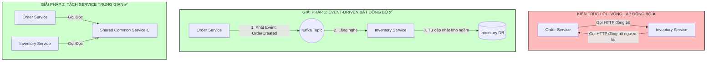

# Một service bị dependency cycle với service khác. Hậu quả là gì?

## ⚡ Tóm tắt ngắn (30s)
* **Bản chất**: **Sự phụ thuộc vòng lặp phân tán (Distributed Dependency Cycle / Circular Dependency)** xảy ra khi hai hoặc nhiều microservices phụ thuộc trực tiếp hoặc gián tiếp vào nhau thông qua các cuộc gọi API đồng bộ (ví dụ: Service A gọi HTTP sang Service B, và Service B lại gọi ngược lại Service A để hoàn tất nghiệp vụ). Đây là một **lỗi thiết kế kiến trúc nghiêm trọng**, phá vỡ ranh giới domain, biến hệ thống của bạn thành một khối **"Monolith phân tán"** chặt chẽ và triệt tiêu toàn bộ ưu thế của hệ thống phân tán.
* **Thảm họa thực chiến được giải quyết**:
  1. **Khóa chết khởi động (Circular Startup Deadlock)**: Khi Service A khởi động yêu cầu gọi API lấy cấu hình/dữ liệu từ Service B, trong khi Service B lúc khởi động cũng bắt buộc phải ping thành công sang Service A. Kết quả là cả hai service bị treo cứng ở trạng thái khởi động, không bao giờ khởi chạy được Pod mới, gây sập toàn diện dịch vụ.
  2. **Bão đệ quy phân tán (Distributed Stack Overflow / Infinite Loop)**: Request đi vào Service A -> A gọi B -> B gọi lại A -> luồng lặp vô hạn diễn ra cho đến khi cạn sạch Thread Pool (Thread Pool Exhaustion) hoặc tràn bộ nhớ và crash toàn bộ các instance liên quan.
  3. **Mất khả năng deploy độc lập**: Bạn không thể deploy Service A nếu không deploy Service B, làm tê liệt quy trình CI/CD và tiến trình phát triển của các team.
* **Quyết định Senior**:
  1. **Bẻ gãy vòng lặp bằng Kiến trúc Bất đồng bộ (Event-Driven)**: Chuyển đổi giao tiếp đồng bộ (HTTP/gRPC) sang phát sự kiện bất đồng bộ qua Message Broker (Kafka/RabbitMQ). Service A phát event `DataCreated`, Service B lắng nghe event để xử lý mà không cần gọi ngược lại Service A.
  2. **Tách biệt thành Service thứ 3 (Shared Service / Component)**: Trích xuất phần logic chung gây vòng lặp ra một service độc lập mới (Service C) hoặc gộp chung thành một thư viện dùng chung (Shared Library).
  3. **Tái cấu trúc ranh giới Domain (Domain Redefinition)**: Đánh giá lại ranh giới Bounded Context trong Domain-Driven Design (DDD). Vòng lặp xuất hiện là dấu hiệu rõ ràng cho thấy hai service này thực chất là một, hãy gộp chúng lại làm một service duy nhất.

---

## 🔍 Chi tiết bản chất thực chiến: Hậu quả của Vòng lặp Phân tán

Sự phụ thuộc vòng lặp phá hủy tính ổn định của hệ thống thông qua 2 cơ chế phá hoại chính:

### 1. Cơ chế gây sập luồng đệ quy phân tán (Infinite Loop)
Hãy tưởng tượng quy trình xử lý đơn hàng nghiệp vụ bị thiết kế sai như sau:

```
[User tạo Order] ──> [Order Service] ──(Gọi HTTP)──> [Inventory Service (Trừ kho)]
                            ▲                                    │
                            │                                    ▼ (Gọi HTTP ngược lại)
                      [In log lỗi / Sập] <── [Đệ quy vô hạn] <── [Order Service (Check trạng thái)]
```

* Để trừ kho, `Inventory Service` cần xác thực trạng thái đơn hàng nên gọi ngược lại `Order Service`.
* Do lượng truy cập cao, luồng xử lý bị quay vòng liên tục. Chỉ cần 1 request kích hoạt là đã chiếm dụng 2 thread ở 2 service khác nhau cho đến khi timeout. Hệ thống sẽ cạn kiệt thread chỉ sau vài giây.

### 2. Sự sụp đổ của khả năng Deploy Độc Lập
Mục tiêu lớn nhất của Microservices là cho phép Team A tự deploy Service A vào lúc 12h trưa mà không cần quan tâm Team B đang làm gì.
* Khi có vòng lặp phụ thuộc, Service A v2 đòi hỏi API v2 của Service B. Service B v2 lại đòi hỏi API v2 của Service A.
* Bạn bắt buộc phải thực hiện **Big Bang Deployment (Deploy đồng thời)**. Nếu một service bị lỗi và phải rollback, service kia cũng phải rollback theo. Điều này biến microservices thành một "cơn ác mộng vận hành".

---

## 🎨 Sơ đồ trực quan (Giải pháp Bẻ gãy vòng lặp phụ thuộc)



---

## 💻 Code thực chiến: Bẻ gãy vòng lặp Circular Dependency bằng Spring Event

Trong mã nguồn Java Spring Boot, lỗi Circular Dependency ở máy local (`BeanCurrentlyInCreationException`) phản ánh chính xác lỗi thiết kế phân tán này. Dưới đây là cách tái cấu trúc bẻ gãy vòng lặp A -> B -> A bằng cách sử dụng **Spring ApplicationEventPublisher (Bất đồng bộ nội bộ)**.

### 1. Cấu hình Lỗi Vòng Lặp ban đầu (Cần tránh)
```java
// ❌ Sẽ gây lỗi BeanCurrentlyInCreationException khi khởi động ứng dụng!
@Service
public class OrderService {
    @Autowired private InventoryService inventoryService; // Phụ thuộc vào Inventory
}

@Service
public class InventoryService {
    @Autowired private OrderService orderService; // Phụ thuộc ngược lại vào Order
}
```

### 2. Tái cấu trúc: Sử dụng Event Publisher để bẻ gãy vòng lặp hoàn hảo
Chúng ta loại bỏ hoàn toàn sự phụ thuộc trực tiếp từ `OrderService` sang `InventoryService`. thay vào đó, `OrderService` chỉ phát đi một sự kiện (Event), và để `InventoryService` tự lắng nghe xử lý.

```java
import lombok.RequiredArgsConstructor;
import lombok.extern.slf4j.Slf4j;
import org.springframework.context.ApplicationEventPublisher;
import org.springframework.stereotype.Service;

@Slf4j
@Service
@RequiredArgsConstructor
public class OrderService {

    private final OrderRepository orderRepository;
    
    // ✅ Sử dụng Event Publisher để bẻ gãy sự phụ thuộc trực tiếp vào InventoryService
    private final ApplicationEventPublisher eventPublisher;

    public void placeOrder(String orderId, String productId) {
        log.info("🛒 Bắt đầu tạo đơn hàng: {}", orderId);
        
        OrderEntity order = new OrderEntity(orderId, productId, "PENDING");
        orderRepository.save(order);

        // ✅ Phát event ra ngoài hệ thống ngầm, giải phóng luồng chính ngay lập tức
        log.info("📡 Phát Event OrderCreatedEvent...");
        eventPublisher.publishEvent(new OrderCreatedEvent(this, orderId, productId));
    }

    public void updateOrderStatus(String orderId, String status) {
        log.info("🔄 Cập nhật trạng thái đơn hàng {} sang {}", orderId, status);
        // Code cập nhật trạng thái đơn hàng thực tế
    }
}
```

```java
import lombok.RequiredArgsConstructor;
import lombok.extern.slf4j.Slf4j;
import org.springframework.context.event.EventListener;
import org.springframework.scheduling.annotation.Async;
import org.springframework.stereotype.Service;

@Slf4j
@Service
@RequiredArgsConstructor
public class InventoryService {

    // ✅ InventoryService chỉ phụ thuộc vào OrderService để cập nhật trạng thái (Sự phụ thuộc 1 chiều an toàn)
    private final OrderService orderService;

    /**
     * ✅ Lắng nghe event OrderCreatedEvent bất đồng bộ để trừ kho.
     * Hoàn toàn không có liên kết ngược từ OrderService sang InventoryService nữa!
     */
    @Async("asyncExecutor") // Chạy ngầm ở thread khác để giải phóng luồng chính của Order
    @EventListener
    public void handleOrderCreated(OrderCreatedEvent event) {
        log.info("📥 Nhận được OrderCreatedEvent cho sản phẩm: {}. Tiến hành trừ kho...", event.getProductId());
        
        boolean reserveSuccess = reserveStock(event.getProductId());

        if (reserveSuccess) {
            // Cập nhật trạng thái đơn hàng một chiều
            orderService.updateOrderStatus(event.getOrderId(), "STOCK_RESERVED");
        } else {
            orderService.updateOrderStatus(event.getOrderId(), "STOCK_OUT");
        }
    }

    private boolean reserveStock(String productId) {
        // Thực hiện logic trừ kho thực tế
        return true;
    }
}
```

---

## 📊 Bảng so sánh 3 Giải Pháp Bẻ Gãy Vòng Lặp Phụ Thuộc

| Tiêu chí | Giải pháp 1: Event-Driven Broker (Kafka) | Giải pháp 2: Tách sang Service thứ 3 (Shared Service) | Giải pháp 3: Gộp chung Domain (Merge Services) |
| :--- | :--- | :--- | :--- |
| **Sự phụ thuộc (Coupling)** | **Lỏng lẻo nhất** (Các service hoàn toàn không biết nhau). | Trung bình (Cả A và B đều biết service trung gian C). | Không còn (Biến thành dependency nội bộ). |
| **Độ trễ xử lý (Latency)** | Trung bình (Do trễ truyền tải qua Queue ngầm). | Thấp (Cuộc gọi HTTP/gRPC đồng bộ trực tiếp). | **Cực thấp** (Chạy trực tiếp trên RAM, không tốn network hop). |
| **Độ phức tạp hạ tầng** | Cao (Đòi hỏi quản trị cụm Kafka/RabbitMQ). | Trung bình (Tốn thêm chi phí deploy/monitor 1 service mới). | **Bằng 0** (Giảm bớt số lượng service cần quản lý). |
| **Mức độ khuyên dùng** | Dành cho các luồng nghiệp vụ không cần phản hồi realtime lập tức. | Dành cho luồng đọc dữ liệu chung hoặc tính năng dùng chung. | Dành cho trường hợp 2 service có ranh giới domain nhập nhèm, nghiệp vụ dính chặt. |

---

## ⚠️ Common Gotchas & Questions follow-up

### 1. Cạm bẫy "Bão Event vòng lặp (Distributed Event Loop)"
* **Vấn đề**: Bạn bẻ gãy vòng lặp HTTP đồng bộ bằng cách sử dụng Kafka Event. Tuy nhiên, do thiết kế event thiếu cẩn thận, bạn vô tình tạo ra **Vòng lặp Event bất đồng bộ**:
  - Service A phát event `DataChanged`.
  - Service B lắng nghe event này, thực hiện xử lý và phát đi event `ResultCalculated`.
  - Service A lại lắng nghe event `ResultCalculated`, thực hiện lưu DB và vô tình phát lại event `DataChanged`!
  - **Hậu quả**: Vòng lặp đệ quy ngầm này sẽ chạy với tốc độ chóng mặt, tạo ra hàng triệu message spam làm sập hoàn toàn cụm Kafka Broker và đè bẹp CPU của cả 2 service.
* **Giải pháp khắc phục**: Đánh dấu rõ ràng cờ nguồn gốc sự kiện (event source) trong payload để nếu nhận được event do chính mình gián tiếp kích hoạt, service sẽ chủ động dừng lại, không tiếp tục phát event mới.

### 2. Câu hỏi đào sâu từ interviewer
* **Q: Làm sao phát hiện sớm sự phụ thuộc vòng lặp giữa các service trước khi deploy lên production?**
  * *Trả lời*:
    * Ta sử dụng 2 công cụ phân tích kiến trúc tự động:
      1. **Sử dụng Linter Kiến Trúc (ArchUnit cho Java)**: Viết test case tự động quét cấu trúc package và module để chặn việc import chéo chéo A -> B -> A ngay tại tầng Unit Test.
      2. **Vẽ biểu đồ phụ thuộc từ Distributed Tracing**: Sử dụng công cụ APM hoặc Service Mesh (như **Istio / Kiali**) để tự động phân tích luồng gọi thực tế (Live Dependency Graph) giữa các service. Kiali sẽ tự động vẽ sơ đồ trực quan và bôi đỏ các cạnh gọi mạng tạo thành vòng khép kín (cycle) để cảnh báo cho đội ngũ kiến trúc sư.
