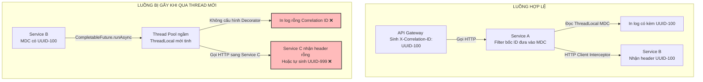

# Correlation ID bị mất giữa các service. Hậu quả là gì?

## ⚡ Tóm tắt ngắn (30s)
* **Bản chất**: **Correlation ID (hoặc Request ID)** là một chuỗi định danh duy nhất được gán cho một request ngay khi nó chạm vào ranh giới hệ thống (API Gateway). Chuỗi này có nhiệm vụ "xâu chuỗi" toàn bộ log nghiệp vụ của tất cả các service liên quan. Nếu Correlation ID bị mất (do gãy thread context hoặc không truyền tiếp HTTP Header), toàn bộ dữ liệu log khổng lồ của bạn sẽ lập tức bị **phân mảnh vô nghĩa**.
* **Thảm họa thực chiến được giải quyết**:
  1. **Thất lạc dấu vết giao dịch (Needle in a Log Haystack)**: Khi một đơn hàng thanh toán của khách hàng VIP bị lỗi trừ tiền nhưng không tạo được đơn, bạn mở Kibana lên và thấy hàng tỷ dòng log hỗn độn của 10 microservices. Không có Correlation ID để lọc (filter), việc tìm kiếm nguyên nhân gốc rễ giống như mò kim đáy bể, kéo dài thời gian sửa lỗi (MTTR) từ 5 phút lên 5 ngày.
  2. **Vi phạm chuẩn an toàn & Tuân thủ (Compliance/Audit Failure)**: Các đối tác thanh toán quốc tế (PCI-DSS) hoặc cơ quan kiểm toán yêu cầu phải có khả năng truy xuất lịch sử xử lý (Audit Trail) xuyên suốt từ đầu tới cuối cho mỗi giao dịch nhạy cảm. Mất Correlation ID trực tiếp làm bạn trượt bài kiểm toán bảo mật.
* **Quyết định Senior**:
  1. **Triển khai Auto-Injection tại Gateway**: API Gateway bắt buộc phải kiểm tra và tự động chèn header `X-Correlation-ID` (dạng UUID/Snowflake) vào mọi request đi vào hệ thống.
  2. **Cấu hình Tracing Filter tự động**: Viết Spring Boot Starter dùng chung cho toàn công ty, tích hợp Servlet Filter để bốc header `X-Correlation-ID` bỏ vào **MDC (Mapped Diagnostic Context)** của logger và tự động chèn nó vào HTTP Client/Kafka Header của cuộc gọi đi.
  3. **Đóng gói TaskDecorator cho Thread Pool**: Đăng ký MDC TaskDecorator cho mọi ThreadPoolExecutor để đảm bảo khi chuyển giao tác vụ bất đồng bộ (async), Correlation ID không bị rơi rụng.

---

## 🔍 Chi tiết bản chất thực chiến: Hậu quả và Cơ chế gãy chuỗi Correlation ID

Khi Correlation ID bị gãy giữa chừng (ví dụ ở Service B), chuỗi liên kết log sẽ bị phá vỡ hoàn toàn như sau:

```
[Request] ──> [API Gateway] ──> [Service A] ──> [Service B (Mất Header)] ──> [Service C]
                 │                 │                 │                         │
            (ID: UUID-1)      (ID: UUID-1)      (ID: [Rỗng / UUID-2])     (ID: [Rỗng / UUID-3])
                 │                 │                 │                         │
                 ▼                 ▼                 ▼                         ▼
            [LOG HỢP LỆ]      [LOG HỢP LỆ]     [LOG MẤT DẤU VẾT]         [LOG MẤT DẤU VẾT]
```

### 1. Phân tích 3 Điểm gãy (Disconnect Points) phổ biến nhất
* **Điểm gãy 1: HTTP Client Calls (Outbound Request)**
  * *Vấn đề*: Lập trình viên tự viết code khởi tạo `RestTemplate` hoặc `WebClient` mới (bằng từ khóa `new`) mà không đi qua WebClient.Builder được Spring quản lý, làm mất hoàn toàn các Interceptor tự động chèn header đi kèm.
* **Điểm gãy 2: Ranh giới Message Broker (Kafka/RabbitMQ)**
  * *Vấn đề*: Khi gửi event vào queue, lập trình viên chỉ truyền payload JSON mà quên đưa Correlation ID vào phần **Message Header / Record Metadata**. Phía consumer khi nhận message sẽ tự sinh một ID mới hoặc để trống.
* **Điểm gãy 3: Thread Boundaries (Mất MDC)**
  * *Vấn đề*: MDC trong Java hoạt động dựa trên cơ chế **ThreadLocal** (biến cục bộ của luồng). Khi bạn sử dụng `@Async`, `CompletableFuture` hoặc Reactive Stream (Project Reactor), code sẽ nhảy sang chạy ở một Thread khác. Luồng mới này hoàn toàn trống rỗng MDC, dẫn tới log in ra bị rỗng Correlation ID.

---

## 🎨 Sơ đồ trực quan (Cơ chế Propagation & Sự sụp đổ khi mất ID)



---

## 💻 Code thực chiến: Chống gãy Correlation ID khi chạy Async trong Spring Boot

Để đảm bảo Correlation ID đi xuyên qua các Thread Pool xử lý bất đồng bộ mà không bị biến mất, chúng ta triển khai custom `MdcTaskDecorator`.

### 1. Viết MDC TaskDecorator sao chép Context sang Thread mới
```java
import org.slf4j.MDC;
import org.springframework.core.task.TaskDecorator;
import java.util.Map;

public class MdcTaskDecorator implements TaskDecorator {

    @Override
    public Runnable decorate(Runnable runnable) {
        // ✅ 1. Lấy toàn bộ ngữ cảnh MDC của Thread cha hiện tại
        Map<String, String> contextMap = MDC.getCopyOfContextMap();
        
        return () -> {
            try {
                // ✅ 2. Thiết lập ngữ cảnh MDC này vào Thread con mới tinh trước khi chạy task
                if (contextMap != null) {
                    MDC.setContextMap(contextMap);
                }
                runnable.run();
            } finally {
                // ✅ 3. Dọn dẹp sạch sẽ MDC của Thread con sau khi chạy xong để tránh rò rỉ bộ nhớ
                MDC.clear();
            }
        };
    }
}
```

### 2. Cấu hình Thread Pool Executor sử dụng Decorator
```java
import org.springframework.context.annotation.Bean;
import org.springframework.context.annotation.Configuration;
import org.springframework.scheduling.annotation.EnableAsync;
import org.springframework.scheduling.concurrent.ThreadPoolTaskExecutor;

import java.util.concurrent.Executor;

@Configuration
@EnableAsync
public class AsyncConfig {

    public static final String CORRELATION_ID_HEADER = "X-Correlation-ID";
    public static final String MDC_CORRELATION_KEY = "correlationId";

    @Bean(name = "asyncExecutor")
    public Executor asyncExecutor() {
        ThreadPoolTaskExecutor executor = new ThreadPoolTaskExecutor();
        executor.setCorePoolSize(10);
        executor.setMaxPoolSize(25);
        executor.setQueueCapacity(500);
        executor.setThreadNamePrefix("AsyncThread-");
        
        // ✅ Bắt buộc gắn MdcTaskDecorator để nhân bản Correlation ID sang thread con
        executor.setTaskDecorator(new MdcTaskDecorator()); 
        
        executor.initialize();
        return executor;
    }
}
```

### 3. Servlet Filter tự động bốc Header từ API Gateway đưa vào MDC
```java
import jakarta.servlet.*;
import jakarta.servlet.http.HttpServletRequest;
import org.slf4j.MDC;
import org.springframework.stereotype.Component;
import java.io.IOException;
import java.util.UUID;

@Component
public class CorrelationIdFilter implements Filter {

    @Override
    public void doFilter(ServletRequest request, ServletResponse response, FilterChain chain)
            throws IOException, ServletException {
        
        HttpServletRequest httpRequest = (HttpServletRequest) request;
        
        // 1. Đọc Correlation ID từ header do Gateway truyền xuống
        String correlationId = httpRequest.getHeader(AsyncConfig.CORRELATION_ID_HEADER);
        
        // 2. Nếu Gateway chưa có (hoặc khi gọi trực tiếp ở local dev), tự sinh UUID mới
        if (correlationId == null || correlationId.isBlank()) {
            correlationId = UUID.randomUUID().toString();
        }

        // 3. Đưa vào MDC để logger tự động in ra mọi dòng log
        MDC.put(AsyncConfig.MDC_CORRELATION_KEY, correlationId);

        try {
            chain.doFilter(request, response);
        } finally {
            // 4. Bắt buộc clear MDC ở cuối luồng để không làm ô nhiễm bộ nhớ của Thread Pool Tomcat
            MDC.clear();
        }
    }
}
```

---

## 📊 Bảng so sánh 3 Khái niệm Giám Sát Phân Tán phổ biến

| Thuật ngữ | Định nghĩa | Phạm vi hoạt động | Mục tiêu sử dụng chính | Công cụ tiêu dùng |
| :--- | :--- | :--- | :--- | :--- |
| **`Correlation ID`** | Chuỗi ID kết nối log (thường dạng text UUID). | Tầng Ứng dụng & Logs. | Tìm kiếm và xâu chuỗi toàn bộ dòng log text thô của các service. | Kibana (ELK), Grafana Loki. |
| **`Trace ID`** | ID đại diện cho chuỗi cuộc gọi (128-bit hex). | Tầng Tracing APM (W3C Standard). | Vẽ biểu đồ cây trực quan, đo latency từng bước đi trong hệ thống. | Jaeger, Zipkin, Tempo. |
| **`Span ID`** | ID đại diện cho 1 công việc tại 1 node (64-bit hex). | Tầng Tracing APM (W3C Standard). | Đo thời gian xử lý cục bộ tại một phương thức hoặc service duy nhất. | Jaeger, Zipkin, Tempo. |

---

## ⚠️ Common Gotchas & Questions follow-up

### 1. Cạm bẫy "Mất dấu vết tại ranh giới Thread Pool của bên thứ ba (Third-party pool loss)"
* **Vấn đề**: Bạn cấu hình `TaskDecorator` cho Thread Pool của Spring (`@Async`), nhưng trong code bạn lại gọi thư viện ngoài (ví dụ: Spring Retry, Hystrix, Apache HttpClient nội bộ). Các thư viện này tự tạo Thread Pool riêng của chúng mà không dùng Spring Executor. Correlation ID lại bị mất sạch khi đi vào các pool ngầm này.
* **Giải pháp khắc phục**: Bọc thủ công tác vụ bằng phương thức tiện ích sao chép MDC trước khi gọi code thư viện ngoài, hoặc cấu hình Java Agent ngầm để tự động inject context propagation (ví dụ dùng OpenTelemetry Java Agent).

### 2. Câu hỏi đào sâu từ interviewer
* **Q: Tại sao phải gọi `MDC.clear()` trong khối `finally` của filter? Nếu quên không gọi thì có hậu quả nghiêm trọng gì?**
  * *Trả lời*:
    * **Hậu quả**: Gây ra hiện tượng **Rò rỉ dữ liệu log (Log Data Leak) cực kỳ nguy hiểm**.
    * **Lý do**: Web Server (như Tomcat) sử dụng mô hình **Thread Pool (Thread Reuse)** để xử lý request. Khi Request A kết thúc, Thread A quay trở lại pool để chờ xử lý Request B.
    * Nếu quên gọi `MDC.clear()`, ThreadLocal MDC của Thread A vẫn giữ Correlation ID của Request A. Khi Request B đi vào hệ thống và được Thread A xử lý, nếu Request B không truyền vào Correlation ID mới, logger sẽ in ra log của Request B nhưng lại mang nhãn Correlation ID của Request A!
    * Việc này làm dữ liệu log bị sai lệch hoàn toàn, không thể trace được lỗi, thậm chí làm rò rỉ thông tin nhạy cảm của khách hàng này sang khách hàng khác trên log.
