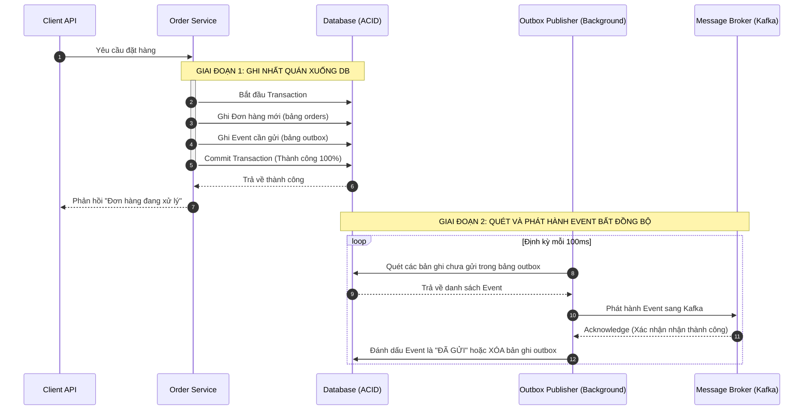

# Service A ghi DB thành công nhưng gửi event thất bại. Bạn xử lý thế nào?

## ⚡ Tóm tắt ngắn (30s)
* **Bản chất**: Đây là **Vấn đề ghi kép (Dual-Write Problem)** kinh điển trong hệ phân tán. Việc cập nhật Database chính và gửi Event sang Message Broker là hai thao tác mạng độc lập, không thể gộp chung vào một Global Transaction (2PC) hiệu quả. Khi DB ghi thành công nhưng gửi event sập, hệ thống sẽ rơi vào trạng thái **bất nhất dữ liệu nghiêm trọng**.
* **Thảm họa thực chiến được giải quyết**:
  1. **Đơn hàng ma (Phantom Transaction)**: Khách hàng thanh toán thành công, trừ tiền và cập nhật trạng thái `SUCCESS` trong Database của Payment Service. Nhưng do gửi event thanh toán thành công sang Kafka bị sập (timeout, broker down), Order Service không hề biết để kích hoạt quy trình giao hàng, trực tiếp gây ra thảm họa khiếu nại.
  2. **Dữ liệu mâu thuẫn (Ghost States)**: Rollback Database thất bại sau khi event đã lỡ phát ra ngoài. Các service khác đã xử lý dựa trên dữ liệu ảo, làm sai lệch báo cáo tài chính.
* **Quyết định Senior**:
  1. **Tuyệt đối cấm gửi Event trực tiếp trong Code nghiệp vụ chính**: Không gửi event trực tiếp trong khối `@Transactional` hoặc sau khi gọi method lưu DB.
  2. **Triển khai Transactional Outbox Pattern**: Lưu thông tin Event cần phát dưới dạng một bản ghi vào bảng phụ `outbox` ngay trong cùng một Transaction ghi dữ liệu chính xuống DB. Đảm bảo tính nhất quán tuyệt đối nhờ ACID của Database (hoặc cả hai cùng ghi thành công, hoặc cả hai cùng rollback).
  3. **Xây dựng Outbox Publisher độc lập**: Sử dụng một Background Worker (quét bảng `outbox` định kỳ) hoặc công cụ CDC (Change Data Capture như Debezium đọc Transaction Log của DB) để bốc Event từ bảng `outbox` đẩy sang Message Broker.
  4. **Thiết kế Idempotent Consumer phía nhận**: Đảm bảo cơ chế gửi Event là **At-least-once** (Chắc chắn gửi thành công ít nhất 1 lần, chấp nhận trùng lặp). Phía Consumer bắt buộc phải kiểm tra trùng lặp để xử lý an toàn.

---

## 🔍 Chi tiết bản chất thực chiến: Sự sụp đổ của giải pháp ngây thơ & Sự cứu rỗi của Outbox

Hãy cùng phân tích tại sao 2 cách tiếp cận ngây thơ mà nhiều lập trình viên thường dùng đều dẫn tới thảm họa bất nhất dữ liệu:

### ⚠️ Cách tiếp cận ngây thơ 1: Gửi Event TRONG Transaction DB
```java
@Transactional
public void createOrder(Order order) {
    orderRepository.save(order); // 1. Ghi DB
    kafkaTemplate.send("order-topic", new OrderEvent(order.getId())); // 2. Gửi Event
}
```
* **Thảm họa**: Bước 2 gửi Kafka thành công, nhưng ngay sau đó việc commit DB ở bước 1 bị thất bại (ví dụ: DB bị lock, trùng constraint hoặc mất kết nối). Transaction bị rollback, DB không lưu Order. Tuy nhiên, **Event đã bay sang Kafka và không thể thu hồi!** Service giao hàng nhận được event và tiến hành giao một đơn hàng không hề tồn tại.

### ⚠️ Cách tiếp cận ngây thơ 2: Gửi Event SAU KHI Transaction DB đã Commit
```java
public void processOrder(Order order) {
    orderService.createOrderInDb(order); // 1. Commit DB thành công
    kafkaTemplate.send("order-topic", new OrderEvent(order.getId())); // 2. Gửi Event
}
```
* **Thảm họa**: Bước 1 commit DB thành công tuyệt đối. Nhưng ngay trước bước 2, máy chủ bị sập nguồn đột ngột (OOM, mất điện, Kubernetes kill pod). Khi hệ thống khởi động lại, Order đã nằm trong DB nhưng **Event không bao giờ được gửi đi**, dẫn tới đơn hàng bị kẹt vĩnh viễn.

---

## 🎨 Sơ đồ trực quan (Cơ chế hoạt động của Transactional Outbox Pattern)



---

## 💻 Code thực chiến: Triển khai Transactional Outbox nhẹ nhàng trong Spring Boot

Dưới đây là cách triển khai hoàn chỉnh cơ chế Outbox sử dụng Event nội bộ của Spring (`ApplicationEventPublisher` kết hợp `@TransactionalEventListener`) để xử lý mượt mà và an toàn.

### 1. Entity Đơn hàng và Bảng Outbox trong cùng một Database
```java
import jakarta.persistence.*;
import lombok.Getter;
import lombok.Setter;
import java.time.LocalDateTime;

@Entity
@Table(name = "outbox_events")
@Getter
@Setter
public class OutboxEvent {
    @Id
    @GeneratedValue(strategy = GenerationType.IDENTITY)
    private Long id;

    private String aggregateType; // Ví dụ: "ORDER"
    private String aggregateId;   // ID của Entity chính (order_id)
    private String eventType;     // Ví dụ: "ORDER_CREATED"
    
    @Lob
    private String payload;       // JSON payload của event
    
    private String status;        // "PENDING", "PROCESSED", "FAILED"
    private LocalDateTime createdAt;
}
```

### 2. Service Nghiệp vụ thực hiện ghi kép bằng Transaction
```java
import com.fasterxml.jackson.databind.ObjectMapper;
import lombok.RequiredArgsConstructor;
import lombok.extern.slf4j.Slf4j;
import org.springframework.stereotype.Service;
import org.springframework.transaction.annotation.Transactional;
import java.time.LocalDateTime;

@Slf4j
@Service
@RequiredArgsConstructor
public class OrderService {

    private final OrderRepository orderRepository;
    private final OutboxRepository outboxRepository;
    private final ObjectMapper objectMapper;

    @Transactional // ✅ Đảm bảo tính ACID: orders và outbox_events cùng ghi hoặc cùng rollback
    public OrderEntity createOrder(OrderRequest request) {
        log.info("🛒 Đang khởi tạo giao dịch tạo đơn hàng trong DB...");

        // 1. Lưu Entity chính (Order)
        OrderEntity order = new OrderEntity();
        order.setCustomerId(request.getCustomerId());
        order.setAmount(request.getAmount());
        order.setStatus("CREATED");
        OrderEntity savedOrder = orderRepository.save(order);

        // 2. Chuyển đổi dữ liệu Event sang JSON Payload
        String payload;
        try {
            OrderCreatedEvent event = new OrderCreatedEvent(savedOrder.getId(), savedOrder.getAmount());
            payload = objectMapper.writeValueAsString(event);
        } catch (Exception e) {
            throw new RuntimeException("Lỗi chuyển đổi dữ liệu JSON", e);
        }

        // 3. Ghi thông tin Event vào bảng Outbox trong cùng Transaction
        OutboxEvent outbox = new OutboxEvent();
        outbox.setAggregateType("ORDER");
        outbox.setAggregateId(savedOrder.getId().toString());
        outbox.setEventType("ORDER_CREATED");
        outbox.setPayload(payload);
        outbox.setStatus("PENDING");
        outbox.setCreatedAt(LocalDateTime.now());
        outbox.setCreatedAt(LocalDateTime.now());
        outboxRepository.save(outbox);

        log.info("✅ Ghi DB thành công cả Đơn hàng và Outbox Event cho đơn hàng: {}", savedOrder.getId());
        return savedOrder;
    }
}
```

### 3. Background Outbox Publisher quét bảng gửi sang Kafka
```java
import lombok.RequiredArgsConstructor;
import lombok.extern.slf4j.Slf4j;
import org.springframework.kafka.core.KafkaTemplate;
import org.springframework.scheduling.annotation.Scheduled;
import org.springframework.stereotype.Component;
import org.springframework.transaction.annotation.Transactional;
import java.util.List;

@Slf4j
@Component
@RequiredArgsConstructor
public class OutboxPublisher {

    private final OutboxRepository outboxRepository;
    private final KafkaTemplate<String, String> kafkaTemplate;

    /**
     * ✅ Quét bảng outbox định kỳ mỗi 1 giây để phát hành các event chưa gửi.
     * Thích hợp cho các dự án vừa và nhỏ. (Hệ thống cực lớn nên dùng Debezium CDC).
     */
    @Scheduled(fixedDelay = 1000)
    @Transactional // Bảo vệ việc update trạng thái outbox
    public void publishPendingEvents() {
        List<OutboxEvent> pendingEvents = outboxRepository.findByStatus("PENDING");
        if (pendingEvents.isEmpty()) return;

        log.info("📡 Phát hiện {} Event chưa gửi trong Outbox. Tiến hành gửi sang Kafka...", pendingEvents.size());

        for (OutboxEvent event : pendingEvents) {
            try {
                // 1. Gửi sang Kafka thực tế
                kafkaTemplate.send("order-topic", event.getAggregateId(), event.getPayload())
                        .get(); // Sử dụng blocking .get() để đảm bảo Kafka đã ghi nhận thành công

                // 2. Cập nhật trạng thái thành PROCESSED hoặc XÓA hẳn bản ghi để tiết kiệm dung lượng DB
                event.setStatus("PROCESSED");
                outboxRepository.save(event);
                log.info("🚀 Đã xuất bản thành công Event ID: {} sang Kafka", event.getId());
            } catch (Exception e) {
                log.error("🚨 Gửi Event ID: {} thất bại. Sẽ thử lại ở lần quét sau. Chi tiết: {}", event.getId(), e.getMessage());
                event.setStatus("FAILED");
                outboxRepository.save(event);
            }
        }
    }
}
```

---

## 📊 Bảng so sánh 3 giải pháp xử lý Ghi Kép (Dual-Write)

| Tiêu chí | Sử dụng Global Transaction (2PC / JTA) | Transactional Outbox (Scheduled Polling) | Change Data Capture (CDC / Debezium) |
| :--- | :--- | :--- | :--- |
| **Độ phức tạp** | Rất cao (Đòi hỏi hệ thống hỗ trợ XA protocol). | Thấp (Dễ viết bằng Spring Boot Scheduled). | Trung bình - Cao (Yêu cầu thiết lập hạ tầng Kafka Connect). |
| **Tác động hiệu năng** | Rất tệ (Khóa tài nguyên DB trong khi chờ mạng, giảm throughput). | Nhẹ (Chỉ tốn thêm 1 lệnh insert vào bảng outbox). | **Cực nhẹ** (Không ảnh hưởng luồng chính, đọc từ DB log file ngầm). |
| **Độ trễ phát hành Event** | Cực thấp (Event phát ngay lập tức). | Trung bình (Trễ từ 500ms - 1s tùy cấu hình Scheduled). | Thấp (Trễ < 100ms nhờ cơ chế CDC thời gian thực). |
| **Khả năng mở rộng (Scale)** | Kém (Gây nghẽn hệ thống khi tăng lượng Transaction). | Tốt (Có thể tối ưu index bảng outbox). | **Tuyệt vời** (Chuẩn Enterprise cho hệ thống chịu tải cao). |

---

## ⚠️ Common Gotchas & Questions follow-up

### 1. Cạm bẫy "Bảng Outbox phình to làm sập dung lượng đĩa (Outbox Table Bloat)"
* **Vấn đề**: Trong một hệ thống High Throughput (ví dụ: 10,000 đơn đặt hàng/phút), bảng `outbox_events` sẽ nhanh chóng tích tụ hàng triệu bản ghi sau vài ngày. Nếu bạn chỉ cập nhật trạng thái sang `PROCESSED` mà không dọn dẹp, dung lượng bảng phình to làm chậm toàn bộ các câu lệnh query/insert của hệ thống chính.
* **Giải pháp khắc phục**: Đừng giữ lại các bản ghi đã gửi thành công.
  1. Tiến hành **Xóa hẳn bản ghi outbox** (DELETE) ngay sau khi gửi thành công sang Kafka thay vì update trạng thái thành `PROCESSED`.
  2. Hoặc thiết lập một Scheduled Job chạy ngầm hàng đêm để purge (xóa cứng) toàn bộ các bản ghi có trạng thái `PROCESSED` đã tồn tại quá 24 giờ.

### 2. Câu hỏi đào sâu từ interviewer
* **Q: Nếu Outbox Publisher gửi event sang Kafka thành công, nhưng trước khi nó kịp xóa bản ghi trong DB thì máy chủ bị sập. Khi khởi động lại, Event đó lại được gửi tiếp lần thứ hai sang Kafka. Làm sao giải quyết vấn đề duplicate event này?**
  * *Trả lời*:
    * Đây là đặc tính **At-Least-Once Delivery** (Chắc chắn gửi thành công ít nhất một lần, chấp nhận trùng lặp). Việc trùng lặp message là điều không thể tránh khỏi hoàn toàn trong hệ thống phân tán.
    * Giải pháp bắt buộc phải nằm ở **phía nhận (Consumer) - Idempotent Consumer Pattern**:
      1. Mỗi Event phát ra bắt buộc phải chứa một ID độc nhất (`event_id` dạng UUID) nằm trong payload hoặc header.
      2. Consumer khi nhận Event, trước khi xử lý nghiệp vụ, phải kiểm tra xem `event_id` này đã từng được xử lý hay chưa bằng cách:
         - Lưu `event_id` vào Redis với TTL (ví dụ: 7 ngày) làm cờ kiểm tra (Distributed Set).
         - Hoặc tạo một bảng `processed_events` trong Database của consumer với primary key là `event_id`. Nếu chèn trùng `event_id`, DB sẽ ném lỗi unique constraint và consumer bỏ qua event đó an toàn.
