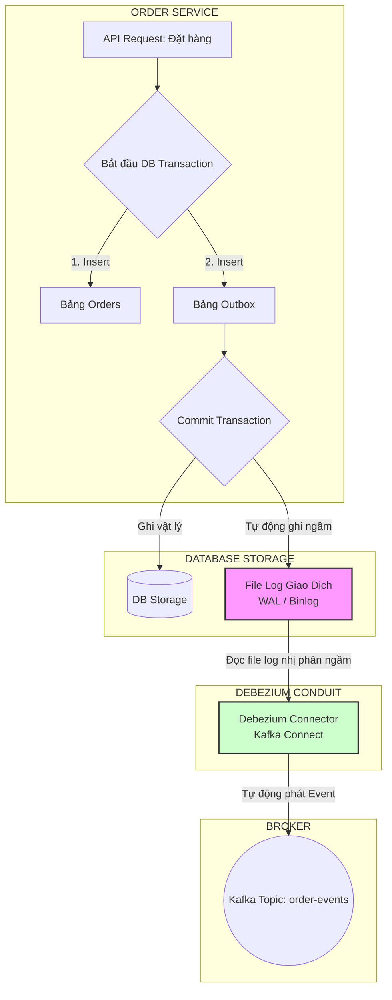

# Outbox pattern giải quyết vấn đề gì trong production?

## ⚡ Tóm tắt ngắn (30s)
* **Bản chất**: Trong kiến trúc Microservices và Event-Driven, **Transactional Outbox Pattern** sinh ra để giải quyết triệt để **Vấn đề ghi kép (Dual-Write)** và nguy cơ **mất mát sự kiện (Event Loss)**. Nó là "tấm khiên" bảo vệ tính nhất quán dữ liệu cuối cùng (**Eventual Consistency**) bằng cách biến việc ghi dữ liệu chính và lưu trữ event thành một giao dịch ACID duy nhất trong lòng Database.
* **Thảm họa thực chiến được giải quyết**:
  1. **Mất mát sự kiện cốt lõi (Silent Event Loss)**: Khi người dùng bấm "Huỷ tài khoản", DB lưu trạng thái thành công nhưng do mạng lag hoặc Kafka bị sập tạm thời, event huỷ không thể gửi đi. Kết quả là hệ thống gửi mail vẫn tiếp tục gửi mail quảng cáo, hệ thống thanh toán vẫn tiếp tục trừ tiền, tạo ra một trải nghiệm khách hàng cực kỳ tồi tệ và vi phạm pháp lý (GDPR).
  2. **Thất bại trong việc phục hồi (Failed Recovery)**: Khi một service trung gian bị crash đột ngột trong khi đang thực hiện giao dịch qua mạng, toàn bộ các event đang chờ phát hành bị bốc hơi khỏi bộ nhớ RAM (In-memory buffer) và không thể khôi phục được.
* **Quyết định Senior**:
  1. **Bảo đảm giao hàng ít nhất một lần (At-Least-Once Delivery)**: Bảng `outbox` đóng vai trò là hàng đợi bền bỉ (persistent queue) nằm ngay trong DB. Nếu Message Broker bị downtime 5 tiếng, event vẫn nằm an toàn trong DB và sẽ tự động được gửi lại khi Broker hoạt động bình thường.
  2. **Tối ưu hóa Latency luồng chính**: Luồng xử lý request chính của khách hàng không bị chặn (block) bởi các cuộc gọi mạng chậm chạp đến Message Broker (vốn có độ trễ dao động mạnh), giúp API phản hồi cực nhanh.
  3. **Cô lập lỗi hạ tầng**: Lỗi sập Kafka/RabbitMQ được cô lập hoàn toàn, không thể làm sập hay rollback các giao dịch kinh doanh cốt lõi của Database.

---

## 🔍 Chi tiết bản chất thực chiến: Tại sao Outbox là chuẩn mực Enterprise?

Trong môi trường Production lớn, Outbox Pattern giải quyết các bài toán vận hành phức tạp thông qua hai cơ chế hoạt động chính:

### 1. Phân biệt 2 Biến thể Outbox Reader: Polling vs CDC (Change Data Capture)

Để đọc dữ liệu từ bảng `outbox` và phát sang Message Broker, chúng ta có hai hướng tiếp cận:

#### Hướng 1: Polling Publisher (Truy vấn định kỳ)
* **Cơ chế**: Dùng một Scheduled Job (ví dụ: Spring `@Scheduled`) chạy truy vấn `SELECT * FROM outbox WHERE status = 'PENDING'` mỗi 500ms.
* **Đánh giá**: Dễ triển khai, không tốn hạ tầng phụ. Tuy nhiên, nó tạo ra lượng tải truy vấn (Read Load) liên tục lên Database chính ngay cả khi hệ thống không có giao dịch mới (hiện tượng **Poll Waste**).

#### Hướng 2: CDC - Transaction Log Mining (Đọc file Log giao dịch - Khuyên dùng)
* **Cơ chế**: Sử dụng công cụ chuyên dụng như **Debezium** kết hợp Kafka Connect để ngầm đọc file log ghi chép giao dịch trực tiếp của Database (Transaction Log / WAL - Write-Ahead Log / Binlog).
* **Đánh giá**:
  * **Tuyệt đối không gây tải** lên Database chính vì nó không chạy câu lệnh SQL SELECT, mà chỉ đọc file log nhị phân ở tầng vật lý của hệ điều hành.
  * Độ trễ (latency) cực thấp (< 50ms), event được phát đi gần như tức thì ngay khi transaction kết thúc.
  * Đây là giải pháp tối thượng cho các hệ thống chịu tải hàng ngàn transaction mỗi giây.

---

## 🎨 Sơ đồ trực quan (Outbox Pattern kết hợp Debezium CDC)



---

## 💻 Code thực chiến: Triển khai Outbox Reader hiệu năng cao với Cơ chế Khóa Lạc Quan

Nếu dự án của bạn chưa có hạ tầng Debezium CDC, hãy triển khai Outbox Reader bằng Java Scheduled Executor sử dụng kỹ thuật **Optimistic Locking (Khóa lạc quan)** kết hợp **Batch Processing** để đảm bảo tốc độ cao và tránh xung đột khi chạy nhiều instance của service (Distributed Race Condition).

```java
import lombok.Getter;
import lombok.Setter;
import java.time.LocalDateTime;

@Getter
@Setter
public class OutboxRecord {
    private Long id;
    private String aggregateType;
    private String aggregateId;
    private String payload;
    private String status;
    private int version; // ✅ Sử dụng Version để phục vụ Khóa Lạc Quan (Optimistic Lock)
    private LocalDateTime updatedAt;
}
```

```java
import lombok.RequiredArgsConstructor;
import lombok.extern.slf4j.Slf4j;
import org.springframework.jdbc.core.BeanPropertyRowMapper;
import org.springframework.jdbc.core.namedparam.MapSqlParameterSource;
import org.springframework.jdbc.core.namedparam.NamedParameterJdbcTemplate;
import org.springframework.kafka.core.KafkaTemplate;
import org.springframework.scheduling.annotation.Scheduled;
import org.springframework.stereotype.Component;

import java.time.LocalDateTime;
import java.util.List;

@Slf4j
@Component
@RequiredArgsConstructor
public class HighPerformanceOutboxReader {

    private final NamedParameterJdbcTemplate jdbcTemplate;
    private final KafkaTemplate<String, String> kafkaTemplate;

    private static final int BATCH_SIZE = 100;

    /**
     * ✅ Quét bảng Outbox bằng khóa lạc quan để đảm bảo nhiều instance của App
     * chạy song song không bao giờ gửi trùng event.
     */
    @Scheduled(fixedDelay = 200) // Quét mỗi 200ms
    public void scanAndPublish() {
        // 1. Quét lấy 100 bản ghi PENDING có version khớp
        String selectSql = "SELECT id, aggregate_type, aggregate_id, payload, status, version " +
                           "FROM outbox_events WHERE status = 'PENDING' LIMIT :limit";
        
        MapSqlParameterSource params = new MapSqlParameterSource().addValue("limit", BATCH_SIZE);
        
        List<OutboxRecord> records = jdbcTemplate.query(selectSql, params, 
                new BeanPropertyRowMapper<>(OutboxRecord.class));

        if (records.isEmpty()) return;

        log.info("📡 Quét được {} Event cần xử lý...", records.size());

        for (OutboxRecord record : records) {
            // ✅ 2. KHÓA LẠC QUAN: Cập nhật trạng thái sang 'PROCESSING' kèm điều kiện khớp Version
            // Việc này đảm bảo nếu có instance khác đã bốc bản ghi này đi xử lý trước, lệnh update này sẽ trả về 0 dòng bị ảnh hưởng.
            String lockSql = "UPDATE outbox_events SET status = 'PROCESSING', version = version + 1, updated_at = :now " +
                             "WHERE id = :id AND version = :version";
            
            MapSqlParameterSource lockParams = new MapSqlParameterSource()
                    .addValue("id", record.getId())
                    .addValue("version", record.getVersion())
                    .addValue("now", LocalDateTime.now());

            int updatedRows = jdbcTemplate.update(lockSql, lockParams);

            if (updatedRows == 0) {
                // Instance khác đã bốc mất bản ghi này -> Bỏ qua
                log.warn("⚠️ Event ID: {} đã được xử lý bởi instance khác. Bỏ qua!", record.getId());
                continue;
            }

            // 3. Tiến hành gửi sang Kafka thực tế
            try {
                kafkaTemplate.send("order-events", record.getAggregateId(), record.getPayload())
                        .get(); // Blocking để chắc chắn Kafka đã ghi nhận

                // 4. Xóa cứng bản ghi để tối ưu bộ nhớ DB (Thay vì cập nhật thành PROCESSED)
                String deleteSql = "DELETE FROM outbox_events WHERE id = :id";
                jdbcTemplate.update(deleteSql, new MapSqlParameterSource("id", record.getId()));
                log.info("🚀 Đã xuất bản và xóa cứng Outbox Event ID: {}", record.getId());
                
            } catch (Exception e) {
                log.error("🚨 Gửi Event ID: {} sang Kafka thất bại. Trả trạng thái về PENDING để thử lại. Lỗi: {}", 
                        record.getId(), e.getMessage());
                
                // Trả trạng thái về PENDING để lần quét sau bốc lại
                String rollbackStatusSql = "UPDATE outbox_events SET status = 'PENDING', updated_at = :now WHERE id = :id";
                MapSqlParameterSource rollbackParams = new MapSqlParameterSource()
                        .addValue("id", record.getId())
                        .addValue("now", LocalDateTime.now());
                jdbcTemplate.update(rollbackStatusSql, rollbackParams);
            }
        }
    }
}
```

---

## 📊 Bảng so sánh 2 Cơ chế Đọc Outbox thực chiến

| Tiêu chí | Polling Publisher (JDBC / Scheduler) | CDC Reader (Debezium + Kafka Connect) |
| :--- | :--- | :--- |
| **Tải trọng lên Database chính** | **Cao** (Chạy câu lệnh SQL `SELECT` và `UPDATE` liên tục). | **Cực thấp** (Chỉ đọc file log nhị phân vật lý ngầm). |
| **Độ trễ (Latency) phát event** | Trung bình (`200ms - 1000ms` tùy tần suất quét). | Cực thấp (`< 50ms` - Thời gian thực). |
| **Xử lý xung đột khi Scale Out** | Phức tạp (Đòi hỏi khóa lạc quan, khóa bi quan hoặc distributed lock). | Không bị xung đột (CDC tự động phân chia phân vùng log độc quyền). |
| **Thời gian triển khai** | Nhanh chóng (Chỉ mất vài giờ viết code Java). | Lâu (Đòi hỏi cài đặt hạ tầng Kafka Connect, Debezium, phân quyền DB). |
| **Mức độ khuyên dùng** | Dành cho dự án nhỏ, Startup, MVP hoặc hệ thống ít giao dịch. | Dành cho hệ thống chịu tải lớn, chuẩn Enterprise, Big Data. |

---

## ⚠️ Common Gotchas & Questions follow-up

### 1. Cạm bẫy "Xử lý sai thứ tự của Event (Event Out-Of-Order)"
* **Vấn đề**: Khi bạn scale-out service của mình lên 3 instance chạy song song, mỗi instance chạy một Outbox Reader.
  * Instance 1 quét được Event 1: *Đơn hàng được tạo*.
  * Instance 2 quét được Event 2: *Đơn hàng đã được thanh toán*.
  * Do Instance 1 gặp mạng lag, Event 2 được gửi sang Kafka trước Event 1. Phía Consumer nhận Event thanh toán trước Event tạo đơn hàng, dẫn tới lỗi logic nghiệp vụ nghiêm trọng.
* **Giải pháp khắc phục**: Bắt buộc phải **Đảm bảo thứ tự tuyệt đối tại tầng Message Broker**.
  1. Khi gửi event sang Kafka, bắt buộc phải chỉ định **Message Key** (chính là `aggregateId` - `order_id`). Kafka đảm bảo các event mang cùng một key sẽ luôn đi vào duy nhất **1 Partition** cụ thể.
  2. Tại partition đó, các event sẽ được xếp hàng theo đúng thứ tự gửi tới (FIFO) và được consumer xử lý tuần tự.

### 2. Câu hỏi đào sâu từ interviewer
* **Q: Nếu Database sử dụng cơ chế ghi phân tán (ví dụ: CockroachDB hoặc MongoDB Replica Set), Outbox Pattern có hoạt động đúng không?**
  * *Trả lời*:
    * Outbox Pattern hoạt động dựa trên cam kết **Transaction ACID** của Database.
    * Nếu Database phân tán hỗ trợ transaction đa tài liệu (Multi-document/Multi-row Transactions với chuẩn ACID như MongoDB v4.0+ hoặc CockroachDB), Outbox Pattern vẫn hoạt động hoàn hảo.
    * Tuy nhiên, nếu Database của bạn là NoSQL dạng **Eventually Consistent (như Cassandra, DynamoDB)** không hỗ trợ ACID transaction đa bảng/đa tài liệu một cách hiệu quả, bạn tuyệt đối **không được áp dụng Outbox Pattern truyền thống**. Trong trường hợp đó, bạn bắt buộc phải chuyển sang cơ chế **Event Sourcing** hoặc sử dụng các công cụ CDC đặc chủng của nhà cung cấp (như DynamoDB Streams).
