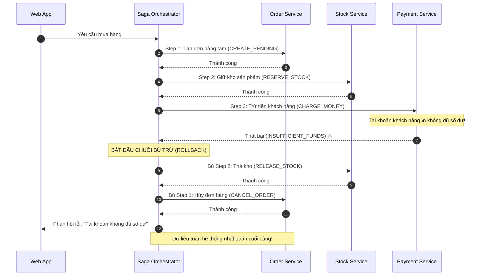

# Saga đang chạy dở thì một step fail. Bạn làm gì?

## ⚡ Tóm tắt ngắn (30s)
* **Bản chất**: Trong hệ thống phân tán, do không thể sử dụng Global Database Transaction (2PC) vì hiệu năng kém, chúng ta sử dụng **Saga Pattern** để quản lý các giao dịch cục bộ (Local Transactions) nối tiếp nhau. Khi một step trong chuỗi Saga bị thất bại (ví dụ: đã trừ tiền nhưng giữ kho thất bại), hệ thống bắt buộc phải thực thi cơ chế **Backward Recovery (Phục hồi ngược)** bằng cách gọi chuỗi **Compensating Transactions (Giao dịch bù trừ)** để tự động hoàn tác dữ liệu ngầm về trạng thái nhất quán.
* **Thảm họa thực chiến được giải quyết**:
  1. **Tiền mất nhưng không có hàng (Data Inconsistency)**: Trong quy trình mua hàng: *1. Trừ tiền ví của user -> 2. Trừ tồn kho sản phẩm -> 3. Tạo hóa đơn giao hàng*. Bước 1 trừ tiền thành công, bước 2 tồn kho báo hết hàng. Nếu không có giao dịch bù ở bước 1 để hoàn tiền, ví tiền của khách hàng bị bốc hơi vĩnh viễn mà không nhận được sản phẩm.
  2. **Trạng thái mồ côi (Orphan States)**: Bản ghi ở các service phía trước bị kẹt ở trạng thái lấp lửng (`PENDING`) mãi mãi, chặn các luồng nghiệp vụ khác của khách hàng.
* **Quyết định Senior**:
  1. **Kích hoạt Chuỗi Giao Dịch Bù Trừ ngược (LIFO)**: Lập tức gọi các API hoàn tác ngược lại theo thứ tự ngược với thứ tự thực hiện thành công trước đó (ví dụ: Gọi API *Hoàn tiền* để bù cho API *Trừ tiền*).
  2. **Cam kết Idempotent cho API Bù**: Các API bù trừ bắt buộc phải được thiết kế Idempotent tuyệt đối (chấp nhận cuộc gọi hoàn tiền bị retry nhiều lần do mạng lỗi nhưng chỉ được cộng tiền đúng 1 lần).
  3. **Tách biệt Pivot Transaction**: Xác định rõ điểm không thể quay đầu (Pivot Transaction - thường là bước trừ tiền/thanh toán). Các bước trước Pivot bị fail sẽ rollback ngược. Các bước sau Pivot bị fail bắt buộc phải **Forward Recovery (Thử lại đến khi thành công)** chứ không rollback.

---

## 🔍 Chi tiết bản chất thực chiến: Quy trình Rollback Phân Tán (Saga Failure)

Khi một bước trong chuỗi Saga bị fail, hệ thống sẽ thực hiện quy trình hoàn tác ngầm (Backward Recovery) theo cơ chế sau:

```
[Khởi tạo Saga] ──> [Step 1: Thành công] ──> [Step 2: Thành công] ──> [Step 3: THẤT BẠI 💥]
                                                                            │
                                                                            ▼ (Kích hoạt Rollback)
[Nhất quán cuối] <── [Bù Step 1: Hoàn tất] <── [Bù Step 2: Hoàn tất] <── [Kích hoạt Chuỗi Bù]
```

### 1. Phân tích 3 Loại Transaction trong thiết kế Saga của Senior
Để thiết kế Saga chịu lỗi tốt, Senior phân loại các bước thành 3 nhóm rõ ràng:

* **Compensable Transaction (Giao dịch có thể bù)**: Các bước diễn ra trước bước thanh toán/quyết định (ví dụ: giữ chỗ, giữ kho tạm thời). Các bước này có thể hoàn tác dễ dàng bằng một hành động bù (ví dụ: thả kho, thả chỗ).
* **Pivot Transaction (Giao dịch bản lề)**: Bước quyết định của toàn bộ chuỗi Saga. Nếu Pivot Transaction thành công, Saga được coi là chắc chắn đi tiếp (commit). Nếu Pivot thất bại, Saga sẽ rollback toàn bộ các bước trước đó. *Thông thường, bước thanh toán/trừ tiền thực tế là Pivot Transaction*.
* **Retriable Transaction (Giao dịch có thể thử lại)**: Các bước diễn ra sau Pivot Transaction (ví dụ: gửi mail xác nhận, tạo hóa đơn). Các bước này **không được phép rollback** vì tiền đã trừ. Nếu gặp lỗi, hệ thống phải liên tục retry (Forward Recovery) cho đến khi thành công tuyệt đối.

### 2. Sự khác biệt khi xảy ra lỗi ở 2 mô hình Saga
* **Orchestrator-based Saga (Điều phối tập trung)**:
  * Khi Step 3 ném lỗi về bộ điều phối (Saga Orchestrator), Orchestrator đọc trạng thái trong DB và tự động gửi lệnh gọi API Bù (Compensate) đến Service 2 và Service 1 theo tuần tự.
  * *Ưu điểm*: Cực kỳ dễ debug, quản lý trạng thái tập trung trong 1 bảng DB duy nhất.
* **Choreography-based Saga (Biên đạo phân tán)**:
  * Service 3 phát event `Step3Failed`. Service 2 lắng nghe event này, thực hiện hành động bù của mình, rồi phát tiếp event `Step2Compensated`. Service 1 nghe thấy và tự động hoàn tiền.
  * *Nhược điểm*: Cực kỳ khó trace lỗi khi hệ thống phình to, dễ bị vòng lặp event vô hạn (Cyclic dependency).

---

## 🎨 Sơ đồ trực quan (Luồng xử lý lỗi của Saga Orchestrator)



---

## 💻 Code thực chiến: Triển khai Saga Orchestrator chịu lỗi tự động bằng Java

Dưới đây là một khung Saga Orchestrator gọn gàng quản lý quy trình thanh toán nhiều bước, tự động bắt lỗi và thực thi chuỗi hoàn tác (Rollback) ngược.

```java
import lombok.RequiredArgsConstructor;
import lombok.extern.slf4j.Slf4j;
import org.springframework.stereotype.Component;

import java.util.ArrayList;
import java.util.Collections;
import java.util.List;

@Slf4j
@Component
@RequiredArgsConstructor
public class CheckoutSagaOrchestrator {

    private final OrderServiceClient orderClient;
    private final StockServiceClient stockClient;
    private final PaymentServiceClient paymentClient;

    public boolean executeSaga(String orderId, String productId, double amount) {
        log.info("🏁 Bắt đầu chuỗi giao dịch phân tán (Saga) cho Đơn hàng: {}", orderId);
        
        // Danh sách lưu các bước đã thực hiện thành công để phục vụ rollback LIFO
        List<SagaStep> completedSteps = new ArrayList<>();

        try {
            // Step 1: Tạo đơn hàng
            log.info("👉 [Saga Step 1] Đang gọi tạo đơn hàng tạm...");
            orderClient.createPendingOrder(orderId);
            completedSteps.add(new SagaStep("CREATE_ORDER", () -> orderClient.cancelOrder(orderId)));

            // Step 2: Giữ kho sản phẩm
            log.info("👉 [Saga Step 2] Đang gọi giữ kho sản phẩm...");
            stockClient.reserveStock(productId, 1);
            completedSteps.add(new SagaStep("RESERVE_STOCK", () -> stockClient.releaseStock(productId, 1)));

            // Step 3: Trừ tiền khách hàng (💥 Mô phỏng lỗi ở đây)
            log.info("👉 [Saga Step 3] Đang gọi trừ tiền khách hàng...");
            boolean paymentSuccess = paymentClient.chargeMoney(orderId, amount);
            
            if (!paymentSuccess) {
                throw new RuntimeException("Thanh toán thất bại do không đủ số dư!");
            }

            log.info("🎉 CHUỖI SAGA THÀNH CÔNG RỰC RỠ!");
            return true;

        } catch (Exception e) {
            log.error("🚨 CHUỖI SAGA BỊ ĐỨT GÃY! Nguyên nhân: {}. Bắt đầu quá trình ROLLBACK...", e.getMessage());
            
            // ✅ Kích hoạt Backward Recovery: Hoàn tác ngược LIFO
            rollbackSaga(completedSteps);
            return false;
        }
    }

    private void rollbackSaga(List<SagaStep> completedSteps) {
        // Đảo ngược danh sách các bước đã hoàn thành thành công để rollback theo thứ tự LIFO
        Collections.reverse(completedSteps);

        for (SagaStep step : completedSteps) {
            log.warn("🔄 Đang thực thi giao dịch bù cho bước: [{}]", step.getStepName());
            int maxRetry = 3;
            boolean success = false;
            
            // Cố gắng retry giao dịch bù nếu gặp lỗi mạng tạm thời
            for (int i = 0; i < maxRetry; i++) {
                try {
                    step.getRollbackAction().run();
                    success = true;
                    log.info("✅ Hoàn tác thành công bước: [{}]", step.getStepName());
                    break;
                } catch (Exception e) {
                    log.error("⚠️ Thử lại hoàn tác bước [{}] lần {} thất bại: {}", step.getStepName(), i + 1, e.getMessage());
                }
            }

            if (!success) {
                // 🚨 CỰC KỲ NGUY HIỂM: Giao dịch bù thất bại hoàn toàn. Cần can thiệp thủ công!
                log.error("🚨🚨🚨 THẢM HỌA: Không thể hoàn tác bước [{}]. Hệ thống bị bất nhất dữ liệu! Báo động khẩn cấp tới vận hành.", step.getStepName());
                // Gửi alert khẩn cấp lên Slack/SMS cho đội On-call ở đây
            }
        }
    }

    @RequiredArgsConstructor
    @Getter
    private static class SagaStep {
        private final String stepName;
        private final Runnable rollbackAction;
    }
}
```

---

## 📊 Bảng so sánh 2 Cách tiếp cận quản lý Saga

| Tiêu chí | Saga điều phối tập trung (Orchestrator-based) | Saga biên đạo phân tán (Choreography-based) |
| :--- | :--- | :--- |
| **Cơ chế liên lạc** | Trực tiếp thông qua API gọi chéo của bộ điều phối. | Bất đồng bộ thông qua Event Broker (Kafka). |
| **Sự phụ thuộc (Coupling)** | Tập trung (Bộ điều phối biết toàn bộ logic chuỗi). | Lỏng lẻo (Mỗi service chỉ biết event của chính mình). |
| **Khả năng debug & trace lỗi** | **Dễ dàng** (Trạng thái và lỗi tập trung tại 1 bảng DB). | Cực khó (Phải dùng distributed tracing để xâu chuỗi). |
| **Khả năng mở rộng (Scale)** | Bị giới hạn nhẹ bởi hiệu năng bộ điều phối tập trung. | Cực tốt nhờ cơ chế xử lý bất đồng bộ phi trạng thái. |
| **Phù hợp với** | Quy trình phức tạp, nhiều bước (>3 bước), đòi hỏi quản lý chặt chẽ. | Quy trình đơn giản, hiệu năng cao, các service ít thay đổi. |

---

## ⚠️ Common Gotchas & Questions follow-up

### 1. Cạm bẫy "Đọc dữ liệu ảo trong khi Saga đang chạy (Dirty Read / Lack of Isolation)"
* **Vấn đề**: Saga không có tính năng **Isolation** (Cô lập) giống như ACID transaction. Khi Saga chạy: *Bước 1: Giữ kho -> Bước 2: Trừ tiền (Fail) -> Rollback*. Trong vài giây trước khi Rollback xảy ra, khách hàng khác vào mua sản phẩm và thấy tồn kho bằng 0 (do bị giữ kho ảo). Họ bỏ đi. Sau đó Saga rollback, kho được thả ra nhưng cơ hội bán hàng đã trôi qua.
* **Giải pháp khắc phục**: Áp dụng kỹ thuật **Semantic Lock (Khóa ngữ nghĩa)**:
  - Không trừ trực tiếp tồn kho thực tế ở bước 1. Hãy tạo thêm một cột `reserved_quantity` trong bảng DB.
  - Khi Saga chạy, tăng `reserved_quantity`. Khi hiển thị tồn kho cho user, tính toán: `Khả dụng = Tồn thực tế - reserved_quantity`.
  - Nếu Saga thành công, tiến hành trừ tồn thực tế và giảm `reserved_quantity`. Nếu Saga fail, chỉ cần giảm `reserved_quantity` là xong.

### 2. Câu hỏi đào sâu từ interviewer
* **Q: Nếu một Giao dịch bù trừ (Compensating Transaction) bị thất bại hoàn toàn (ví dụ: API hoàn tiền trả về lỗi 500 do ngân hàng liên kết bị sập) thì xử lý thế nào để hệ thống không bị lệch sổ sách vĩnh viễn?**
  * *Trả lời*:
    * Khi Giao dịch bù thất bại hoàn toàn sau nhiều lần retry, **tuyệt đối không được bỏ qua âm thầm!**
    * Quy trình xử lý Senior bắt buộc gồm 3 lá chắn:
      1. **Đưa vào hàng đợi lỗi bền bỉ (Outbox / DLQ)**: Đẩy yêu cầu bù thất bại này vào một Dead Letter Queue hoặc bảng `failed_compensations` trong DB để lưu vết vĩnh viễn.
      2. **Báo động đỏ tự động (Alerting)**: Kích hoạt hệ thống Alerting (PagerDuty/Slack) hú còi cảnh báo khẩn cấp cho đội ngũ trực vận hành (On-call) để can thiệp thủ công lập tức.
      3. **Viết Script tự động hòa giải dữ liệu (Reconciliation Job)**: Chạy một background job định kỳ mỗi giờ quét bảng `failed_compensations` để tự động gọi lại API bù khi dịch vụ ngân hàng hoạt động bình thường trở lại.
