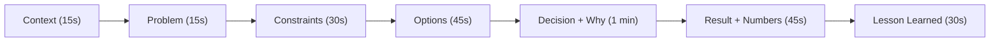

# Story Bank — Chuẩn bị 8-12 Câu chuyện Thực tế (Format CCO-DRL)

## ⚡ Tóm tắt ngắn (30s)
* **Story bank** = bộ 8-12 câu chuyện kinh nghiệm thực tế của bạn, mỗi câu structure **CCO-DRL**:
  * **C**ontext → **P**roblem → **C**onstraints → **O**ptions → **D**ecision → **R**esult → **L**esson learned.
* **Mỗi story**: 3-5 phút telling, cover 1 chủ đề.
* **Coverage tối thiểu**:
  - 2 stories về **incident** (production sự cố).
  - 2 stories về **system design** (decision phức tạp).
  - 2 stories về **leadership** (mentor, conflict).
  - 2 stories về **trade-off** (technical choice).
  - 1 failure story.
  - 1 success story.

---

## 🔍 Phương pháp chi tiết

### Step 1: Brainstorm raw stories
List 20+ event đáng nhớ trong 3-5 năm gần đây:
- Major incidents bạn handle.
- Tech decision impactful.
- Migration / refactor.
- Hiring / firing.
- Mentor junior.
- Conflict với stakeholder.

### Step 2: Filter top 8-12
Chọn stories có:
- Clear context (interviewer hiểu trong 30s).
- Decision YOU made (không phải team).
- Quantifiable result.
- Lesson reusable.

### Step 3: Write CCO-DRL for each
Format chuẩn:
```
[CONTEXT]: 1-2 câu setup
[PROBLEM]: 1 câu vấn đề
[CONSTRAINTS]: time/budget/team/tech
[OPTIONS]: 2-3 options bạn cân nhắc
[DECISION]: bạn chọn gì + tại sao
[RESULT]: số + thời gian + impact
[LESSON]: học được gì
```

### Step 4: Practice telling
- Out loud, time yourself.
- 3-5 min ideal.
- Avoid jargon.

### Step 5: Map to interview questions
| Question type | Stories |
| :--- | :--- |
| "Most challenging project" | System design stories |
| "Difficult decision" | Trade-off stories |
| "Failure" | Failure + recovery |
| "Conflict" | Leadership |
| "Production incident" | Incident stories |

---

## 🎨 Story canvas



---

## 💻 Example story (fill in)

```markdown
# Story: Migration Kafka → Pulsar

CONTEXT:
- 2023, e-commerce 10M event/day.
- Tôi là tech lead messaging team, 4 engineers.

PROBLEM:
- Kafka cluster legacy, hard to scale, ops burden 30%/week.
- Need to support multi-tenant + geo-replicated.

CONSTRAINTS:
- 6 months timeline.
- No downtime allowed (e-commerce 24/7).
- Budget: hire 1 contractor max.

OPTIONS:
1. Upgrade Kafka to latest version.
2. Migrate to Apache Pulsar (multi-tenant native).
3. Migrate to AWS MSK + KafkaConnect.

DECISION:
- Chose Pulsar.
- Reason: multi-tenant out-of-box; geo-replication mature; ops simpler at scale.
- Trade-off accepted: smaller ecosystem.

RESULT:
- 6 months on schedule.
- Zero downtime via shadow + cutover.
- Ops time reduced 80%.
- Cost saved $50k/year.

LESSON:
- Shadow + replay validates correctness.
- Investment in observability pre-migration pays off.
- Pulsar's docs lagging — needed internal runbook.
```

---

## 📊 Coverage matrix

| Story | Type | Tags |
| :--- | :--- | :--- |
| 1. Kafka→Pulsar migration | System design | scalability, ops |
| 2. Black Friday outage | Incident | recovery, comms |
| 3. Junior promote | Leadership | mentor, growth |
| 4. RDBMS vs NoSQL | Trade-off | data, justification |
| 5. Failed feature launch | Failure | learning |
| 6. Save legacy system | Success | impact |
| 7. Cross-team conflict | Leadership | conflict resolution |
| 8. Hire decision | Leadership | judgment |

---

## ⚠️ Common Mistakes & Pro Tips

1. **Too much detail**: skip team org chart, dive to decision.
2. **No numbers**: "improved performance" → "p99 from 800ms to 120ms".
3. **Group success**: be specific about YOUR contribution.
4. **No lesson**: every story needs a takeaway.
5. **Memorize wording**: bad. Practice structure, speak naturally.
6. **Bring metrics**: have specific numbers ready.
