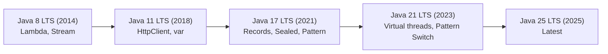

# Modern Java — Java 11/17/21 Features

## ⚡ Tóm tắt ngắn (30s)
* **Modern Java features must know** (for Senior interview):
  1. **Records** (Java 14+): immutable DTO concise.
  2. **Sealed classes** (Java 17): restricted inheritance.
  3. **Pattern matching** (Java 21): switch + instanceof.
  4. **Text blocks** (Java 15): multi-line strings.
  5. **Virtual threads** (Java 21): lightweight concurrency.
  6. **ZGC** (Java 15+): low-pause GC.
  7. **Container-aware JVM**: respect cgroup limits.

---

## 💻 Examples

### Records (Java 14+)
```java
public record Order(String id, String customer, double amount) {
    // Auto: constructor, getters, equals, hashCode, toString.
}

var o = new Order("1", "alice", 100.0);
String id = o.id();  // getter
```

### Sealed classes (Java 17)
```java
public sealed interface Shape permits Circle, Square, Triangle {}
public final class Circle implements Shape { ... }
public final class Square implements Shape { ... }
public final class Triangle implements Shape { ... }
```

Pair with pattern matching switch.

### Pattern matching for switch (Java 21)
```java
double area = switch (shape) {
    case Circle c -> Math.PI * c.radius() * c.radius();
    case Square s -> s.side() * s.side();
    case Triangle t -> 0.5 * t.base() * t.height();
};
```

### Text blocks (Java 15)
```java
String json = """
    {
      "name": "Alice",
      "age": 30
    }
    """;
```

### Virtual threads (Java 21)
```java
// Old way (heavy)
ExecutorService old = Executors.newFixedThreadPool(200);

// New way (lightweight, can have millions)
ExecutorService virtual = Executors.newVirtualThreadPerTaskExecutor();

virtual.submit(() -> {
    // Blocking I/O OK — virtual thread parks, releases carrier
    return httpClient.get("...");
});
```

Use case: high-concurrency I/O-bound (microservices calling other services).

### ZGC + container-aware (Java 15+)
```bash
java -XX:+UseZGC \
     -XX:+UnlockExperimentalVMOptions \
     -XX:MaxRAMPercentage=75 \
     -jar app.jar
```

- ZGC: pause < 1ms regardless of heap size.
- MaxRAMPercentage: respect container memory cgroup.

---

## 🎨 Java version timeline



---

## 📊 Adoption priority

| Feature | Priority | Production benefit |
| :--- | :--- | :--- |
| Records | High | DTO simplification |
| Pattern switch | High | Cleaner code |
| Virtual threads | Very High | Major perf for I/O |
| Sealed classes | Medium | Better domain modeling |
| ZGC | Very High | Low-pause GC |
| Container-aware JVM | Very High | Proper resource use |

---

## ⚠️ Interviewer questions

**"When use records vs class?"**
- Records: immutable DTO with auto-generated equals/hashCode.
- Class: when need mutability, complex methods, inheritance.

**"Virtual threads vs reactive?"**
- Virtual threads: looks like blocking code, just works for I/O.
- Reactive: more complex, finer control, lower memory.
- Virtual threads simpler for most cases.

**"Migrate from Java 8 to 21?"**
1. Tool: jdeps, jdeprscan, jlink.
2. Test thoroughly.
3. Fix removed/deprecated APIs.
4. Adopt new features iteratively.
5. Performance test (GC behavior changed).
