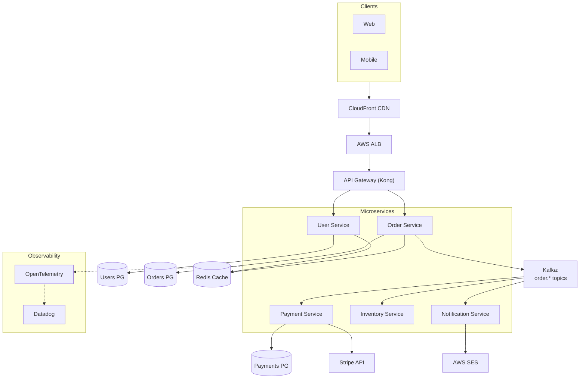

# Architecture Diagrams — Vẽ lại 2-3 Project Cũ

## ⚡ Tóm tắt ngắn (30s)
* **Mục đích**: trong phỏng vấn system design, interviewer hỏi "draw your last project's architecture". Bạn cần vẽ trong 5 min, fluent, explain.
* **Diagram phải có**:
  1. **External actors** (users, mobile, web).
  2. **API/Load balancer**.
  3. **Microservices** named.
  4. **Database** (primary + replica).
  5. **Cache layer** (Redis).
  6. **Message broker** (Kafka).
  7. **External integrations**.
  8. **Monitoring/observability** (high-level).

---

## 🎨 Example architecture (Mermaid)

---

## 💻 Drawing tips

1. **Top-down**: clients top, infrastructure bottom.
2. **Group by layer**: gateway, services, data, observability.
3. **Use subgraphs**: cluster related components.
4. **Label data flows**: synchronous vs async.
5. **Show data stores**: cylinder shape.
6. **Annotate**: TPS, latency next to bottleneck.

---

## 📊 Per-project diagram checklist

| Element | Included? |
| :--- | :---: |
| Clients (web, mobile) | ☐ |
| CDN / Load balancer | ☐ |
| API gateway | ☐ |
| Microservices (named) | ☐ |
| Databases | ☐ |
| Cache layer | ☐ |
| Message broker | ☐ |
| External integrations | ☐ |
| Observability stack | ☐ |
| Annotations (scale, latency) | ☐ |

---

## ⚠️ Common Mistakes & Pro Tips

1. **Too detailed**: hide implementation details, show flow.
2. **Too vague**: name components specifically.
3. **No async vs sync indication**: critical signal.
4. **Skip observability**: senior signal to include.
5. **Hand-drawn**: practice on whiteboard/Miro/Excalidraw.

**Pro tip**: practice 3 different diagrams for variety. Mermaid lets you commit to git, version control.
