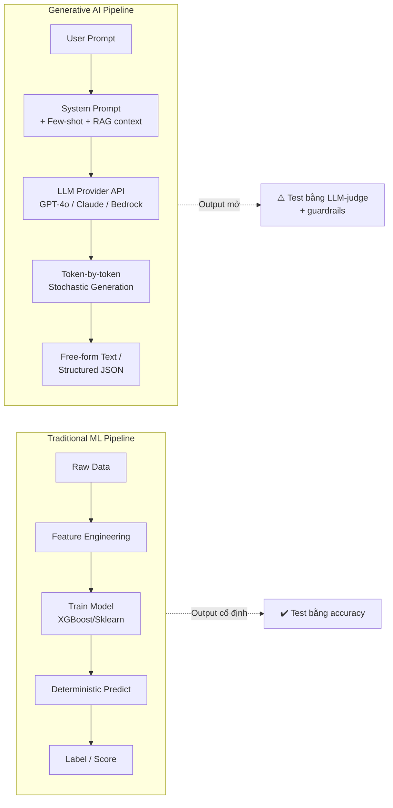

# Generative AI khác gì với Traditional ML

## ⚡ Tóm tắt ngắn (30s)
* **Bản chất**: Traditional ML (Discriminative / Predictive Model) học để **dự đoán nhãn** hoặc giá trị từ một tập feature đã chuẩn hóa (classification, regression, ranking). Generative AI (đặc biệt là LLM) học **phân phối xác suất của ngôn ngữ tự nhiên** để **sinh ra dữ liệu mới** (text, code, image) bằng cách dự đoán token tiếp theo trên một context window khổng lồ.
* **Khác biệt cốt lõi mà Senior phải hiểu**:
  1. **Output space**: ML truyền thống output 1 nhãn / 1 số / 1 ranking score → có ground truth rõ ràng → đánh giá bằng accuracy / F1 / AUC. GenAI output là **chuỗi token mở** → không có 1 đáp án đúng duy nhất → phải đánh giá bằng LLM-as-judge, human eval, hoặc semantic similarity.
  2. **Training cost & ownership**: ML truyền thống train trên dataset của công ty (GBs đến TBs), 1 GPU vài giờ. LLM được pretrain trên hàng trillion token, hàng nghìn GPU, vài tháng → ngưỡng vào quá cao → backend engineer **chỉ tiêu thụ** API hoặc fine-tune top layer, không train từ đầu.
  3. **Behavior**: ML truyền thống deterministic (cùng input → cùng output). GenAI **stochastic** (nhiệt độ, sampling) → cùng prompt có thể ra nhiều câu trả lời khác nhau → kéo theo phải thiết kế lại testing, caching, idempotency.
* **Thảm họa thực chiến nếu nhầm lẫn**: Team đem mindset ML truyền thống "1 input → 1 deterministic output, viết unit test so sánh string" áp vào LLM endpoint → 50% test fail ngẫu nhiên ở CI, devops phải retry pipeline → giảm tốc độ release. Hoặc team đem LLM thay cho classifier có sẵn để phân loại spam → cost x100, latency x20, accuracy giảm vì LLM không được train cho domain đó.

---

## 🔍 Chi tiết bản chất

### 1. Học gì – Discriminative vs Generative

| Khía cạnh | Traditional ML (Discriminative) | Generative AI (LLM) |
| :--- | :--- | :--- |
| Hàm học | `P(y \| x)` — xác suất nhãn y khi biết feature x | `P(token_{t+1} \| token_1..token_t)` — sinh token tiếp theo |
| Goal | Phân biệt ranh giới giữa các lớp | Mô phỏng phân phối toàn bộ ngôn ngữ |
| Ví dụ | Logistic regression, XGBoost, Random Forest, BERT cho classification | GPT-4o, Claude, Gemini, Llama-3 |
| Khả năng "few-shot" | Phải retrain với data mới | Học task mới chỉ bằng vài example trong prompt (in-context learning) |

### 2. Pipeline khác nhau hoàn toàn

**ML truyền thống** (5 năm trước vẫn dùng):
1. Thu thập dataset có nhãn (label) → cleansing → feature engineering.
2. Train model trên Spark / Sklearn / XGBoost.
3. Validate → deploy model lên một service (MLflow, SageMaker endpoint).
4. Monitor accuracy drift theo thời gian → retrain định kỳ.

**GenAI workflow** (LLM-first):
1. Chọn provider/model (OpenAI gpt-4o, Anthropic claude-sonnet-4-6, Bedrock Llama-3 self-hosted).
2. **Prompt engineering** thay vì feature engineering: viết system prompt, few-shot examples.
3. (Tùy chọn) RAG để bơm dữ liệu công ty vào context.
4. (Tùy chọn) Fine-tune nhẹ để dạy format / domain ngôn ngữ.
5. Deploy backend service gọi API, monitor token cost / hallucination / latency.

### 3. Khi nào dùng GenAI, khi nào dùng ML truyền thống

* **Dùng ML truyền thống** khi: có dataset có nhãn rõ ràng (fraud labels, click logs); cần latency < 50ms; cần explainability cao (vay tín dụng, healthcare); cần đảm bảo deterministic (rules engine).
* **Dùng GenAI** khi: input/output là ngôn ngữ tự nhiên không có schema cố định (summarization, drafting, classification trên text dài, code generation, conversational interface).

---

## 🎨 Sơ đồ trực quan



---

## 💻 Code thực chiến: Cùng một bài toán giải bằng 2 cách

Bài toán: Phân loại email khách hàng thành 3 nhãn (`bug`, `feature_request`, `billing`).

### 1. Cách Traditional ML (Spring + một Sklearn model qua HTTP)

```java
package com.example.support.classifier;

import org.springframework.web.client.RestClient;
import org.springframework.stereotype.Service;

@Service
public class TraditionalMlClassifier {
    private final RestClient client = RestClient.create("http://ml-service.internal:8080");

    public String classify(String emailBody) {
        // ML service đã được train sẵn trên 50k email có nhãn lịch sử
        // Trả về deterministic: cùng input → cùng output, latency ~30ms
        return client.post()
                .uri("/predict")
                .body(new PredictRequest(emailBody))
                .retrieve()
                .body(PredictResponse.class)
                .label();
    }
    record PredictRequest(String text) {}
    record PredictResponse(String label, double confidence) {}
}
```

### 2. Cách GenAI (Spring AI + OpenAI / Anthropic)

```java
package com.example.support.classifier;

import org.springframework.ai.chat.client.ChatClient;
import org.springframework.stereotype.Service;

@Service
public class GenAiClassifier {
    private final ChatClient chatClient;

    // System prompt cố định "khóa" model vào nhiệm vụ phân loại
    private static final String SYSTEM = """
            Bạn là bộ phân loại email hỗ trợ. Chỉ trả về 1 trong 3 nhãn:
            bug | feature_request | billing.
            Không giải thích, không thêm dấu câu, không bọc trong markdown.
            """;

    public GenAiClassifier(ChatClient.Builder builder) {
        // Temperature = 0 để giảm tính ngẫu nhiên (gần deterministic nhưng không tuyệt đối)
        this.chatClient = builder.defaultSystem(SYSTEM).build();
    }

    public String classify(String emailBody) {
        // Few-shot trực tiếp trong user prompt giúp tăng chính xác khi không fine-tune
        String userPrompt = """
                Ví dụ:
                "App crash khi mở app" -> bug
                "Cho mình xin hóa đơn tháng 5" -> billing

                Email: %s
                Nhãn:""".formatted(emailBody);

        return chatClient.prompt()
                .user(userPrompt)
                .call()
                .content()
                .trim()
                .toLowerCase();
    }
}
```

> **Quyết định Senior**: Với 50k email/ngày, Traditional ML thắng về cost & latency. Nhưng nếu chỉ có 200 email/ngày và không có dataset có nhãn, GenAI là lựa chọn duy nhất vì không cần build training pipeline.

---

## 📊 Bảng so sánh chi tiết Traditional ML vs Generative AI

| Tiêu chí | Traditional ML | Generative AI (LLM) | Ai thắng |
| :--- | :--- | :--- | :--- |
| **Latency / request** | 5–100ms (model nhỏ, chạy on-CPU/GPU local) | 500ms–10s (gọi API, sinh token tuần tự) | ML truyền thống |
| **Cost / 1M request** | ~$1 (tự host inference) | $10–$500 tùy model & token | ML truyền thống |
| **Cần dataset có nhãn?** | Bắt buộc | Không cần (zero-shot / few-shot) | GenAI |
| **Explainability** | Có (SHAP, feature importance) | Rất khó (black-box) | ML truyền thống |
| **Bài toán mới chưa có data** | Bế tắc | Triển khai trong 1 ngày | GenAI |
| **Output schema rigid** | Mạnh (1 nhãn / 1 số) | Phải dùng JSON mode / structured output / guardrail | ML truyền thống |
| **Xử lý text dài, ngữ cảnh** | Yếu (BERT max 512 token) | Mạnh (Claude/GPT-4o 200k–1M token) | GenAI |
| **Đánh giá chất lượng** | Accuracy / F1 / AUC | LLM-as-judge / human eval / similarity | ML truyền thống dễ hơn |
| **Cập nhật kiến thức mới** | Retrain → deploy → tốn ngày | Đổi prompt / context → ngay lập tức | GenAI |

---

## ⚠️ Common Gotchas & Questions follow-up

### 1. Cạm bẫy: Dùng LLM thay cho mọi bài toán phân loại
* **Vấn đề**: Sau khi đội ngũ phát hiện "LLM giải mọi thứ", họ thay luôn cả classifier spam (đã được train chuẩn 99.5% F1) bằng prompt gọi GPT-4o. Kết quả: cost x40, latency p99 từ 50ms vọt lên 4s, accuracy giảm xuống 92% vì LLM không được train cho domain spam của công ty.
* **Giải pháp**: Nguyên tắc Senior — **GenAI không thay thế ML truyền thống cho high-volume / low-latency / well-labeled tasks**. Hãy dùng LLM để mở task mới (không có nhãn) hoặc làm preprocessing (sinh nhãn cho dataset rồi train classifier nhỏ).

### 2. Cạm bẫy: Mong đợi deterministic output
* **Vấn đề**: Dev viết unit test `assertEquals("bug", classifier.classify(email))` cho LLM-based classifier. CI fail ngẫu nhiên 5% lần build vì model thỉnh thoảng trả "Bug." (có dấu chấm) hoặc "BUG".
* **Giải pháp**: 
  1. Đặt `temperature = 0` để giảm random.
  2. Dùng **structured output / JSON mode** (`response_format: json_schema` với OpenAI, hoặc `tool use` với Anthropic).
  3. Validate output bằng enum trong code (`Set.of("bug", "feature_request", "billing")`) và retry với prompt được làm rõ hơn nếu không khớp.
  4. Test bằng "semantic equality" hoặc "set membership", không bằng string equality cứng.

### 3. Câu hỏi đào sâu từ interviewer
* **Interviewer: "Bạn đang có classifier truyền thống chạy ngon, sếp ép phải migrate sang LLM 'cho hiện đại'. Bạn phản biện thế nào?"**
* **Trả lời Senior**:
  1. Đặt tiêu chí quyết định lên bàn: cost/request, p99 latency, accuracy, explainability, blast radius khi sai. So sánh số liệu hai bên (ví dụ: classifier 30ms vs LLM 1500ms → fail SLA).
  2. Đề xuất **hybrid**: dùng LLM ở nhánh "fallback / uncertain" của classifier (khi confidence < 0.7), hoặc dùng LLM offline để sinh thêm training data cho model nhỏ → "distillation".
  3. Demo POC nhỏ với 1000 email so sánh trực tiếp 3 chiều: ML cũ, LLM, hybrid → đem số đi convince thay vì cãi miệng. Senior không tranh luận bằng cảm tính, mà tranh luận bằng data.
