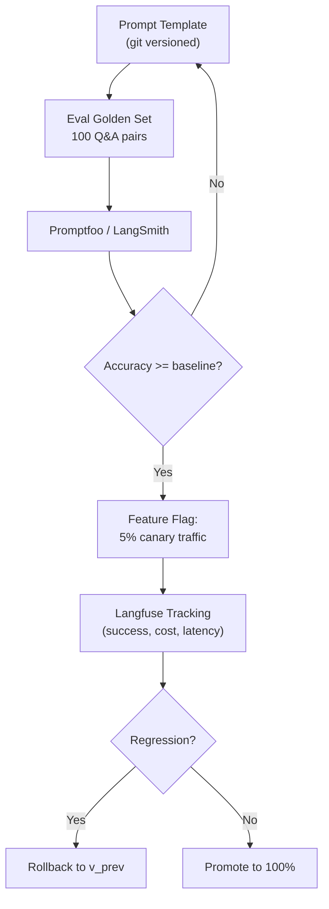

# Prompt Engineering là gì

## ⚡ Tóm tắt ngắn (30s)
* **Prompt Engineering** là **kỹ thuật thiết kế prompt** (system + user + few-shot examples + format hints) để LLM trả ra kết quả mong muốn, **một cách reliable và lặp lại được**, mà không cần thay đổi model weights. Đây là "lập trình" cho LLM — input là natural language thay vì code.
* **5 kỹ thuật cốt lõi mỗi Senior phải biết**:
  1. **Role/Persona priming**: "Bạn là Senior Java engineer..." → khóa style và domain.
  2. **Few-shot learning**: Cho 2–5 cặp input/output làm ví dụ → model bắt chước format.
  3. **Chain-of-Thought (CoT)**: Yêu cầu "think step by step" → tăng accuracy trên reasoning task 10–30%.
  4. **Structured output**: JSON schema, XML tag, hoặc instruction format cứng → parse được trong code.
  5. **Decomposition**: Chia task lớn thành nhiều LLM call nhỏ (planning → search → summarize → format).
* **Khác biệt giữa "prompt engineering hobby" vs "prompt engineering production"**:
  * Hobby: thử chatbot vài câu, copy paste prompt từ Twitter.
  * Production: prompt được **version control**, **A/B test**, có **eval pipeline**, **regression test**, **prompt caching**, **fallback prompt** khi v1 fail.
* **Thảm họa thực chiến**: PM trực tiếp edit production prompt qua admin panel để "fix nhanh" một report user → prompt mới làm hỏng 5 use case khác chưa được test → 3 ngày sau team phát hiện accuracy giảm 40%. Senior fix bằng cách: prompt vào git, PR-based review, eval suite run trên golden set trước khi promote.

---

## 🔍 Chi tiết bản chất

### 1. Anatomy của 1 prompt production

```
┌─────────────────────────────────────────┐
│ 1. SYSTEM PROMPT                        │
│    - Role: "Bạn là..."                  │
│    - Domain context                     │
│    - Constraints: "Chỉ trả lời từ..."   │
│    - Output format spec                 │
├─────────────────────────────────────────┤
│ 2. FEW-SHOT EXAMPLES (optional)         │
│    Input 1 → Output 1                   │
│    Input 2 → Output 2                   │
├─────────────────────────────────────────┤
│ 3. RAG CONTEXT (nếu có)                 │
│    [Retrieved chunks]                   │
├─────────────────────────────────────────┤
│ 4. USER MESSAGE                         │
│    Câu hỏi thực tế                      │
├─────────────────────────────────────────┤
│ 5. OUTPUT FORMAT REMINDER (optional)    │
│    "Reply in JSON: {...}"               │
└─────────────────────────────────────────┘
```

### 2. Các kỹ thuật chi tiết

#### Role/Persona Priming
```
Bạn là Senior PostgreSQL DBA với 15 năm kinh nghiệm tuning query trên DB >1TB.
Trả lời ngắn gọn, ưu tiên giải pháp đo lường được.
```
→ Model output thiên về tone chuyên nghiệp, đi vào EXPLAIN ANALYZE, index strategy thay vì giải thích kiến thức cơ bản.

#### Few-shot Examples
```
Phân loại email thành: bug | feature | billing

Email: "App crash khi mở camera" → bug
Email: "Cho mình xin invoice tháng 3" → billing
Email: "Có thể thêm dark mode không?" → feature

Email: "Không thấy báo cáo tuần này" → ???
```
Few-shot mạnh hơn zero-shot 10–30% trên task có format cứng. 3–5 example là sweet spot.

#### Chain-of-Thought
```
Q: Một xe chạy 60km/h trong 2 giờ, sau đó 80km/h trong 3 giờ. Tổng quãng đường?
A: Hãy suy luận từng bước:
   - Giai đoạn 1: 60 × 2 = 120 km
   - Giai đoạn 2: 80 × 3 = 240 km
   - Tổng: 120 + 240 = 360 km
   Đáp án: 360 km
```
Hiệu quả nhất trên math/logic. Với model nhỏ hơn (Haiku, GPT-4o-mini) CoT cải thiện rõ rệt. Với model lớn (Opus 4.7, GPT-4o), thường đã CoT internally.

#### Structured Output
```
Trả ONLY JSON theo schema:
{
  "intent": "bug" | "feature" | "billing",
  "priority": "high" | "medium" | "low",
  "summary": string
}
```
Hoặc dùng JSON mode (OpenAI), tool use (Anthropic), structured output (Spring AI) → ép format level provider.

#### Decomposition
Bài toán: "Lập kế hoạch viết bài blog về Spring Boot 4". Thay vì 1 LLM call dài → chia:
1. Outline generator
2. Per-section content generator
3. Editor / polish
4. SEO meta extraction

Mỗi step có prompt riêng, eval riêng, retry riêng → reliability cao hơn 1 prompt giant.

### 3. Prompt Engineering production lifecycle

| Stage | Activity | Tool |
| :--- | :--- | :--- |
| Author | Viết draft prompt | Markdown file trong git |
| Test | Eval trên golden set | LangSmith, Promptfoo, OpenAI Evals |
| Review | Code review prompt như code | PR + comment |
| Deploy | A/B test 5% traffic | Feature flag (LaunchDarkly, GrowthBook) |
| Monitor | Track success rate, cost, latency | Langfuse, Datadog |
| Iterate | Roll back nếu regression | Versioned prompt |

---

## 🎨 Sơ đồ trực quan



---

## 💻 Code thực chiến

### 1. Versioned prompt template + few-shot trong Java

```java
package com.example.ai.prompts;

import org.springframework.stereotype.Component;
import java.util.List;

@Component
public class TicketClassificationPrompt {

    public static final String VERSION = "v3.2";  // Bump khi đổi → log để A/B

    private static final String SYSTEM = """
            Bạn là bộ phân loại ticket support. Trả output JSON CHÍNH XÁC schema:
            {"intent": "bug"|"feature"|"billing"|"other", "priority": "high"|"medium"|"low"}.
            KHÔNG giải thích, KHÔNG bọc trong markdown code block.
            """;

    private static final List<Example> FEW_SHOTS = List.of(
        new Example("App crash khi mở camera", "{\"intent\":\"bug\",\"priority\":\"high\"}"),
        new Example("Cho mình xin invoice tháng 3", "{\"intent\":\"billing\",\"priority\":\"low\"}"),
        new Example("Có thể thêm dark mode không?", "{\"intent\":\"feature\",\"priority\":\"low\"}")
    );

    public String system() { return SYSTEM; }

    public String user(String ticketBody) {
        StringBuilder sb = new StringBuilder();
        for (Example ex : FEW_SHOTS) {
            sb.append("Ticket: ").append(ex.input()).append("\n");
            sb.append("Output: ").append(ex.output()).append("\n\n");
        }
        sb.append("Ticket: ").append(ticketBody).append("\nOutput:");
        return sb.toString();
    }

    private record Example(String input, String output) {}
}
```

### 2. Wrap Spring AI ChatClient + log version

```java
@Service
public class TicketClassifier {
    private final ChatClient chat;
    private final TicketClassificationPrompt promptBuilder;
    private final ObjectMapper mapper = new ObjectMapper();
    private static final Logger log = LoggerFactory.getLogger(TicketClassifier.class);

    public TicketClassifier(ChatClient.Builder b, TicketClassificationPrompt p) {
        this.chat = b.build();
        this.promptBuilder = p;
    }

    public TicketLabel classify(String body) throws Exception {
        long start = System.currentTimeMillis();
        String response = chat.prompt()
                .system(promptBuilder.system())
                .user(promptBuilder.user(body))
                .options(ChatOptions.builder().temperature(0.0).maxTokens(80).build())
                .call().content();

        // Log version + outcome cho monitoring
        log.info("prompt_version={} latency_ms={} response={}",
            TicketClassificationPrompt.VERSION,
            System.currentTimeMillis() - start,
            response);

        return mapper.readValue(response, TicketLabel.class);
    }

    public record TicketLabel(String intent, String priority) {}
}
```

### 3. Promptfoo config — Eval suite

```yaml
# promptfoo.yaml
providers:
  - openai:gpt-4o-mini
  - anthropic:claude-haiku-4-5

prompts:
  - file://prompts/ticket_classify_v3.2.txt
  - file://prompts/ticket_classify_v3.1.txt  # baseline

tests:
  - vars:
      ticket: "App crash khi mở camera"
    assert:
      - type: javascript
        value: JSON.parse(output).intent === "bug"
  - vars:
      ticket: "Cho mình xin invoice"
    assert:
      - type: javascript
        value: JSON.parse(output).intent === "billing"
  # ... 100 golden cases
```

---

## 📊 Bảng so sánh các kỹ thuật prompting

| Kỹ thuật | Khi dùng | Cost overhead | Hiệu quả |
| :--- | :--- | :---: | :--- |
| Zero-shot | Task quá đơn giản hoặc model rất mạnh | Thấp | Baseline |
| Few-shot (3–5 examples) | Task có format cụ thể | Token tăng | Cao (+10-30%) |
| Chain-of-Thought | Math, logic, multi-step reasoning | Output dài hơn | Rất cao trên model nhỏ |
| Self-consistency (sample n) | Critical reasoning | n× cost | Cao nhưng đắt |
| Role/Persona | Cần style/domain cụ thể | Thấp | Trung bình |
| Structured Output / JSON mode | Cần parse output | Thấp | Đảm bảo format |
| Decomposition | Task lớn, multi-step | n× call | Cao về reliability |
| Tool Use / Function Calling | Cần gọi external API | Token định nghĩa tool | Mở use case mới |

---

## ⚠️ Common Gotchas & Questions follow-up

### 1. Cạm bẫy: Prompt là "magic spell"
* **Vấn đề**: Dev copy prompt 200 dòng từ Twitter, không hiểu vì sao work. Khi model upgrade từ Sonnet 3 → Sonnet 4 → prompt fail vì model mới không tuân lệnh "respond as a pirate".
* **Giải pháp**: 
  1. Hiểu rõ từng dòng prompt làm gì.
  2. Test prompt qua model upgrade.
  3. Document quyết định (ADR-style): vì sao có few-shot example này, vì sao cấu trúc này.

### 2. Cạm bẫy: Prompt thay đổi trực tiếp ở production
* **Vấn đề**: Admin panel cho PM edit prompt → PM "fix nhẹ" cho 1 case → vô tình break 5 case khác.
* **Giải pháp**:
  1. Prompt là code → vào git, qua PR.
  2. Eval suite blocking trong CI.
  3. A/B test với feature flag.
  4. Easy rollback (1 click).

### 3. Cạm bẫy: Prompt dài kinh dị
* **Vấn đề**: Senior viết prompt 3000 token với 20 rule, model bắt đầu confuse rule này với rule kia. Sau khi cắt còn 800 token với 5 rule chính → accuracy tăng.
* **Giải pháp**: Ít nhưng chất. Mỗi rule cần justification. Test có/không rule để đo impact.

### 4. Câu hỏi đào sâu từ interviewer
* **Interviewer: "Làm sao bạn debug khi prompt không work như mong đợi?"**
* **Trả lời Senior**:
  1. **Đọc raw response**: không skim qua, đọc nguyên văn. Tìm hint model "hiểu sai chỗ nào".
  2. **Ablation**: bớt từng phần prompt → xem phần nào load-bearing.
  3. **Adversarial inputs**: thử các edge case (empty, very long, conflicting instructions trong user input).
  4. **CoT explicit**: cho model "explain reasoning before output" → đọc chain để hiểu logic.
  5. **Đo bằng numbers**: golden set, accuracy trước/sau. Không trust feel.
  6. **Promptfoo / LangSmith** để diff response giữa 2 prompt version.
