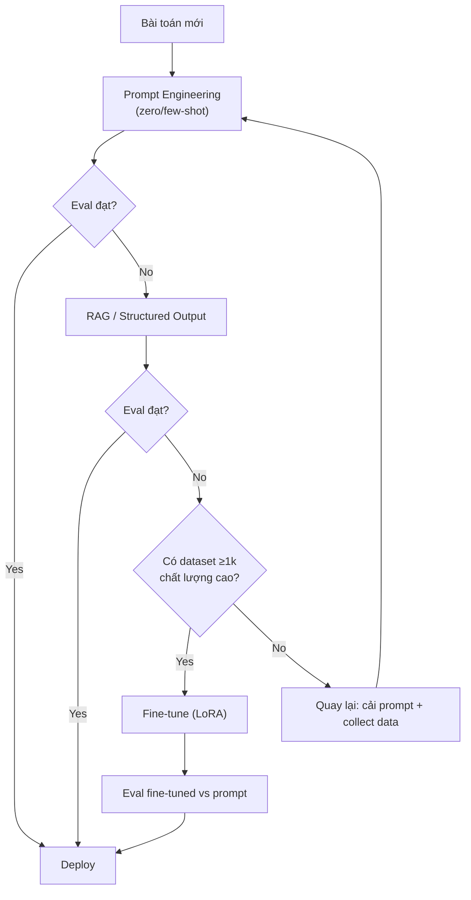

# Fine-tuning khác Prompt Engineering thế nào

## ⚡ Tóm tắt ngắn (30s)
* **Prompt Engineering**: Giữ nguyên model weights, **tác động hành vi qua text prompt** (system, few-shot, format). Realtime — đổi prompt là có effect ngay.
* **Fine-tuning**: **Cập nhật weights** của model trên dataset domain → "ghi cứng" pattern mới vào parameters. Cần training pipeline (10k–1M sample), GPU, vài giờ–vài ngày.
* **Khác biệt cốt lõi cho Senior**:
  | Khía cạnh | Prompt Engineering | Fine-tuning |
  | :--- | :--- | :--- |
  | Setup cost | Phút | Giờ–ngày, $100–$10000 |
  | Cập nhật kiến thức mới | Realtime | Cần retrain |
  | Quality cho format / style | Tốt với few-shot | Xuất sắc |
  | Quality cho domain kiến thức | Phụ thuộc context | Tốt nhưng dễ overfit |
  | Cost / request sau khi triển khai | Token prompt cao | Token thấp (prompt ngắn) |
  | Reversibility | Đổi prompt là done | Lock vào model version |
* **Quyết định 80% case**: Bắt đầu bằng prompt engineering. Chỉ chuyển sang fine-tuning khi: (a) prompt đã optimize hết mà vẫn không đạt quality, (b) có >1000 sample/format cứng, (c) cần latency thấp / cost thấp / output ngắn nhất quán.
* **Thảm họa thực chiến**: Team fine-tune Llama-3 trên 5000 ticket lịch sử để chatbot trả lời "đúng tone công ty". Sau 3 tháng dữ liệu mới (tone đã đổi) → model trả lời lạc hậu. Cost retrain mỗi tháng $4000. Senior chuyển sang prompt engineering + RAG → tone cố định ở system prompt, kiến thức cập nhật realtime.

---

## 🔍 Chi tiết bản chất

### 1. Prompt Engineering — Tác động qua text

Hoạt động:
* Soạn system + few-shot + format spec.
* Model dùng **in-context learning**: học pattern từ ví dụ ngay trong prompt.
* Mỗi request gửi đầy đủ prompt → tốn input token.

Mạnh ở:
* Bài toán mới, chưa có data.
* Quick iteration (test 10 phương án trong 1 giờ).
* Adapt sang task khác chỉ cần đổi prompt.

Yếu ở:
* Token cost cao nếu few-shot dài (5 example × 200 token = 1000 token mỗi request).
* Latency cao vì prompt dài.
* Output có thể không hoàn toàn nhất quán format.
* Học pattern phức tạp khó (e.g. JSON schema rất sâu).

### 2. Fine-tuning — Cập nhật weights

Có 3 cấp độ:

**Full Fine-tuning**: Cập nhật toàn bộ weights. Cực đắt, đòi hỏi cluster GPU lớn, hiếm khi áp dụng cho LLM lớn.

**LoRA / QLoRA (Low-Rank Adaptation)**: Đóng băng weights gốc, train một số "low-rank adapter" nhỏ (~0.1% params). Rẻ hơn 100x, đủ tốt cho hầu hết domain adaptation.

**Provider fine-tuning API**: OpenAI / Anthropic / Bedrock cung cấp managed fine-tuning. Upload JSONL dataset (1k–100k example), provider train, deploy thành "your custom model".

Mạnh ở:
* Output format CỰC kỳ nhất quán (chuyên dùng cho structured output).
* Domain language / tone đặc thù (legal jargon, medical, internal slang).
* Cost thấp ở runtime — prompt có thể rất ngắn vì format đã "in" vào weights.

Yếu ở:
* Cần dataset có nhãn 1000+ example chất lượng cao.
* Overfit nếu dataset hẹp.
* Lock vào model version — provider sunset model → phải retrain.
* Khó update kiến thức (vs RAG realtime).

### 3. Quy tắc quyết định

```
Bắt đầu với Prompt Engineering.
   ↓
Eval không đạt KPI? (accuracy < target, format inconsistent)
   ↓
Thử RAG (cho knowledge) hoặc structured output (cho format).
   ↓
Vẫn không đạt + có dataset ≥1000 sample chất lượng?
   ↓
→ Fine-tuning (LoRA).
   ↓
ROI dương sau 3-6 tháng (giảm cost / tăng quality)?
   ↓
→ Giữ. Nếu không → quay về prompt engineering.
```

### 4. Khi NÀO fine-tune đem lại ROI

* **High volume**: nếu chỉ 1k request/ngày → khó offset chi phí fine-tune.
* **Domain ngôn ngữ đặc thù**: medical, legal, code internal.
* **Output format cực rigid**: extract structured data với 50 trường.
* **Latency critical**: prompt ngắn → TTFT thấp.
* **Cost-sensitive ở scale**: fine-tuned gpt-3.5/4o-mini quality cho task narrow có thể bằng GPT-4o non-tuned → cost 10x thấp hơn.

### 5. Khi NÀO không fine-tune

* Kiến thức thay đổi thường xuyên (news, doc nội bộ).
* Dataset <500 sample / quality thấp.
* Bài toán đang trong giai đoạn explore (chưa biết requirement cuối).
* Compliance không cho upload data sang provider để train.

---

## 🎨 Sơ đồ trực quan



---

## 💻 Code thực chiến

### 1. Prompt Engineering — Quick adapt

```java
@Service
public class StyleExtractor {
    private final ChatClient chat;

    public StyleExtractor(ChatClient.Builder b) { this.chat = b.build(); }

    public String extract(String body) {
        // Đổi tone đơn giản bằng cách đổi prompt — KHÔNG cần retrain
        return chat.prompt()
            .system("Bạn là editor tạp chí. Viết lại ngắn gọn, tone trang trọng, dưới 50 từ.")
            .user(body)
            .call().content();
    }
}
```

### 2. Fine-tuning với OpenAI — Workflow chuẩn

```python
# Step 1: Prepare JSONL dataset (1000+ examples)
# data/finetune.jsonl
# {"messages": [{"role":"system","content":"You are..."},
#              {"role":"user","content":"..."}, {"role":"assistant","content":"..."}]}

from openai import OpenAI
client = OpenAI()

# Step 2: Upload file
training_file = client.files.create(
    file=open("data/finetune.jsonl", "rb"),
    purpose="fine-tune"
)

# Step 3: Create fine-tune job
job = client.fine_tuning.jobs.create(
    training_file=training_file.id,
    model="gpt-4o-mini-2024-07-18",  # Base model
    hyperparameters={
        "n_epochs": 3,
        "learning_rate_multiplier": 0.1
    },
    suffix="my-classifier-v1"  # Đặt tên dễ trace
)

# Step 4: Poll status
job = client.fine_tuning.jobs.retrieve(job.id)
print(job.status, job.fine_tuned_model)
# When status = "succeeded", fine_tuned_model = "ft:gpt-4o-mini-2024-07-18:org::id"

# Step 5: Use fine-tuned model — prompt RẤT NGẮN vì format đã "in" vào weights
resp = client.chat.completions.create(
    model="ft:gpt-4o-mini-2024-07-18:org::id",
    messages=[{"role":"user","content":"App crash khi mở camera"}],
    temperature=0.0,
    max_tokens=50
)
# Output: {"intent":"bug","priority":"high"} — no need few-shot
```

### 3. LoRA fine-tune Llama-3 self-host (HuggingFace + PEFT)

```python
from transformers import AutoModelForCausalLM, AutoTokenizer, TrainingArguments
from peft import LoraConfig, get_peft_model
from trl import SFTTrainer

base_model = "meta-llama/Llama-3.1-8B-Instruct"
tokenizer = AutoTokenizer.from_pretrained(base_model)
model = AutoModelForCausalLM.from_pretrained(base_model, torch_dtype="bfloat16")

# LoRA: chỉ train ~0.1% params
lora_cfg = LoraConfig(
    r=16, lora_alpha=32,
    target_modules=["q_proj","v_proj"],
    lora_dropout=0.05, task_type="CAUSAL_LM"
)
model = get_peft_model(model, lora_cfg)

trainer = SFTTrainer(
    model=model, tokenizer=tokenizer,
    train_dataset=load_jsonl("data/finetune.jsonl"),
    args=TrainingArguments(
        output_dir="./out", num_train_epochs=3,
        per_device_train_batch_size=4, learning_rate=2e-4,
        bf16=True, logging_steps=10, save_strategy="epoch"
    )
)
trainer.train()
model.save_pretrained("./lora-adapters")
```

---

## 📊 Bảng quyết định: Prompt Eng vs Fine-tune

| Tiêu chí | Prompt Engineering | Fine-tuning |
| :--- | :--- | :--- |
| Setup time | Phút | Ngày |
| Setup cost | $0 | $100–$10000 |
| Cập nhật kiến thức | Realtime | Cần retrain |
| Output format consistency | Tốt với JSON mode | Xuất sắc |
| Latency ở runtime | Trung bình (prompt dài) | Thấp (prompt ngắn) |
| Cost ở runtime | Cao (more input tokens) | Thấp |
| Cần dataset có nhãn | Không | Bắt buộc ≥1k chất lượng |
| Reversibility | Cao | Thấp (lock model version) |
| Cross-provider portability | Cao | Thấp (vendor lock) |
| Compliance / data residency | OK với non-PII | Khó nếu data nhạy cảm |

---

## ⚠️ Common Gotchas & Questions follow-up

### 1. Cạm bẫy: Fine-tune trước khi đo baseline prompt
* **Vấn đề**: Team fine-tune ngay không thử prompt engineering carefully → tốn $5000 + 1 tuần. Kết quả: prompt engineering nâng accuracy từ 78% → 91%, không cần fine-tune.
* **Giải pháp**: Bắt buộc baseline:
  1. Zero-shot.
  2. Few-shot (3, 5, 10 examples).
  3. CoT.
  4. RAG nếu là knowledge task.
  5. Đo bằng eval suite.
  6. Chỉ khi đã tận dụng hết → cân nhắc fine-tune.

### 2. Cạm bẫy: Fine-tune trên data noisy
* **Vấn đề**: Lấy 10k ticket support có nhãn từ DB lịch sử, fine-tune. Sau khi deploy phát hiện accuracy thấp hơn baseline. Lý do: data có 30% nhãn sai do agent gắn nhầm.
* **Giải pháp**: 
  1. Clean data trước fine-tune (LLM-as-judge clean nhãn, hoặc human review).
  2. Start small: 500 sample sạch tốt hơn 10k sample noisy.
  3. Train/val/test split kỹ, monitor val loss.

### 3. Cạm bẫy: Coi fine-tune là cách add knowledge mới
* **Vấn đề**: Fine-tune để "model biết policy mới của công ty". Sau 1 tháng policy đổi → retrain. Tốn kém + chậm.
* **Giải pháp**: Knowledge → dùng RAG (realtime). Fine-tune cho **format / style / behavior**, không cho fact.

### 4. Câu hỏi đào sâu từ interviewer
* **Interviewer: "Khi nào kết hợp cả Fine-tune VÀ Prompt Engineering?"**
* **Trả lời Senior**:
  1. **Common pattern**: Fine-tune cho format + tone (output luôn JSON, luôn ngắn 50 từ), prompt engineering bơm context (RAG result, user metadata) vào user message.
  2. **Distillation**: Dùng GPT-4o với prompt engineering tốt → sinh 10k example → fine-tune gpt-4o-mini → model nhỏ rẻ chạy production với quality gần model lớn.
  3. **Hybrid evaluation**: A/B test 3 phương án: prompt-only, ft-only, ft+prompt → chọn ROI cao nhất.
  4. **Versioning**: cả prompt và fine-tuned model đều phải versioned, eval gắn vào CI.
