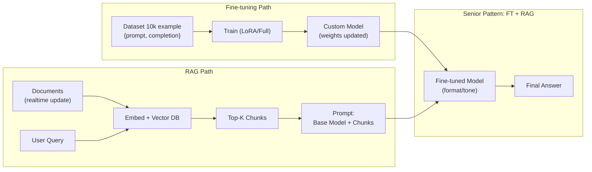

# Fine-tuning khác RAG thế nào

## ⚡ Tóm tắt ngắn (30s)
* **Fine-tuning** = ghi pattern (format, style, behavior) **vào weights của model**. Một lần train, mọi request dùng kiến thức đó. Cập nhật kiến thức = retrain.
* **RAG (Retrieval-Augmented Generation)** = giữ nguyên model, **bơm context relevant vào prompt** tại thời điểm query. Knowledge nằm ở **vector DB** + tài liệu, có thể update realtime mà không động vào model.
* **Quy tắc Senior phải nhớ**: 
  * **Fine-tune cho FORM (cách trả lời)**: tone, format JSON, language style, domain dialect.
  * **RAG cho FACT (nội dung trả lời)**: kiến thức công ty, doc mới, dữ liệu tươi.
* **80% case dùng RAG. Fine-tune là phương pháp bổ trợ cho format**.
* **Thảm họa thực chiến**: Team CTO yêu cầu "fine-tune model lên toàn bộ wiki Confluence để chatbot biết mọi thứ về công ty". Tốn $8000 train Llama-70B trên 200k page. Sau 2 tuần — Confluence có 5000 page mới, chatbot vẫn trả thông tin cũ. Đổi sang RAG: index Confluence vào pgvector, cập nhật mỗi giờ → chatbot luôn fresh, cost vận hành /10.

---

## 🔍 Chi tiết bản chất

### 1. Mô hình mental — Form vs Fact

```
                    │ FORM (cách diễn đạt)        │ FACT (nội dung)
────────────────────┼──────────────────────────────┼─────────────────────
Fine-tuning         │ ✓✓✓ (mạnh)                   │ ✓ (yếu, khó update)
Prompt Engineering  │ ✓✓ (few-shot examples)       │ ✓ (chỉ nếu trong context)
RAG                 │ ✗ (chỉ ảnh hưởng đáp lại)   │ ✓✓✓ (mạnh, realtime)
```

### 2. Fine-tuning hoạt động ra sao

* Upload dataset có cấu trúc `{prompt, completion}` × 1000–100000 sample.
* Provider/library chạy gradient descent → cập nhật weights → model "ghi nhớ" pattern.
* Kết quả: cùng prompt, model trả lời theo đúng style/format đã train.

Limitation:
* **Knowledge cập nhật chậm**: muốn thêm 1 doc mới → phải retrain (1 ngày–1 tuần).
* **Catastrophic forgetting**: fine-tune trên domain hẹp → giảm khả năng general.
* **Cost**: dataset chuẩn + GPU + ops.

### 3. RAG hoạt động ra sao

1. Ingestion: chunk document → embed → lưu vào vector DB.
2. Query time: embed user question → vector search top-K chunks → đưa vào prompt.
3. Model trả lời dựa trên context được bơm.

Strength:
* **Update realtime**: thêm doc mới → re-embed → có ngay.
* **Citation**: biết doc nào support claim → reduce hallucination.
* **Permission control**: filter ở vector search theo tenant/role.

Limitation:
* **Retrieval quality** quyết định mọi thứ. Miss chunk → trả lời sai.
* Cost token cao hơn (prompt dài hơn vì chứa context).
* Khó với multi-hop reasoning (câu trả lời cần combine nhiều doc cùng lúc).

### 4. So sánh chi tiết qua case study

**Case 1**: Chatbot trả lời FAQ sản phẩm.
* Form: "Trả lời ngắn 2-3 câu, tone thân thiện, kết bằng câu hỏi".
* Fact: Tài liệu sản phẩm + FAQ + policy.
* **Approach Senior**: Prompt engineering cho form (system prompt đầy đủ) + RAG cho fact. KHÔNG fine-tune.

**Case 2**: Trợ lý SQL generator cho internal DB.
* Form: SQL syntax PostgreSQL, naming convention snake_case, dùng CTE.
* Fact: Schema 200 bảng cập nhật hàng tuần.
* **Approach Senior**: Fine-tune cho form (SQL style) + RAG cho schema (chèn schema relevant vào prompt). Hai phương pháp BỔ TRỢ.

**Case 3**: Customer service tone công ty riêng.
* Form: Tone công ty rất đặc thù, đào tạo nhân viên mất 6 tháng.
* Fact: Kiến thức ổn định, không đổi nhiều.
* **Approach**: Fine-tune trên 5000 phản hồi mẫu của top agent → model trả lời "đúng văn phong". Knowledge dùng prompt cứng vì ít thay đổi.

---

## 🎨 Sơ đồ trực quan



---

## 💻 Code thực chiến

### 1. RAG-only — Realtime knowledge updates

```java
package com.example.ai.rag;

import org.springframework.ai.chat.client.ChatClient;
import org.springframework.stereotype.Service;
import java.util.List;

@Service
public class FaqChatbot {
    private final ChatClient chat;
    private final VectorStoreService vectorStore;

    public FaqChatbot(ChatClient.Builder b, VectorStoreService v) {
        this.chat = b.build();
        this.vectorStore = v;
    }

    public String ask(String question) {
        // Step 1: RAG retrieval — lấy chunk fresh từ vector DB
        List<String> chunks = vectorStore.search(question, 5);

        // Step 2: Build prompt với context
        String context = String.join("\n---\n", chunks);
        String system = """
                Bạn là trợ lý FAQ. Chỉ trả lời từ CONTEXT. Tone thân thiện, ngắn.
                Nếu không tìm thấy, nói "Không có thông tin".
                """;
        String user = "CONTEXT:\n" + context + "\n\nQ: " + question;

        return chat.prompt().system(system).user(user).call().content();
    }
}
```

### 2. Fine-tuned + RAG — Pattern Senior

```python
import openai
from app.rag import vector_search

# Custom fine-tuned model — đã được train cho tone công ty
FT_MODEL = "ft:gpt-4o-mini-2024-07-18:mycompany:tone-v3"

def answer(question: str) -> str:
    # RAG cung cấp fact mới nhất
    chunks = vector_search(question, top_k=5)
    context = "\n---\n".join(chunks)
    
    # Prompt RẤT ngắn vì format/tone đã in vào weights qua fine-tune
    messages = [
        {"role": "system", "content": "Trả lời từ CONTEXT."},
        {"role": "user", "content": f"CONTEXT:\n{context}\n\nQ: {question}"}
    ]
    
    resp = openai.chat.completions.create(
        model=FT_MODEL,
        messages=messages,
        temperature=0.0,
        max_tokens=300
    )
    return resp.choices[0].message.content
```

### 3. Update knowledge realtime (RAG ingestion)

```java
@Service
public class ConfluenceSync {
    private final VectorStoreService vectorStore;
    private final EmbeddingService embedding;

    @Scheduled(fixedRate = 3600000)  // Mỗi giờ
    public void syncFromConfluence() {
        // Pull doc mới/cập nhật từ Confluence API
        var updatedPages = confluenceClient.fetchUpdatedSince(lastSync);
        
        for (var page : updatedPages) {
            // Delete old chunks of this page (idempotent update)
            vectorStore.deleteByMetadata("confluence_page_id", page.id());
            
            // Re-chunk + re-embed + insert
            for (var chunk : chunker.split(page.content())) {
                float[] emb = embedding.embed(chunk.text());
                vectorStore.insert(emb, Map.of(
                    "confluence_page_id", page.id(),
                    "updated_at", page.updatedAt(),
                    "tenant_id", page.tenantId()
                ));
            }
        }
    }
}
```

---

## 📊 Bảng so sánh chi tiết

| Tiêu chí | Fine-tuning | RAG | Khi dùng cái nào |
| :--- | :--- | :--- | :--- |
| **Loại thông tin học** | Form, style, behavior pattern | Fact, document content | FT: cách trả lời. RAG: nội dung |
| **Update kiến thức** | Phải retrain | Realtime (re-embed) | RAG cho dynamic knowledge |
| **Setup cost** | $100–$10000 | $0–$1000 (infra) | RAG rẻ hơn để bắt đầu |
| **Latency** | Thấp (prompt ngắn) | Cao hơn (vector search +200ms) | FT khi cần latency thấp |
| **Cost/request** | Thấp | Cao (token context) | FT khi high volume |
| **Hallucination risk** | Vẫn có | Thấp hơn (grounded) | RAG cho factual |
| **Explainability** | Thấp (knowledge in weights) | Cao (citation tới doc) | RAG cho compliance |
| **Compliance / data residency** | Phải gửi data sang provider train | Có thể self-host vector DB | RAG cho data sensitive |

---

## ⚠️ Common Gotchas & Questions follow-up

### 1. Cạm bẫy: Dùng fine-tune để "dạy model biết doc mới"
* **Vấn đề**: Team fine-tune model lên doc nội bộ. 2 tuần sau doc update → câu trả lời lạc hậu. Lock model version, retrain định kỳ tốn tiền.
* **Giải pháp**: Knowledge là RAG. Fine-tune chỉ cho behavior/format.

### 2. Cạm bẫy: Coi RAG là silver bullet
* **Vấn đề**: Mọi câu hỏi đều quăng vào RAG. Câu "Hôm nay là thứ mấy?" cũng retrieval → vô nghĩa. Hoặc multi-hop reasoning đòi hỏi suy diễn cross-doc → RAG fail.
* **Giải pháp**:
  1. Routing trước: classify intent, chỉ RAG khi knowledge-based.
  2. Agentic RAG: nhiều bước retrieval + reasoning, model tự quyết định iterate.

### 3. Cạm bẫy: Fine-tune trên RAG-style data → "hardcode" retrieved chunks
* **Vấn đề**: Fine-tune `{prompt: "CONTEXT: X\nQ: Y", completion: "Z"}` với CONTEXT cụ thể → model học "nhớ" context, generalize kém với context khác.
* **Giải pháp**: Khi fine-tune RAG-style, vary context trong dataset rộng để model học pattern "đọc context và trả lời" thay vì memorize.

### 4. Câu hỏi đào sâu từ interviewer
* **Interviewer: "Vậy khi nào dùng cả 2?"**
* **Trả lời Senior**:
  1. **Use case**: Chatbot SQL generator cho internal DB.
  2. **FT cho form**: train trên 2000 example `{question → SQL}` để model học naming convention + dialect Postgres của công ty.
  3. **RAG cho schema**: schema có 200 bảng + update mỗi tuần → không thể fine-tune mọi lần. Lấy top-K bảng relevant theo embedding của question.
  4. **Loop runtime**:
     - User hỏi "doanh thu Q1".
     - RAG fetch schema bảng `sales`, `orders` (top-3).
     - Fine-tuned model dùng schema + style FT để gen SQL chuẩn.
  5. **Versioning**: cả FT model + prompt + RAG pipeline đều versioned. A/B test khi đổi.
  6. **Pitfall**: nếu compliance không cho upload SQL ví dụ → fine-tune trên synthetic data, hoặc skip FT chỉ dùng prompt + few-shot.
