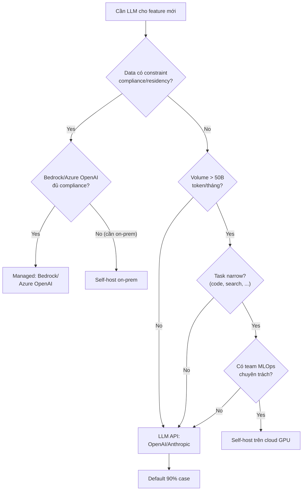

# Khi nào nên dùng LLM API thay vì tự host Model

## ⚡ Tóm tắt ngắn (30s)
* **Mặc định Senior chọn LLM API (OpenAI, Anthropic, Bedrock, Vertex)** vì 90% case nó thắng về TCO, speed-to-market, quality, và ops simplicity. Self-host (Llama-3, Mistral trên vLLM/SageMaker) chỉ có ý nghĩa khi: 
  1. **Compliance/data residency** không cho phép gửi data ra ngoài (banking, healthcare, defense).
  2. **Volume cực lớn** (>100M token/ngày) cộng với task narrow → cost self-host < API.
  3. **Latency ultra-low** cần on-prem GPU gần app.
  4. **Cần model open-weights** để fine-tune sâu (full fine-tune, not just LoRA).
  5. **Provider lock-in / availability concern** mang tính chiến lược.
* **Sự thật bị quên**: Self-host KHÔNG miễn phí. Cost gồm: GPU (H100 ~$3/giờ on-demand), kỹ sư MLOps full-time, monitoring (prom/grafana/dashboard), inference framework (vLLM/TGI), security patching, model upgrade. Đối với app dưới 10M token/ngày, gần như chắc chắn API rẻ hơn.
* **Thảm họa thực chiến**: Team self-host Llama-2-70B vì "rẻ hơn GPT-4". Setup 4× A100 ($20k/tháng). Sau 6 tháng phát hiện: (1) volume thực 5M token/ngày → cost OpenAI ~$3k/tháng, (2) Llama-2 quality thấp hơn → cần re-prompt → cost ops gấp đôi, (3) lockdown khi A100 fail. Senior tắt cluster, chuyển sang gpt-4o-mini → cost giảm 7x, quality tăng.

---

## 🔍 Chi tiết bản chất

### 1. Tổng chi phí thực của Self-host (TCO)

Một cluster Llama-3-70B trên 2× H100 80GB serving ~500 req/min:

| Khoản | Cost/tháng | Note |
| :--- | ---: | :--- |
| 2× H100 80GB on-demand (AWS p5) | $9000–14000 | Reserved giảm 30-50% |
| Networking / storage / load balancer | $500 | |
| Monitoring (Prometheus, Grafana) | $200 | |
| MLOps engineer (allocate 0.3 FTE) | $5000–10000 | Hidden cost lớn nhất |
| Model upgrade / regression testing | $1000 | Time + GPU |
| Backup / failover GPU | $3000 | Spare capacity |
| **Tổng** | **~$18–28k/tháng** | Trước khi tính power, cooling nếu on-prem |

So với OpenAI gpt-4o-mini ($0.15/$0.60 per 1M token):
* 100M input + 30M output token/tháng = $15 + $18 = **$33/tháng**.
* 1B input + 300M output = $150 + $180 = **$330/tháng**.
* 10B input + 3B output = $1500 + $1800 = **$3300/tháng**.

→ Breakeven của self-host với gpt-4o-mini ở ~50–100B token/tháng. Hầu hết app **không bao giờ** đạt threshold này.

### 2. Khi nào TỰ HOST có ý nghĩa

#### (a) Compliance cứng
* Banking, healthcare, defense, government có quy định không cho data leave premise.
* Nếu provider không có vùng region trong nước / dedicated tenancy → buộc self-host.
* AWS Bedrock, Azure OpenAI có cam kết: data không train, không log, regional → đủ với hầu hết enterprise.

#### (b) Volume cực lớn + task narrow
* Code completion engine (GitHub Copilot scale): 10B+ token/ngày → self-host code-specialized model (StarCoder, CodeLlama) rẻ hơn API.
* Search relevance scoring trên hàng triệu doc/ngày.

#### (c) Latency cực thấp on-prem
* Real-time gaming AI, embedded edge AI cần <50ms TTFT.
* API round-trip thường 300ms baseline → không đáp ứng.

#### (d) Full fine-tune deep customization
* LoRA đủ cho 99% case. Khi LoRA không đủ → cần full fine-tune trên open-weights model → bắt buộc self-host.

#### (e) Strategic provider risk
* Tránh single point of failure: ChatGPT down hồi tháng 6/2024 ảnh hưởng nhiều app. Self-host (hoặc dual-provider) giảm rủi ro.

### 3. Khi nào API thắng (90% case)

* **Time-to-market**: 1 ngày setup API vs 1 tháng setup cluster.
* **Quality**: GPT-4o, Claude Sonnet 4.6, Opus 4.7 vẫn vượt mọi open model trên benchmark phức tạp.
* **Auto-scaling**: API absorb spike traffic; self-host phải pre-provision GPU.
* **Multi-model**: API cho phép dễ dàng A/B với gpt-4o vs claude-sonnet. Self-host cần GPU riêng cho mỗi model.
* **Feature mới**: Vision, audio, structured output, tool use rollout trước trên API.
* **Maintenance**: provider lo upgrade, security patch, GPU failure. Self-host phải tự lo.

### 4. Pattern Senior: Managed Hosting Hybrid

Không phải "API vs full self-host" — có middle ground:
* **AWS Bedrock**: managed inference cho Anthropic, Meta, Mistral, Amazon Titan. Data ở VPC, không qua public internet.
* **Azure OpenAI**: GPT-4o trong Azure tenant, regional compliance.
* **Vertex AI / Gemini API**: tương tự Google.
* **Together AI, Fireworks AI, Groq**: serverless inference cho open-weights model. Trả tiền per-token thay vì per-GPU-hour.

→ 80% case của "tôi cần on-prem/compliance" thực ra dùng Bedrock/Azure OpenAI đủ.

---

## 🎨 Sơ đồ trực quan



---

## 💻 Code thực chiến

### 1. LLM API call (OpenAI)

```java
package com.example.ai.api;

import com.openai.client.OpenAIClient;
import com.openai.client.okhttp.OpenAIOkHttpClient;
import com.openai.models.ChatCompletion;
import com.openai.models.ChatCompletionCreateParams;
import com.openai.models.ChatModel;
import org.springframework.stereotype.Service;

@Service
public class OpenAiService {
    private final OpenAIClient client = OpenAIOkHttpClient.builder()
            .apiKey(System.getenv("OPENAI_API_KEY"))
            .build();

    public String chat(String userMsg) {
        ChatCompletionCreateParams params = ChatCompletionCreateParams.builder()
                .model(ChatModel.GPT_4O_MINI)
                .addUserMessage(userMsg)
                .maxTokens(500)
                .temperature(0.0)
                .build();
        ChatCompletion resp = client.chat().completions().create(params);
        return resp.choices().get(0).message().content().orElseThrow();
    }
}
```

### 2. Self-host Llama-3 trên vLLM (OpenAI-compatible)

```python
# vLLM exposes OpenAI-compatible API → code app KHÔNG thay đổi
# Run server (on GPU box):
# vllm serve meta-llama/Llama-3.1-70B-Instruct \
#     --tensor-parallel-size 2 \  # 2 GPU
#     --max-model-len 32768 \
#     --gpu-memory-utilization 0.9 \
#     --port 8000

# Client side (Spring AI hoặc OpenAI SDK):
from openai import OpenAI
client = OpenAI(
    base_url="http://gpu-host.internal:8000/v1",
    api_key="dummy"  # vLLM không cần auth, hoặc đặt secret riêng
)

resp = client.chat.completions.create(
    model="meta-llama/Llama-3.1-70B-Instruct",
    messages=[{"role":"user","content":"Hello"}],
    max_tokens=500
)
```

### 3. Abstraction layer cho easy provider switch

```java
package com.example.ai.abstraction;

public interface LlmProvider {
    String chat(String system, String user, ChatOptions opts);
}

@Service
public class OpenAiProvider implements LlmProvider { /* ... */ }

@Service
public class AnthropicProvider implements LlmProvider { /* ... */ }

@Service
public class SelfHostedProvider implements LlmProvider { /* vLLM endpoint */ }

@Service
public class LlmRouter {
    private final Map<String, LlmProvider> providers;

    public LlmRouter(List<LlmProvider> all) {
        // Inject by config: routing.default = openai, routing.code = self-hosted
    }

    public String chat(String taskType, String system, String user, ChatOptions opts) {
        LlmProvider p = providers.getOrDefault(taskType, providers.get("default"));
        return p.chat(system, user, opts);
    }
}
```

---

## 📊 Bảng quyết định: API vs Managed vs Self-host

| Tiêu chí | LLM API public | Managed (Bedrock/Azure) | Self-host on-prem |
| :--- | :--- | :--- | :--- |
| Setup time | < 1 ngày | < 1 tuần | 1–3 tháng |
| Quality | Latest, best | Cùng provider, regional | Open-weights (Llama, Mistral) |
| Compliance / data | Provider terms | VPC, no train, regional | Hoàn toàn control |
| Cost ≤ 10M token/day | Rẻ | Trung bình | Đắt |
| Cost ≥ 100M token/day narrow task | Đắt | Đắt | Rẻ nhất |
| Ops effort | Gần như zero | Thấp | Cao (MLOps team) |
| Fine-tune full | Không (chỉ LoRA via API) | Có (giới hạn) | Có (full control) |
| Latency p50 | 300–600ms | 200–400ms | 50–150ms (gần app) |

---

## ⚠️ Common Gotchas & Questions follow-up

### 1. Cạm bẫy: Hype-driven self-host
* **Vấn đề**: Đội thấy "Llama open-source, free!" → setup cluster. Quên rằng GPU ≠ free, MLOps eng ≠ free.
* **Giải pháp**: Tính TCO 12 tháng đầy đủ. So với API. Quyết định bằng số.

### 2. Cạm bẫy: Đánh giá compliance hời hợt
* **Vấn đề**: "Sếp bảo không gửi data ra ngoài" → conclude self-host. Thực ra Azure OpenAI / Bedrock đáp ứng đủ legal (cam kết no-train, no-log, regional).
* **Giải pháp**: Đem hợp đồng provider cho legal review. Compare điều khoản: data residency, no-train, audit log, deletion. Thường thấy managed đủ.

### 3. Cạm bẫy: Underestimate model upgrade
* **Vấn đề**: Self-host Llama-3-70B. 6 tháng sau Llama-4 ra → cluster cần upgrade. Tốn 1 tuần test regression, retune param.
* **Giải pháp**: API tự upgrade. Self-host phải kế hoạch upgrade window. Versioning rõ ràng.

### 4. Câu hỏi đào sâu từ interviewer
* **Interviewer: "Công ty bạn đang scale 50M token/ngày trên OpenAI, hóa đơn $30k/tháng. Nên migrate sang self-host không?"**
* **Trả lời Senior**:
  1. **Phân tích cấu trúc token**: input/output ratio, task type. Có task nào volume lớn + narrow đủ để self-host model nhỏ?
  2. **Quality benchmark**: chạy Llama-3-70B trên golden set, so với gpt-4o. Nếu quality gap > 10% → migrate sẽ hại UX.
  3. **Cost migration**:
     - Self-host TCO 12 tháng: ~$250k (GPU + ops + redundancy).
     - OpenAI hiện tại: $360k/năm.
     - Saving ~$110k/năm, nhưng có 1 lần overhead setup ~3 tháng + risk operational.
  4. **Hybrid option tốt hơn**:
     - Route 70% task đơn giản sang Bedrock Llama-3 self-managed → giảm cost 70%.
     - Giữ 30% task phức tạp trên gpt-4o/Sonnet.
     - Cost giảm ~50% mà không cần MLOps team.
  5. **Khuyến nghị**: trừ khi >100M token/ngày stable, hybrid managed thắng pure self-host.
