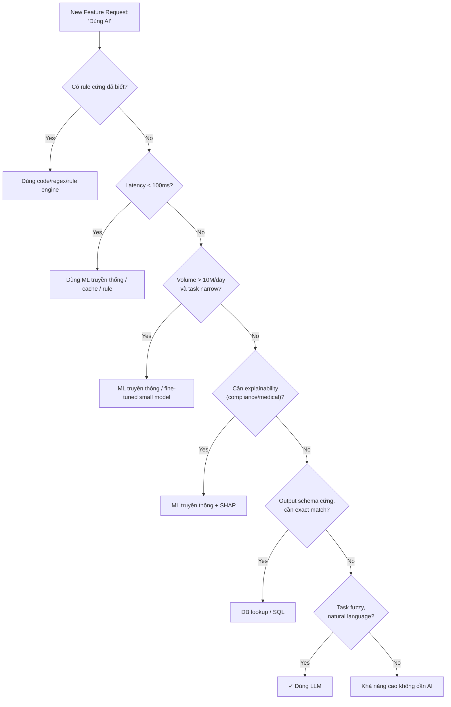

# Khi nào KHÔNG nên dùng AI cho một feature

## ⚡ Tóm tắt ngắn (30s)
* "Có nên dùng AI" là **câu hỏi sai**. Câu đúng là: "Đây có phải là class bài toán mà LLM phù hợp hơn deterministic code, ML truyền thống, hoặc rule engine không?". 80% case Senior nói **KHÔNG**.
* **Các tình huống TUYỆT ĐỐI không nên dùng AI/LLM**:
  1. **Cần determinism tuyệt đối**: tính tiền lương, thuế, payment, balance — KHÔNG dùng LLM. Sai 0.01% = scandal.
  2. **Latency cứng <100ms**: LLM call 300ms–10s. Inline trong checkout flow → user bỏ.
  3. **Cost-sensitive task lặp tỷ lần**: mỗi spam filter request 1B/ngày qua LLM = phá sản.
  4. **Rule cứng đã có**: validate email format, parse JSON, format date — regex/lib nhanh + rẻ + chính xác.
  5. **Compliance / explainability**: vay tín dụng, healthcare diagnosis cần SHAP/feature importance. LLM không giải thích được.
  6. **Bài toán đã có ML truyền thống giải tốt**: classifier 99% F1 với XGBoost — đừng replace bằng LLM.
  7. **Task cần exact match deterministic** (e.g. SKU lookup, ID resolution): SQL/Redis tốt hơn.
  8. **User input không có natural language**: form input cấu trúc → form validation đủ.
* **Thảm họa thực chiến**: Team thay rule engine validate địa chỉ giao hàng (regex + Google Maps API, latency 200ms, cost $0.001) bằng LLM "thông minh hơn". Latency p99 5s, cost 50x, accuracy thấp hơn ban đầu vì LLM "sáng tạo" thêm tên đường không tồn tại. Senior revert.

---

## 🔍 Chi tiết bản chất

### 1. Mental model: AI/LLM là tool, không phải answer

LLM mạnh ở **fuzzy, ngôn ngữ tự nhiên, no-clear-rule, knowledge work**. Yếu (hoặc thua deterministic alternative) ở:
* Computation exact (math, dates, units).
* Quy tắc đã được code rõ ràng.
* High-volume + low-cost-per-call requirement.
* Compliance + auditability.

### 2. Checklist 10 câu hỏi trước khi dùng LLM

Khi PM/feature owner đề xuất "dùng AI", Senior hỏi:

1. **Bài toán có rule cứng đã biết không?** → Nếu có, dùng code.
2. **Latency budget bao nhiêu ms?** → < 100ms thường loại LLM.
3. **Volume bao nhiêu req/ngày?** → > 10M req/ngày → chuyển sang ML hoặc rule.
4. **Sai 1% có chấp nhận được?** → Không (payment, medical) → loại LLM.
5. **Cần explainability?** → Có (vay tín dụng, healthcare) → loại LLM.
6. **Đã có dataset có nhãn?** → Có 100k+ → ML truyền thống có thể tốt hơn.
7. **Output có schema cứng?** → Có và đơn giản (1 nhãn, 1 số) → ML truyền thống / regex.
8. **Input có cấu trúc?** → Có (DB row, JSON đã chuẩn) → SQL / code thường đủ.
9. **Có cần real-time correctness?** → SQL transaction, balance update — KHÔNG dùng LLM.
10. **Cost runtime bao nhiêu mỗi call?** → > $0.01 per call cho high-volume task = đỏ flag.

### 3. Mẫu sai phổ biến (anti-patterns)

#### Anti-pattern 1: LLM thay regex
"Dùng LLM để extract số điện thoại". Regex `\+?[\d\-\s\(\)]{8,15}` đủ tốt 99.5%, 0ms, $0. LLM 100x đắt hơn, không chính xác hơn.

#### Anti-pattern 2: LLM tính toán
"Dùng LLM tính tổng doanh thu". LLM bịa số. SQL `SELECT SUM(amount)` 100% đúng.

#### Anti-pattern 3: LLM làm conditional routing
"Dùng LLM phân loại request đến service A hay B". `if/else` trên field rõ ràng đủ. Dùng LLM = thêm 500ms latency cho mỗi request, dễ failure.

#### Anti-pattern 4: LLM thay classifier truyền thống đã hoạt động
"Spam filter của chúng ta đã có XGBoost 99% F1, nhưng team mới muốn dùng GPT-4". Replace = cost x100, accuracy giảm.

#### Anti-pattern 5: LLM với data không có
"Build feature recommendation bằng LLM". Recommendation cần collaborative filtering hoặc embeddings tuned trên click data — LLM general không phù hợp.

#### Anti-pattern 6: LLM cho task lặp triệu lần
"Mỗi log line dùng LLM để classify severity". 100M log line/ngày × $0.0005/call = $50k/ngày. Dùng regex + small classifier.

---

## 🎨 Sơ đồ trực quan



---

## 💻 Code thực chiến: Quyết định Senior trong thực tế

### 1. Sai (anti-pattern): LLM thay regex extract email

```java
// ❌ Anti-pattern: dùng LLM cho task có regex tốt
public String extractEmailWithLlm(String text) {
    return chatClient.prompt()
        .user("Extract email from: " + text)
        .call().content(); // ~500ms, ~$0.001/call, không chính xác hơn regex
}
```

### 2. Đúng: Regex trước, LLM chỉ làm fallback

```java
package com.example.email;

import org.springframework.stereotype.Service;
import java.util.regex.*;

@Service
public class EmailExtractor {

    private static final Pattern EMAIL = Pattern.compile(
        "[a-zA-Z0-9._%+\\-]+@[a-zA-Z0-9.\\-]+\\.[a-zA-Z]{2,}"
    );

    private final ChatClient llmFallback;

    public EmailExtractor(ChatClient.Builder b) { this.llmFallback = b.build(); }

    public String extract(String text) {
        // (1) Fast path: regex — 0ms, $0
        Matcher m = EMAIL.matcher(text);
        if (m.find()) return m.group();

        // (2) Slow path: LLM cho case obfuscated (e.g. "john dot doe at gmail dot com")
        // Chỉ chạy khi regex miss → tiết kiệm 99% cost
        return llmFallback.prompt()
            .system("Extract email. If text says 'dot' or 'at', convert to . and @. Reply only email or 'NONE'.")
            .user(text)
            .call().content().trim();
    }
}
```

### 3. Đúng: Dùng ML cũ thay vì LLM cho high-volume classification

```java
package com.example.spam;

@Service
public class SpamFilter {
    private final XgboostModel model;  // 30k feature, train trên 10M email
    private final ChatClient llmForGrayZone;

    public boolean isSpam(String emailBody) {
        double score = model.predict(emailBody);

        if (score < 0.2) return false;       // Confident not spam
        if (score > 0.8) return true;        // Confident spam

        // Chỉ ~5% nằm trong gray zone → escalate LLM
        // Cost-effective: 95% qua XGBoost (1ms, $0), 5% qua LLM (300ms, $0.0001)
        return llmForGrayZone.prompt()
            .system("Is this spam? Reply YES or NO.")
            .user(emailBody)
            .call().content().trim().equalsIgnoreCase("YES");
    }
}
```

---

## 📊 Bảng "Khi nào KHÔNG nên dùng AI"

| Tình huống | Lý do | Alternative |
| :--- | :--- | :--- |
| Tính toán số (lương, thuế, balance) | LLM bịa số, sai mathfact | Code + DB transaction |
| Validate format (email, phone, URL) | Regex chính xác, 0ms, $0 | Regex / lib |
| Lookup database theo ID | Cần exact match | SQL/Redis |
| Routing request giữa service | Cần deterministic | `if/else` / config |
| Compliance scoring (credit, insurance) | Cần explainable | XGBoost + SHAP |
| Spam filter ở scale | High volume, narrow task | XGBoost / Naive Bayes |
| OCR / barcode | LLM không bắt buộc tốt hơn | Tesseract / Vision API specialized |
| Date parsing | Lib chính xác 100% | `LocalDate.parse` / chrono |
| Rate limiting decision | Cần realtime + deterministic | Token bucket trong Redis |
| ID resolution (user lookup) | Cần exact | Index + query |

---

## ⚠️ Common Gotchas & Questions follow-up

### 1. Cạm bẫy: AI as marketing
* **Vấn đề**: PM nói "feature này CẦN AI để pitch nhà đầu tư". Engineering làm theo dù không cần thiết.
* **Giải pháp**: Senior đẩy ngược: "Nếu bỏ AI, feature có còn giá trị không?". Nếu có → build trước, gắn AI badge label sau. Tránh tech debt từ AI thừa.

### 2. Cạm bẫy: AI cho mọi pop-up message
* **Vấn đề**: Mỗi error message dynamic generate qua LLM cho "personalized". Cost x100, slower, có thể sai tone.
* **Giải pháp**: Static template với i18n thay thế biến. LLM chỉ cho case đặc biệt (e.g. lỗi mơ hồ cần giải thích).

### 3. Cạm bẫy: AI cho automation toàn phần
* **Vấn đề**: "Để AI tự refund order khi user khiếu nại". LLM có thể bị prompt injection → refund cho fraud.
* **Giải pháp**: AI chỉ **đề xuất**, human/rule approve cho action có irreversibility (money, deletion).

### 4. Câu hỏi đào sâu từ interviewer
* **Interviewer: "Stakeholder thuyết phục dùng AI cho mọi feature. Bạn pushback thế nào?"**
* **Trả lời Senior**:
  1. **Đặt KPI rõ ràng**: "Feature này tăng metric X bao nhiêu %?". Nếu non-AI option cũng đạt → AI là over-engineering.
  2. **Cost-benefit table**: ước lượng cost runtime + dev time + maintenance vs benefit. AI thường lose ở cost-benefit nếu rule-based khả thi.
  3. **POC nhỏ**: 1 sprint POC, so sánh AI vs non-AI trên 100 case. Đem số ra quyết định.
  4. **Frame là tradeoff**: "Với AI: +X% accuracy, +$Y/tháng, +Zms latency. Đáng không?".
  5. **Reserve AI cho task thực sự fuzzy**: customer chat, content generation, semantic search, classification của text dài. Tránh dùng AI ở "easy path" nơi rule đủ.
  6. **Pragmatic compromise**: AI làm "phụ", code làm "chính". E.g. recommendation: collaborative filter chính + LLM rerank top-20 → AI vào đúng chỗ giá trị nhất.
