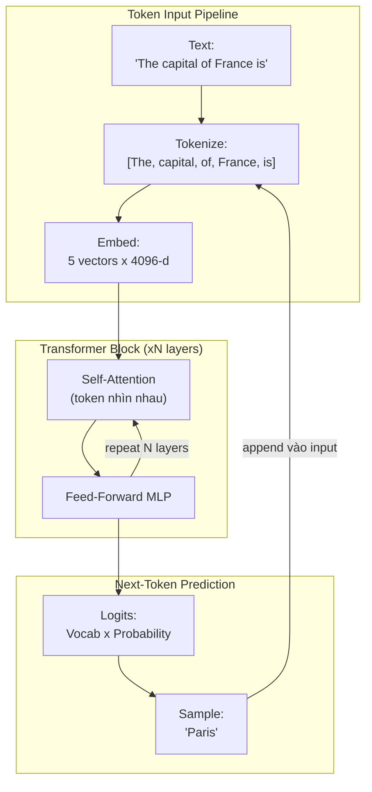

# LLM và Transformer ở mức High-Level

## ⚡ Tóm tắt ngắn (30s)
* **LLM (Large Language Model)** là một mạng neural khổng lồ (hàng tỷ tham số) được train để **dự đoán token tiếp theo** dựa trên các token đã thấy. Đó là toàn bộ công việc của nó — không có "hiểu" hay "suy nghĩ" theo nghĩa con người, chỉ có mô phỏng phân phối xác suất ngôn ngữ.
* **Transformer** là **kiến trúc neural network** đứng sau hầu hết LLM hiện đại (GPT, Claude, Gemini, Llama). Điểm cốt lõi: cơ chế **self-attention** cho phép mỗi token "nhìn" được tất cả token khác trong context window cùng lúc → mô hình hóa được quan hệ xa-gần trong văn bản dài, song song hóa được trên GPU (khác hẳn RNN/LSTM tuần tự cũ).
* **Backend Engineer cần nhớ gì** (không cần biết toán):
  1. Token là đơn vị tính cost, không phải ký tự hay từ → 1 trang A4 ≈ 500–700 token tiếng Anh, tiếng Việt tốn ~2x.
  2. Mọi token đều phải đi qua self-attention → cost compute **bậc 2 theo context length** (O(n²)) → đó là lý do gửi 128k token đắt gấp ~64 lần gửi 16k token, không phải 8 lần.
  3. Generation là **autoregressive** (1 token / 1 step) → latency tỷ lệ với số token output → giải pháp: streaming, hạn chế max_tokens.
* **Thảm họa thực chiến**: Team paste cả tài liệu 200 trang vào prompt vì "Claude có context 200k", chi phí mỗi request lên $2. Hệ thống xử lý 10k request/ngày → cháy $20k/ngày = $600k/tháng. Senior fix bằng RAG chunking + cache → giảm còn $300/ngày.

---

## 🔍 Chi tiết bản chất

### 1. LLM thực ra làm gì?

LLM chỉ làm **một việc duy nhất**: nhận một chuỗi token và trả về **phân phối xác suất** cho token tiếp theo. Lặp lại quá trình này → sinh ra văn bản.

```
Input:  "The capital of France is"
LLM:    P("Paris")=0.92, P("London")=0.03, P("a")=0.02, ...
Output: "Paris"   (sample từ phân phối, hoặc lấy argmax)

Input:  "The capital of France is Paris"
LLM:    P(".")=0.45, P(",")=0.20, P(" and")=0.10, ...
Output: "."

→ Cứ thế lặp đến khi gặp <stop> token hoặc max_tokens.
```

Không có "tư duy", không có "tra cứu" — chỉ có dự đoán thống kê đã được training cô đặc vào trọng số.

### 2. Kiến trúc Transformer ở mức high-level

Transformer (Vaswani 2017, "Attention is All You Need") có 3 ý tưởng chính. Backend engineer cần hiểu **ý tưởng** chứ không cần code lại:

**(a) Token Embedding**: Mỗi token được map sang một vector (thường 4096–12288 chiều). Vector này nắm bắt "nghĩa" của token trong không gian số.

**(b) Self-Attention**: Trong một câu, mỗi token tính độ liên quan (attention score) với mọi token khác. Ví dụ trong câu "Con mèo ngồi trên thảm vì nó mềm", token "nó" sẽ attention mạnh tới "thảm" hơn là "mèo" — đó là cách Transformer "hiểu" được tham chiếu xa.

**(c) Feed-forward + Stacking**: Output của attention đi qua một mạng MLP, rồi lặp lại N layer (GPT-3 có 96 layer, Llama-3-405B có 126 layer). Càng nhiều layer → mô hình càng giỏi nắm bắt pattern phức tạp.

### 3. Vì sao Transformer thắng RNN/LSTM

| Khía cạnh | RNN / LSTM (cũ, 2014) | Transformer (2017–nay) |
| :--- | :--- | :--- |
| Xử lý token | Tuần tự (token n cần token n-1 xong) | **Song song** (mọi token attention cùng lúc) |
| Phụ thuộc xa | Mất thông tin sau ~50 token | Giữ thông tin xuyên suốt context window |
| Train trên GPU | Khó tận dụng | Cực kỳ tốt (matrix multiplication) |
| Scale tham số | Khó vượt vài trăm triệu | Dễ scale lên hàng nghìn tỷ |

### 4. Hệ quả của kiến trúc lên Backend Engineering

* **Cost bậc 2 theo context**: Attention so sánh từng cặp token → context 100k token tốn ~10000x compute so với 1k token. Trong thực tế provider đã tối ưu (flash attention, KV cache), nhưng pricing vẫn không tuyến tính.
* **Generation chậm dần khi output dài**: Mỗi token output kéo theo 1 forward pass mới. 1000 token output ≈ 1000 forward pass → latency tuyến tính với output length.
* **KV cache**: Provider lưu attention key/value của context để tránh tính lại → đây là lý do **prompt caching** giảm 50–90% cost khi reuse system prompt.

---

## 🎨 Sơ đồ trực quan



---

## 💻 Code thực chiến: Hiểu token + autoregressive bằng Java

Backend engineer cần biết **đo & tính token** trước khi gọi LLM, để dự báo cost và chống cắt context.

### 1. Đo token bằng jtokkit (OpenAI-compatible tokenizer)

```java
package com.example.ai.token;

import com.knuddels.jtokkit.Encodings;
import com.knuddels.jtokkit.api.Encoding;
import com.knuddels.jtokkit.api.EncodingType;
import org.springframework.stereotype.Component;

@Component
public class TokenCounter {
    // jtokkit chứa tokenizer cl100k_base (gpt-4) và o200k_base (gpt-4o)
    private final Encoding enc = Encodings.newDefaultEncodingRegistry()
            .getEncoding(EncodingType.O200K_BASE);

    public int count(String text) {
        return enc.countTokens(text);
    }

    /**
     * Pre-check trước khi gọi LLM: từ chối sớm nếu prompt quá dài.
     * Tránh trường hợp gửi đi rồi provider trả 400, vẫn tốn thời gian + log noise.
     */
    public void assertWithinBudget(String systemPrompt, String userPrompt, int budgetTokens) {
        int total = count(systemPrompt) + count(userPrompt);
        if (total > budgetTokens) {
            throw new IllegalArgumentException(
                "Prompt %d token vượt budget %d. Cần chunking hoặc summarize.".formatted(total, budgetTokens)
            );
        }
    }
}
```

### 2. Streaming response để cảm nhận autoregressive (Spring AI)

```java
package com.example.ai.stream;

import org.springframework.ai.chat.client.ChatClient;
import org.springframework.http.MediaType;
import org.springframework.web.bind.annotation.*;
import reactor.core.publisher.Flux;

@RestController
@RequestMapping("/ai")
public class StreamChatController {
    private final ChatClient chatClient;

    public StreamChatController(ChatClient.Builder builder) {
        this.chatClient = builder.build();
    }

    // Vì model sinh tuần tự token, ta dùng SSE để stream từng token về client
    // Trải nghiệm: user thấy chữ "chạy ra" thay vì chờ 5s mới hiện full
    @GetMapping(value = "/chat", produces = MediaType.TEXT_EVENT_STREAM_VALUE)
    public Flux<String> chat(@RequestParam String q) {
        return chatClient.prompt()
                .user(q)
                .stream()
                .content();
    }
}
```

---

## 📊 Bảng so sánh các kiến trúc LLM phổ biến

| Model | Kiến trúc | Context | Note kỹ thuật |
| :--- | :--- | :--- | :--- |
| GPT-4o / 4.1 | Decoder-only Transformer | 128k–1M | OpenAI, hỗ trợ JSON mode, function calling |
| Claude Opus 4.7 / Sonnet 4.6 | Decoder-only Transformer (proprietary) | 200k–1M | Anthropic, mạnh ở reasoning + tool use, prompt caching native |
| Gemini 2.x | Decoder-only + multimodal | 1M–2M | Google, context cực dài, multimodal native |
| Llama-3.x (8B / 70B / 405B) | Decoder-only Transformer open-weights | 8k–128k | Meta, có thể self-host trên Bedrock / vLLM / Ollama |
| Mistral / Mixtral (MoE) | Mixture-of-Experts | 32k–128k | Chỉ activate vài expert / token → rẻ hơn ở scale |

---

## ⚠️ Common Gotchas & Questions follow-up

### 1. Cạm bẫy: Tưởng LLM "hiểu" và "nhớ" như con người
* **Vấn đề**: PM yêu cầu "Chatbot phải nhớ user đã hỏi gì hôm trước". Dev gửi 1 prompt như "Hôm qua user X hỏi gì?" và mong model tự nhớ.
* **Hậu quả**: Model không có memory bẩm sinh — mỗi request là **stateless**. Nó chỉ thấy đúng những gì bạn nhét vào prompt. Nếu không tự lưu lịch sử và truyền lại, LLM không biết.
* **Giải pháp Senior**: 
  1. Lưu lịch sử hội thoại vào DB (Postgres/Redis) gắn với `session_id` hoặc `user_id`.
  2. Khi gọi LLM, prepend lịch sử có liên quan vào prompt.
  3. Khi lịch sử quá dài → summarize bằng một LLM call rẻ hơn (Haiku/gpt-4o-mini) → lưu summary thay vì raw.

### 2. Cạm bẫy: Cho rằng context window càng to càng tốt
* **Vấn đề**: Đội ép Claude với 200k token tài liệu → kết quả vẫn miss thông tin ở giữa ("lost in the middle" — model có xu hướng attention mạnh ở đầu/cuối, yếu ở giữa).
* **Giải pháp**: Dùng RAG để chỉ bơm chunk relevant vào prompt (5–10 chunk × 500 token = 5k token đủ tốt). Vừa rẻ vừa chính xác hơn nhồi nguyên 200k.

### 3. Câu hỏi đào sâu từ interviewer
* **Interviewer: "Tại sao gọi LLM trên 100k token tốn hơn 100x so với 1k token, dù model chỉ predict thêm 100 token?"**
* **Trả lời**:
  1. **Self-attention O(n²)**: mỗi token mới phải attention với toàn bộ 100k token cũ → compute scale bậc 2 với context length.
  2. **Token nạp vào (input token) cũng tính cost**, không chỉ output token. Provider tính 2 đơn giá riêng (input cheaper than output thường ~3–5x).
  3. **Prompt caching** có thể giảm cost input token đáng kể nếu cùng prefix được tái sử dụng (Claude/OpenAI đều hỗ trợ); senior backend sẽ thiết kế prompt template với system prompt cố định ở đầu để hit cache.
