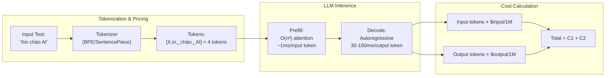

# Token là gì? Vì sao Token ảnh hưởng Cost và Latency

## ⚡ Tóm tắt ngắn (30s)
* **Token là đơn vị "từ con" mà LLM thực sự thấy** — không phải ký tự, không phải từ. LLM tokenize văn bản đầu vào bằng thuật toán BPE (Byte-Pair Encoding) hoặc tương tự, biến `"unbelievable"` thành 3 token `["un", "believ", "able"]`, biến `"hello"` thành 1 token. Một token ≈ 4 ký tự tiếng Anh ≈ 0.75 từ tiếng Anh. **Tiếng Việt tốn ~2x token** vì có dấu Unicode và ít common-subword.
* **Token chi phối toàn bộ kinh tế LLM**:
  1. **Cost**: Tất cả LLM provider tính tiền theo **input token + output token**, với 2 đơn giá khác nhau (output thường mắc gấp 3–5x input). Không có "request fee" cố định.
  2. **Latency**: Đầu vào càng nhiều token → prefill (encoding) càng lâu (~1ms/token). Đầu ra càng nhiều token → generation càng lâu (~10–100ms/token tùy model). Output dài là thủ phạm chính của latency.
  3. **Context limit**: Mỗi model có max context (8k, 128k, 200k, 1M token). Vượt → API trả 400.
* **Thảm họa thực chiến**: Team dùng OpenAI gpt-4o, mỗi request gửi system prompt 5000 token (copy-paste từ docs), user prompt 200 token, output 500 token. Cost tính ra: ~$0.03/request × 100k req/ngày = $3000/ngày = **$90k/tháng**. Sau khi (1) cắt system prompt còn 800 token, (2) bật prompt caching, (3) chuyển 70% traffic sang gpt-4o-mini → cost giảm còn $4k/tháng (giảm ~22 lần).

---

## 🔍 Chi tiết bản chất

### 1. Tokenization hoạt động ra sao?

Mỗi LLM provider có **tokenizer riêng**:
* OpenAI gpt-4 / gpt-4o: `cl100k_base` / `o200k_base` (vocab ~200k)
* Anthropic Claude: tokenizer riêng, không public
* Llama / Mistral: SentencePiece BPE

Quy trình tokenize một string bằng BPE (high level):
1. Bắt đầu bằng character-level.
2. Lặp lại: tìm cặp ký tự xuất hiện nhiều nhất trong training corpus, merge thành 1 token mới.
3. Sau ~50k–200k lần merge → có vocab. Mỗi token hay gặp (như `" the"`, `" and"`) đều ngắn 1 token; từ hiếm bị xé thành nhiều mảnh.

**Hệ quả thực tế**:
* `"GPT-4o"` → 4 token (`G`, `PT`, `-`, `4o`)
* `"công nghệ"` (tiếng Việt) → ~5 token (có thể dính cả khoảng trắng + dấu)
* JSON formatting cũng tốn token: `{"name":"X"}` = ~7 token
* Code có khoảng trắng / indent / brackets → mỗi ký tự đặc biệt có thể là 1 token riêng

### 2. Vì sao cost tỷ lệ với token

Provider pricing tham khảo (May 2026, đơn giá $/1M token):

| Model | Input | Output | Note |
| :--- | :---: | :---: | :--- |
| Claude Opus 4.7 | $15 | $75 | Strongest reasoning, expensive |
| Claude Sonnet 4.6 | $3 | $15 | Sweet spot quality/cost |
| Claude Haiku 4.5 | $0.80 | $4 | Fast & cheap, đủ tốt cho classify/summarize |
| GPT-4o | $2.5 | $10 | OpenAI flagship |
| GPT-4o-mini | $0.15 | $0.60 | Rẻ kinh ngạc |
| Llama-3-70b (Bedrock) | $0.72 | $0.72 | Self-host hoặc managed |

Output token mắc hơn input vì server phải chạy generation autoregressive (1 forward pass / token, không song song hóa được).

### 3. Vì sao latency tỷ lệ với token

Một LLM call có 2 pha:
* **Prefill (encoding input)**: Xử lý song song toàn bộ input tokens. Thời gian ≈ `n_input_tokens × t_prefill`. Với gpt-4o ~1–2 ms/token → 10k token input mất ~10–20s. Đây là lý do prompt dài làm "Time-to-first-token" (TTFT) cao.
* **Decode (sinh output)**: Sinh từng token một. Thời gian ≈ `n_output_tokens × t_decode`. Mỗi token mất 30–100 ms tùy model size. 1000 output token = 30–100 giây.

**Kết luận Senior Backend**:
* Muốn giảm TTFT → cắt input token (RAG chunking, prompt caching).
* Muốn giảm tổng latency → set `max_tokens` hợp lý, dùng streaming để user thấy ngay.
* Cost peak ở **output token**, đặc biệt với Opus/GPT-4 nên Senior thường thiết kế "max_tokens" guard cứng.

---

## 🎨 Sơ đồ trực quan



---

## 💻 Code thực chiến: Pre-flight Token Budget Guard

Senior backend luôn check token TRƯỚC khi gọi LLM. Tránh: (1) tốn cost lãng phí khi request chắc chắn quá dài, (2) cắt context giữa chừng làm output sai.

### 1. Token counting + cost estimation (Java + jtokkit)

```java
package com.example.ai.budget;

import com.knuddels.jtokkit.Encodings;
import com.knuddels.jtokkit.api.Encoding;
import com.knuddels.jtokkit.api.EncodingType;
import org.springframework.stereotype.Service;

@Service
public class TokenBudgetService {

    private final Encoding gpt4oEnc = Encodings.newDefaultEncodingRegistry()
            .getEncoding(EncodingType.O200K_BASE);

    // Đơn giá May 2026, lưu vào config thật khi đi prod
    private static final double GPT4O_INPUT_USD_PER_1K = 0.0025;
    private static final double GPT4O_OUTPUT_USD_PER_1K = 0.010;

    public record CostEstimate(int inputTokens, int estOutputTokens, double usd) {}

    /**
     * Ước lượng cost trước khi call, từ chối sớm nếu vượt budget.
     * Throws IllegalStateException khi vượt.
     */
    public CostEstimate estimateOrThrow(String prompt, int maxOutputTokens, double budgetUsd) {
        int inputTokens = gpt4oEnc.countTokens(prompt);
        double estUsd = (inputTokens / 1000.0) * GPT4O_INPUT_USD_PER_1K
                      + (maxOutputTokens / 1000.0) * GPT4O_OUTPUT_USD_PER_1K;

        if (estUsd > budgetUsd) {
            throw new IllegalStateException(
                "Request vượt budget: $%.4f > $%.4f (input=%d, maxOut=%d). Cần chunking/cắt prompt."
                  .formatted(estUsd, budgetUsd, inputTokens, maxOutputTokens)
            );
        }
        return new CostEstimate(inputTokens, maxOutputTokens, estUsd);
    }
}
```

### 2. Streaming + early stop để tiết kiệm output token

```java
package com.example.ai.stream;

import org.springframework.ai.chat.client.ChatClient;
import org.springframework.ai.chat.prompt.ChatOptions;
import org.springframework.stereotype.Service;
import reactor.core.publisher.Flux;

@Service
public class CostAwareStreamingService {
    private final ChatClient chatClient;

    public CostAwareStreamingService(ChatClient.Builder b) { this.chatClient = b.build(); }

    /**
     * Trả về 1 Flux<String> sao cho:
     * - Streaming để user thấy ngay (TTFT thấp)
     * - max_tokens guard cứng để không bao giờ tốn quá $X/request
     * - Cancel khi client disconnect → cứu cost
     */
    public Flux<String> stream(String userMessage) {
        ChatOptions options = ChatOptions.builder()
                .maxTokens(500)  // Guard cứng: không bao giờ vượt 500 token output
                .temperature(0.3)
                .build();

        return chatClient.prompt()
                .user(userMessage)
                .options(options)
                .stream()
                .content()
                .doOnCancel(() -> System.out.println("Client disconnect → cancel LLM call để cứu cost"));
    }
}
```

---

## 📊 Bảng so sánh tỷ lệ "ký tự : token" theo ngôn ngữ và content type

| Loại nội dung | Ratio ký tự / token | Note |
| :--- | :---: | :--- |
| Tiếng Anh thông thường | ~4 ký tự / token | Best case |
| Tiếng Việt có dấu | ~2 ký tự / token | Unicode đốt token |
| Tiếng Trung / Nhật | ~1 ký tự / token | Worst case |
| Code Java / Python | ~3 ký tự / token | Indent + brackets tốn |
| JSON dày key | ~2.5 ký tự / token | `{"`, `":"` tốn token riêng |
| Base64 / hash | ~1.5 ký tự / token | Rất tệ — nên cắt ra hoặc thay bằng reference |

**Quy tắc nhớ**: 1 trang A4 tiếng Anh ≈ 500 token. Tiếng Việt ≈ 1000 token. Toàn bộ codebase 1000 LOC Java ≈ 8000–12000 token.

---

## ⚠️ Common Gotchas & Questions follow-up

### 1. Cạm bẫy: Đếm token bằng `text.length() / 4`
* **Vấn đề**: Dev approximate token bằng cách chia ký tự cho 4. Trong production phát hiện request bị reject vì vượt context window — vì content tiếng Việt thực tế tốn gấp đôi.
* **Giải pháp**: Dùng tokenizer thật của provider (jtokkit cho OpenAI, Anthropic SDK có method `count_tokens`). Đối với LLM không có tokenizer public, dùng `tiktoken` của OpenAI làm gần đúng kèm safety margin 20%.

### 2. Cạm bẫy: Không set max_tokens → cost bùng nổ
* **Vấn đề**: Khi không set `max_tokens`, model có thể "lê" ra tới context limit. Một user prompt "Viết essay 10 trang" với gpt-4 không max_tokens → output 4000 token = $0.24/request. Bot tự động chạy 1000 lần = $240. Sau release, attacker phát hiện và spam = tốn $24k/ngày.
* **Giải pháp**: 
  1. Luôn set `max_tokens` cứng (300–2000 tùy use case).
  2. Set quota per-user trong Redis.
  3. Alert khi token usage tăng đột biến 3x baseline.

### 3. Câu hỏi đào sâu từ interviewer
* **Interviewer: "Hệ thống của bạn xử lý 10k email/ngày, mỗi email cần LLM summarize. System prompt cố định ~3k token. Bạn tối ưu cost thế nào?"**
* **Trả lời Senior**:
  1. **Bật prompt caching**: Anthropic / OpenAI đều hỗ trợ. System prompt 3k token được cache → input cost cho phần đó giảm 90% từ lần thứ 2. Tiết kiệm ~$X/tháng (tùy số request).
  2. **Chọn model phù hợp**: summarization không cần Opus. Dùng Haiku-4.5 hoặc gpt-4o-mini, cost ~10–20x thấp hơn, quality vẫn ổn cho summary.
  3. **Cache kết quả summary**: cùng email body (hash) → cache trong Redis 7 ngày.
  4. **Truncate input email** nếu cực dài: nén bằng heuristic (cắt header, signature, quoted reply) trước khi gửi vào LLM.
  5. **Đo & alert**: dashboard token-per-request, alert khi p99 vượt baseline.
