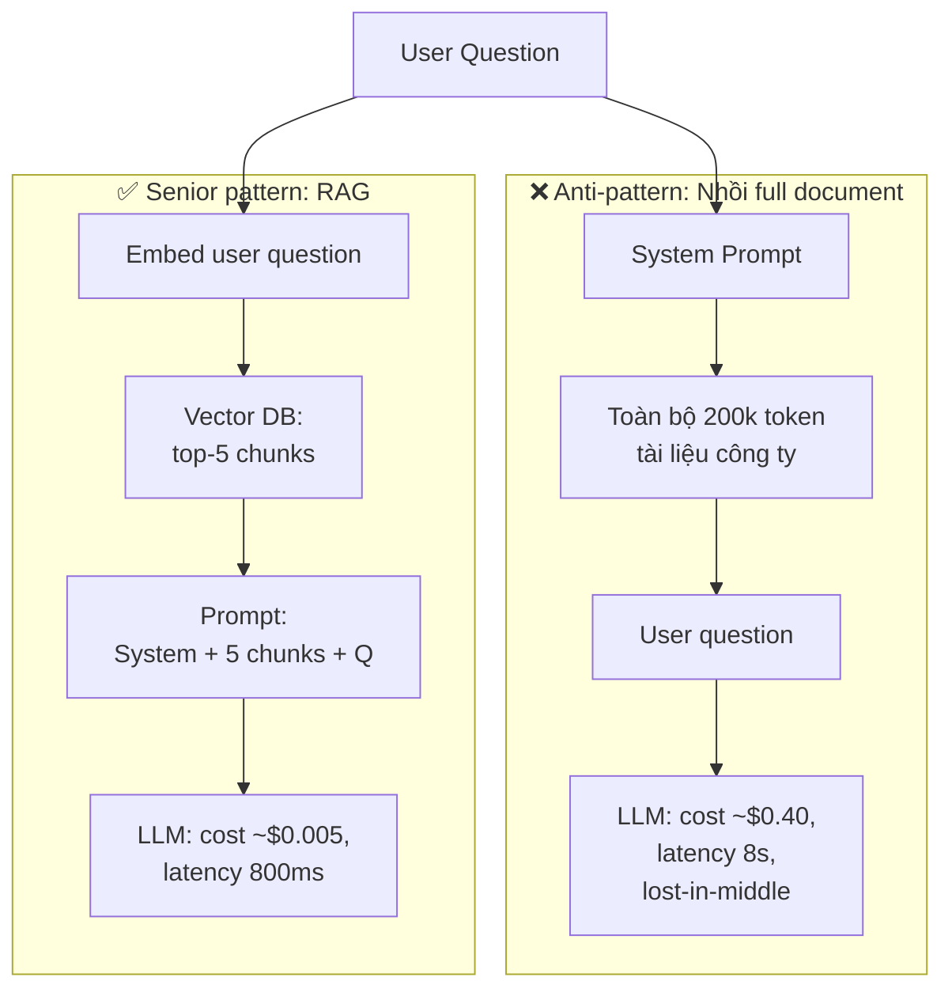

# Context Window là gì? Context Window lớn có giải quyết được mọi vấn đề không

## ⚡ Tóm tắt ngắn (30s)
* **Context window** là **giới hạn tổng số token** (input prompt + system prompt + output) mà một LLM có thể xử lý trong một lần gọi. GPT-4o: 128k–1M; Claude Sonnet 4.6: 200k–1M; Gemini 2.x: 1M–2M; Llama-3: 8k–128k. Vượt giới hạn → API trả 400 hoặc auto-truncate.
* **Context lớn KHÔNG giải quyết mọi vấn đề** vì 4 lý do nghiêm trọng:
  1. **Cost bậc 2**: Self-attention O(n²) → 128k token tốn ~10000x compute so với 1k token. Hóa đơn cuối tháng chứng minh điều này.
  2. **Latency tăng**: TTFT (time-to-first-token) với 200k context có thể 5–20 giây.
  3. **"Lost in the middle"**: Model có xu hướng attention mạnh ở **đầu và cuối** context, **quên ở giữa**. Nhồi 200k token tài liệu thì model có thể miss thông tin nằm ở token thứ 50k–150k.
  4. **Bảo mật**: Càng nhồi nhiều dữ liệu nội bộ vào prompt → bề mặt tấn công prompt injection càng rộng, leakage risk cao.
* **Quyết định Senior**: Default dùng RAG để chỉ bơm **5–10 chunk relevant × 500 token = 5k token**, không nhồi cả tài liệu. Long context window chỉ dùng cho: phân tích văn bản pháp lý dài, code review whole repo, audio/video transcription dài.
* **Thảm họa thực chiến**: Team bypass RAG, nhồi 150k token tài liệu cho mỗi câu hỏi → cost $0.45/request × 50k/ngày = **$22k/ngày**. Đồng thời accuracy giảm 30% so với RAG vì lost-in-the-middle. Senior fix: revert sang RAG → cost còn $0.012/req, accuracy phục hồi.

---

## 🔍 Chi tiết bản chất

### 1. Context window gồm những gì?

```
[System Prompt] + [Few-shot examples] + [RAG retrieved chunks] +
[Conversation history] + [User message] + [Tool definitions] +
[Reserved space for Output]   ≤   max_context_window
```

Quan trọng: **output cũng nằm trong context budget** (với một số model). Phải để dành đủ "khoảng trống" cho output. Ví dụ context 128k, dùng 120k cho input → chỉ còn 8k cho output.

### 2. Vì sao "context to" không phải silver bullet

#### (a) Cost compute O(n²)
Self-attention so sánh từng cặp token. Token thứ n phải attention với n-1 token trước. Tổng cost ≈ Σi=1..n(i) = O(n²).

Pricing thực tế không phải O(n²) tuyến tính (do flash attention + KV cache), nhưng vẫn **tỷ lệ thuận với input length**. Gấp đôi token = gấp đôi tiền input.

#### (b) Latency
Prefill (encode toàn bộ input prompt) là pha **chạy 1 lần đầu** trước khi sinh output. Prefill 200k token với GPT-4o mất ~5–10s; với Claude Opus có thể 10–20s. Đây là time-to-first-token (TTFT) — user thấy "chờ lâu".

#### (c) "Lost in the middle" — paper năm 2023 (Liu et al.)
Khi nhồi 20 đoạn vào context và đặt câu hỏi liên quan đến đoạn ở giữa:
* Đoạn ở đầu (position 1–3): accuracy ~80%
* Đoạn ở giữa (position 10): accuracy giảm xuống ~50%
* Đoạn ở cuối (position 18–20): accuracy lại tăng lên ~75%

Hình "U" rõ ràng. Đây là **bias kiến trúc của Transformer**, không phải bug.

#### (d) Bảo mật & compliance
* Nhồi cả tài liệu nội bộ → tăng nguy cơ leakage qua prompt injection.
* Một số provider có thể log prompt → cần đảm bảo không gửi PII/secret.

### 3. Khi nào nên dùng long context

| Use case | Long context hợp lý? | Lý do |
| :--- | :---: | :--- |
| Hỏi đáp trên 1 doc 200 trang | ✗ | Dùng RAG hiệu quả hơn |
| Phân tích contract pháp lý 100 trang để tìm điều khoản cụ thể | ✓ | Cần đọc full để không miss interaction giữa các clause |
| Summarize cả 1 cuốn sách | ✓ | Không thể chunk vì cần holistic view |
| Code review whole repo small | ✓ | Cross-file dependency cần thấy hết |
| Multi-turn chat dài 100 lượt | ✗ | Nên summarize history thay vì truyền raw |

---

## 🎨 Sơ đồ trực quan



---

## 💻 Code thực chiến: Khi nào fallback sang Long Context

Senior xây "context strategy router" — mặc định dùng RAG, fallback long-context cho query đặc biệt.

```java
package com.example.ai.context;

import org.springframework.ai.chat.client.ChatClient;
import org.springframework.stereotype.Service;
import java.util.List;

@Service
public class ContextStrategyRouter {

    private final ChatClient chatClient;
    private final VectorSearchService vectorSearch;
    private final TokenBudgetService budget;

    private static final int RAG_TOKEN_BUDGET = 6000;   // 5-10 chunks
    private static final int LONG_CONTEXT_THRESHOLD_USD = 1; // $1 / request guard

    public String ask(String question, String docId) {
        // (1) Default path: RAG
        List<String> chunks = vectorSearch.topK(question, docId, 8);
        String ragPrompt = buildPrompt(question, chunks);

        if (budget.estimate(ragPrompt, 1000).usd() < 0.05) {
            return chatClient.prompt().user(ragPrompt).call().content();
        }

        // (2) Escalate to long-context CHỈ khi:
        //     - query yêu cầu holistic view (vd "compare across all sections")
        //     - hoặc RAG fail (no relevant chunks)
        if (needsHolisticView(question) && budget.estimate(loadFullDoc(docId), 2000).usd() < LONG_CONTEXT_THRESHOLD_USD) {
            String fullPrompt = buildPrompt(question, List.of(loadFullDoc(docId)));
            return chatClient.prompt().user(fullPrompt).call().content();
        }

        throw new IllegalStateException("Query không match RAG, document quá dài cho long-context. Cần chia nhỏ task.");
    }

    private boolean needsHolisticView(String q) {
        String lower = q.toLowerCase();
        // Heuristic đơn giản; production nên dùng classifier hoặc LLM nhỏ phán đoán
        return lower.contains("compare") || lower.contains("overall") || lower.contains("summary of all");
    }

    private String loadFullDoc(String docId) { /* load from storage */ return ""; }
    private String buildPrompt(String q, List<String> chunks) { return "..."; }
}
```

---

## 📊 Bảng so sánh: RAG vs Long Context vs Fine-tune

| Tiêu chí | RAG (default) | Long Context (200k+) | Fine-tuning |
| :--- | :--- | :--- | :--- |
| **Cost / request** | $0.005–0.02 | $0.20–2.00 | $0.002 (sau khi train) |
| **Latency TTFT** | 200–800ms | 3–15s | 100–500ms |
| **Lost-in-middle risk** | Thấp (5-10 chunk) | Cao | Không có |
| **Cập nhật kiến thức** | Realtime (re-embed) | Realtime | Cần retrain |
| **Holistic / cross-doc reasoning** | Yếu | Mạnh | Yếu nếu data outside training |
| **Permission control** | Filter ở vector search | Khó (toàn bộ doc trong prompt) | Khó (kiến thức "ngấm" vào weights) |
| **Khi dùng** | 80% use case | Cross-section analysis, code review repo | Domain language, format đặc thù |

---

## ⚠️ Common Gotchas & Questions follow-up

### 1. Cạm bẫy: Tin marketing "1M context"
* **Vấn đề**: Provider quảng cáo "Gemini 1.5 với 2M context!" → đội mặc định nhồi cả database vào. Thực tế quality giảm rõ rệt sau ~200k, và cost vọt lên. Marketing đo "needle in a haystack" benchmark (tìm 1 thông tin trong context), không đo reasoning thực tế.
* **Giải pháp Senior**: Test với chính dataset của bạn. Benchmark accuracy ở các mức context length (16k, 64k, 128k, 200k). Thường thấy curve "diminishing returns" rõ rệt.

### 2. Cạm bẫy: Output không có chỗ
* **Vấn đề**: System + user prompt = 127k token, model context = 128k. Set max_tokens=4000 → API reject "context overflow" hoặc auto-truncate input → output sai.
* **Giải pháp**: Pre-check `input_tokens + max_tokens ≤ context_window - 1000 (safety margin)`. Throw lỗi rõ ràng trước khi gọi LLM.

### 3. Câu hỏi đào sâu từ interviewer
* **Interviewer: "Khi nào bạn chọn long context thay vì RAG?"**
* **Trả lời Senior**:
  1. **Holistic / cross-section reasoning**: "So sánh điều khoản về thanh toán giữa 5 contract" — RAG có thể miss các điều khoản nằm rải rác.
  2. **Document có cấu trúc phụ thuộc dài**: Truyện ngắn (cần biết hết plot), code review (cần thấy import / class relationship).
  3. **Khi RAG fail liên tục** (retrieval quality kém vì doc khó embed) — fallback long context như "safety net".
  4. **Không bao giờ chọn long context vì lười xây RAG** — đó là dấu hiệu junior thinking. Cost dài hạn của long context vượt cost xây RAG chỉ sau vài ngày traffic.
